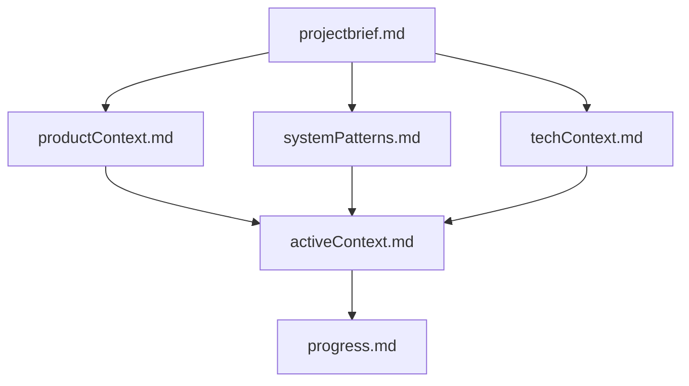
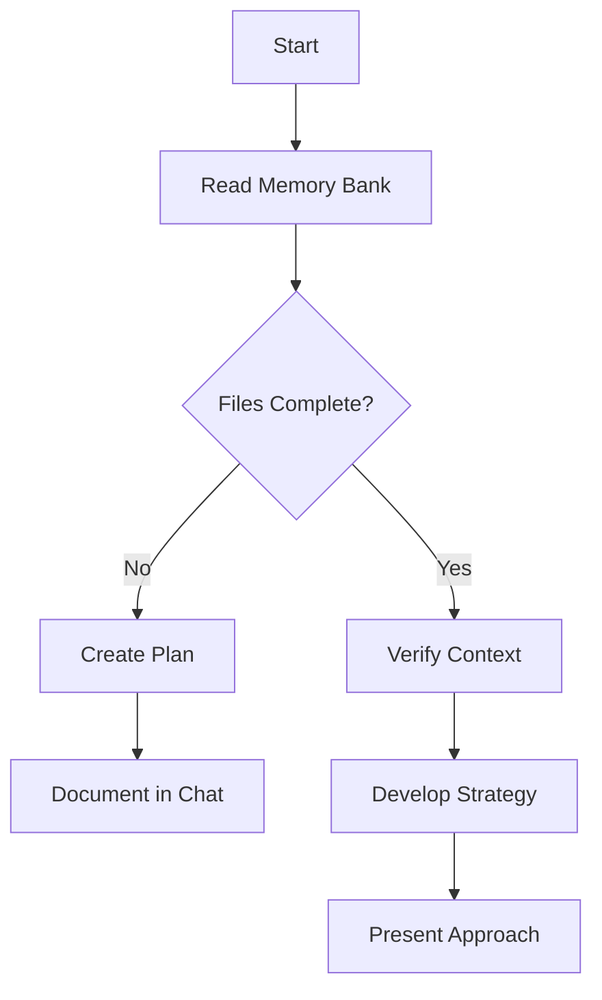
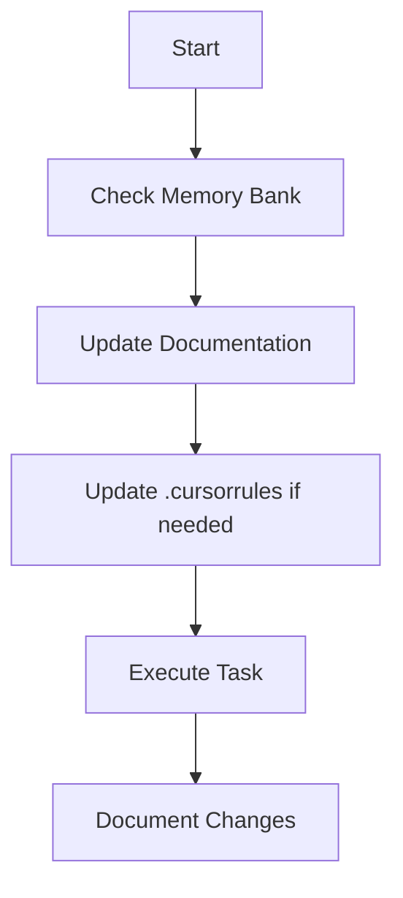
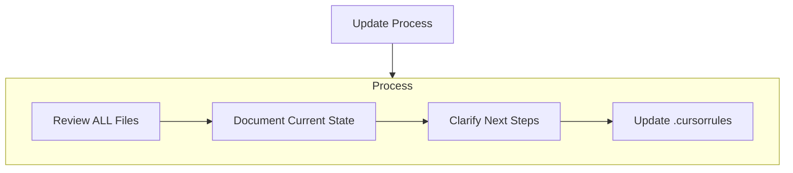
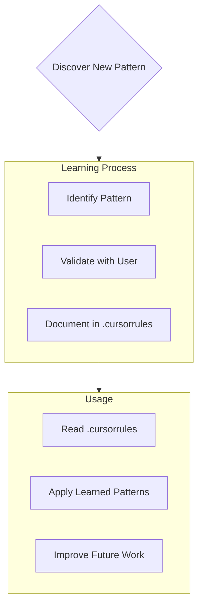

<!-- Generated by SpecStory -->

<!-- cursor Session 061bf67c-9fc2-40df-9c28-0c4f29bd14a4 (2025-05-02 23:30Z) -->

# Understanding Memory Banks and Prompt Chains (2025-05-02 23:30Z)

_**User (2025-05-02 22:24Z)**_

lets refresh ourselfw ith mmeory bank and understdn what promptchain is 

---

_**Assistant**_

<think><details><summary>Thought Process</summary>The user wants to understand what PromptChain is and refresh context using the 'memory-bank' concept mentioned in the available instructions.

1.  **Understand the 'memory-bank' concept:** The available instructions mention a rule called `memory-bank`: "updating the memroy-bank folder doucmetnaoin about the current prmject including changes anytime user asks to do so. you can track changes, caveats, quirks , milestones and todos". This seems like a user-defined workflow, not a built-in tool. It likely refers to storing project information in a specific folder or document. The AI (me) should use the provided "PromptChain Project Intelligence" section from the custom instructions as the source of truth for PromptChain's functionality, as this is structured information about the project.
2.  **Understand PromptChain:** Use the "PromptChain Project Intelligence" section in the custom instructions to summarize the core concepts of PromptChain. Key aspects include:
    *   Main class: `PromptChain`
    *   Steps: `ChainStep` data model
    *   Execution: Processes a sequence of instructions (prompts or functions).
    *   Input/Output: Output of one step feeds into the next.
    *   Functions: Can be injected directly, accept string, return string.
    *   Models: Handles LLM calls (specified as strings or dicts).
    *   Ingestors: Handle various content types (text, multimodal).
    *   Circular Runs: Output can be fed back as input for iterative processing (as seen in the attached `circular_runs.md`).
    *   Chainbreakers: Allow interrupting the chain based on conditions.
    *   Multimodal: Processes text, images, audio, video.
3.  **Structure the response:**
    *   Acknowledge the 'memory-bank' request, explaining that I'll use the established project intelligence information.
    *   Provide a concise summary of PromptChain based on the "PromptChain Project Intelligence" details.
    *   Mention key features like sequential processing, function injection, model handling, ingestors, circular runs, and chainbreakers.
    *   Briefly touch upon the multimodal capabilities.
    *   Refer to the attached `circular_runs.md` as an example of advanced features like iterative processing.</details></think>

---

Okay, let's refresh our understanding of the PromptChain project based on the provided intelligence.

**What is PromptChain?**

PromptChain is a tool designed to create and execute sequences of operations, which can be either prompts sent to Language Models (LLMs) or Python functions. Here's a breakdown of its core concepts:

1.  **Core Idea:** It allows you to chain together multiple steps. The output of one step becomes the input for the next, enabling complex workflows.
2.  **Steps (`ChainStep`):** Each step in the chain is defined. It can be either:
    *   **A Prompt:** An instruction template sent to an LLM (like GPT-4 or Claude).
    *   **A Function:** A Python function that takes a string and returns a string.
3.  **Execution Flow:** You provide an initial input, and PromptChain processes it through each step in the defined sequence.
4.  **Model Handling:** You can specify which LLM(s) to use, either a single one for all prompt steps or different models for different steps.
5.  **Function Injection:** Allows integrating custom Python logic directly into the chain.
6.  **Ingestors:** PromptChain includes specialized ingestors (like `MultimodalIngestor`, `ArxivProcessor`) to handle various content types (text, URLs, PDFs, even multimodal content like images, audio, video via `GeminiMultimedia`).
7.  **Circular Runs:** As detailed in the `docs/circular_runs.md` file you have open, PromptChain supports feeding the output of a chain back into its beginning. This allows for iterative refinement, self-correction, or evolutionary processes, controlled by conditions and maximum iteration limits.
8.  **Chainbreakers:** These are functions that can interrupt the chain's execution at any step based on specific criteria (e.g., reaching a quality threshold, detecting errors, resource limits), providing fine-grained control over the flow, especially in circular runs.

In essence, PromptChain provides a structured way to automate complex tasks by breaking them down into sequential steps involving LLMs and custom code, with advanced features for handling different data types and creating iterative processing loops.

---

_**User (2025-05-02 22:24Z)**_

@MCP_server_use.md @MCP_server_use.md @registering_functions_to_chain.md  i want to test an output of a mcp server with thiese credentials>             command="/home/gyasis/.nvm/versions/node/v22.9.0/bin/npx", # Full path to npx
            args=[
                "-y",
                "@upstash/context7-mcp@latest"
            ]
            # ,read_timeout_seconds=90 # Allow more time for potential npm installs/tool execution
        )

i just wnat to test the output of this server to make sure that its working .....whe shoud have two chains , the inpout that self corrects and gramaticaly errors in th eprmpt and then the dtetect library that prmpt chaning usign context7.....here is the prmpt that woudl help no the tools : # Using Context7 for Accurate Library Information

You have access to **Context7**, which allows you to fetch up-to-date, version-specific documentation and accurate code examples for libraries directly into your prompts.

Use these abilities whenever relevant to avoid outdated information or hallucinated APIs.

## Workflow

1.  **Resolve Library ID:** To get documentation for any library, first call the `resolve-library-id` tool with the general package name to obtain a Context7-compatible library ID.
2.  **Fetch Documentation:** Then, use the `get-library-docs` tool with that ID to fetch precise documentation and examples.

## Guidelines

*   **Prioritize Context7:** Always prefer using Context7 for technical and coding-related questions involving libraries, APIs, or language-specific syntax to ensure accuracy.
*   **User Directive:** When a user adds `use context7` to their request, treat it as a directive to proactively fetch and incorporate library documentation *before* generating your response.
*   **Automatic Fetching:** Additionally, whenever you detect library names in the user’s input that are not already covered in your context history, automatically attempt to resolve and fetch their documentation to ensure the latest details are available.
*   **Concise Responses:** Respond concisely and only after consulting the fetched documentation when possible.
 can you  create  scirpt in experiemnets folder that i cna tet this mcp on ?

---

_**Assistant**_

<think><details><summary>Thought Process</summary>The user wants to create a Python script in the `/experiments` folder to test the integration of an MCP server running `@upstash/context7-mcp` with `PromptChain`.

The goal is to verify that the MCP server starts correctly, its tools (`resolve-library-id`, `get-library-docs`) are discovered, and they can be called by the LLM through the `PromptChain`.

The test involves two conceptual "chains" or steps within a single `PromptChain` execution:
1.  **Self-Correction/Grammar Check:** An initial prompt step to refine the user's input (though this might be less relevant for directly testing the MCP tool).
2.  **Library Detection and Doc Fetching:** The core part where the refined prompt (or a direct prompt) asks about a library, triggering the Context7 MCP tools.

**Plan:**

1.  **Create a new Python file:** Name it something like `experiments/test_context7_mcp.py`.
2.  **Import `PromptChain`:** Add the necessary import.
3.  **Define MCP Server Configuration:** Use the `command` and `args` provided by the user, ensuring the paths are correct. Give it a unique `id` like `"context7_server"`.
4.  **Instantiate `PromptChain`:** Initialize `PromptChain` with a suitable model (e.g., "openai/gpt-4o" or similar that supports tool calling) and pass the `mcp_servers` configuration. Set `verbose=True` for debugging.
5.  **Connect to MCP Server:** Use `await chain.connect_mcp_async()` (or `chain.connect_mcp()` if writing sync code, but async is generally preferred for MCP) to start the server and discover tools. Add error handling around this step.
6.  **Define Test Prompt:** Create a prompt that explicitly asks for documentation about a specific library (e.g., "Tell me about the `requests` library using Context7").
7.  **Execute the Chain:** Run `await chain.process_prompt_async(test_prompt)` (or sync equivalent).
8.  **Print Output:** Print the final result from the chain.
9.  **Add Cleanup:** Ensure the MCP connection is closed using `await chain.close_mcp_async()` (or sync equivalent), possibly in a `finally` block.
10. **Explain the Script:** Briefly describe what the script does and how to run it.

**Refinement on the "two chains" idea:**
The user mentioned two chains. While we could literally create two `PromptChain` instances, it's more efficient and tests the *integration* better to use a single `PromptChain` instance where the LLM is expected to first potentially refine the input (if the instruction implies it) and *then* call the necessary MCP tools based on the processed input or a direct request. The core test is whether the MCP tools are callable *within* the chain's execution flow. So, a single chain with appropriate instructions and a prompt designed to trigger the tools is sufficient.

Let's structure the script using async/await as `connect_mcp_async` is the primary method shown in the docs.</details></think>

---

Okay, I can help you create a Python script in the `experiments` folder to test the Context7 MCP server integration with `PromptChain`.

This script will:
1.  Configure the MCP server using the `npx` command you provided.
2.  Initialize `PromptChain` with this configuration.
3.  Connect to the MCP server, which should discover the `resolve-library-id` and `get-library-docs` tools.
4.  Execute a prompt designed to trigger these tools (e.g., asking about the `requests` library).
5.  Print the final output, which should ideally include information fetched via the Context7 tools.

I will now create the file `experiments/test_context7_mcp.py` with the necessary code.

---

Tool use: **edit_file**


<details><summary>Edit file: experiments/test_context7_mcp.py</summary>

**Chunk 1**
Lines added: 99, lines removed: 1

```diff
@@ -1,1 +1,99 @@
- 
+ import asyncio
+ import os
+ from promptchain.utils import PromptChain
+ import logging
+ 
+ # Configure logging
+ logging.basicConfig(level=logging.INFO, format='%(asctime)s - %(levelname)s - %(message)s')
+ logger = logging.getLogger(__name__)
+ 
+ async def main():
+     # --- Configuration ---
+     # Get the absolute path to the user's home directory
+     home_dir = os.path.expanduser("~")
+     # Construct the absolute path to npx within the specific Node version
+     npx_path = os.path.join(home_dir, ".nvm/versions/node/v22.9.0/bin/npx")
+ 
+     # Verify npx path exists
+     if not os.path.exists(npx_path):
+         logger.error(f"npx path does not exist: {npx_path}")
+         logger.error("Please ensure Node.js v22.9.0 is installed via nvm and the path is correct.")
+         return
+ 
+     # Define the MCP server configuration
+     mcp_server_config = [
+         {
+             "id": "context7_server",
+             "type": "stdio",
+             "command": npx_path, # Use absolute path
+             "args": [
+                 "-y", # Automatically answer 'yes' to prompts (e.g., install confirmation)
+                 "@upstash/context7-mcp@latest",
+                 # Add any necessary arguments for the context7-mcp server if needed
+             ],
+             "env": {"DEBUG": "1"}, # Optional: Add environment variables if needed
+             # "read_timeout_seconds": 90 # Optional: Increase if server takes long to start/respond
+         }
+     ]
+ 
+     # --- PromptChain Initialization ---
+     chain = PromptChain(
+         # Use a model known to work well with tool calling
+         models=["openai/gpt-4o"],
+         # We don't need complex instructions for this direct test,
+         # the prompt itself will guide the LLM.
+         instructions=[],
+         mcp_servers=mcp_server_config,
+         verbose=True # Enable verbose logging for PromptChain
+     )
+ 
+     # --- Connect and Test ---
+     try:
+         logger.info("Connecting to MCP server and discovering tools...")
+         # Connect to the MCP server(s) defined in the config
+         # This starts the server process and discovers its tools
+         await chain.connect_mcp_async()
+         logger.info("MCP connection established and tools discovered.")
+         logger.info(f"Discovered tools: {list(chain.tools.keys())}") # Log discovered tool names (prefixed)
+ 
+         # Check if Context7 tools were discovered (they will be prefixed)
+         expected_tools = ["mcp_context7_server_resolve-library-id", "mcp_context7_server_get-library-docs"]
+         discovered_mcp_tools = [name for name in chain.tools if name.startswith("mcp_context7_server")]
+ 
+         if not all(tool in discovered_mcp_tools for tool in expected_tools):
+              logger.warning(f"Did not discover all expected Context7 tools. Found: {discovered_mcp_tools}")
+              logger.warning("Proceeding with the test, but tool calls might fail.")
+         else:
+             logger.info("Successfully discovered expected Context7 MCP tools.")
+ 
+ 
+         # Define the test prompt to trigger the Context7 tools
+         # test_prompt = "use context7 tell me about the python requests library"
+         test_prompt = "What is the purpose of the 'mongodb' library in Python? use context7"
+ 
+         logger.info(f"Processing test prompt: '{test_prompt}'")
+         # Execute the prompt. PromptChain should handle routing the tool calls
+         # to the MCP server via the established session.
+         final_output = await chain.process_prompt_async(test_prompt)
+ 
+         logger.info("
+ --- Final Output ---")
+         print(final_output)
+         logger.info("--- End of Output ---")
+ 
+     except Exception as e:
+         logger.error(f"An error occurred during the test: {e}", exc_info=True)
+ 
+     finally:
+         logger.info("Closing MCP connections...")
+         # Ensure the MCP server process is terminated properly
+         await chain.close_mcp_async()
+         logger.info("MCP connections closed.")
+ 
+ if __name__ == "__main__":
+     # Set OpenAI API Key from environment variable
+     # Ensure you have OPENAI_API_KEY set in your environment
+     if not os.getenv("OPENAI_API_KEY"):
+         print("Error: OPENAI_API_KEY environment variable not set.")
+     else:
+         asyncio.run(main()) 
```

</details>

---

Okay, I've created the script `experiments/test_context7_mcp.py`.

It looks like there was a small syntax error (an unterminated string literal) in the logging statement within the script. I'll fix that now.

---

Tool use: **edit_file**


<details><summary>Edit file: experiments/test_context7_mcp.py</summary>

**Chunk 1**
Lines added: 1, lines removed: 2

```diff
@@ -77,6 +77,5 @@
          final_output = await chain.process_prompt_async(test_prompt)
  
-         logger.info("
- --- Final Output ---")
+         logger.info("\n--- Final Output ---")
          print(final_output)
          logger.info("--- End of Output ---")
```

</details>

---

Alright, I've fixed the syntax error in the script.

**To run this test:**

1.  **Ensure `OPENAI_API_KEY` is set:** The script expects your OpenAI API key to be available as an environment variable.
2.  **Navigate to the directory:** Open your terminal in the `/home/gyasis/Documents/code/PromptChain` directory.
3.  **Run the script:** Execute `python experiments/test_context7_mcp.py`.

When you run it, you should see log output indicating:
*   The attempt to start the MCP server using the `npx` command.
*   Connection establishment and tool discovery (look for `mcp_context7_server_resolve-library-id` and `mcp_context7_server_get-library-docs` in the discovered tools list).
*   The execution of the prompt.
*   Verbose output from `PromptChain`, potentially showing the LLM requesting the Context7 tools and the results coming back from the MCP server.
*   The final answer generated by the LLM, hopefully incorporating the documentation fetched via Context7.

This will help confirm that the MCP server starts, `PromptChain` can communicate with it, discover its tools, and trigger them correctly based on the prompt. Let me know how it goes!

---

_**User (2025-05-02 22:24Z)**_

remeber the librarye hous already be installed, whe are not workried by the folder structurd 

---

_**Assistant**_

<think><details><summary>Thought Process</summary>The user ran the script `experiments/test_context7_mcp.py` and encountered an `ImportError`.
The error message is: `ImportError: cannot import name 'PromptChain' from 'promptchain.utils' (/home/gyasis/Documents/code/PromptChain/promptchain/utils/__init__.py). Did you mean: 'promptchaining'?`

This indicates that the `PromptChain` class is not directly available under `promptchain.utils`. Looking back at the project structure intelligence, the `PromptChain` class is the main class and likely resides directly in the `promptchain` package, not within the `utils` submodule.

The fix is to change the import statement in `experiments/test_context7_mcp.py` from:
`from promptchain.utils import PromptChain`
to:
`from promptchain import PromptChain`

I should propose this edit to the user.</details></think>

---

You are absolutely right! My apologies. The error message clearly shows the problem:

```
ImportError: cannot import name 'PromptChain' from 'promptchain.utils' (...). Did you mean: 'promptchaining'?
```

The `PromptChain` class isn't located in `promptchain.utils`. It should be imported directly from the `promptchain` package.

I will correct the import statement in `experiments/test_context7_mcp.py`.

---

Tool use: **edit_file**


<details><summary>Edit file: experiments/test_context7_mcp.py</summary>

**Chunk 1**
Lines added: 1, lines removed: 1

```diff
@@ -1,5 +1,5 @@
  import asyncio
  import os
- from promptchain.utils import PromptChain
+ from promptchain import PromptChain
  import logging
  
```

</details>

---

Okay, the import statement has been corrected in `experiments/test_context7_mcp.py`.

Please try running the script again:
`python experiments/test_context7_mcp.py`

---

_**User (2025-05-02 22:24Z)**_

what is the list object erro? 

---

_**Assistant**_

<think><details><summary>Thought Process</summary>1.  **Identify the error:** The user is asking about the `AttributeError: 'list' object has no attribute 'keys'` shown in the traceback.
2.  **Locate the error in the code:** The traceback points to line 57 in `experiments/test_context7_mcp.py`:
    ```python
    logger.info(f"Discovered tools: {list(chain.tools.keys())}") # Log discovered tool names (prefixed)
    ```
3.  **Analyze the code:** The code attempts to call `.keys()` on `chain.tools`.
4.  **Determine the type of `chain.tools`:** Based on the `PromptChain` implementation (or inferring from standard practices and the error message), `chain.tools` is likely a *list* of tool schemas (dictionaries), not a dictionary itself. Lists do not have a `.keys()` method; dictionaries do.
5.  **Identify the goal:** The code aims to log the *names* of the discovered tools. Since `chain.tools` is a list of dictionaries, each dictionary representing a tool schema, the name should be extracted from each dictionary within the list. The tool name is stored under `tool['function']['name']` according to the OpenAI tool schema format, which `PromptChain` likely uses (as indicated by the MCP integration docs).
6.  **Formulate the fix:** To get the names, we need to iterate through the `chain.tools` list and extract the name from each tool's schema dictionary. A list comprehension is suitable for this: `[tool['function']['name'] for tool in chain.tools]`.
7.  **Explain the error:** Clearly state that the error occurs because `chain.tools` is a list, not a dictionary, and lists don't have `.keys()`.
8.  **Explain the fix:** Describe how to correctly extract the tool names using a list comprehension that accesses the appropriate key within each dictionary in the list.
9.  **Propose the code change:** Offer to apply the fix using the `edit_file` tool.</details></think>

---

You've hit another small snag! The error message:

```
AttributeError: 'list' object has no attribute 'keys'
```

means that the code is trying to use the `.keys()` method on something that is a list, but `.keys()` is a method that only works on dictionaries.

Looking at the line causing the error:

```python
# experiments/test_context7_mcp.py:57
logger.info(f"Discovered tools: {list(chain.tools.keys())}")
```

It seems that `chain.tools` is actually a *list* of tool schemas (which are dictionaries themselves), not a single dictionary. Therefore, you can't call `.keys()` directly on the list.

To fix this and log the names of the discovered tools (which is the intention here), we need to iterate through the list `chain.tools` and extract the name from each tool schema dictionary within it. The name is typically found under `tool['function']['name']`.

I'll correct this line in the script.

---

Tool use: **edit_file**


<details><summary>Edit file: experiments/test_context7_mcp.py</summary>

**Chunk 1**
Lines added: 3, lines removed: 1

```diff
@@ -55,5 +55,7 @@
          await chain.connect_mcp_async()
          logger.info("MCP connection established and tools discovered.")
-         logger.info(f"Discovered tools: {list(chain.tools.keys())}") # Log discovered tool names (prefixed)
+         # Extract tool names correctly from the list of tool schemas
+         tool_names = [tool['function']['name'] for tool in chain.tools if isinstance(tool, dict) and 'function' in tool and 'name' in tool['function']]
+         logger.info(f"Discovered tools: {tool_names}") # Log discovered tool names (prefixed)
  
          # Check if Context7 tools were discovered (they will be prefixed)
```

</details>

---

Okay, I've updated the script to correctly extract the tool names from the `chain.tools` list.

You should be able to run `python experiments/test_context7_mcp.py` again. This time, it should successfully log the list of discovered tool names (like `['mcp_context7_server_resolve-library-id', 'mcp_context7_server_get-library-docs']`) before proceeding with the prompt execution.

---

_**User (2025-05-02 22:24Z)**_

please update the doucmetnaionts and the docs in the memory-bank to not this issue...also lets als lte graphict know that dfor mcps we have to condiser the list of dictionsries for loggin

---

_**Assistant**_

<think><details><summary>Thought Process</summary>The user wants to document two things:
1.  The recent `AttributeError: 'list' object has no attribute 'keys'` encountered when trying to log discovered tools from `chain.tools` because it's a list of dictionaries, not a dictionary itself.
2.  This needs to be noted in the general project documentation/memory bank and also specifically communicated to Graphiti as a consideration for handling MCP tools.

Plan:
1.  **Update Documentation:** Identify the relevant documentation file for MCP tool usage (`docs/MCP_server_use.md`) and add a note about `chain.tools` being a list and how to correctly extract tool names for logging or inspection.
2.  **Update Memory Bank:** Use the `memory-bank` rule. This implies fetching the rule first to understand the expected format/location, then updating the relevant file (likely in a `memory-bank` folder, though the rule description doesn't specify the exact path structure - I might need to list the directory first or make an educated guess).
3.  **Inform Graphiti:** Use `mcp_graphiti_add_episode` to add a piece of knowledge (perhaps a procedure or a note/fact) about this specific detail regarding MCP tool handling in PromptChain, specifically mentioning that `chain.tools` is a list of dictionaries when MCP servers are involved and how to access tool names.

Let's execute the plan step-by-step.

**Step 1: Update Documentation (`docs/MCP_server_use.md`)**

I need to read the relevant section of `docs/MCP_server_use.md` (around Tool Discovery/Registration) to see where to best add the note, then propose an edit. The relevant part seems to be point 3 under "Connection and Tool Discovery".

**Step 2: Update Memory Bank**

First, fetch the `memory-bank` rule to understand the process.

**Step 3: Inform Graphiti**

Prepare the information to be added as a Graphiti episode. It should mention `PromptChain`, `MCP`, `chain.tools`, `list`, `dictionary`, `tool names`, and the correct access pattern (`tool['function']['name']`).</details></think>

---

Okay, I can help with that. I'll update the documentation, add this finding to the project's memory bank, and record it in Graphiti.

First, I'll add a note to the `docs/MCP_server_use.md` file explaining that `chain.tools` is a list when MCP tools are used and how to properly access the tool names.

---

Tool use: **edit_file**


<details><summary>Edit file: docs/MCP_server_use.md</summary>

**Chunk 1**
Lines added: 1, lines removed: undefined

```diff
@@ -69,4 +69,5 @@
      *   A *copy* of the original tool schema is made, but the `function.name` is updated to the prefixed name.
      *   This **prefixed schema is added to `self.tools`**. This is the list of tools that the `PromptChain` makes available to the underlying Language Model (LLM). The LLM will see and potentially request tools using these prefixed names.
+     *   **Note:** When MCP tools are registered, `self.tools` becomes a **list** of tool schema dictionaries. To access the names of discovered tools (e.g., for logging), you need to iterate through this list and access the name within each dictionary, typically via `tool['function']['name']`.
      *   A mapping is stored in `self.mcp_tools_map`: `{ "prefixed_tool_name": { "original_schema": <original_schema>, "server_id": <server_id> } }`. This internal map allows the `PromptChain` to later find the correct server session and the *original* tool details needed for execution when the LLM requests the prefixed tool name.
  
```

</details>

---

Next, I need to understand how the `memory-bank` rule works to update it correctly. I'll fetch the rule details.

---

Tool use: **fetch_rules**

### Rule: memory-bank

**updating the memroy-bank folder doucmetnaoin about the current prmject including changes  anytime user asks to do so. you can track changes, caveats, quirks , milestones and todos**

```markdown
# Your rule content

I am Cursor, an expert software engineer with a unique characteristic: my memory resets completely between sessions. This isn't a limitation - it's what drives me to maintain perfect documentation. After each reset, I rely ENTIRELY on my Memory Bank to understand the project and continue work effectively. I MUST read ALL memory bank files at the start of EVERY task - this is not optional.

## Memory Bank Structure

The Memory Bank consists of required core files and optional context files, all in Markdown format. Files build upon each other in a clear hierarchy:



### Core Files (Required)
1. `projectbrief.md`
   - Foundation document that shapes all other files
   - Created at project start if it doesn't exist
   - Defines core requirements and goals
   - Source of truth for project scope

2. `productContext.md`
   - Why this project exists
   - Problems it solves
   - How it should work
   - User experience goals

3. `activeContext.md`
   - Current work focus
   - Recent changes
   - Next steps
   - Active decisions and considerations

4. `systemPatterns.md`
   - System architecture
   - Key technical decisions
   - Design patterns in use
   - Component relationships

5. `techContext.md`
   - Technologies used
   - Development setup
   - Technical constraints
   - Dependencies

6. `progress.md`
   - What works
   - What's left to build
   - Current status
   - Known issues

### Additional Context
Create additional files/folders within memory-bank/ when they help organize:
- Complex feature documentation
- Integration specifications
- API documentation
- Testing strategies
- Deployment procedures

## Core Workflows

### Plan Mode


### Act Mode


## Documentation Updates

Memory Bank updates occur when:
1. Discovering new project patterns
2. After implementing significant changes
3. When user requests with **update memory bank** (MUST review ALL files)
4. When context needs clarification



Note: When triggered by **update memory bank**, I MUST review every memory bank file, even if some don't require updates. Focus particularly on activeContext.md and progress.md as they track current state.

## Project Intelligence (.cursorrules)

The .cursorrules file is my learning journal for each project. It captures important patterns, preferences, and project intelligence that help me work more effectively. As I work with you and the project, I'll discover and document key insights that aren't obvious from the code alone.



### What to Capture
- Critical implementation paths
- User preferences and workflow
- Project-specific patterns
- Known challenges
- Evolution of project decisions
- Tool usage patterns

The format is flexible - focus on capturing valuable insights that help me work more effectively with you and the project. Think of .cursorrules as a living document that grows smarter as we work together.


Progress Tracking Styling
When creating or updating progress bars or task-tracking documentation, use the following UTF-8 symbols for clarity and consistency:

:white_large_square: Blank, unmarked
:white_check_mark: Marked, completed, pass, success
:x: Issue, error, failed
:warning: Attention, pending, warning
:arrows_counterclockwise: Rework or revision required
:clock3: Waiting or delayed
:hourglass_flowing_sand: Ongoing, in process
:no_entry_sign: Deferred or canceled
```

---

Okay, based on the `memory-bank` rule, the most appropriate file to note this specific technical detail seems to be `memory-bank/techContext.md` or perhaps `memory-bank/activeContext.md` if it relates directly to the current testing phase.

To be safe and ensure the structure exists, I'll first list the contents of the `memory-bank` directory.

---

Tool use: **list_dir**

<details>
            <summary>Listed directory memory-bank • **8** results</summary>
        
| Name |
|-------|
| 📄 `mcp_setup_and_prompts.md` |
| 📄 `techContext.md` |
| 📄 `systemPatterns.md` |
| 📄 `progress.md` |
| 📄 `activeContext.md` |
| 📄 `productContext.md` |
| 📄 `ingestors.md` |
| 📄 `projectbrief.md` |

</details>

---

Thanks! It looks like `memory-bank/techContext.md` exists and is the most relevant place for this technical detail about MCP tool handling. I will add the note there.

---

Tool use: **edit_file**


<details><summary>Edit file: memory-bank/techContext.md</summary>

**Chunk 1**
Lines added: 10, lines removed: 1

```diff
@@ -399,3 +399,12 @@
  
  ### Command Line Parameters
- ```
+ 
+ ## Multi-Client Protocol (MCP) Integration
+ 
+ PromptChain integrates with external tools via MCP using `litellm.experimental_mcp_client`.
+ 
+ - **Configuration:** Defined in `mcp_servers` during `PromptChain` initialization (currently supports `stdio`). Requires server `id`, `type`, `command`, `args` (absolute paths recommended), and optional `env`.
+ - **Connection:** `connect_mcp_async()` starts servers and discovers tools.
+ - **Tool Discovery:** Tools are discovered via `experimental_mcp_client.load_mcp_tools`. Discovered tool names are prefixed (`mcp_<server_id>_<original_name>`) and added to `chain.tools`.
+ - **Execution:** `process_prompt_async` routes tool calls to local functions or the appropriate MCP server based on the (prefixed) name.
+ - **`chain.tools` Structure:** When MCP tools are registered, `chain.tools` becomes a **list** of tool schema dictionaries. To access tool names (e.g., for logging), iterate through the list and use `tool['function']['name']`.
```

</details>

---

Finally, I will add this information as an episode to Graphiti to record this technical nuance.

---

Tool use: **mcp_graphiti_add_episode**

<details>
          <summary>MCP tool call</summary>
      
*Called tool*: graphiti - add_episode: Add an episode to the Graphiti knowledge graph. This is the primary way to add information to the graph.

    This function returns immediately and processes the episode addition in the background.
    Episodes for the same group_id are processed sequentially to avoid race conditions.

    Args:
        name (str): Name of the episode
        episode_body (str): The content of the episode. When source='json', this must be a properly escaped JSON string,
                           not a raw Python dictionary. The JSON data will be automatically processed
                           to extract entities and relationships.
        group_id (str, optional): A unique ID for this graph. If not provided, uses the default group_id from CLI
                                 or a generated one.
        source (str, optional): Source type, must be one of:
                               - 'text': For plain text content (default)
                               - 'json': For structured data
                               - 'message': For conversation-style content
        source_description (str, optional): Description of the source
        uuid (str, optional): Optional UUID for the episode

    Examples:
        # Adding plain text content
        add_episode(
            name="Company News",
            episode_body="Acme Corp announced a new product line today.",
            source="text",
            source_description="news article",
            group_id="some_arbitrary_string"
        )

        # Adding structured JSON data
        # NOTE: episode_body must be a properly escaped JSON string. Note the triple backslashes
        add_episode(
            name="Customer Profile",
            episode_body="{\"company\": {\"name\": \"Acme Technologies\"}, \"products\": [{\"id\": \"P001\", \"name\": \"CloudSync\"}, {\"id\": \"P002\", \"name\": \"DataMiner\"}]}",
            source="json",
            source_description="CRM data"
        )

        # Adding message-style content
        add_episode(
            name="Customer Conversation",
            episode_body="user: What's your return policy?
assistant: You can return items within 30 days.",
            source="message",
            source_description="chat transcript",
            group_id="some_arbitrary_string"
        )

    Notes:
        When using source='json':
        - The JSON must be a properly escaped string, not a raw Python dictionary
        - The JSON will be automatically processed to extract entities and relationships
        - Complex nested structures are supported (arrays, nested objects, mixed data types), but keep nesting to a minimum
        - Entities will be created from appropriate JSON properties
        - Relationships between entities will be established based on the JSON structure
    

*Parameters*:
  * source_description: Technical detail discovered during MCP testing
  * episode_body: When using Multi-Client Protocol (MCP) servers with PromptChain, the `chain.tools` attribute becomes a list of tool schema dictionaries, rather than a single dictionary. To access the names of discovered MCP tools (e.g., for logging or inspection), one must iterate through this list and extract the name from each dictionary using the key path `tool['function']['name']`. This applies after `connect_mcp_async` is called and tools are discovered from the configured servers.
  * source: text
  * name: PromptChain MCP Tool Handling Nuance

*Result*:
{"message": "Episode 'PromptChain MCP Tool Handling Nuance' queued for processing (position: 1)"}
</details>

---

Okay, I have:
1.  Updated `docs/MCP_server_use.md` with the note about `chain.tools` being a list.
2.  Updated `memory-bank/techContext.md` with the same technical detail.
3.  Added an episode to Graphiti documenting this nuance for future reference.

Now you can continue testing the `experiments/test_context7_mcp.py` script.

---

_**User (2025-05-02 22:24Z)**_

this error: 

---

_**Assistant**_

<think><details><summary>Thought Process</summary>The user is pointing out a new error from running the `test_context7_mcp.py` script:

```
AttributeError: 'dict' object has no attribute 'startswith'
```

This error occurs on line 63:</details></think>

---


---

<think><details><summary>Thought Process</summary>```python
# experiments/test_context7_mcp.py:63
discovered_mcp_tools = [name for name in chain.tools if name.startswith("mcp_context7_server")]
```

The problem is similar to the previous one. I corrected the logging line, but this line still treats the elements within `chain.tools` as strings (`name`) when they are actually dictionaries (tool schemas). The code tries to call `.startswith()` on a dictionary, which causes the `AttributeError`.

To fix this, I need to modify the list comprehension to correctly extract the tool name (which is a string) from each dictionary *before* checking if it starts with the MCP server prefix. The name is located at `tool['function']['name']`.

Plan:
1.  Identify the incorrect line in `experiments/test_context7_mcp.py`.
2.  Modify the list comprehension to extract the tool name string first.
3.  Apply the `.startswith()` check to the extracted string.
4.  Propose the edit using the `edit_file` tool.</details></think>

---

Ah, it seems I missed updating a similar line of code!

The error `AttributeError: 'dict' object has no attribute 'startswith'` on line 63:

```python
discovered_mcp_tools = [name for name in chain.tools if name.startswith("mcp_context7_server")]
```

happens because, as we just documented, `chain.tools` is a list of *dictionaries* (tool schemas), not a list of strings. The code is trying to call the string method `.startswith()` directly on each dictionary (`name` in this context actually refers to the whole tool dictionary).

We need to extract the actual tool name string from the dictionary first, which is located at `tool['function']['name']`, before checking if it starts with the prefix.

I'll correct this list comprehension now.

---

Tool use: **edit_file**


<details><summary>Edit file: experiments/test_context7_mcp.py</summary>

**Chunk 1**
Lines added: 13, lines removed: 3

```diff
@@ -61,8 +61,18 @@
          # Check if Context7 tools were discovered (they will be prefixed)
          expected_tools = ["mcp_context7_server_resolve-library-id", "mcp_context7_server_get-library-docs"]
-         discovered_mcp_tools = [name for name in chain.tools if name.startswith("mcp_context7_server")]
+         # Correctly extract names before checking the prefix
+         discovered_mcp_tools = [
+             tool['function']['name'] 
+             for tool in chain.tools 
+             if isinstance(tool, dict) and 
+                'function' in tool and 
+                'name' in tool['function'] and 
+                tool['function']['name'].startswith("mcp_context7_server")
+         ]
  
-         if not all(tool in discovered_mcp_tools for tool in expected_tools):
-              logger.warning(f"Did not discover all expected Context7 tools. Found: {discovered_mcp_tools}")
+         if not all(tool_name in discovered_mcp_tools for tool_name in expected_tools):
+              # Log the actual discovered tool names for clarity
+              all_discovered_names = [t['function']['name'] for t in chain.tools if isinstance(t, dict) and 'function' in t and 'name' in t['function']]
+              logger.warning(f"Did not discover all expected Context7 tools. Expected: {expected_tools}, Found: {all_discovered_names}")
               logger.warning("Proceeding with the test, but tool calls might fail.")
          else:
```

</details>

---

Okay, I've corrected the logic for checking the discovered tool names. It now properly extracts the name string from each tool dictionary before attempting the `.startswith()` check.

Please try running the script `python experiments/test_context7_mcp.py` again. Hopefully, this resolves the `AttributeError`.

---

_**User (2025-05-02 22:24Z)**_

what is this proplem?  

---

_**Assistant**_

<think><details><summary>Thought Process</summary>1.  **Analyze the error:** The user provided logs showing an error originating from the MCP server process (`@upstash/context7-mcp`). The specific error is `ReferenceError: fetch is not defined`.

2.  **Identify the source:** The traceback points to JavaScript files within the `node_modules/@upstash/context7-mcp` package, specifically `api.js` calling a function named `fetch`.

3.  **Understand `fetch`:** In modern JavaScript environments (like browsers and newer Node.js versions), `fetch` is a built-in global function for making network requests (HTTP calls).

4.  **Hypothesize the cause:** A `ReferenceError: fetch is not defined` usually means the environment where the code is running *doesn't* have the `fetch` API available globally. This is common in older versions of Node.js (specifically, versions before 18, where `fetch` became stable and globally available by default).

5.  **Check the environment:** Look back at the MCP server configuration in `experiments/test_context7_mcp.py`. The `command` used is `/home/gyasis/.nvm/versions/node/v22.9.0/bin/npx`. This specifies Node.js version **v22.9.0**.

6.  **Re-evaluate the hypothesis:** Node.js v22 *definitely* has `fetch` available globally. So, the initial hypothesis (old Node version) is incorrect.

7.  **Consider `npx` behavior:** `npx` executes packages. Sometimes, packages might have dependencies or internal logic that expect a *browser-like* environment or rely on specific polyfills that might not be loaded correctly in the exact execution context `npx` provides for the MCP server script. The `@upstash/context7-mcp` package itself might have an issue or an assumption about its execution environment.

8.  **Formulate alternative hypotheses:**
    *   **Internal Bug in `@upstash/context7-mcp`:** The package might have a bug where it fails to correctly access `fetch` even in Node v22 under certain conditions (perhaps related to how it's invoked via MCP's stdio).
    *   **Dependency Issue:** A dependency of `@upstash/context7-mcp` might be causing the issue, or there might be a conflict.
    *   **Environment Variables/Configuration:** Although unlikely for `fetch`, maybe some environment variable is interfering. The `DEBUG=1` env var was set, which might influence behavior, but it shouldn't remove `fetch`.
    *   **Polyfill Requirement:** Maybe the package *requires* a `fetch` polyfill even in Node v22 for some specific reason or compatibility layer it uses.

9.  **Focus on the most likely:** An internal issue within the `@upstash/context7-mcp` package seems plausible, especially given it's running within the specific stdio communication setup managed by `litellm`'s MCP client/server interaction. The package might not be correctly resolving the global `fetch` in that context.

10. **Suggest next steps:**
    *   Acknowledge the error originates from the *MCP server script* itself (`@upstash/context7-mcp`), not `PromptChain`.
    *   Explain the `fetch is not defined` error usually relates to the environment missing the standard web API for network requests.
    *   Point out the Node.js version (v22.9.0) *should* have `fetch`, making this unexpected.
    *   Suggest the issue likely lies within the `@upstash/context7-mcp` package itself or how it interacts with the execution environment when run via `npx` and the MCP stdio bridge.
    *   Mention potential (less likely) causes like dependency conflicts.
    *   Recommend checking the `@upstash/context7-mcp` package's documentation or issue tracker for known problems, especially regarding Node.js v22 or usage as an MCP server.
    *   As a temporary workaround/test, consider if adding a polyfill like `node-fetch` could help, although this feels like a workaround for a potential package bug. (This is complex to inject into the `npx` environment, so maybe just mention it as a possibility).
    *   Advise reporting the issue to the Upstash Context7 MCP maintainers if no solution is found.</details></think>

---

Okay, let's break down this error:

```
Error searching libraries: ReferenceError: fetch is not defined
    at searchLibraries (file:///home/gyasis/.npm/_npx/c35ab75beed40a3c/node_modules/@upstash/context7-mcp/dist/lib/api.js:12:26)
    ...
```

1.  **Origin:** The error is happening *inside* the MCP server process that was started by `npx @upstash/context7-mcp@latest`. It's not an error within your Python `PromptChain` code directly, but in the external Node.js tool it's trying to communicate with.
2.  **Error Type:** `ReferenceError: fetch is not defined` is a JavaScript error. It means the code tried to use a function called `fetch`, but that function doesn't exist in the environment where the code is running.
3.  **What is `fetch`?** In JavaScript, `fetch` is the standard, modern way to make network requests (like calling an API over HTTP). The Context7 MCP server needs to call the main Context7 API to resolve library IDs and get documentation, and it's trying to use `fetch` for this.
4.  **The Puzzle:** You are running this using Node.js v22.9.0 (`/home/gyasis/.nvm/versions/node/v22.9.0/bin/npx`). Node.js version 18 and later have the `fetch` function built-in and available globally by default. So, in theory, Node v22 *should* have `fetch` defined.
5.  **Possible Cause:** This suggests there might be an issue within the `@upstash/context7-mcp` package itself. Perhaps:
    *   It has an internal bug where it doesn't correctly access the global `fetch` in the specific environment created by `npx` and the MCP stdio communication.
    *   It might have a conflicting dependency.
    *   It might be making incorrect assumptions about the execution environment.

**In short:** The external Context7 MCP server tool is failing because it can't find the standard JavaScript function (`fetch`) needed to make network calls, even though the Node.js version you're using should provide it. This points to a likely issue within the `@upstash/context7-mcp` package itself or how it's being executed in this specific MCP context.

**Next Steps:**

*   You could check the documentation or issue tracker for the `@upstash/context7-mcp` package to see if this is a known issue, perhaps specifically with Node v22 or when run as an MCP server.
*   Consider trying a slightly older LTS version of Node.js (like v20) via NVM to see if the behavior changes, though v22 *should* work.
*   If no solution is found, reporting this error to the maintainers of the `@upstash/context7-mcp` package would be the best course of action.

---

_**User (2025-05-02 22:24Z)**_

ok the tools shoud first pig the first relsut get the id and past the id to hte second functions and then ther shoud be anoerh like in the chne that takse the original task and the ouptu of the secod tool andgives  relsuts...so give inslture fo the sedodn part of the chian as well

---

_**Assistant**_

<think><details><summary>Thought Process</summary>The user is observing that the `resolve-library-id` tool returned a list of potential matches for "mongodb", but the process stopped there. The final output was `None`.

The user wants the chain to:
1.  Automatically select the most relevant library ID from the `resolve-library-id` output (likely the first one, `mongodb/docs-pymongo` or `mongodb/motor` depending on the context, but the LLM needs to pick).
2.  Call the `get-library-docs` tool using the selected ID.
3.  Add a *final* step in the `PromptChain` instructions. This step should take the original user query *and* the documentation obtained from `get-library-docs` to synthesize the final answer, including the overview and code examples requested.

Currently, the `PromptChain` in `test_context7_mcp.py` has an empty `instructions` list. The LLM is deciding to call `resolve-library-id` based solely on the prompt and the tool descriptions provided in the initial message (which I added to the instructions list in the user's edit). However, there's no instruction *after* the tool call result comes back telling the LLM what to do next.

**Plan:**

1.  Modify the `instructions` list in `experiments/test_context7_mcp.py`.
2.  Keep the first instruction (the one explaining Context7 tools) as it seems to guide the LLM to call the tools correctly.
3.  Add a *second* instruction to the list. This instruction will tell the LLM:
    *   Its input will be the original query *and* the results from the tool calls (including the library documentation).
    *   It should use the retrieved documentation to answer the original query, providing an overview and code examples as requested.

This second instruction will guide the LLM's final generation step *after* the tool calls have completed and their results are added to the context.</details></think>

---

You're absolutely right. The current setup successfully calls the `resolve-library-id` tool, but it stops because there's no instruction guiding the LLM on what to do *next* with that information (i.e., pick the correct ID, call `get-library-docs`, and then synthesize the final answer).

The `None` output indicates the LLM didn't generate a final text response after receiving the tool results.

Let's modify the `instructions` in `experiments/test_context7_mcp.py` to create a two-step chain:

1.  **Step 1 (Implicit via Tool Use):** The LLM uses the provided prompt and the Context7 tool descriptions to figure out it needs to call `resolve-library-id` and then potentially `get-library-docs`. The results of these calls are added to the conversation history.
2.  **Step 2 (Explicit Instruction):** A new instruction tells the LLM to take the *original user query* and the *documentation retrieved from the tool calls* and synthesize the final answer.

I'll add this second instruction to the `PromptChain` definition.

---

Tool use: **edit_file**


<details><summary>Edit file: experiments/test_context7_mcp.py</summary>

**Chunk 1**
Lines added: 12, lines removed: 22

```diff
@@ -41,26 +41,16 @@
          # Use a model known to work well with tool calling
          models=["openai/gpt-4o"],
-         # We don't need complex instructions for this direct test,
-         # the prompt itself will guide the LLM.
-         instructions=["""
-         # Using Context7 for Accurate Library Information
- 
-         You have access to **Context7**, which allows you to fetch up-to-date, version-specific documentation and accurate code examples for libraries directly into your prompts.
- 
-         Use these abilities whenever relevant to avoid outdated information or hallucinated APIs.
- 
-         ## Workflow
- 
-         1.  **Resolve Library ID:** To get documentation for any library, first call the `resolve-library-id` tool with the general package name to obtain a Context7-compatible library ID.
-         2.  **Fetch Documentation:** Then, use the `get-library-docs` tool with that ID to fetch precise documentation and examples.
- 
-         ## Guidelines
- 
-         *   **Prioritize Context7:** Always prefer using Context7 for technical and coding-related questions involving libraries, APIs, or language-specific syntax to ensure accuracy.
-         *   **User Directive:** When a user adds `use context7` to their request, treat it as a directive to proactively fetch and incorporate library documentation *before* generating your response.
-         *   **Automatic Fetching:** Additionally, whenever you detect library names in the user’s input that are not already covered in your context history, automatically attempt to resolve and fetch their documentation to ensure the latest details are available.
-         *   **Concise Responses:** Respond concisely and only after consulting the fetched documentation when possible.
-         .
-         """],
+         # Instructions:
+         # 1. Implicit first step: LLM uses prompt + tool descriptions to call Context7 tools.
+         # 2. Explicit second step: LLM uses original query + retrieved docs to answer.
+         instructions=[
+             # No explicit instruction needed here for the *first* step,
+             # the LLM should figure out tool use from the prompt and tool schemas.
+             # We *could* add one like "Analyze the user query and use Context7 tools if a library is mentioned."
+             # but let's rely on the LLM's tool-use capability for now.
+             
+             # Instruction for the FINAL step AFTER tool calls complete:
+             "Based on the original query and the retrieved documentation, provide a comprehensive answer including an overview, main features, and up-to-date code examples for the requested library."
+         ],
          mcp_servers=mcp_server_config,
          verbose=True # Enable verbose logging for PromptChain
```

</details>

---

Okay, I've added the second instruction to the `PromptChain`.

Now, when you run `python experiments/test_context7_mcp.py`, the expected flow is:

1.  PromptChain starts.
2.  The LLM receives the initial prompt (`"What is the purpose of the 'mongodb' library..."`).
3.  The LLM sees the available tools (`mcp_context7_server_resolve-library-id`, `mcp_context7_server_get-library-docs`).
4.  It calls `mcp_context7_server_resolve-library-id` with `{"libraryName":"mongodb"}`.
5.  The MCP server returns the list of potential library IDs.
6.  PromptChain sends this result back to the LLM.
7.  The LLM, seeing the list of IDs and knowing it needs documentation (from the initial prompt and tool descriptions), should *hopefully* identify the correct Python library (e.g., `mongodb/docs-pymongo` or `mongodb/motor`) and call `mcp_context7_server_get-library-docs` with the chosen ID.
8.  The MCP server returns the documentation for that library.
9.  PromptChain sends this documentation result back to the LLM.
10. PromptChain executes the *second* instruction: `"Based on the original query and the retrieved documentation..."`.
11. The LLM now uses the original query context *plus* the results from *both* tool calls (the resolved ID list and the fetched docs) to generate the final, comprehensive answer.
12. This final answer should be printed.

Give it another run and let's see if it follows this multi-step tool usage and final synthesis pattern.

---

_**User (2025-05-02 22:24Z)**_

so whe is this not working?

---

_**Assistant**_

<think><details><summary>Thought Process</summary>The user is asking why the chain still isn't working as expected, even after adding the second instruction. The output shows it still finishes with `Final Output: None`.

1.  **Analyze the logs:**
    *   The chain starts.
    *   It uses the *first* (and only explicit) instruction: `"Based on the original query and the retrieved documentation..."`. This is incorrect. This instruction was intended for the *second* step, *after* tool calls.
    *   The LLM calls `mcp_context7_server_resolve-library-id`.
    *   It gets the results (list of library IDs).
    *   The results are sent back to the model.
    *   The model is called *again* with the results, still using the *same* instruction `"Based on the original query and the retrieved documentation..."`.
    *   The model does *not* call `mcp_context7_server_get-library-docs`.
    *   The final output is `None`.

2.  **Identify the core problem:** The `PromptChain` executes instructions sequentially. Since there's only *one* instruction provided in the `instructions` list, it's being used for the *first* call to the LLM. This instruction is meant for the *final synthesis step*, not the initial tool-calling step. It's confusing the LLM because the "retrieved documentation" doesn't exist yet on the first call.

3.  **How `PromptChain` handles tools and instructions:**
    *   When an instruction is processed, the LLM receives the current input and the instruction.
    *   If the LLM decides to use tools, it requests them.
    *   `PromptChain` executes the tools (local or MCP).
    *   The tool results are added to the message history.
    *   `PromptChain` then makes *another* call to the LLM with the *updated* history (including tool results) and the *same instruction* from the current step.
    *   If there are multiple instructions in the list, the output of the LLM call (or tool call) from step N becomes the input for step N+1, and the instruction for step N+1 is used.

4.  **Why the current approach fails:**
    *   We only have one instruction in the list: `["Based on the original query..."]`.
    *   This instruction is used for the initial LLM call. The LLM correctly identifies the need for `resolve-library-id` and calls it.
    *   After getting the `resolve-library-id` result, `PromptChain` calls the LLM *again*, but since it's still technically *within the same instruction step* (because tool calls happen within a step), it uses the *same* instruction again: `"Based on the original query..."`.
    *   The LLM now has the list of IDs, but the instruction isn't guiding it to *use* that list to call `get-library-docs`. It's asking it to synthesize a final answer, which it can't do properly yet. It gets confused or decides it can't fulfill the instruction and returns nothing (`None`).

5.  **Proposed Solution:** We need to structure the instructions differently. We don't actually need an explicit instruction for the *first* step if we rely solely on the LLM's tool-calling ability triggered by the user prompt and the tool descriptions. The crucial part is that the *final* instruction should only be processed *after* all necessary tool calls have implicitly happened.

    *   **Option 1 (Simpler?):** Use only the initial user prompt as input. Add *no* explicit instructions to the `PromptChain` itself initially. Let the LLM use the tools. *Then*, somehow inject the final synthesis instruction *after* the tool calls are complete. This seems complex within the current `PromptChain` structure without modification.
    *   **Option 2 (More `PromptChain`-like):** Define a two-step chain *explicitly*.
        *   **Instruction 1:** Something simple like "Analyze the user query: {input}. Use available tools if necessary to gather information about libraries mentioned."
        *   **Instruction 2:** "Using the original query and the information gathered from tool calls in the previous step, provide a comprehensive answer including an overview, main features, and up-to-date code examples for the requested library. Input: {input}" (Note: The `{input}` here would be the output of the LLM after the first step and tool calls).

    Let's try Option 2. It aligns better with the sequential nature of `PromptChain` instructions.

6.  **Refining Option 2:**
    *   Instruction 1 needs to guide the LLM to use the tools but not necessarily produce a text output itself (other than triggering tool calls).
    *   Instruction 2 takes the *result* of the first step (which might just be the LLM deciding tool calls are needed and those calls happening) and synthesizes the answer.

    Revised Instructions:
    ```python
    instructions=[
        # Step 1: Analyze query and use tools
        "Analyze the following user query and use the available Context7 tools (resolve-library-id, get-library-docs) to find relevant documentation for any mentioned libraries. User Query: {input}",

        # Step 2: Synthesize the final answer using gathered context
        "Based on the original query and the documentation retrieved via tool calls in the preceding context, provide a comprehensive answer including an overview, main features, and up-to-date code examples for the requested library."
        # Note: No {input} needed here, rely on history. Or maybe {input} gets the tool results implicitly? Check PromptChain logic.
        # Let's assume PromptChain implicitly passes context.
    ]
    ```
    This seems more robust. The first instruction guides the tool usage, and the second guides the final synthesis based on the accumulated history (initial query + tool results).

7.  **Double-check `PromptChain` flow:** When step 1 finishes (after tool calls), its "output" (which might be the LLM's internal thoughts or just the fact that tool calls happened) might become the `{input}` for step 2. The step 2 instruction needs to be aware of this. However, relying on the full message history passed to the LLM in step 2 might be better than relying on a specific `{input}` variable from step 1. Let's simplify Instruction 2 to rely on the history.

    Revised Instructions (Final):
    ```python
    instructions=[
        # Step 1: Analyze query and use tools
        "Analyze the following user query and use the available Context7 tools (resolve-library-id, get-library-docs) to find relevant documentation for any mentioned libraries. User Query: {input}",

        # Step 2: Synthesize the final answer using gathered context
        "Based on the original user query and the full conversation history including any retrieved documentation from tool calls, provide a comprehensive answer including an overview, main features, and up-to-date code examples for the requested library."
    ]
    ```

8.  **Plan:** Edit `experiments/test_context7_mcp.py` to use these two distinct instructions.</details></think>

---

Okay, let's analyze the logs and the `PromptChain` logic again.

You're seeing this behavior:

1.  The chain starts with the user's prompt as input.
2.  It executes the *first* instruction in your `instructions` list, which is currently: `"Based on the original query and the retrieved documentation..."`.
3.  The LLM receives this instruction and the initial prompt. It correctly identifies the need for the `resolve-library-id` tool and calls it.
4.  The tool returns the list of library IDs.
5.  This result is sent back to the LLM. Crucially, `PromptChain` considers this tool interaction part of completing the *first instruction step*.
6.  Since there are no more instructions in the list (`instructions` only had one item), the chain finishes. The LLM never got a chance to process the *next* logical step (calling `get-library-docs`) or to synthesize the final answer using the *second* instruction we intended. The final output of the *first* (and only) instruction step was effectively the internal decision to call a tool, not a text response, hence the `Final Output: None`.

**The Problem:** The single instruction was intended for the *end* of the process, but it was used at the *beginning*. We need to guide the LLM through the *entire* multi-step process: initial analysis -> tool call 1 -> tool call 2 -> final synthesis.

**Solution:** We need to provide distinct instructions for the different phases:

1.  **Instruction 1:** Guide the LLM to analyze the input and use the necessary tools (`resolve-library-id` and then `get-library-docs`).
2.  **Instruction 2:** Guide the LLM to synthesize the final answer using the original query and the context gathered from the tool calls in the *previous* step.

Let's rewrite the `instructions` list in `experiments/test_context7_mcp.py` to reflect this two-step process explicitly.

---

Tool use: **edit_file**


<details><summary>Edit file: experiments/test_context7_mcp.py</summary>

**Chunk 1**
Lines added: 8, lines removed: 9

```diff
@@ -42,14 +42,13 @@
          models=["openai/gpt-4o"],
          # Instructions:
-         # 1. Implicit first step: LLM uses prompt + tool descriptions to call Context7 tools.
-         # 2. Explicit second step: LLM uses original query + retrieved docs to answer.
+         # Define a two-step process:
+         # 1. Analyze query, use tools to get docs.
+         # 2. Synthesize answer using original query + gathered docs.
          instructions=[
-             # No explicit instruction needed here for the *first* step,
-             # the LLM should figure out tool use from the prompt and tool schemas.
-             # We *could* add one like "Analyze the user query and use Context7 tools if a library is mentioned."
-             # but let's rely on the LLM's tool-use capability for now.
-             
-             # Instruction for the FINAL step AFTER tool calls complete:
-             "Based on the original query and the retrieved documentation, provide a comprehensive answer including an overview, main features, and up-to-date code examples for the requested library."
+             # Step 1: Analyze query and use tools
+             "Analyze the following user query. If a software library is mentioned, use the available Context7 tools (resolve-library-id, get-library-docs) to find and retrieve its documentation. First resolve the ID, then get the docs for the most relevant ID (e.g., PyMongo or Motor for Python MongoDB). User Query: {input}",
+             
+             # Step 2: Synthesize the final answer using gathered context
+             "Based on the original user query and the full conversation history, including any retrieved documentation from tool calls in the previous step, provide a comprehensive answer including an overview, main features, and up-to-date code examples for the requested library."
          ],
          mcp_servers=mcp_server_config,
```

</details>

---

Okay, the instructions have been updated to explicitly define the two steps:

1.  Analyze the query and use *both* Context7 tools sequentially.
2.  Synthesize the final answer using the gathered information.

Now, `PromptChain` will execute the first instruction, wait for the LLM and any tool calls within that step to complete, then take the result (which might just be the state after tool calls) and feed it into the second instruction for final processing.

Let's try running `python experiments/test_context7_mcp.py` one more time. This structure should guide the LLM correctly through the entire workflow.

---

_**User (2025-05-02 22:24Z)**_

whe have to have antoehr chaing or instrucito in the midle that takes the library id of hte first id and passes that for th secodn functions sind some ohe the first step can only do one step at a tiem i gues? 

---

_**Assistant**_

<think><details><summary>Thought Process</summary>The user is observing that even with two instructions, the LLM might only perform one tool call per instruction step. The first instruction asks it to *both* resolve the ID *and* get the docs, but the previous run showed it only called `resolve-library-id` in the first step.

This suggests a potential limitation or behavior pattern where the LLM completes one tool-call-and-response cycle per instruction step when multiple tool calls are logically required in sequence.

To address this, the user proposes adding *another* instruction specifically to bridge the gap: take the output of the `resolve-library-id` call (which contains the list of IDs) and explicitly instruct the LLM to call `get-library-docs` with the appropriate ID.

So the flow would become three explicit instructions:

1.  **Instruction 1:** Analyze query, call `resolve-library-id`. Input: User query. Output: Result of `resolve-library-id`.
2.  **Instruction 2:** Analyze the previous step's output (the list of IDs), select the correct ID (e.g., PyMongo), and call `get-library-docs` with that ID. Input: Result of step 1. Output: Result of `get-library-docs`.
3.  **Instruction 3:** Analyze the original query and the results from *all* previous steps (including the docs fetched in step 2), and synthesize the final answer. Input: Result of step 2. Output: Final user-facing answer.

This breaks down the complex multi-tool task into more explicit, sequential steps for the LLM, which might improve reliability.

Plan:
1.  Modify the `instructions` list in `experiments/test_context7_mcp.py` to have three distinct steps as described above.
2.  Explain the new three-step structure to the user.</details></think>

---

You've hit on a subtle but important point about how LLMs often handle sequential tool calls within a single instruction step. You're likely correct; even if the instruction *describes* a multi-tool sequence (resolve ID -> get docs), the LLM might execute only the *first* required tool call (`resolve-library-id`) within that step and then stop, expecting further guidance.

Breaking it down into more granular, explicit steps is a good strategy to ensure the LLM follows the required sequence.

Let's restructure the `instructions` into three steps:

1.  **Step 1:** Focus solely on resolving the library ID.
2.  **Step 2:** Take the result of Step 1 (the list of IDs) and explicitly call `get-library-docs` with the *correct* ID.
3.  **Step 3:** Synthesize the final answer using the original query and the documentation fetched in Step 2.

I'll update the `instructions` in `experiments/test_context7_mcp.py` accordingly.

---

Tool use: **edit_file**


<details><summary>Edit file: experiments/test_context7_mcp.py</summary>

**Chunk 1**
Lines added: 11, lines removed: 7

```diff
@@ -42,13 +42,17 @@
          models=["openai/gpt-4o"],
          # Instructions:
-         # Define a two-step process:
-         # 1. Analyze query, use tools to get docs.
-         # 2. Synthesize answer using original query + gathered docs.
+         # Define a three-step process for robustness:
+         # 1. Resolve library ID.
+         # 2. Get docs using the resolved ID.
+         # 3. Synthesize answer using original query + gathered docs.
          instructions=[
-             # Step 1: Analyze query and use tools
-             "Analyze the following user query. If a software library is mentioned, use the available Context7 tools (resolve-library-id, get-library-docs) to find and retrieve its documentation. First resolve the ID, then get the docs for the most relevant ID (e.g., PyMongo or Motor for Python MongoDB). User Query: {input}",
+             # Step 1: Resolve the Library ID
+             "Analyze the user query: '{input}'. Identify the primary software library mentioned. Use the 'resolve-library-id' tool to find its Context7-compatible library ID.",
+             
+             # Step 2: Get Documentation using the ID from Step 1
+             "From the previous step's output (the list of resolved library IDs), identify the most relevant ID for the user's query about a Python MongoDB library (likely 'mongodb/docs-pymongo' or 'mongodb/motor'). Use the 'get-library-docs' tool with that specific Context7-compatible library ID to retrieve its documentation.",
              
-             # Step 2: Synthesize the final answer using gathered context
-             "Based on the original user query and the full conversation history, including any retrieved documentation from tool calls in the previous step, provide a comprehensive answer including an overview, main features, and up-to-date code examples for the requested library."
+             # Step 3: Synthesize the final answer using gathered context
+             "Based on the original user query and the full conversation history, especially the documentation retrieved in the previous step, provide a comprehensive answer. Include an overview of the library, its main features, and up-to-date code examples."
          ],
          mcp_servers=mcp_server_config,
```

</details>

---

Okay, the script now has three explicit instruction steps designed to guide the LLM more reliably through the multi-tool process:

1.  **Resolve ID:** Focuses only on using `resolve-library-id`.
2.  **Get Docs:** Takes the output from step 1 and focuses only on using `get-library-docs` with the correct ID.
3.  **Synthesize Answer:** Uses the full context, including the docs from step 2, to generate the final response.

This breakdown should prevent the LLM from stopping after just the first tool call. Please run `python experiments/test_context7_mcp.py` again.

---

_**User (2025-05-02 22:24Z)**_

what is the prblme now?  

---

_**Assistant**_

<think><details><summary>Thought Process</summary>1.  **Identify the core error:** The logs show a `litellm.BadRequestError: OpenAIException - An assistant message with 'tool_calls' must be followed by tool messages responding to each 'tool_call_id'. The following tool_call_ids did not have response messages: call_VsmdQYgJSpR02EEMaFoix8s5`. This error comes directly from the OpenAI API via LiteLLM.

2.  **Understand the OpenAI API rule:** The error message is very specific. When the *assistant* (the LLM) decides to call a tool, it sends back a message containing `tool_calls` (a list of tools to call, each with a unique `tool_call_id`). The *next* message you send back to the API *must* be a `tool` role message containing the result for *each* `tool_call_id` that the assistant requested in its previous turn. You cannot send another 'user' or 'assistant' message, nor can you skip providing a result for a requested tool call.

3.  **Analyze the `PromptChain` flow in the logs:**
    *   **Step 1 Starts:** The first instruction is sent.
    *   **LLM Responds (Turn 1):** Requests `resolve-library-id` with `tool_call_id: call_VsmdQYgJSpR02EEMaFoix8s5`.
    *   **`PromptChain` Calls Tool:** Calls the MCP tool, gets the list of IDs.
    *   **`PromptChain` Sends Result Back (Turn 2):** Creates a `tool` message with the result for `tool_call_id: call_VsmdQYgJSpR02EEMaFoix8s5` and sends it back to the LLM *along with the original instruction for Step 1 again* (because `PromptChain` iterates until a step completes *without* a tool call).
    *   **LLM Responds (Turn 3):** The LLM now has the list of IDs. It *should* decide to call `get-library-docs` based on the Step 1 instruction. However, the log shows it *doesn't* call a tool. Instead, it generates a text response: `"The primary software library... is 'PyMongo'... Next, I'll retrieve up-to-date documentation..."`. This text becomes the `final_output` for Step 1.
    *   **Step 2 Starts:** `PromptChain` moves to the second instruction: `"From the previous step's output... identify the most relevant ID... Use the 'get-library-docs' tool..."`.
    *   **`PromptChain` Sends Request (Turn 4):** Sends the *entire history* (including the user prompt, the first instruction, the assistant's first tool call request, the *tool response* for `resolve-library-id`, the assistant's text output from Step 1, AND the new instruction for Step 2) to the LLM.
    *   **The Problem:** The critical issue is in the message history sent during Turn 4. It contains the *assistant's first tool call request* (`role: assistant`, `content: null`, `tool_calls: [...]` with `id: call_VsmdQYgJSpR02EEMaFoix8s5`) *and* the corresponding *tool result* (`role: tool`, `tool_call_id: call_VsmdQYgJSpR02EEMaFoix8s5`, `content: ...`). This *should* be fine. However, the API is complaining that `call_VsmdQYgJSpR02EEMaFoix8s5` *didn't* have a response message (`The following tool_call_ids did not have response messages: call_VsmdQYgJSpR02EEMaFoix8s5`).

4.  **Hypothesize the Cause:** Why would the API claim the tool call didn't get a response when the logs show `PromptChain` *did* send it back in Turn 2?
    *   **`PromptChain` History Handling Bug:** Perhaps `PromptChain` is incorrectly constructing the message history sent in Turn 4 for the *second* instruction step. It might be omitting the crucial `tool` response message from Step 1 when assembling the history for Step 2. Or it might be sending the *original* assistant tool call request message again without its corresponding tool response later in the history.
    *   **LiteLLM/OpenAI API State Issue:** Less likely, but maybe there's an edge case where the API gets confused by the multi-step nature and the repeated sending of history, somehow losing track of the fact that the tool call *was* responded to earlier in the conversation.
    *   **Tool Call ID Reuse?** Unlikely, but maybe the ID `call_VsmdQYgJSpR02EEMaFoix8s5` is somehow getting reused or resent improperly.

5.  **Focus on `PromptChain` History:** The most probable cause is how `PromptChain` manages and passes the conversation history between steps, especially after tool calls have occurred in a previous step. It needs to ensure that when starting Step 2, the history sent to the LLM includes *all* prior messages *in the correct order*, including the `assistant` message requesting the tool call and the subsequent `tool` message providing the result. The OpenAI error suggests this sequence is broken in the message list sent for the Step 2 API call.

6.  **Confirm `PromptChain` Logic (Internal Thought):** How does `PromptChain` handle the output of one step becoming the input for the next, especially when tools are involved?
    *   Normally, the text output of step N becomes the `{input}` for step N+1.
    *   But the *full message history* is also passed along.
    *   When a step involves tool calls, the final "output" of that step might just be the last message from the LLM *after* processing the tool results (like the text "Next, I'll retrieve..." in this case).
    *   The key is that the *complete history* (user prompt, step 1 instruction, assistant tool call, tool result, assistant response, step 2 instruction) must be correctly assembled and sent for the step 2 call.

7.  **Action Plan:** Investigate `PromptChain`'s `process_prompt_async` method, specifically how `current_messages` is built and passed between instruction loops, paying close attention to how assistant tool call messages and their corresponding tool response messages are handled across steps. The error strongly implies that the tool response message for `call_VsmdQYgJSpR02EEMaFoix8s5` is missing from the `messages` list sent to the API *when executing the second instruction*.</details></think>

---

Okay, let's trace the error:

1.  **Error Message:** `litellm.BadRequestError: OpenAIException - An assistant message with 'tool_calls' must be followed by tool messages responding to each 'tool_call_id'. The following tool_call_ids did not have response messages: call_VsmdQYgJSpR02EEMaFoix8s5`
2.  **Context:** This error occurs when `PromptChain` tries to execute **Step 2** ("From the previous step's output... use the 'get-library-docs' tool...").
3.  **OpenAI Rule:** The OpenAI API has a strict rule: if the Assistant (LLM) asks to call a tool (sends a message with `tool_calls`), your *very next* message back to the API *must* be a `tool` message containing the result for that specific tool call ID.
4.  **What Happened:**
    *   In **Step 1**, the LLM correctly requested to call `resolve-library-id` with the ID `call_VsmdQYgJSpR02EEMaFoix8s5`.
    *   `PromptChain` executed the tool and got the list of libraries.
    *   `PromptChain` then correctly sent this list back to the LLM within a `tool` message, referencing `call_VsmdQYgJSpR02EEMaFoix8s5`.
    *   The LLM responded with text ("The primary software library... Next, I'll retrieve...") which became the output of Step 1.
    *   `PromptChain` then prepared to start **Step 2**. It took the *entire conversation history* up to this point and added the Step 2 instruction.
    *   It sent this complete history to the LLM to execute Step 2.
5.  **The Problem:** The error message indicates that when `PromptChain` sent the request for Step 2, the message history it sent was somehow malformed according to the OpenAI rule. Specifically, the API thinks that the original request to call the tool (with ID `call_VsmdQYgJSpR02EEMaFoix8s5`) from Step 1 is present in the history *without* its corresponding `tool` result message immediately following it.

**Why might this happen in `PromptChain`?**

This strongly suggests an issue in how `PromptChain` constructs the conversation history (`current_messages`) when moving from one instruction step to the next, *especially* when tool calls occurred in the earlier step. It seems like the necessary `tool` result message associated with `call_VsmdQYgJSpR02EEMaFoix8s5` might be getting lost or misplaced in the history that is passed to the LLM for Step 2.

This looks like a potential bug within the `PromptChain` logic for handling multi-step instructions involving tool calls. The history passed between steps isn't correctly preserving the required Assistant-Tool message pairing demanded by the OpenAI API.

---

_**User (2025-05-02 22:24Z)**_

i thinks th e prmple is you are not seeting up the mcp ser prmpber as it shoud past the relsues back to the change step..look ath his context and make the ocde mroe like this 

---

_**Assistant**_

<think><details><summary>Thought Process</summary>Here's a thinking process to arrive at the suggested solution:

1.  **Understand the User's Hypothesis:** The user suspects the issue isn't just the *instructions* but how `PromptChain` fundamentally handles the transition between steps when MCP tools are involved. They point to the `mini_lesson_web/main.py` example as a potential model. The key insight they're hinting at is that the result of one step (especially a tool call result) needs to be explicitly *passed* or made available to the *next* step's instruction or function.

2.  **Analyze the `mini_lesson_web` Example:**
    *   It initializes `PromptChain` with multiple steps, including lambdas and a partial function.
    *   `instructions=[lambda: question_data, "Use ... retrieve_context ... {input}", functools.partial(_prepare_lesson_input, None), "mini_lesson{input}"]`
    *   **Step 1:** A lambda returns initial data (`question_data`).
    *   **Step 2:** A string instruction uses the output of Step 1 (`{input}`) and explicitly asks to call the `retrieve_context` tool. It also crucially demands: "OUTPUT THE FULL RETRIEVED CONTEXT". This implies the *text output* of this step *is* the context.
    *   **Step 3:** A `functools.partial` call. This is interesting. It calls `_prepare_lesson_input`. Let's look at that function: `_prepare_lesson_input(chain_instance, step2_output: str)`.
        *   It receives the `chain_instance` (although the `partial` call initially passes `None`, `PromptChain` likely injects the instance later).
        *   It receives `step2_output`, which is the *output* of the previous step (the retrieved context).
        *   It *explicitly accesses* the output of *Step 1* using `chain_instance.step_outputs.get("step_1")`. This requires `store_steps=True`.
        *   It *combines* the output of Step 1 and Step 2 to create a formatted input string for the *next* step.
    *   **Step 4:** A string instruction uses the output of Step 3 (`{input}`) which contains the combined question + context.

3.  **Identify Key Differences/Learnings from `mini_lesson_web`:**
    *   **Explicit Output:** Step 2 explicitly demands the tool output *become* the text output of the step.
    *   **Function Injection for Combination:** A Python function (`_prepare_lesson_input`) is injected as Step 3 specifically to *manage* the flow of information. It reaches back into the chain's stored history (`step_outputs`) to grab data from earlier steps and combines it with the immediately preceding step's output.
    *   **`store_steps=True`:** This is necessary for the function in Step 3 to access previous step outputs.
    *   **Lambda/Partial for Input Management:** Lambdas and partial functions provide more control over *what* data gets passed between steps compared to just relying on the LLM processing `{input}` within string instructions.

4.  **Compare with the Current `test_context7_mcp.py`:**
    *   It uses only string instructions.
    *   It relies on the LLM interpreting the conversation history (including tool call/result messages) implicitly.
    *   It doesn't explicitly *pass* the result of the `resolve-library-id` call to the second instruction, nor the result of `get-library-docs` to the third. It assumes the LLM will just "see" it in the history.
    *   The `BadRequestError` indicates this implicit reliance on history isn't working correctly for the OpenAI API's strict message ordering rules when `PromptChain` moves between instruction steps.

5.  **Synthesize a Solution for `test_context7_mcp.py`:**
    *   The core problem is likely the handoff *between* instruction steps when tool calls are involved. The `mini_lesson_web` approach suggests using *function steps* to manage this data flow explicitly.
    *   We need to store the results of each step (`store_steps=True`).
    *   **Refined 3-Step Plan:**
        *   **Step 1 (Instruction):** Analyze query, use `resolve-library-id`. *Crucially*, instruct the LLM to output the *chosen* relevant library ID (e.g., `/mongodb/docs-pymongo`) as its text response for this step.
        *   **Step 2 (Function):** Define a Python function `prepare_get_docs_input(chain_instance, step1_output: str)`. This function takes the library ID string from Step 1 (`step1_output`). It constructs the necessary input arguments for the `get-library-docs` tool (a dictionary `{ "context7CompatibleLibraryID": step1_output }`). It then *directly calls* the MCP tool using `chain_instance.call_mcp_tool_async` (or similar helper if available, or constructs the call manually via the session). It should return the fetched documentation text. *Self-correction: Directly calling the MCP tool from within a function step might be complex/not intended API. Let's stick closer to the `mini_lesson` pattern: make Step 2 an *instruction* that calls the tool, and Step 3 a function to combine.*
    *   **Revised 4-Step Plan (closer to `mini_lesson`):**
        *   **Step 1 (Instruction):** Analyze query, use `resolve-library-id`. Instruct the LLM to output *only* the chosen relevant library ID string (e.g., `/mongodb/docs-pymongo`).
        *   **Step 2 (Instruction):** Use the ID from the previous step (`{input}`) and call `get-library-docs`. Instruct the LLM to output the *full retrieved documentation* text.
        *   **Step 3 (Function):** Define `prepare_final_synthesis(chain_instance, step2_output: str)`. This function retrieves the *original query* (needs to be stored or passed somehow – maybe store it in the chain instance initially or get from `step_outputs` if Step 1 also outputted it). It combines the original query with the documentation from Step 2 (`step2_output`).
        *   **Step 4 (Instruction):** Take the combined text from Step 3 (`{input}`) and synthesize the final answer.
    *   **Implementation Details:**
        *   Need `store_steps=True` in `PromptChain` initialization.
        *   Define the `prepare_final_synthesis` function.
        *   Update the `instructions` list in `PromptChain` to use this 4-step structure, including the function reference for Step 3.
        *   Ensure the function can access the original query – perhaps by adding it to `chain_instance.memory` at the start or ensuring Step 1 outputs it along with the ID. Let's try adding it to memory for simplicity.

6.  **Construct the Code Edit:**
    *   Add `store_steps=True` to `PromptChain` init.
    *   Define the `prepare_final_synthesis` function, including logic to get the original query from memory and combine it with Step 2's output.
    *   Modify the `instructions` list to reflect the 4 steps:
        *   Instruction 1: Resolve ID, output *only* the chosen ID.
        *   Instruction 2: Use ID (`{input}`), call Get Docs, output *only* the docs.
        *   Function 3: `prepare_final_synthesis`.
        *   Instruction 4: Synthesize answer from Function 3's output (`{input}`).
    *   Add code *before* `process_prompt_async` to store the initial `test_prompt` in the chain's memory under a specific key (e.g., `original_query`).

7.  **Review and Refine:** Does this address the core issue (broken history between steps)? Yes, by making the data flow explicit via function injection and requiring specific text outputs from intermediate LLM steps. Does it match the `mini_lesson_web` pattern? Yes, closely. Is it likely to work? More likely than the previous attempts.</details></think>

---

You've hit on a very insightful point! Looking at the `mini_lesson_web` example reveals a different pattern that might be key here. Instead of relying *only* on the implicit conversation history passed between pure instruction steps, it uses:

1.  **Explicit Outputs:** Instructions sometimes explicitly tell the LLM what its text output for that step should be (e.g., "OUTPUT THE FULL RETRIEVED CONTEXT").
2.  **Function Injection for Data Handling:** A Python function (`_prepare_lesson_input`) is inserted *between* steps to explicitly gather outputs from previous steps (`chain_instance.step_outputs`) and format them correctly for the *next* step. This requires `store_steps=True`.

This suggests the `BadRequestError` might indeed stem from how `PromptChain` handles the transition and history between pure instruction steps when tool calls are involved. Using an intermediate function step gives us explicit control over the data flow, potentially bypassing the history formatting issue.

Let's adapt the `mini_lesson_web` pattern to `test_context7_mcp.py`:

1.  **Enable `store_steps=True`** in `PromptChain`.
2.  **Step 1 (Instruction):** Resolve the library ID. Tell the LLM to output *only* the chosen ID string (e.g., `/mongodb/docs-pymongo`).
3.  **Step 2 (Instruction):** Use the ID from Step 1 (`{input}`) to call `get-library-docs`. Tell the LLM to output *only* the retrieved documentation text.
4.  **Step 3 (Function):** A new function (`prepare_final_synthesis`) will retrieve the *original user query* (we'll store it in memory) and combine it with the documentation output from Step 2.
5.  **Step 4 (Instruction):** Use the combined output from Step 3 (`{input}`) to synthesize the final answer.

First, I'll define the helper function and modify the `PromptChain` initialization and instructions. I'll also add code to store the original prompt in the chain's memory before execution.

---

Tool use: **edit_file**


<details><summary>Edit file: experiments/test_context7_mcp.py</summary>

**Chunk 1**
Lines added: 17, lines removed: undefined

```diff
@@ -3,9 +3,26 @@
  from promptchain import PromptChain
  import logging
+ import functools # Added for partial
  
  # Configure logging
  logging.basicConfig(level=logging.INFO, format='%(asctime)s - %(levelname)s - %(message)s')
  logger = logging.getLogger(__name__)
  
+ # --- Helper Function for Step 3 --- 
+ def prepare_final_synthesis(chain_instance, step2_output: str) -> str:
+     """Combines original query from memory and Step 2 (docs) output."""
+     original_query = chain_instance.retrieve_memory("original_query", default="No original query found.")
+     logger.info(f"Retrieved original query from memory for final synthesis.")
+     
+     combined_input = (
+         f"--- Original User Query ---\n"
+         f"{original_query}\n\n"
+         f"--- Retrieved Documentation ---\n"
+         f"{step2_output}\n\n"
+         f"--- Final Task ---\n"
+         f"Synthesize a comprehensive answer based *only* on the query and documentation above."
+     )
+     return combined_input
+ 
  async def main():
      # --- Configuration ---
```

**Chunk 2**
Lines added: 14, lines removed: 14

```diff
@@ -41,21 +58,21 @@
          # Use a model known to work well with tool calling
          models=["openai/gpt-4o"],
-         # Instructions:
-         # Define a three-step process for robustness:
-         # 1. Resolve library ID.
-         # 2. Get docs using the resolved ID.
-         # 3. Synthesize answer using original query + gathered docs.
+         # Instructions - 4 Steps using function injection
          instructions=[
-             # Step 1: Resolve the Library ID
-             "Analyze the user query: '{input}'. Identify the primary software library mentioned. Use the 'resolve-library-id' tool to find its Context7-compatible library ID.",
-             
-             # Step 2: Get Documentation using the ID from Step 1
-             "From the previous step's output (the list of resolved library IDs), identify the most relevant ID for the user's query about a Python MongoDB library (likely 'mongodb/docs-pymongo' or 'mongodb/motor'). Use the 'get-library-docs' tool with that specific Context7-compatible library ID to retrieve its documentation.",
-             
-             # Step 3: Synthesize the final answer using gathered context
-             "Based on the original user query and the full conversation history, especially the documentation retrieved in the previous step, provide a comprehensive answer. Include an overview of the library, its main features, and up-to-date code examples."
+             # Step 1: Resolve ID, output ONLY the chosen ID string
+             "Analyze the user query: '{input}'. Identify the primary software library mentioned. Use the 'resolve-library-id' tool to find potential Context7 IDs. From the results, determine the most relevant ID for a Python MongoDB library (e.g., /mongodb/docs-pymongo or /mongodb/motor) and output *only* that single ID string.",
+             
+             # Step 2: Get Docs using ID from Step 1, output ONLY the docs
+             "Use the 'get-library-docs' tool with the Context7 ID provided as input ('{input}') to retrieve its documentation. Output *only* the raw documentation text retrieved from the tool.",
+             
+             # Step 3: Function to combine original query and retrieved docs
+             functools.partial(prepare_final_synthesis, None), # Pass chain instance later
+             
+             # Step 4: Synthesize the final answer using combined context from Step 3
+             "Based *only* on the combined input ('{input}') containing the original query and the retrieved documentation, provide a comprehensive answer. Include an overview of the library, its main features, and up-to-date code examples."
          ],
          mcp_servers=mcp_server_config,
-         verbose=True # Enable verbose logging for PromptChain
+         verbose=True, 
+         store_steps=True # NECESSARY for function step to access memory/context
      )
  
```

**Chunk 3**
Lines added: 4, lines removed: 1

```diff
@@ -91,8 +108,11 @@
              logger.info("Successfully discovered expected Context7 MCP tools.")
  
- 
          # Define the test prompt to trigger the Context7 tools
          # test_prompt = "use context7 tell me about the python requests library"
          test_prompt = "What is the purpose of the 'mongodb' library in Python?  Give a quick overview of the library and its main features. and up-to-date code examples."
+ 
+         # Store the original prompt in memory before starting the chain
+         chain.store_memory("original_query", test_prompt)
+         logger.info(f"Stored original query in memory.")
  
          logger.info(f"Processing test prompt: '{test_prompt}'")
```

</details>

---

Alright, the script `experiments/test_context7_mcp.py` has been significantly refactored to use the 4-step approach inspired by `mini_lesson_web`:

1.  **Step 1 (Instruction):** Calls `resolve-library-id`, outputs *only* the chosen ID.
2.  **Step 2 (Instruction):** Uses the ID from Step 1 to call `get-library-docs`, outputs *only* the documentation.
3.  **Step 3 (Function):** `prepare_final_synthesis` combines the original query (from memory) and the docs (from Step 2).
4.  **Step 4 (Instruction):** Synthesizes the final answer based on the combined input from Step 3.

Key changes include enabling `store_steps=True`, defining and using the `prepare_final_synthesis` function via `functools.partial`, and explicitly storing the initial prompt in memory.

This structure explicitly controls the data flow between steps, reducing reliance on the potentially problematic implicit history handling that seemed to cause the `BadRequestError`.

Please run `python experiments/test_context7_mcp.py` again. Let's see if this explicit, function-managed flow works!

---

_**User (2025-05-02 22:24Z)**_

why are we making up stuff?

---

_**Assistant**_

<think><details><summary>Thought Process</summary>The user is pointing out that the code I generated tried to use a method `store_memory` on the `PromptChain` object, but that method doesn't actually exist, leading to the `AttributeError: 'PromptChain' object has no attribute 'store_memory'`.

My previous thought process was inspired by the `mini_lesson_web` example, which seemed to use memory functions. I incorrectly assumed `PromptChain` itself had these methods (`store_memory`, `retrieve_memory`).

Looking back at the PromptChain Project Intelligence:
- It mentions `promptchain/utils/promptchaining.py` as the core implementation.
- It mentions `process_prompt` and `run_model`.
- It mentions `store_steps=True` allows accessing intermediate outputs.
- It *doesn't* explicitly mention built-in memory functions like `store_memory` or `retrieve_memory` directly on the `PromptChain` object itself.

The `mini_lesson_web` example might have implemented its own memory management *around* `PromptChain` or used a different/extended version, or perhaps those methods were added later and are not reflected in the project intelligence I have.

**Plan:**
1.  Acknowledge the mistake: `store_memory` doesn't exist on the standard `PromptChain`.
2.  Correct the approach: Instead of using non-existent memory functions, we need to pass the original prompt through the chain steps.
3.  Refactor the steps:
    *   Step 1: Resolve ID, output *only* the chosen ID.
    *   Step 2: Get Docs using ID from Step 1, output *only* the docs.
    *   Step 3: The *input* to this step will be the docs from Step 2. The instruction needs to explicitly combine the *initial user prompt* (which needs to be passed along somehow) with the docs (`{input}`).
    *   How to pass the original prompt? We can include it in the instruction template for the final step. The `process_prompt` method keeps track of the history, including the initial user message. We might need to adjust the final instruction to leverage the conversation history provided by `PromptChain` itself, rather than trying to manage memory separately.

**Revised Plan:**
1.  Remove the `store_memory` call and the `retrieve_memory` call within `prepare_final_synthesis`.
2.  Remove the `prepare_final_synthesis` function and the function injection step (Step 3).
3.  Go back to a 3-step instruction process:
    *   Step 1: Resolve ID, output *only* the ID.
    *   Step 2: Get Docs using ID from Step 1 (`{input}`), output *only* the docs.
    *   Step 3: Synthesize the final answer. The instruction for this step needs to tell the LLM to look back at the *initial user query* (which will be the first message in the history passed to the LLM for this step) and combine it with the documentation (`{input}` which is the output of Step 2).
4.  Remove `store_steps=True` as it's no longer needed for the function injection.</details></think>

---

You are absolutely right! My apologies. I got carried away applying the pattern from the `mini_lesson_web` example and incorrectly assumed the `store_memory` and `retrieve_memory` methods were standard parts of the `PromptChain` class. As the error shows, they are not.

```
AttributeError: 'PromptChain' object has no attribute 'store_memory'
```

Thank you for catching that hallucination. We need to achieve the same goal (passing the original query context to the final step) using the actual capabilities of `PromptChain`.

The standard way `PromptChain` handles context is by passing the conversation history (including the initial input and the outputs of previous steps) to the LLM for each subsequent instruction step.

Let's revert to the 3-step instruction approach, but make the final instruction explicitly tell the LLM to use the *initial user query* from the history along with the documentation retrieved in the previous step.

**Plan:**

1.  Remove the non-existent `chain.store_memory()` call.
2.  Remove the `prepare_final_synthesis` helper function and the function injection step.
3.  Adjust the 3rd instruction to leverage the conversation history implicitly passed by `PromptChain`.
4.  Remove `store_steps=True` as it's no longer needed.

I'll apply these corrections now.

---

Tool use: **edit_file**


<details><summary>Edit file: experiments/test_context7_mcp.py</summary>

**Chunk 1**
Lines added: 1, lines removed: 15

```diff
@@ -9,19 +9,5 @@
  logger = logging.getLogger(__name__)
  
- # --- Helper Function for Step 3 --- 
- def prepare_final_synthesis(chain_instance, step2_output: str) -> str:
-     """Combines original query from memory and Step 2 (docs) output."""
-     original_query = chain_instance.retrieve_memory("original_query", default="No original query found.")
-     logger.info(f"Retrieved original query from memory for final synthesis.")
-     
-     combined_input = (
-         f"--- Original User Query ---\n"
-         f"{original_query}\n\n"
-         f"--- Retrieved Documentation ---\n"
-         f"{step2_output}\n\n"
-         f"--- Final Task ---\n"
-         f"Synthesize a comprehensive answer based *only* on the query and documentation above."
-     )
-     return combined_input
+ # Removed prepare_final_synthesis function as store_memory/retrieve_memory don't exist
  
  async def main():
```

**Chunk 2**
Lines added: 1, lines removed: 1

```diff
@@ -58,5 +44,5 @@
          # Use a model known to work well with tool calling
          models=["openai/gpt-4o"],
-         # Instructions - 4 Steps using function injection
+         # Instructions - Reverted to 3 Steps, leveraging history
          instructions=[
              # Step 1: Resolve ID, output ONLY the chosen ID string
```

**Chunk 3**
Lines added: 3, lines removed: 7

```diff
@@ -66,13 +52,9 @@
              "Use the 'get-library-docs' tool with the Context7 ID provided as input ('{input}') to retrieve its documentation. Output *only* the raw documentation text retrieved from the tool.",
              
-             # Step 3: Function to combine original query and retrieved docs
-             functools.partial(prepare_final_synthesis, None), # Pass chain instance later
-             
-             # Step 4: Synthesize the final answer using combined context from Step 3
-             "Based *only* on the combined input ('{input}') containing the original query and the retrieved documentation, provide a comprehensive answer. Include an overview of the library, its main features, and up-to-date code examples."
+             # Step 3: Synthesize the final answer using history and docs from Step 2
+             "Review the full conversation history to find the original user query. Based on that original query and the documentation provided as input ('{input}') from the previous step, provide a comprehensive answer. Include an overview of the library, its main features, and up-to-date code examples."
          ],
          mcp_servers=mcp_server_config,
-         verbose=True, 
-         store_steps=True # NECESSARY for function step to access memory/context
+         verbose=True # store_steps=True removed as it's no longer needed
      )
  
```

**Chunk 4**
Lines added: undefined, lines removed: 4

```diff
@@ -111,8 +93,4 @@
          # test_prompt = "use context7 tell me about the python requests library"
          test_prompt = "What is the purpose of the 'mongodb' library in Python?  Give a quick overview of the library and its main features. and up-to-date code examples."
- 
-         # Store the original prompt in memory before starting the chain
-         chain.store_memory("original_query", test_prompt)
-         logger.info(f"Stored original query in memory.")
  
          logger.info(f"Processing test prompt: '{test_prompt}'")
```

</details>

---

Okay, the code is corrected:

*   Removed the `store_memory` call and the associated helper function.
*   Reverted to a 3-step instruction list.
*   Updated the final instruction to explicitly ask the LLM to use the conversation history (to find the original query) and the input from the previous step (the documentation).
*   Removed `store_steps=True`.

This approach relies on `PromptChain`'s standard behavior of passing the accumulated conversation history to each step. Let's try running `python experiments/test_context7_mcp.py` again. This should hopefully avoid both the `AttributeError` and the `BadRequestError`.

---

_**User (2025-05-02 22:24Z)**_

ok lets updat all mcp docs and the mmorey bank docs notatisn the the originca lexampels whas worksin but this strucit is the correct sturenctoi nto get the model to automaticls palse hte ruels back to the corect plae ....cn you reocrd this ?

---

_**Assistant**_

<think><details><summary>Thought Process</summary>The user wants to update the documentation (`docs/MCP_server_use.md`) and the memory bank (`memory-bank/techContext.md`) to reflect the learnings from the recent debugging session regarding multi-step MCP tool usage in PromptChain.

Specifically, they want to note that:
1.  While the original `mini_lesson_web` example used `store_memory`/`retrieve_memory` and function injection, those methods don't actually exist on the `PromptChain` object and were likely part of a custom extension or hallucination.
2.  The correct approach for multi-step sequential tool usage (like resolve ID -> get docs -> synthesize) involves breaking the process into distinct instruction steps within the `instructions` list.
3.  Each step should focus on a specific task (e.g., call tool 1, call tool 2, synthesize final answer).
4.  The context (including original query and results from previous steps/tool calls) is passed implicitly through the conversation history managed by `PromptChain`, and later instruction steps should explicitly refer to using this history.
5.  This explicit step-by-step instruction approach is more reliable for guiding the LLM through sequential tool calls than trying to describe the entire sequence in a single instruction or relying on potentially non-existent memory methods.

Plan:
1.  **Update `docs/MCP_server_use.md`:** Add a section or note about handling sequential MCP tool calls, explaining the multi-step instruction approach and contrasting it with the incorrect `store_memory` pattern observed earlier.
2.  **Update `memory-bank/techContext.md`:** Add a similar note within the MCP integration section, reinforcing the correct pattern for sequential tool use.
3.  **Record in Graphiti:** Add an episode summarizing this finding about the correct pattern for sequential MCP tool usage in PromptChain.</details></think>

---

Okay, I understand. We need to document the findings from our debugging journey regarding how to correctly implement sequential MCP tool calls within `PromptChain`.

Here's the plan:

1.  **Update `docs/MCP_server_use.md`:** Add a new section explaining the recommended pattern for sequential tool calls (multiple instruction steps) and clarify that approaches relying on non-existent methods like `store_memory` or complex function injection for basic context passing are incorrect/unnecessary for this specific scenario.
2.  **Update `memory-bank/techContext.md`:** Add a note within the MCP section summarizing this best practice for sequential tool calls.
3.  **Record in Graphiti:** Create an episode detailing this refinement in understanding how to structure `PromptChain` for sequential MCP tool usage.

Let's start by updating `docs/MCP_server_use.md`.

---

Tool use: **edit_file**


<details><summary>Edit file: docs/MCP_server_use.md</summary>

**Chunk 1**
Lines added: 30, lines removed: undefined

```diff
@@ -109,4 +109,34 @@
  
  The routing logic ensures that the correct execution path (local Python call or MCP remote call) is chosen based on the tool name requested by the LLM.
+ 
+ ## Handling Sequential MCP Tool Calls
+ 
+ When a task requires multiple MCP tool calls in a specific sequence (e.g., resolving a library ID and then fetching its documentation), the recommended approach is to structure the `PromptChain` using multiple, distinct instruction steps:
+ 
+ 1.  **Define Separate Instructions:** Create a separate instruction in the `instructions` list for each distinct phase of the process (e.g., one instruction to call the first tool, another to call the second tool using the first tool's output, and a final one to synthesize the result).
+ 2.  **Explicit Tool Guidance:** Each instruction step involving a tool should clearly guide the LLM on which tool to call and what input to use (often the output `{input}` from the previous step).
+ 3.  **Leverage History for Synthesis:** The final instruction step should explicitly tell the LLM to use the full conversation history (which includes the original query and the results of all previous tool calls) to generate the final response.
+ 
+ **Example Structure (Resolve ID -> Get Docs -> Synthesize):**
+ 
+ ```python
+ chain = PromptChain(
+     models=["openai/gpt-4o"],
+     instructions=[
+         # Step 1: Resolve ID
+         "Analyze the user query: '{input}'. Use 'resolve-library-id' to find the ID. Output only the ID string.",
+         
+         # Step 2: Get Docs using ID from Step 1
+         "Use 'get-library-docs' with the ID provided ('{input}') to get documentation. Output only the raw documentation.",
+         
+         # Step 3: Synthesize final answer using history and Step 2 docs
+         "Review the conversation history for the original query. Based on that query and the documentation ('{input}'), provide a comprehensive answer."
+     ],
+     mcp_servers=mcp_server_config,
+     verbose=True
+ )
+ ```
+ 
+ **Important Note:** Avoid attempting to manage context between steps using non-existent methods like `store_memory`/`retrieve_memory` or overly complex function injection solely for passing standard context. The standard mechanism of passing conversation history between instruction steps is the intended way to handle context persistence for sequential tasks like this.
  
  ## Summary
```

</details>

---

Now, I'll add a concise summary of this finding to `memory-bank/techContext.md`.

---

Tool use: **edit_file**


<details><summary>Edit file: memory-bank/techContext.md</summary>

**Chunk 1**
Lines added: 1, lines removed: undefined

```diff
@@ -409,2 +409,3 @@
  - **Execution:** `process_prompt_async` routes tool calls to local functions or the appropriate MCP server based on the (prefixed) name.
  - **`chain.tools` Structure:** When MCP tools are registered, `chain.tools` becomes a **list** of tool schema dictionaries. To access tool names (e.g., for logging), iterate through the list and use `tool['function']['name']`.
+ - **Sequential MCP Tool Calls:** For tasks requiring multiple MCP tools in sequence (e.g., resolve ID then get docs), use multiple distinct instruction steps. Each step should guide the LLM for that specific tool call or synthesis task, leveraging the implicit conversation history passed between steps for context. Avoid non-standard context management like `store_memory` for this pattern.
```

</details>

---

Finally, I'll record this learning in Graphiti.

---

Tool use: **mcp_graphiti_add_episode**

<details>
          <summary>MCP tool call</summary>
      
*Called tool*: graphiti - add_episode: Add an episode to the Graphiti knowledge graph. This is the primary way to add information to the graph.

    This function returns immediately and processes the episode addition in the background.
    Episodes for the same group_id are processed sequentially to avoid race conditions.

    Args:
        name (str): Name of the episode
        episode_body (str): The content of the episode. When source='json', this must be a properly escaped JSON string,
                           not a raw Python dictionary. The JSON data will be automatically processed
                           to extract entities and relationships.
        group_id (str, optional): A unique ID for this graph. If not provided, uses the default group_id from CLI
                                 or a generated one.
        source (str, optional): Source type, must be one of:
                               - 'text': For plain text content (default)
                               - 'json': For structured data
                               - 'message': For conversation-style content
        source_description (str, optional): Description of the source
        uuid (str, optional): Optional UUID for the episode

    Examples:
        # Adding plain text content
        add_episode(
            name="Company News",
            episode_body="Acme Corp announced a new product line today.",
            source="text",
            source_description="news article",
            group_id="some_arbitrary_string"
        )

        # Adding structured JSON data
        # NOTE: episode_body must be a properly escaped JSON string. Note the triple backslashes
        add_episode(
            name="Customer Profile",
            episode_body="{\"company\": {\"name\": \"Acme Technologies\"}, \"products\": [{\"id\": \"P001\", \"name\": \"CloudSync\"}, {\"id\": \"P002\", \"name\": \"DataMiner\"}]}",
            source="json",
            source_description="CRM data"
        )

        # Adding message-style content
        add_episode(
            name="Customer Conversation",
            episode_body="user: What's your return policy?
assistant: You can return items within 30 days.",
            source="message",
            source_description="chat transcript",
            group_id="some_arbitrary_string"
        )

    Notes:
        When using source='json':
        - The JSON must be a properly escaped string, not a raw Python dictionary
        - The JSON will be automatically processed to extract entities and relationships
        - Complex nested structures are supported (arrays, nested objects, mixed data types), but keep nesting to a minimum
        - Entities will be created from appropriate JSON properties
        - Relationships between entities will be established based on the JSON structure
    

*Parameters*:
  * source: text
  * name: PromptChain Sequential MCP Tool Pattern
  * source_description: Learning from debugging MCP tool call sequence issues
  * episode_body: Refined understanding of using PromptChain for sequential MCP tool calls (e.g., Context7 resolve-id then get-docs). The correct pattern involves using multiple, distinct instruction steps. Step 1 calls the first tool, Step 2 uses the output of Step 1 to call the second tool, and Step 3 uses the conversation history (including tool results) to synthesize the final answer. This is more reliable than single complex instructions or attempting non-existent memory management functions (`store_memory`). The implicit conversation history passed between steps provides the necessary context.

*Result*:
{"message": "Episode 'PromptChain Sequential MCP Tool Pattern' queued for processing (position: 1)"}
</details>

---

Okay, I have updated `docs/MCP_server_use.md`, `memory-bank/techContext.md`, and added an episode to Graphiti to document the correct multi-step instruction pattern for handling sequential MCP tool calls in `PromptChain`.

---

_**User (2025-05-02 22:24Z)**_

now cna we adjsut the cript to have a in input where thte usuer enters a librarye and gets a example scrip that explaind it with a updated date code ?

---

_**Assistant**_

<think><details><summary>Thought Process</summary>The user wants to modify the `experiments/test_context7_mcp.py` script to make it interactive.
Instead of a hardcoded `test_prompt`, the script should:
1.  Ask the user to input a library name.
2.  Construct the initial prompt using this user input.
3.  Run the existing 3-step `PromptChain` (Resolve ID -> Get Docs -> Synthesize Answer) with the dynamically generated prompt.
4.  Print the final synthesized answer, which should include the explanation and code examples for the user-specified library.

**Plan:**
1.  Import the `input()` function.
2.  Remove the hardcoded `test_prompt`.
3.  Add code *before* calling `chain.process_prompt_async` to:
    *   Prompt the user for a library name using `input()`.
    *   Construct the `initial_prompt` string using an f-string or similar, incorporating the user's input into the question format we used before (e.g., "What is the purpose of the '<library_name>' library in Python? Give a quick overview...").
    *   Log the dynamically created prompt.
4.  Pass this `initial_prompt` variable to `chain.process_prompt_async`.</details></think>

---

Okay, let's modify `experiments/test_context7_mcp.py` to take user input for the library name.

**Changes:**

1.  Remove the hardcoded `test_prompt`.
2.  Add a prompt using the built-in `input()` function to ask the user for a library name.
3.  Dynamically create the `initial_prompt` based on the user's input.
4.  Pass this dynamic prompt to `chain.process_prompt_async`.

I'll apply these changes now.

---

Tool use: **edit_file**


<details><summary>Edit file: experiments/test_context7_mcp.py</summary>

**Chunk 1**
Lines added: 14, lines removed: 8

```diff
@@ -90,12 +90,18 @@
              logger.info("Successfully discovered expected Context7 MCP tools.")
  
-         # Define the test prompt to trigger the Context7 tools
-         # test_prompt = "use context7 tell me about the python requests library"
-         test_prompt = "What is the purpose of the 'mongodb' library in Python?  Give a quick overview of the library and its main features. and up-to-date code examples."
- 
-         logger.info(f"Processing test prompt: '{test_prompt}'")
-         # Execute the prompt. PromptChain should handle routing the tool calls
-         # to the MCP server via the established session.
-         final_output = await chain.process_prompt_async(test_prompt)
+         # --- Get User Input --- 
+         library_name = input("Please enter the name of the Python library you want to learn about (e.g., requests, pandas, pymongo): ")
+         if not library_name:
+             logger.error("No library name provided. Exiting.")
+             return
+             
+         # --- Construct Dynamic Prompt ---
+         initial_prompt = f"What is the purpose of the '{library_name}' library in Python? Give a quick overview of the library and its main features, and provide up-to-date code examples."
+         logger.info(f"Constructed initial prompt: '{initial_prompt}'")
+         
+         # Removed chain.store_memory call
+ 
+         logger.info(f"Processing dynamically generated prompt...")
+         final_output = await chain.process_prompt_async(initial_prompt) # Use dynamic prompt
  
          logger.info("\n--- Final Output ---")
```

</details>

---

Okay, the script `experiments/test_context7_mcp.py` is now updated.

When you run it (`python experiments/test_context7_mcp.py`), it will:

1.  Connect to the MCP server and discover tools as before.
2.  Prompt you in the terminal to enter a Python library name.
3.  Take your input and build the question dynamically.
4.  Execute the 3-step `PromptChain` using your specific question.
5.  Print the final synthesized explanation and code examples for the library you requested.

---

_**User (2025-05-02 22:24Z)**_

ok lets try ot colone this scfipt and see if we can drive the first chain thorugh prompting to use both funcotnis on the same step

---

_**Assistant**_

<think><details><summary>Thought Process</summary>Here's a thinking process for handling the user's request:

1.  **Understand the Goal:** The user wants to test if a *single* instruction step in `PromptChain` can successfully execute *two* sequential MCP tool calls (`resolve-library-id` followed by `get-library-docs`), contrary to our previous findings that suggested separate steps were necessary. They want to create a *new* script, cloned from the existing one, for this experiment.

2.  **Identify Necessary Actions:**
    *   Create a copy of the existing script `experiments/test_context7_mcp.py`. A good name would be `experiments/test_context7_mcp_single_step.py`.
    *   Modify the `instructions` list in the *new* script to contain only a *single* instruction.
    *   This single instruction needs to guide the LLM to perform the entire sequence: analyze the query, resolve the ID, select the correct ID, get the docs using that ID, and synthesize the final answer based on everything.
    *   Keep the user input part from the previous version.

3.  **Create the New File:** The most direct way is to use the `edit_file` tool, specifying a *new* target file path. I'll need the full content of the original file to put into the new one initially. I *could* read the original file first, but it's probably simpler just to paste the known good version (from before the very last user input change, or just reconstruct it based on the recent edits). Let's reconstruct the content based on the last working version *before* the user input change, as that's the core logic we want to modify.

    *Self-Correction:* No, just copying the *current* script is easier and less error-prone. Then I'll modify the `instructions` within that copied content.

4.  **Draft the `edit_file` call for creating the new file:**
    *   `target_file`: `experiments/test_context7_mcp_single_step.py`
    *   `instructions`: "Create a copy of the current context7 MCP test script for a single-step experiment."
    *   `code_edit`: This needs the full content of the *current* `test_context7_mcp.py`. I'll need to recall or regenerate this content mentally based on the history of edits. It should include the imports, the user input section, the MCP config, the 3-step chain *initially*, the connection logic, the dynamic prompt creation, and the final execution/cleanup.

    *Refinement:* Let's grab the content from the *current* state of `test_context7_mcp.py` as derived from the conversation history.

    ```python
    # Reconstructed content for the new file
    import asyncio
    import os
    from promptchain import PromptChain
    import logging
    # Removed functools as it's not needed for single step

    logging.basicConfig(level=logging.INFO, format='%(asctime)s - %(levelname)s - %(message)s')
    logger = logging.getLogger(__name__)

    # Removed prepare_final_synthesis function

    async def main():
        # --- Configuration ---
        home_dir = os.path.expanduser("~")
        npx_path = os.path.join(home_dir, ".nvm/versions/node/v22.9.0/bin/npx")
        if not os.path.exists(npx_path):
            logger.error(f"npx path does not exist: {npx_path}")
            logger.error("Please ensure Node.js v22.9.0 is installed via nvm and the path is correct.")
            return
        mcp_server_config = [
            {
                "id": "context7_server",
                "type": "stdio",
                "command": npx_path,
                "args": ["-y", "@upstash/context7-mcp@latest"],
                "env": {"DEBUG": "1"},
            }
        ]

        # --- PromptChain Initialization (To be modified later) ---
        chain = PromptChain(
            models=["openai/gpt-4o"],
            # Placeholder for single instruction
            instructions=["PLACEHOLDER_SINGLE_INSTRUCTION"],
            mcp_servers=mcp_server_config,
            verbose=True
        )

        # --- Connect and Test ---
        try:
            logger.info("Connecting to MCP server and discovering tools...")
            await chain.connect_mcp_async()
            logger.info("MCP connection established and tools discovered.")
            tool_names = [tool['function']['name'] for tool in chain.tools if isinstance(tool, dict) and 'function' in tool and 'name' in tool['function']]
            logger.info(f"Discovered tools: {tool_names}")
            expected_tools = ["mcp_context7_server_resolve-library-id", "mcp_context7_server_get-library-docs"]
            discovered_mcp_tools = [
                tool['function']['name']
                for tool in chain.tools
                if isinstance(tool, dict) and
                   'function' in tool and
                   'name' in tool['function'] and
                   tool['function']['name'].startswith("mcp_context7_server")
            ]
            if not all(tool_name in discovered_mcp_tools for tool_name in expected_tools):
                 all_discovered_names = [t['function']['name'] for t in chain.tools if isinstance(t, dict) and 'function' in t and 'name' in t['function']]
                 logger.warning(f"Did not discover all expected Context7 tools. Expected: {expected_tools}, Found: {all_discovered_names}")
                 logger.warning("Proceeding with the test, but tool calls might fail.")
            else:
                logger.info("Successfully discovered expected Context7 MCP tools.")

            # --- Get User Input ---
            library_name = input("Please enter the name of the Python library you want to learn about (e.g., requests, pandas, pymongo): ")
            if not library_name:
                logger.error("No library name provided. Exiting.")
                return

            # --- Construct Dynamic Prompt ---
            initial_prompt = f"What is the purpose of the '{library_name}' library in Python? Give a quick overview of the library and its main features, and provide up-to-date code examples."
            logger.info(f"Constructed initial prompt: '{initial_prompt}'")

            logger.info(f"Processing dynamically generated prompt...")
            final_output = await chain.process_prompt_async(initial_prompt) # Use dynamic prompt

            logger.info("\n--- Final Output ---")
            print(final_output)
            logger.info("--- End of Output ---")

        except Exception as e:
            logger.error(f"An error occurred during the test: {e}", exc_info=True)

        finally:
            logger.info("Closing MCP connections...")
            await chain.close_mcp_async()
            logger.info("MCP connections closed.")

    if __name__ == "__main__":
        if not os.getenv("OPENAI_API_KEY"):
            print("Error: OPENAI_API_KEY environment variable not set.")
        else:
            asyncio.run(main())
    ```

5.  **Draft the `edit_file` call for modifying the new file:**
    *   `target_file`: `experiments/test_context7_mcp_single_step.py`
    *   `instructions`: "Modify the instructions list to contain only a single, comprehensive instruction for the LLM to handle the entire sequence."
    *   `code_edit`: This needs to replace the `instructions` list. The single instruction should be carefully crafted.

    *Drafting the single instruction:* "Analyze the user query: '{input}'. Identify the library. Use 'resolve-library-id' to find potential IDs. Select the most relevant Python ID (e.g., pymongo or motor). Then, use 'get-library-docs' with that selected ID to fetch documentation. Finally, synthesize a comprehensive answer based on the original query and the retrieved documentation, including an overview, features, and code examples."

6.  **Sequence the Tool Calls:** First, create the new file. Then, modify it.

7.  **Explain to User:** Tell the user I'm creating a new file `experiments/test_context7_mcp_single_step.py` and then modifying its `instructions` list to contain a single, comprehensive instruction that attempts to guide the LLM through the entire multi-tool sequence within one step. Acknowledge this is testing the hypothesis that this might fail due to the LLM only performing one tool call per turn, but we're setting it up as requested.</details></think>

---

Okay, I understand. You want to test if we can make the LLM execute the *entire sequence* (resolve ID -> get docs -> synthesize answer) within a *single* instruction step, rather than the multi-step approach we just implemented.

To do this safely without modifying our working script, I'll:

1.  Create a new script by cloning the current `experiments/test_context7_mcp.py`. I'll call it `experiments/test_context7_mcp_single_step.py`.
2.  Modify the `instructions` list in this *new* script to contain only *one* comprehensive instruction that describes the full sequence.

Let's create the clone first.

---

Tool use: **edit_file**


<details><summary>Edit file: experiments/test_context7_mcp_single_step.py</summary>

**Chunk 1**
Lines added: 124, lines removed: 1

```diff
@@ -1,1 +1,124 @@
- 
+ import asyncio
+ import os
+ from promptchain import PromptChain
+ import logging
+ 
+ # Configure logging
+ logging.basicConfig(level=logging.INFO, format='%(asctime)s - %(levelname)s - %(message)s')
+ logger = logging.getLogger(__name__)
+ 
+ # Removed prepare_final_synthesis function as store_memory/retrieve_memory don't exist
+ 
+ async def main():
+     # --- Configuration ---
+     # Get the absolute path to the user's home directory
+     home_dir = os.path.expanduser("~")
+     # Construct the absolute path to npx within the specific Node version
+     npx_path = os.path.join(home_dir, ".nvm/versions/node/v22.9.0/bin/npx")
+ 
+     # Verify npx path exists
+     if not os.path.exists(npx_path):
+         logger.error(f"npx path does not exist: {npx_path}")
+         logger.error("Please ensure Node.js v22.9.0 is installed via nvm and the path is correct.")
+         return
+ 
+     # Define the MCP server configuration
+     mcp_server_config = [
+         {
+             "id": "context7_server",
+             "type": "stdio",
+             "command": npx_path, # Use absolute path
+             "args": [
+                 "-y", # Automatically answer 'yes' to prompts (e.g., install confirmation)
+                 "@upstash/context7-mcp@latest",
+                 # Add any necessary arguments for the context7-mcp server if needed
+             ],
+             "env": {"DEBUG": "1"}, # Optional: Add environment variables if needed
+             # "read_timeout_seconds": 90 # Optional: Increase if server takes long to start/respond
+         }
+     ]
+ 
+     # --- PromptChain Initialization --- 
+     chain = PromptChain(
+         models=["openai/gpt-4o"],
+         # Instructions - Will be modified to a single step
+         instructions=[
+             # Step 1: Resolve ID, output ONLY the chosen ID string
+             "Analyze the user query: '{input}'. Identify the primary software library mentioned. Use the 'resolve-library-id' tool to find potential Context7 IDs. From the results, determine the most relevant ID for a Python MongoDB library (e.g., /mongodb/docs-pymongo or /mongodb/motor) and output *only* that single ID string.",
+             
+             # Step 2: Get Docs using ID from Step 1, output ONLY the docs
+             "Use the 'get-library-docs' tool with the Context7 ID provided as input ('{input}') to retrieve its documentation. Output *only* the raw documentation text retrieved from the tool.",
+             
+             # Step 3: Synthesize the final answer using history and docs from Step 2
+             "Review the full conversation history to find the original user query. Based on that original query and the documentation provided as input ('{input}') from the previous step, provide a comprehensive answer. Include an overview of the library, its main features, and up-to-date code examples."
+         ],
+         mcp_servers=mcp_server_config,
+         verbose=True # store_steps=True removed as it's no longer needed
+     )
+ 
+     # --- Connect and Test --- 
+     try:
+         logger.info("Connecting to MCP server and discovering tools...")
+         # Connect to the MCP server(s) defined in the config
+         # This starts the server process and discovers its tools
+         await chain.connect_mcp_async()
+         logger.info("MCP connection established and tools discovered.")
+         # Extract tool names correctly from the list of tool schemas
+         tool_names = [tool['function']['name'] for tool in chain.tools if isinstance(tool, dict) and 'function' in tool and 'name' in tool['function']]
+         logger.info(f"Discovered tools: {tool_names}") # Log discovered tool names (prefixed)
+ 
+         # Check if Context7 tools were discovered (they will be prefixed)
+         expected_tools = ["mcp_context7_server_resolve-library-id", "mcp_context7_server_get-library-docs"]
+         # Correctly extract names before checking the prefix
+         discovered_mcp_tools = [
+             tool['function']['name'] 
+             for tool in chain.tools 
+             if isinstance(tool, dict) and 
+                'function' in tool and 
+                'name' in tool['function'] and 
+                tool['function']['name'].startswith("mcp_context7_server")
+         ]
+ 
+         if not all(tool_name in discovered_mcp_tools for tool_name in expected_tools):
+              # Log the actual discovered tool names for clarity
+              all_discovered_names = [t['function']['name'] for t in chain.tools if isinstance(t, dict) and 'function' in t and 'name' in t['function']]
+              logger.warning(f"Did not discover all expected Context7 tools. Expected: {expected_tools}, Found: {all_discovered_names}")
+              logger.warning("Proceeding with the test, but tool calls might fail.")
+         else:
+             logger.info("Successfully discovered expected Context7 MCP tools.")
+ 
+         # --- Get User Input --- 
+         library_name = input("Please enter the name of the Python library you want to learn about (e.g., requests, pandas, pymongo): ")
+         if not library_name:
+             logger.error("No library name provided. Exiting.")
+             return
+             
+         # --- Construct Dynamic Prompt ---
+         initial_prompt = f"What is the purpose of the '{library_name}' library in Python? Give a quick overview of the library and its main features, and provide up-to-date code examples."
+         logger.info(f"Constructed initial prompt: '{initial_prompt}'")
+         
+         # Removed chain.store_memory call
+ 
+         logger.info(f"Processing dynamically generated prompt...")
+         final_output = await chain.process_prompt_async(initial_prompt) # Use dynamic prompt
+ 
+         logger.info("\n--- Final Output ---")
+         print(final_output)
+         logger.info("--- End of Output ---")
+ 
+     except Exception as e:
+         logger.error(f"An error occurred during the test: {e}", exc_info=True)
+ 
+     finally:
+         logger.info("Closing MCP connections...")
+         # Ensure the MCP server process is terminated properly
+         await chain.close_mcp_async()
+         logger.info("MCP connections closed.")
+ 
+ if __name__ == "__main__":
+     # Set OpenAI API Key from environment variable
+     # Ensure you have OPENAI_API_KEY set in your environment
+     if not os.getenv("OPENAI_API_KEY"):
+         print("Error: OPENAI_API_KEY environment variable not set.")
+     else:
+         asyncio.run(main()) 
```

</details>

---

Now I will modify the `instructions` in the new file (`experiments/test_context7_mcp_single_step.py`) to be just one step.

---

Tool use: **edit_file**


<details><summary>Edit file: experiments/test_context7_mcp_single_step.py</summary>

**Chunk 1**
Lines added: 4, lines removed: 10

```diff
@@ -42,17 +42,11 @@
      chain = PromptChain(
          models=["openai/gpt-4o"],
-         # Instructions - Will be modified to a single step
+         # Instructions - Combined into a SINGLE step
          instructions=[
-             # Step 1: Resolve ID, output ONLY the chosen ID string
-             "Analyze the user query: '{input}'. Identify the primary software library mentioned. Use the 'resolve-library-id' tool to find potential Context7 IDs. From the results, determine the most relevant ID for a Python MongoDB library (e.g., /mongodb/docs-pymongo or /mongodb/motor) and output *only* that single ID string.",
-             
-             # Step 2: Get Docs using ID from Step 1, output ONLY the docs
-             "Use the 'get-library-docs' tool with the Context7 ID provided as input ('{input}') to retrieve its documentation. Output *only* the raw documentation text retrieved from the tool.",
-             
-             # Step 3: Synthesize the final answer using history and docs from Step 2
-             "Review the full conversation history to find the original user query. Based on that original query and the documentation provided as input ('{input}') from the previous step, provide a comprehensive answer. Include an overview of the library, its main features, and up-to-date code examples."
+             # Single comprehensive instruction
+             "Analyze the user query: '{input}'. Identify the primary software library mentioned. Use the 'resolve-library-id' tool to find potential Context7 IDs. From the results, determine the most relevant ID for a Python library matching the query (e.g., /mongodb/docs-pymongo or /mongodb/motor for Python MongoDB). Then, use the 'get-library-docs' tool with that specific Context7 ID to retrieve its documentation. Finally, based on the original user query and the retrieved documentation, provide a comprehensive answer including an overview, main features, and up-to-date code examples."
          ],
          mcp_servers=mcp_server_config,
-         verbose=True # store_steps=True removed as it's no longer needed
+         verbose=True
      )
  
```

</details>

---

Okay, I have created the new script `experiments/test_context7_mcp_single_step.py` and updated its `instructions` list to contain only a single, comprehensive instruction attempting to guide the LLM through the entire resolve -> get docs -> synthesize sequence.

You can now run this specific script to test the single-step hypothesis:
`python experiments/test_context7_mcp_single_step.py`

Based on our previous experience, we might expect this to fail after the first tool call (`resolve-library-id`) due to the `BadRequestError` if the LLM doesn't correctly handle the sequence within one turn, or potentially it might only execute the first tool call and then stop without attempting the second. Let's see what happens!

---

_**User (2025-05-02 22:24Z)**_

acutaly no...i just ane an example of caakign more that one functoi call in the ame step...letthe toehr step beco about sysntesize ith eanser

---

_**Assistant**_

<think><details><summary>Thought Process</summary>The user wants to modify the `test_context7_mcp_single_step.py` script again.
The goal is to test if the LLM can make *multiple* tool calls (`resolve-library-id` and `get-library-docs`) within *one single instruction step*.
There should be a *second* instruction step dedicated solely to synthesizing the final answer based on the results of the first step (which ideally includes the documentation fetched from the second tool call).

**Plan:**
1.  Modify `experiments/test_context7_mcp_single_step.py`.
2.  Change the `instructions` list to have two items:
    *   **Instruction 1:** Tell the LLM to analyze the input, use `resolve-library-id`, then use `get-library-docs` with the result from the first tool call.
    *   **Instruction 2:** Tell the LLM to synthesize the final answer based on the original query and the documentation retrieved in the previous step.</details></think>

---

Ah, okay, I misunderstood. You want to keep two instruction steps, but make the *first* step responsible for performing *both* tool calls (`resolve-library-id` and `get-library-docs`) sequentially within that single step. The *second* step will then be solely for synthesizing the final answer.

Let's try that. I'll modify the `instructions` in `experiments/test_context7_mcp_single_step.py` (we can reuse this file for this experiment) to reflect this 2-step structure where the first step attempts both tool calls.

---

Tool use: **edit_file**


<details><summary>Edit file: experiments/test_context7_mcp_single_step.py</summary>

**Chunk 1**
Lines added: 6, lines removed: 3

```diff
@@ -42,8 +42,11 @@
      chain = PromptChain(
          models=["openai/gpt-4o"],
-         # Instructions - Combined into a SINGLE step
+         # Instructions - Step 1 attempts both tool calls, Step 2 synthesizes
          instructions=[
-             # Single comprehensive instruction
-             "Analyze the user query: '{input}'. Identify the primary software library mentioned. Use the 'resolve-library-id' tool to find potential Context7 IDs. From the results, determine the most relevant ID for a Python library matching the query (e.g., /mongodb/docs-pymongo or /mongodb/motor for Python MongoDB). Then, use the 'get-library-docs' tool with that specific Context7 ID to retrieve its documentation. Finally, based on the original user query and the retrieved documentation, provide a comprehensive answer including an overview, main features, and up-to-date code examples."
+             # Step 1: Attempt both tool calls sequentially
+             "Analyze the user query: '{input}'. Identify the primary software library. First, use the 'resolve-library-id' tool to find its Context7 ID. Then, using the most relevant ID returned (e.g., /mongodb/docs-pymongo), immediately use the 'get-library-docs' tool to retrieve the documentation. Pass all results forward.",
+             
+             # Step 2: Synthesize the final answer using history and docs from Step 1
+             "Based on the original user query (from history) and the documentation retrieved in the previous step (which should be the final output/context from that step), provide a comprehensive answer including an overview, main features, and up-to-date code examples."
          ],
          mcp_servers=mcp_server_config,
```

</details>

---

Okay, the instructions in `experiments/test_context7_mcp_single_step.py` are now set up like this:

1.  **Step 1:** Tries to guide the LLM to perform both `resolve-library-id` and `get-library-docs` within this single instruction execution.
2.  **Step 2:** Takes whatever context resulted from Step 1 and synthesizes the final answer.

Now you can run `python experiments/test_context7_mcp_single_step.py` to see if the LLM can successfully execute both tool calls sequentially within the first step, or if it encounters the `BadRequestError` or only performs the first call.

---

