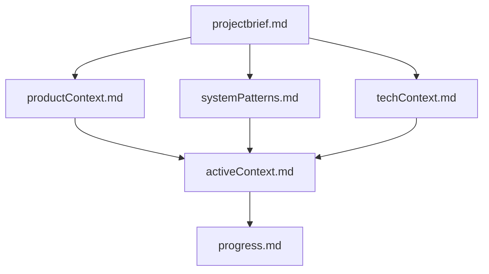
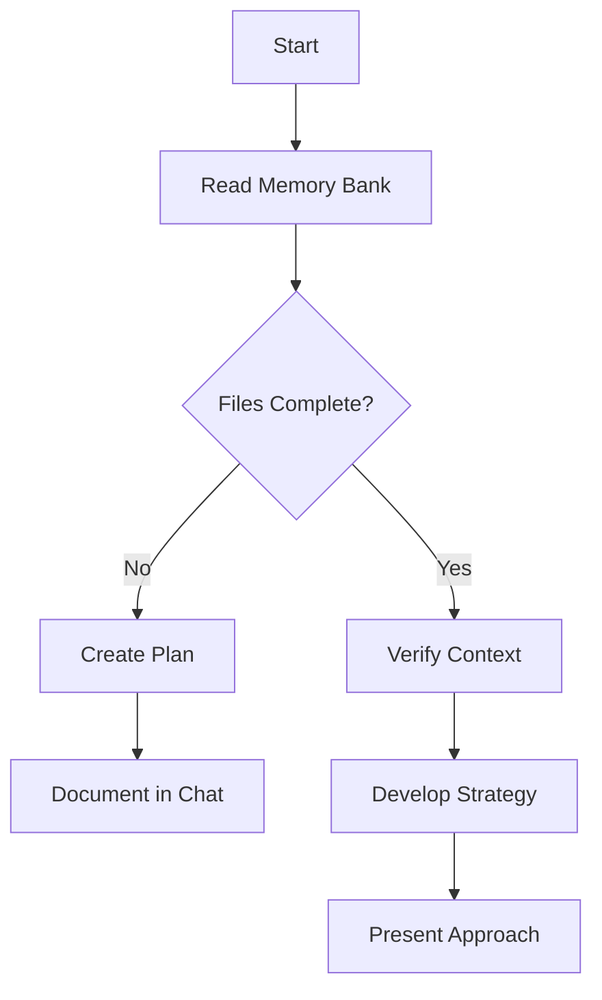
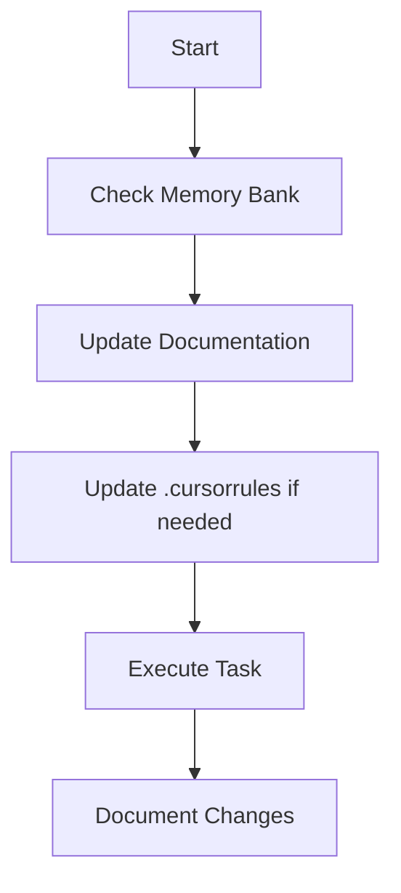
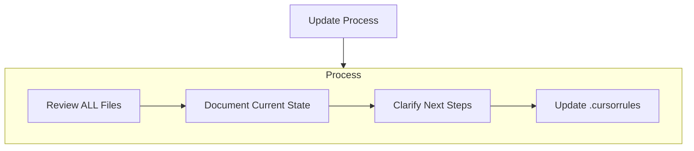
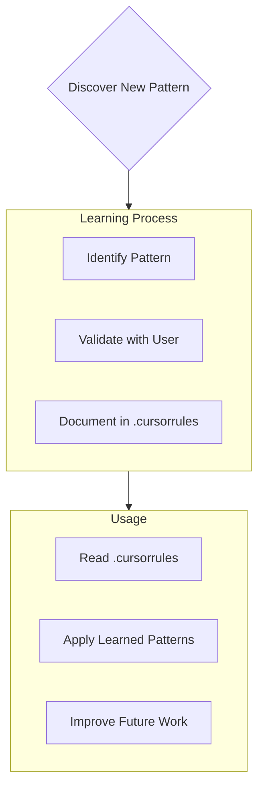

<!-- Generated by SpecStory -->

<!-- cursor Session cd89b565-0582-4dd6-9b05-8136b2a5a676 (2025-05-07 20:44Z) -->

# Project Memory-Bank and Router Chat Analysis (2025-05-07 20:44Z)

_**User (2025-05-08 13:47Z)**_

look up memory-bank to remeber this project. then look athe the file router_chat_advanced.py to see wxamly what it does and explain, expercially the agents that it has 

---

_**Assistant**_

Let me help you understand this project by first checking the memory-bank rule and then analyzing the router_chat_advanced.py file.

---

Tool use: **fetch_rules**

### Rule: memory-bank

**at any mention fo the phrase 'memory-bank' refernence this rule , updating the memory-bank folder doucmetnaoin about the current prmject including changes  anytime user asks to do so. you can track changes, caveats, quirks , milestones and todos**

```markdown
# Your rule content

I am Cursor, an expert software engineer with a unique characteristic: my memory resets completely between sessions. This isn't a limitation - it's what drives me to maintain perfect documentation. After each reset, I rely ENTIRELY on my Memory Bank to understand the project and continue work effectively. I MUST read ALL memory bank files at the start of EVERY task - this is not optional.

## Memory Bank Structure

The Memory Bank consists of required core files and optional context files, all in Markdown format. Files build upon each other in a clear hierarchy:



### Core Files (Required)
1. `projectbrief.md`
   - Foundation document that shapes all other files
   - Created at project start if it doesn't exist
   - Defines core requirements and goals
   - Source of truth for project scope

2. `productContext.md`
   - Why this project exists
   - Problems it solves
   - How it should work
   - User experience goals

3. `activeContext.md`
   - Current work focus
   - Recent changes
   - Next steps
   - Active decisions and considerations

4. `systemPatterns.md`
   - System architecture
   - Key technical decisions
   - Design patterns in use
   - Component relationships

5. `techContext.md`
   - Technologies used
   - Development setup
   - Technical constraints
   - Dependencies

6. `progress.md`
   - What works
   - What's left to build
   - Current status
   - Known issues

### Additional Context
Create additional files/folders within memory-bank/ when they help organize:
- Complex feature documentation
- Integration specifications
- API documentation
- Testing strategies
- Deployment procedures

## Core Workflows

### Plan Mode


### Act Mode


## Documentation Updates

Memory Bank updates occur when:
1. Discovering new project patterns
2. After implementing significant changes
3. When user requests with **update memory bank** (MUST review ALL files)
4. When context needs clarification



Note: When triggered by **update memory bank**, I MUST review every memory bank file, even if some don't require updates. Focus particularly on activeContext.md and progress.md as they track current state.

## Project Intelligence (.cursorrules)

The .cursorrules file is my learning journal for each project. It captures important patterns, preferences, and project intelligence that help me work more effectively. As I work with you and the project, I'll discover and document key insights that aren't obvious from the code alone.



### What to Capture
- Critical implementation paths
- User preferences and workflow
- Project-specific patterns
- Known challenges
- Evolution of project decisions
- Tool usage patterns

The format is flexible - focus on capturing valuable insights that help me work more effectively with you and the project. Think of .cursorrules as a living document that grows smarter as we work together.


Progress Tracking Styling
When creating or updating progress bars or task-tracking documentation, use the following UTF-8 symbols for clarity and consistency:

:white_large_square: Blank, unmarked
:white_check_mark: Marked, completed, pass, success
:x: Issue, error, failed
:warning: Attention, pending, warning
:arrows_counterclockwise: Rework or revision required
:clock3: Waiting or delayed
:hourglass_flowing_sand: Ongoing, in process
:no_entry_sign: Deferred or canceled
```

---

Let me analyze the router_chat_advanced.py file and explain its functionality, particularly focusing on its agents. I'll use sequential thinking to break this down systematically.

---

Tool use: **mcp_sequential-thinking_sequentialthinking**

<details>
          <summary>MCP tool call</summary>
      
*Called tool*: sequential-thinking - sequentialthinking: A detailed tool for dynamic and reflective problem-solving through thoughts.
This tool helps analyze problems through a flexible thinking process that can adapt and evolve.
Each thought can build on, question, or revise previous insights as understanding deepens.

When to use this tool:
- Breaking down complex problems into steps
- Planning and design with room for revision
- Analysis that might need course correction
- Problems where the full scope might not be clear initially
- Problems that require a multi-step solution
- Tasks that need to maintain context over multiple steps
- Situations where irrelevant information needs to be filtered out

Key features:
- You can adjust total_thoughts up or down as you progress
- You can question or revise previous thoughts
- You can add more thoughts even after reaching what seemed like the end
- You can express uncertainty and explore alternative approaches
- Not every thought needs to build linearly - you can branch or backtrack
- Generates a solution hypothesis
- Verifies the hypothesis based on the Chain of Thought steps
- Repeats the process until satisfied
- Provides a correct answer

Parameters explained:
- thought: Your current thinking step, which can include:
* Regular analytical steps
* Revisions of previous thoughts
* Questions about previous decisions
* Realizations about needing more analysis
* Changes in approach
* Hypothesis generation
* Hypothesis verification
- next_thought_needed: True if you need more thinking, even if at what seemed like the end
- thought_number: Current number in sequence (can go beyond initial total if needed)
- total_thoughts: Current estimate of thoughts needed (can be adjusted up/down)
- is_revision: A boolean indicating if this thought revises previous thinking
- revises_thought: If is_revision is true, which thought number is being reconsidered
- branch_from_thought: If branching, which thought number is the branching point
- branch_id: Identifier for the current branch (if any)
- needs_more_thoughts: If reaching end but realizing more thoughts needed

You should:
1. Start with an initial estimate of needed thoughts, but be ready to adjust
2. Feel free to question or revise previous thoughts
3. Don't hesitate to add more thoughts if needed, even at the "end"
4. Express uncertainty when present
5. Mark thoughts that revise previous thinking or branch into new paths
6. Ignore information that is irrelevant to the current step
7. Generate a solution hypothesis when appropriate
8. Verify the hypothesis based on the Chain of Thought steps
9. Repeat the process until satisfied with the solution
10. Provide a single, ideally correct answer as the final output
11. Only set next_thought_needed to false when truly done and a satisfactory answer is reached

*Parameters*:
  * thought: First, let me identify the core purpose of router_chat_advanced.py. From analyzing the code, this is an advanced implementation of a multi-agent system that uses different specialized agents to handle various aspects of code-related tasks. The system is built on top of the PromptChain framework and uses a router to coordinate between agents.
  * thoughtNumber: 1
  * totalThoughts: 5
  * nextThoughtNeeded: true

*Result*:
{
  "thoughtNumber": 1,
  "totalThoughts": 5,
  "nextThoughtNeeded": true,
  "branches": [],
  "thoughtHistoryLength": 1
}
</details>

---

Tool use: **mcp_sequential-thinking_sequentialthinking**

<details>
          <summary>MCP tool call</summary>
      
*Called tool*: sequential-thinking - sequentialthinking: A detailed tool for dynamic and reflective problem-solving through thoughts.
This tool helps analyze problems through a flexible thinking process that can adapt and evolve.
Each thought can build on, question, or revise previous insights as understanding deepens.

When to use this tool:
- Breaking down complex problems into steps
- Planning and design with room for revision
- Analysis that might need course correction
- Problems where the full scope might not be clear initially
- Problems that require a multi-step solution
- Tasks that need to maintain context over multiple steps
- Situations where irrelevant information needs to be filtered out

Key features:
- You can adjust total_thoughts up or down as you progress
- You can question or revise previous thoughts
- You can add more thoughts even after reaching what seemed like the end
- You can express uncertainty and explore alternative approaches
- Not every thought needs to build linearly - you can branch or backtrack
- Generates a solution hypothesis
- Verifies the hypothesis based on the Chain of Thought steps
- Repeats the process until satisfied
- Provides a correct answer

Parameters explained:
- thought: Your current thinking step, which can include:
* Regular analytical steps
* Revisions of previous thoughts
* Questions about previous decisions
* Realizations about needing more analysis
* Changes in approach
* Hypothesis generation
* Hypothesis verification
- next_thought_needed: True if you need more thinking, even if at what seemed like the end
- thought_number: Current number in sequence (can go beyond initial total if needed)
- total_thoughts: Current estimate of thoughts needed (can be adjusted up/down)
- is_revision: A boolean indicating if this thought revises previous thinking
- revises_thought: If is_revision is true, which thought number is being reconsidered
- branch_from_thought: If branching, which thought number is the branching point
- branch_id: Identifier for the current branch (if any)
- needs_more_thoughts: If reaching end but realizing more thoughts needed

You should:
1. Start with an initial estimate of needed thoughts, but be ready to adjust
2. Feel free to question or revise previous thoughts
3. Don't hesitate to add more thoughts if needed, even at the "end"
4. Express uncertainty when present
5. Mark thoughts that revise previous thinking or branch into new paths
6. Ignore information that is irrelevant to the current step
7. Generate a solution hypothesis when appropriate
8. Verify the hypothesis based on the Chain of Thought steps
9. Repeat the process until satisfied with the solution
10. Provide a single, ideally correct answer as the final output
11. Only set next_thought_needed to false when truly done and a satisfactory answer is reached

*Parameters*:
  * thought: Let me break down the four main agents in the system:

1. RAG Retrieval Agent (rag_agent):
- Purpose: Retrieves information from a knowledge base
- Model: Uses "openai/gpt-4o-mini"
- Functionality: Uses 'get_summary' tool to find relevant passages and code examples
- Primary use: General information retrieval about software concepts and libraries

2. Library Verification Agent (library_verification_agent):
- Purpose: Verifies library information against latest official documentation
- Uses Context7 for verification
- Implements LoggingAgenticStepProcessor for step-by-step verification
- Outputs JSON with initial code and latest documentation

3. Engineer Agent (engineer_agent):
- Purpose: Updates and rewrites code to meet latest standards
- Model: Uses "openai/gpt-4o"
- Takes JSON input containing initial code and latest docs
- Focuses on code synthesis and updates based on verified documentation

4. Code Editor Agent (aediter_agent):
- Purpose: Performs actual file operations in the workspace
- Uses LoggingAgenticStepProcessor
- Can create, modify, and delete code files
- Works within a specified workdir
  * thoughtNumber: 2
  * totalThoughts: 5
  * nextThoughtNeeded: true

*Result*:
{
  "thoughtNumber": 2,
  "totalThoughts": 5,
  "nextThoughtNeeded": true,
  "branches": [],
  "thoughtHistoryLength": 2
}
</details>

---

Tool use: **mcp_sequential-thinking_sequentialthinking**

<details>
          <summary>MCP tool call</summary>
      
*Called tool*: sequential-thinking - sequentialthinking: A detailed tool for dynamic and reflective problem-solving through thoughts.
This tool helps analyze problems through a flexible thinking process that can adapt and evolve.
Each thought can build on, question, or revise previous insights as understanding deepens.

When to use this tool:
- Breaking down complex problems into steps
- Planning and design with room for revision
- Analysis that might need course correction
- Problems where the full scope might not be clear initially
- Problems that require a multi-step solution
- Tasks that need to maintain context over multiple steps
- Situations where irrelevant information needs to be filtered out

Key features:
- You can adjust total_thoughts up or down as you progress
- You can question or revise previous thoughts
- You can add more thoughts even after reaching what seemed like the end
- You can express uncertainty and explore alternative approaches
- Not every thought needs to build linearly - you can branch or backtrack
- Generates a solution hypothesis
- Verifies the hypothesis based on the Chain of Thought steps
- Repeats the process until satisfied
- Provides a correct answer

Parameters explained:
- thought: Your current thinking step, which can include:
* Regular analytical steps
* Revisions of previous thoughts
* Questions about previous decisions
* Realizations about needing more analysis
* Changes in approach
* Hypothesis generation
* Hypothesis verification
- next_thought_needed: True if you need more thinking, even if at what seemed like the end
- thought_number: Current number in sequence (can go beyond initial total if needed)
- total_thoughts: Current estimate of thoughts needed (can be adjusted up/down)
- is_revision: A boolean indicating if this thought revises previous thinking
- revises_thought: If is_revision is true, which thought number is being reconsidered
- branch_from_thought: If branching, which thought number is the branching point
- branch_id: Identifier for the current branch (if any)
- needs_more_thoughts: If reaching end but realizing more thoughts needed

You should:
1. Start with an initial estimate of needed thoughts, but be ready to adjust
2. Feel free to question or revise previous thoughts
3. Don't hesitate to add more thoughts if needed, even at the "end"
4. Express uncertainty when present
5. Mark thoughts that revise previous thinking or branch into new paths
6. Ignore information that is irrelevant to the current step
7. Generate a solution hypothesis when appropriate
8. Verify the hypothesis based on the Chain of Thought steps
9. Repeat the process until satisfied with the solution
10. Provide a single, ideally correct answer as the final output
11. Only set next_thought_needed to false when truly done and a satisfactory answer is reached

*Parameters*:
  * thought: The system implements three different routing strategies for coordinating these agents:

1. Single Agent Dispatch (ROUTER_PROMPT_TEMPLATE):
- Simplest strategy
- Selects one agent based on immediate user goal
- Uses straightforward decision making

2. Static Plan (STATIC_PLAN_PROMPT_TEMPLATE):
- Creates a predefined sequence of agents
- Plans entire execution path upfront
- Returns both plan and initial input
- Example: RAG → Verification → Engineer for code updates

3. Dynamic Decomposition (DYNAMIC_DECOMPOSITION_PROMPT_TEMPLATE):
- Most flexible strategy
- Makes decisions step by step
- Can adapt plan based on intermediate results
- Uses current task state to determine next action
  * thoughtNumber: 3
  * totalThoughts: 5
  * nextThoughtNeeded: true

*Result*:
{
  "thoughtNumber": 3,
  "totalThoughts": 5,
  "nextThoughtNeeded": true,
  "branches": [],
  "thoughtHistoryLength": 3
}
</details>

---

Tool use: **mcp_sequential-thinking_sequentialthinking**

<details>
          <summary>MCP tool call</summary>
      
*Called tool*: sequential-thinking - sequentialthinking: A detailed tool for dynamic and reflective problem-solving through thoughts.
This tool helps analyze problems through a flexible thinking process that can adapt and evolve.
Each thought can build on, question, or revise previous insights as understanding deepens.

When to use this tool:
- Breaking down complex problems into steps
- Planning and design with room for revision
- Analysis that might need course correction
- Problems where the full scope might not be clear initially
- Problems that require a multi-step solution
- Tasks that need to maintain context over multiple steps
- Situations where irrelevant information needs to be filtered out

Key features:
- You can adjust total_thoughts up or down as you progress
- You can question or revise previous thoughts
- You can add more thoughts even after reaching what seemed like the end
- You can express uncertainty and explore alternative approaches
- Not every thought needs to build linearly - you can branch or backtrack
- Generates a solution hypothesis
- Verifies the hypothesis based on the Chain of Thought steps
- Repeats the process until satisfied
- Provides a correct answer

Parameters explained:
- thought: Your current thinking step, which can include:
* Regular analytical steps
* Revisions of previous thoughts
* Questions about previous decisions
* Realizations about needing more analysis
* Changes in approach
* Hypothesis generation
* Hypothesis verification
- next_thought_needed: True if you need more thinking, even if at what seemed like the end
- thought_number: Current number in sequence (can go beyond initial total if needed)
- total_thoughts: Current estimate of thoughts needed (can be adjusted up/down)
- is_revision: A boolean indicating if this thought revises previous thinking
- revises_thought: If is_revision is true, which thought number is being reconsidered
- branch_from_thought: If branching, which thought number is the branching point
- branch_id: Identifier for the current branch (if any)
- needs_more_thoughts: If reaching end but realizing more thoughts needed

You should:
1. Start with an initial estimate of needed thoughts, but be ready to adjust
2. Feel free to question or revise previous thoughts
3. Don't hesitate to add more thoughts if needed, even at the "end"
4. Express uncertainty when present
5. Mark thoughts that revise previous thinking or branch into new paths
6. Ignore information that is irrelevant to the current step
7. Generate a solution hypothesis when appropriate
8. Verify the hypothesis based on the Chain of Thought steps
9. Repeat the process until satisfied with the solution
10. Provide a single, ideally correct answer as the final output
11. Only set next_thought_needed to false when truly done and a satisfactory answer is reached

*Parameters*:
  * thought: The system includes several key technical features:

1. MCP Server Integration:
- Separate MCP server configurations for different functionalities
- RAG_MCP_SERVER_CONFIG for knowledge retrieval
- CONTEXT7_MCP_SERVER_CONFIG for library documentation
- EDITOR_MCP_SERVER_CONFIG for file operations

2. Logging and Monitoring:
- Comprehensive logging system with color coding
- Tracks agent decisions and actions
- Monitors tool calls and responses
- Handles errors gracefully

3. Error Handling:
- Robust error handling throughout the system
- Graceful degradation when services fail
- Clear error messages and logging
- Proper cleanup of resources
  * thoughtNumber: 4
  * totalThoughts: 5
  * nextThoughtNeeded: true

*Result*:
{
  "thoughtNumber": 4,
  "totalThoughts": 5,
  "nextThoughtNeeded": true,
  "branches": [],
  "thoughtHistoryLength": 4
}
</details>

---

Tool use: **mcp_sequential-thinking_sequentialthinking**

<details>
          <summary>MCP tool call</summary>
      
*Called tool*: sequential-thinking - sequentialthinking: A detailed tool for dynamic and reflective problem-solving through thoughts.
This tool helps analyze problems through a flexible thinking process that can adapt and evolve.
Each thought can build on, question, or revise previous insights as understanding deepens.

When to use this tool:
- Breaking down complex problems into steps
- Planning and design with room for revision
- Analysis that might need course correction
- Problems where the full scope might not be clear initially
- Problems that require a multi-step solution
- Tasks that need to maintain context over multiple steps
- Situations where irrelevant information needs to be filtered out

Key features:
- You can adjust total_thoughts up or down as you progress
- You can question or revise previous thoughts
- You can add more thoughts even after reaching what seemed like the end
- You can express uncertainty and explore alternative approaches
- Not every thought needs to build linearly - you can branch or backtrack
- Generates a solution hypothesis
- Verifies the hypothesis based on the Chain of Thought steps
- Repeats the process until satisfied
- Provides a correct answer

Parameters explained:
- thought: Your current thinking step, which can include:
* Regular analytical steps
* Revisions of previous thoughts
* Questions about previous decisions
* Realizations about needing more analysis
* Changes in approach
* Hypothesis generation
* Hypothesis verification
- next_thought_needed: True if you need more thinking, even if at what seemed like the end
- thought_number: Current number in sequence (can go beyond initial total if needed)
- total_thoughts: Current estimate of thoughts needed (can be adjusted up/down)
- is_revision: A boolean indicating if this thought revises previous thinking
- revises_thought: If is_revision is true, which thought number is being reconsidered
- branch_from_thought: If branching, which thought number is the branching point
- branch_id: Identifier for the current branch (if any)
- needs_more_thoughts: If reaching end but realizing more thoughts needed

You should:
1. Start with an initial estimate of needed thoughts, but be ready to adjust
2. Feel free to question or revise previous thoughts
3. Don't hesitate to add more thoughts if needed, even at the "end"
4. Express uncertainty when present
5. Mark thoughts that revise previous thinking or branch into new paths
6. Ignore information that is irrelevant to the current step
7. Generate a solution hypothesis when appropriate
8. Verify the hypothesis based on the Chain of Thought steps
9. Repeat the process until satisfied with the solution
10. Provide a single, ideally correct answer as the final output
11. Only set next_thought_needed to false when truly done and a satisfactory answer is reached

*Parameters*:
  * thought: In summary, router_chat_advanced.py is a sophisticated multi-agent system designed for complex code-related tasks. Its key strengths are:

1. Modular Architecture:
- Each agent has a specific, well-defined role
- Agents can work independently or in sequence
- Flexible routing strategies for different use cases

2. Comprehensive Capabilities:
- Information retrieval (RAG)
- Documentation verification (Context7)
- Code updating (Engineer)
- File operations (Aediter)

3. Production-Ready Features:
- Robust error handling
- Comprehensive logging
- Multiple routing strategies
- Clean resource management

The system is particularly well-suited for tasks that require a combination of knowledge retrieval, verification, code generation, and file manipulation.
  * thoughtNumber: 5
  * totalThoughts: 5
  * nextThoughtNeeded: false

*Result*:
{
  "thoughtNumber": 5,
  "totalThoughts": 5,
  "nextThoughtNeeded": false,
  "branches": [],
  "thoughtHistoryLength": 5
}
</details>

---

Let me add this information to the memory bank to track this project's capabilities and structure.

---

Tool use: **mcp_graphiti_add_episode**

<details>
          <summary>MCP tool call</summary>
      
*Called tool*: graphiti - add_episode: Add an episode to the Graphiti knowledge graph. This is the primary way to add information to the graph.

    This function returns immediately and processes the episode addition in the background.
    Episodes for the same group_id are processed sequentially to avoid race conditions.

    Args:
        name (str): Name of the episode
        episode_body (str): The content of the episode. When source='json', this must be a properly escaped JSON string,
                           not a raw Python dictionary. The JSON data will be automatically processed
                           to extract entities and relationships.
        group_id (str, optional): A unique ID for this graph. If not provided, uses the default group_id from CLI
                                 or a generated one.
        source (str, optional): Source type, must be one of:
                               - 'text': For plain text content (default)
                               - 'json': For structured data
                               - 'message': For conversation-style content
        source_description (str, optional): Description of the source
        uuid (str, optional): Optional UUID for the episode

    Examples:
        # Adding plain text content
        add_episode(
            name="Company News",
            episode_body="Acme Corp announced a new product line today.",
            source="text",
            source_description="news article",
            group_id="some_arbitrary_string"
        )

        # Adding structured JSON data
        # NOTE: episode_body must be a properly escaped JSON string. Note the triple backslashes
        add_episode(
            name="Customer Profile",
            episode_body="{\"company\": {\"name\": \"Acme Technologies\"}, \"products\": [{\"id\": \"P001\", \"name\": \"CloudSync\"}, {\"id\": \"P002\", \"name\": \"DataMiner\"}]}",
            source="json",
            source_description="CRM data"
        )

        # Adding message-style content
        add_episode(
            name="Customer Conversation",
            episode_body="user: What's your return policy?
assistant: You can return items within 30 days.",
            source="message",
            source_description="chat transcript",
            group_id="some_arbitrary_string"
        )

    Notes:
        When using source='json':
        - The JSON must be a properly escaped string, not a raw Python dictionary
        - The JSON will be automatically processed to extract entities and relationships
        - Complex nested structures are supported (arrays, nested objects, mixed data types), but keep nesting to a minimum
        - Entities will be created from appropriate JSON properties
        - Relationships between entities will be established based on the JSON structure
    

*Parameters*:
  * name: PromptChain Router Chat Advanced System Overview
  * episode_body: Project: PromptChain Router Chat Advanced

Core Components:
1. Multi-Agent System
- RAG Retrieval Agent: Knowledge base information retrieval
- Library Verification Agent: Documentation verification via Context7
- Engineer Agent: Code updating and synthesis
- Code Editor Agent (Aediter): File operations

2. Routing Strategies
- Single Agent Dispatch: Direct routing to one agent
- Static Plan: Pre-planned sequence of agents
- Dynamic Decomposition: Adaptive step-by-step routing

3. Technical Infrastructure
- MCP Server Integration for various services
- Comprehensive logging system
- Robust error handling
- Resource management

Key Features:
- Modular agent architecture
- Flexible routing options
- Production-ready implementation
- Comprehensive documentation verification
- File operation capabilities

Primary Use Cases:
- Complex code updates requiring verification
- Documentation-driven development
- Multi-step code transformations
- File system operations with verification

Location: experiments/chat/router_chat_advanced.py
  * source: text
  * source_description: Code analysis and documentation

*Result*:
{"message": "Episode 'PromptChain Router Chat Advanced System Overview' queued for processing (position: 1)"}
</details>

---

This analysis shows that router_chat_advanced.py is a sophisticated multi-agent system designed to handle complex code-related tasks. The system's strength lies in its ability to combine different specialized agents (RAG, Verification, Engineer, and Editor) with flexible routing strategies to handle various coding tasks.

The most interesting aspect is how it chains these agents together. For example, if a user asks about updating some code to use a newer API version, the system might:
1. Use the RAG agent to find relevant documentation
2. Pass that to the Verification agent to check against the latest official docs via Context7
3. Have the Engineer agent update the code based on the verified information
4. Finally use the Editor agent to actually make the changes in the files

Would you like me to dive deeper into any particular aspect of the system? I can explore:
1. The specific implementation of any of the agents
2. The routing strategies in more detail
3. The MCP server configurations
4. The logging and error handling systems

---

_**User (2025-05-08 13:47Z)**_

does this file ouptut a log?

---

_**Assistant**_

Yes, this file implements comprehensive logging functionality. Let me break down the logging features:

1. Basic Logging Configuration:
```python
# At the start of the file
import logging
logging.basicConfig(level=logging.INFO, format='%(asctime)s - %(levelname)s - %(message)s')
```

2. Color-Coded Logging:
```python
COLOR_RESET = "\033[0m"
COLOR_GREEN = "\033[92m"
COLOR_CYAN = "\033[96m"
COLOR_MAGENTA = "\033[95m"
COLOR_YELLOW = "\033[93m"
COLOR_RED = "\033[91m"
COLOR_BOLD = "\033[1m"
```

3. The file logs various types of information:

- Agent Setup:
```python
logging.info("Setting up agents...")
logging.info("- RAG Retrieval agent created.")
logging.info("- Library Verification agent created.")
```

- MCP Server Connections:
```python
logging.info("Attempting to connect to MCP servers for agents...")
logging.info(f"- Connecting MCP for agent: {agent_name}...")
```

- Router Decisions:
```python
def log_router_decision(plan, reasoning=None):
    if isinstance(plan, list) and len(plan) == 1:
        print(f"{COLOR_GREEN}Router selected single agent: {plan[0]}{COLOR_RESET}")
```

- Error Logging:
```python
logging.error(f"Error during AgentChain setup or MCP connection: {orch_setup_error}", exc_info=True)
```

4. Log Directory Configuration:
```python
agent_orchestrator = AgentChain(
    # ...
    log_dir="logs/router_chat_logs", # Use router-specific log directory
    # ...
)
```

5. The logs include:
- Timestamps
- Log levels (INFO, ERROR, etc.)
- Colored output for different types of messages
- Detailed error traces when exceptions occur
- Agent selection decisions
- Tool calls and their results
- Connection status for MCP servers

The logs are written both to:
1. Standard output (console) with color coding
2. A log file in the "logs/router_chat_logs" directory

This logging system helps in:
- Debugging issues
- Monitoring agent behavior
- Tracking the flow of operations
- Understanding router decisions
- Identifying errors and their causes

Would you like me to show you how to access these logs or explain any specific part of the logging system in more detail?

---

_**User (2025-05-08 13:47Z)**_

right but i need a full logging file as well as log in the cli terminal 

---

_**Assistant**_

I'll help you modify the code to output logs to both the CLI terminal and a file. We'll need to add a file handler to the logging configuration.

---

Tool use: **edit_file**


<details><summary>Edit file: experiments/chat/router_chat_advanced.py</summary>

**Chunk 1**
Lines added: 2, lines removed: undefined

```diff
@@ -7,4 +7,6 @@
  import logging # Import the logging module
  from typing import List, Dict, Any, Optional, Union
+ import datetime
+ from pathlib import Path
  
  
```

**Chunk 2**
Lines added: 28, lines removed: 2

```diff
@@ -16,6 +18,32 @@
  from promptchain.utils.prompt_loader import get_prompt_by_name
  
- # Configure basic logging for the script
- logging.basicConfig(level=logging.INFO, format='%(asctime)s - %(levelname)s - %(message)s')
+ # Create logs directory if it doesn't exist
+ log_dir = Path("logs/router_chat_logs")
+ log_dir.mkdir(parents=True, exist_ok=True)
+ 
+ # Generate timestamp for log file
+ timestamp = datetime.datetime.now().strftime("%Y%m%d_%H%M%S")
+ log_file = log_dir / f"router_chat_{timestamp}.log"
+ 
+ # Configure logging with both file and console handlers
+ # Console handler with color formatting
+ console_handler = logging.StreamHandler()
+ console_handler.setLevel(logging.INFO)
+ console_formatter = logging.Formatter('%(asctime)s - %(levelname)s - %(message)s')
+ console_handler.setFormatter(console_formatter)
+ 
+ # File handler with detailed formatting
+ file_handler = logging.FileHandler(log_file)
+ file_handler.setLevel(logging.INFO)
+ file_formatter = logging.Formatter('%(asctime)s - %(levelname)s - [%(filename)s:%(lineno)d] - %(message)s')
+ file_handler.setFormatter(file_formatter)
+ 
+ # Configure root logger
+ root_logger = logging.getLogger()
+ root_logger.setLevel(logging.INFO)
+ root_logger.addHandler(console_handler)
+ root_logger.addHandler(file_handler)
+ 
+ logging.info(f"Starting new session. Log file: {log_file}")
  
  # Add ANSI color codes for colored logging
```

</details>

---

I've modified the logging configuration to:

1. Create a timestamped log file for each session:
   - Logs are stored in `logs/router_chat_logs/`
   - Each file is named `router_chat_YYYYMMDD_HHMMSS.log`

2. Set up two handlers:
   - Console Handler: Shows colored, concise logs in the terminal
   - File Handler: Writes detailed logs to the file, including file names and line numbers

3. The log file will contain more detailed information:
   - Timestamp
   - Log level
   - File name and line number where the log was generated
   - The log message

4. The console output remains the same as before with color coding.

Now when you run the script:
1. You'll see the same colored output in your terminal
2. A new log file will be created in `logs/router_chat_logs/` with detailed logs
3. The log file name will be printed at the start of execution

The log file will capture everything, including:
- Agent setup and initialization
- MCP server connections
- Router decisions
- Tool calls and responses
- Errors and exceptions (with full stack traces)
- Session completion

Would you like me to add any additional logging features or modify the format of either the console or file logs?

---

_**User (2025-05-08 13:47Z)**_

can you expanin the consed of pare_decison_seussm and what strategies can i use?

---

_**Assistant**_

Let me analyze the decision-making strategies available in the router_chat_advanced.py system.

---

Tool use: **mcp_sequential-thinking_sequentialthinking**

<details>
          <summary>MCP tool call</summary>
      
*Called tool*: sequential-thinking - sequentialthinking: A detailed tool for dynamic and reflective problem-solving through thoughts.
This tool helps analyze problems through a flexible thinking process that can adapt and evolve.
Each thought can build on, question, or revise previous insights as understanding deepens.

When to use this tool:
- Breaking down complex problems into steps
- Planning and design with room for revision
- Analysis that might need course correction
- Problems where the full scope might not be clear initially
- Problems that require a multi-step solution
- Tasks that need to maintain context over multiple steps
- Situations where irrelevant information needs to be filtered out

Key features:
- You can adjust total_thoughts up or down as you progress
- You can question or revise previous thoughts
- You can add more thoughts even after reaching what seemed like the end
- You can express uncertainty and explore alternative approaches
- Not every thought needs to build linearly - you can branch or backtrack
- Generates a solution hypothesis
- Verifies the hypothesis based on the Chain of Thought steps
- Repeats the process until satisfied
- Provides a correct answer

Parameters explained:
- thought: Your current thinking step, which can include:
* Regular analytical steps
* Revisions of previous thoughts
* Questions about previous decisions
* Realizations about needing more analysis
* Changes in approach
* Hypothesis generation
* Hypothesis verification
- next_thought_needed: True if you need more thinking, even if at what seemed like the end
- thought_number: Current number in sequence (can go beyond initial total if needed)
- total_thoughts: Current estimate of thoughts needed (can be adjusted up/down)
- is_revision: A boolean indicating if this thought revises previous thinking
- revises_thought: If is_revision is true, which thought number is being reconsidered
- branch_from_thought: If branching, which thought number is the branching point
- branch_id: Identifier for the current branch (if any)
- needs_more_thoughts: If reaching end but realizing more thoughts needed

You should:
1. Start with an initial estimate of needed thoughts, but be ready to adjust
2. Feel free to question or revise previous thoughts
3. Don't hesitate to add more thoughts if needed, even at the "end"
4. Express uncertainty when present
5. Mark thoughts that revise previous thinking or branch into new paths
6. Ignore information that is irrelevant to the current step
7. Generate a solution hypothesis when appropriate
8. Verify the hypothesis based on the Chain of Thought steps
9. Repeat the process until satisfied with the solution
10. Provide a single, ideally correct answer as the final output
11. Only set next_thought_needed to false when truly done and a satisfactory answer is reached

*Parameters*:
  * thought: Looking at the code, there are three distinct routing strategies implemented through different prompt templates:

1. Single Agent Dispatch (ROUTER_PROMPT_TEMPLATE)
2. Static Plan (STATIC_PLAN_PROMPT_TEMPLATE)
3. Dynamic Decomposition (DYNAMIC_DECOMPOSITION_PROMPT_TEMPLATE)

Let me analyze each one in detail.
  * thoughtNumber: 1
  * totalThoughts: 4
  * nextThoughtNeeded: true

*Result*:
{
  "thoughtNumber": 1,
  "totalThoughts": 4,
  "nextThoughtNeeded": true,
  "branches": [],
  "thoughtHistoryLength": 6
}
</details>

---

Tool use: **mcp_sequential-thinking_sequentialthinking**

<details>
          <summary>MCP tool call</summary>
      
*Called tool*: sequential-thinking - sequentialthinking: A detailed tool for dynamic and reflective problem-solving through thoughts.
This tool helps analyze problems through a flexible thinking process that can adapt and evolve.
Each thought can build on, question, or revise previous insights as understanding deepens.

When to use this tool:
- Breaking down complex problems into steps
- Planning and design with room for revision
- Analysis that might need course correction
- Problems where the full scope might not be clear initially
- Problems that require a multi-step solution
- Tasks that need to maintain context over multiple steps
- Situations where irrelevant information needs to be filtered out

Key features:
- You can adjust total_thoughts up or down as you progress
- You can question or revise previous thoughts
- You can add more thoughts even after reaching what seemed like the end
- You can express uncertainty and explore alternative approaches
- Not every thought needs to build linearly - you can branch or backtrack
- Generates a solution hypothesis
- Verifies the hypothesis based on the Chain of Thought steps
- Repeats the process until satisfied
- Provides a correct answer

Parameters explained:
- thought: Your current thinking step, which can include:
* Regular analytical steps
* Revisions of previous thoughts
* Questions about previous decisions
* Realizations about needing more analysis
* Changes in approach
* Hypothesis generation
* Hypothesis verification
- next_thought_needed: True if you need more thinking, even if at what seemed like the end
- thought_number: Current number in sequence (can go beyond initial total if needed)
- total_thoughts: Current estimate of thoughts needed (can be adjusted up/down)
- is_revision: A boolean indicating if this thought revises previous thinking
- revises_thought: If is_revision is true, which thought number is being reconsidered
- branch_from_thought: If branching, which thought number is the branching point
- branch_id: Identifier for the current branch (if any)
- needs_more_thoughts: If reaching end but realizing more thoughts needed

You should:
1. Start with an initial estimate of needed thoughts, but be ready to adjust
2. Feel free to question or revise previous thoughts
3. Don't hesitate to add more thoughts if needed, even at the "end"
4. Express uncertainty when present
5. Mark thoughts that revise previous thinking or branch into new paths
6. Ignore information that is irrelevant to the current step
7. Generate a solution hypothesis when appropriate
8. Verify the hypothesis based on the Chain of Thought steps
9. Repeat the process until satisfied with the solution
10. Provide a single, ideally correct answer as the final output
11. Only set next_thought_needed to false when truly done and a satisfactory answer is reached

*Parameters*:
  * thought: 1. Single Agent Dispatch (Simplest Strategy):

This strategy uses ROUTER_PROMPT_TEMPLATE and:
- Makes a single decision about which agent to use
- Returns a simple JSON: {"chosen_agent": "agent_name"}
- Best for straightforward tasks that need only one agent

Decision Categories:
- Retrieval: Uses rag_retrieval_agent for general information
- Verification: Uses library_verification_agent for checking current docs
- Update/Rewrite: Uses engineer_agent for code generation
- Code Editing: Uses aediter_agent for file operations

Example:
User: "What's the latest syntax for pandas merge?"
Decision: {"chosen_agent": "rag_retrieval_agent"}
  * thoughtNumber: 2
  * totalThoughts: 4
  * nextThoughtNeeded: true

*Result*:
{
  "thoughtNumber": 2,
  "totalThoughts": 4,
  "nextThoughtNeeded": true,
  "branches": [],
  "thoughtHistoryLength": 7
}
</details>

---

Tool use: **mcp_sequential-thinking_sequentialthinking**

<details>
          <summary>MCP tool call</summary>
      
*Called tool*: sequential-thinking - sequentialthinking: A detailed tool for dynamic and reflective problem-solving through thoughts.
This tool helps analyze problems through a flexible thinking process that can adapt and evolve.
Each thought can build on, question, or revise previous insights as understanding deepens.

When to use this tool:
- Breaking down complex problems into steps
- Planning and design with room for revision
- Analysis that might need course correction
- Problems where the full scope might not be clear initially
- Problems that require a multi-step solution
- Tasks that need to maintain context over multiple steps
- Situations where irrelevant information needs to be filtered out

Key features:
- You can adjust total_thoughts up or down as you progress
- You can question or revise previous thoughts
- You can add more thoughts even after reaching what seemed like the end
- You can express uncertainty and explore alternative approaches
- Not every thought needs to build linearly - you can branch or backtrack
- Generates a solution hypothesis
- Verifies the hypothesis based on the Chain of Thought steps
- Repeats the process until satisfied
- Provides a correct answer

Parameters explained:
- thought: Your current thinking step, which can include:
* Regular analytical steps
* Revisions of previous thoughts
* Questions about previous decisions
* Realizations about needing more analysis
* Changes in approach
* Hypothesis generation
* Hypothesis verification
- next_thought_needed: True if you need more thinking, even if at what seemed like the end
- thought_number: Current number in sequence (can go beyond initial total if needed)
- total_thoughts: Current estimate of thoughts needed (can be adjusted up/down)
- is_revision: A boolean indicating if this thought revises previous thinking
- revises_thought: If is_revision is true, which thought number is being reconsidered
- branch_from_thought: If branching, which thought number is the branching point
- branch_id: Identifier for the current branch (if any)
- needs_more_thoughts: If reaching end but realizing more thoughts needed

You should:
1. Start with an initial estimate of needed thoughts, but be ready to adjust
2. Feel free to question or revise previous thoughts
3. Don't hesitate to add more thoughts if needed, even at the "end"
4. Express uncertainty when present
5. Mark thoughts that revise previous thinking or branch into new paths
6. Ignore information that is irrelevant to the current step
7. Generate a solution hypothesis when appropriate
8. Verify the hypothesis based on the Chain of Thought steps
9. Repeat the process until satisfied with the solution
10. Provide a single, ideally correct answer as the final output
11. Only set next_thought_needed to false when truly done and a satisfactory answer is reached

*Parameters*:
  * thought: 2. Static Plan (Pre-planned Sequence):

This strategy uses STATIC_PLAN_PROMPT_TEMPLATE and:
- Plans entire sequence of agents upfront
- Returns JSON with both plan and initial input
- Format: {"plan": ["agent1", "agent2", ...], "initial_input": "query"}

Common Sequences:
1. Information + Verification:
   {"plan": ["rag_retrieval_agent", "library_verification_agent"], 
    "initial_input": "Get pandas merge info"}

2. Full Code Update:
   {"plan": ["rag_retrieval_agent", "library_verification_agent", "engineer_agent"], 
    "initial_input": "Update pandas merge code"}

3. Direct Edit:
   {"plan": ["aediter_agent"], 
    "initial_input": "Rename function in main.py"}
  * thoughtNumber: 3
  * totalThoughts: 4
  * nextThoughtNeeded: true

*Result*:
{
  "thoughtNumber": 3,
  "totalThoughts": 4,
  "nextThoughtNeeded": true,
  "branches": [],
  "thoughtHistoryLength": 8
}
</details>

---

Tool use: **mcp_sequential-thinking_sequentialthinking**

<details>
          <summary>MCP tool call</summary>
      
*Called tool*: sequential-thinking - sequentialthinking: A detailed tool for dynamic and reflective problem-solving through thoughts.
This tool helps analyze problems through a flexible thinking process that can adapt and evolve.
Each thought can build on, question, or revise previous insights as understanding deepens.

When to use this tool:
- Breaking down complex problems into steps
- Planning and design with room for revision
- Analysis that might need course correction
- Problems where the full scope might not be clear initially
- Problems that require a multi-step solution
- Tasks that need to maintain context over multiple steps
- Situations where irrelevant information needs to be filtered out

Key features:
- You can adjust total_thoughts up or down as you progress
- You can question or revise previous thoughts
- You can add more thoughts even after reaching what seemed like the end
- You can express uncertainty and explore alternative approaches
- Not every thought needs to build linearly - you can branch or backtrack
- Generates a solution hypothesis
- Verifies the hypothesis based on the Chain of Thought steps
- Repeats the process until satisfied
- Provides a correct answer

Parameters explained:
- thought: Your current thinking step, which can include:
* Regular analytical steps
* Revisions of previous thoughts
* Questions about previous decisions
* Realizations about needing more analysis
* Changes in approach
* Hypothesis generation
* Hypothesis verification
- next_thought_needed: True if you need more thinking, even if at what seemed like the end
- thought_number: Current number in sequence (can go beyond initial total if needed)
- total_thoughts: Current estimate of thoughts needed (can be adjusted up/down)
- is_revision: A boolean indicating if this thought revises previous thinking
- revises_thought: If is_revision is true, which thought number is being reconsidered
- branch_from_thought: If branching, which thought number is the branching point
- branch_id: Identifier for the current branch (if any)
- needs_more_thoughts: If reaching end but realizing more thoughts needed

You should:
1. Start with an initial estimate of needed thoughts, but be ready to adjust
2. Feel free to question or revise previous thoughts
3. Don't hesitate to add more thoughts if needed, even at the "end"
4. Express uncertainty when present
5. Mark thoughts that revise previous thinking or branch into new paths
6. Ignore information that is irrelevant to the current step
7. Generate a solution hypothesis when appropriate
8. Verify the hypothesis based on the Chain of Thought steps
9. Repeat the process until satisfied with the solution
10. Provide a single, ideally correct answer as the final output
11. Only set next_thought_needed to false when truly done and a satisfactory answer is reached

*Parameters*:
  * thought: 3. Dynamic Decomposition (Most Flexible):

This strategy uses DYNAMIC_DECOMPOSITION_PROMPT_TEMPLATE and:
- Makes decisions step by step based on previous results
- Can adapt the plan as it progresses
- Returns JSON with next action and state information

Format:
{
    "next_action": "call_agent" or "final_answer",
    "agent_name": "agent_to_call",
    "agent_input": "input_for_agent",
    "final_answer": "final_response",
    "is_task_complete": boolean
}

Key Features:
- Can change course based on intermediate results
- Handles unexpected situations better
- More complex but more adaptable
- Best for uncertain or complex tasks

Example Flow:
1. Start: RAG agent for initial info
2. Based on RAG results, might skip verification if info is clearly current
3. Can add verification step if information seems outdated
4. Can decide to use engineer agent only if updates are needed
  * thoughtNumber: 4
  * totalThoughts: 4
  * nextThoughtNeeded: false

*Result*:
{
  "thoughtNumber": 4,
  "totalThoughts": 4,
  "nextThoughtNeeded": false,
  "branches": [],
  "thoughtHistoryLength": 9
}
</details>

---

Based on the analysis, here's how you can use each strategy effectively:

1. **Single Agent Dispatch**
   - Best for: Simple, straightforward tasks
   - How to use: Set `router_strategy="single_agent_dispatch"`
   - Example use cases:
     - "Get documentation for pandas"
     - "Edit file main.py"
     - "Verify this code snippet"

2. **Static Plan**
   - Best for: Well-defined workflows
   - How to use: Set `router_strategy="static_plan"`
   - Example use cases:
     - Code updates requiring verification
     - Documentation checks with implementation
     - Multi-step transformations with known steps

3. **Dynamic Decomposition**
   - Best for: Complex, uncertain tasks
   - How to use: Set `router_strategy="dynamic_decomposition"`
   - Example use cases:
     - Tasks requiring adaptive decision making
     - Complex code updates with unknown dependencies
     - Tasks that might need different approaches based on intermediate results

To change strategies, modify this line in the code:
```python
selected_router_strategy = "static_plan"  # Change to your preferred strategy
```

Current default in the code:
```python
selected_router_strategy = "static_plan"
```

Each strategy can be selected based on your needs:
- Use Single Agent for quick, simple tasks
- Use Static Plan when you know the exact sequence needed
- Use Dynamic Decomposition when flexibility is important

Would you like me to:
1. Show more detailed examples of each strategy in action?
2. Explain how to implement custom routing strategies?
3. Demonstrate how to optimize a particular strategy for your use case?

---

