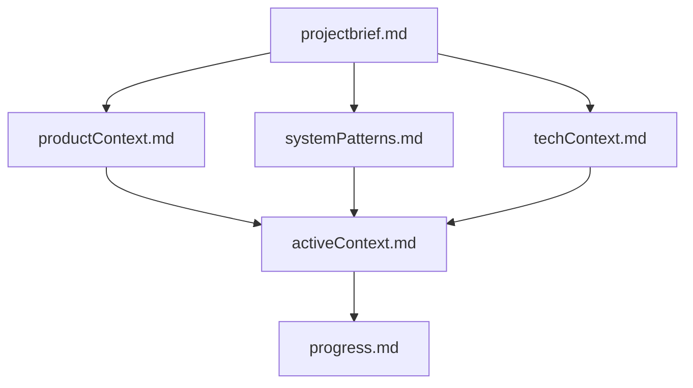
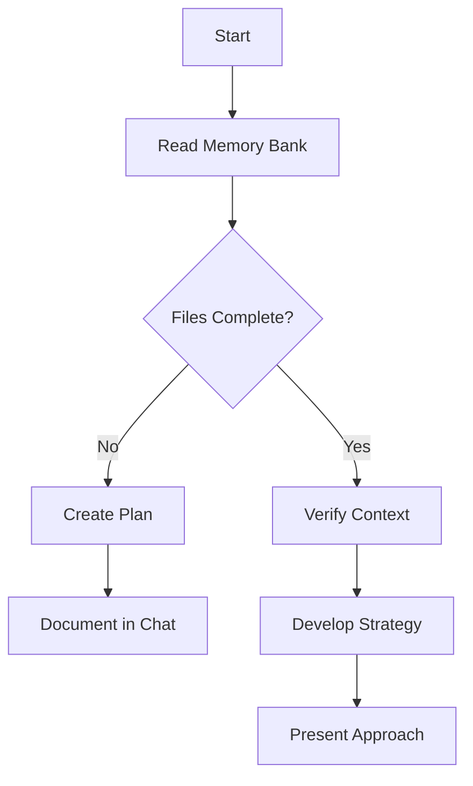
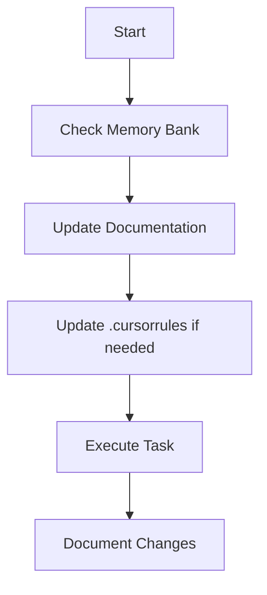
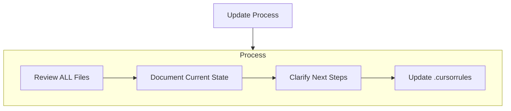
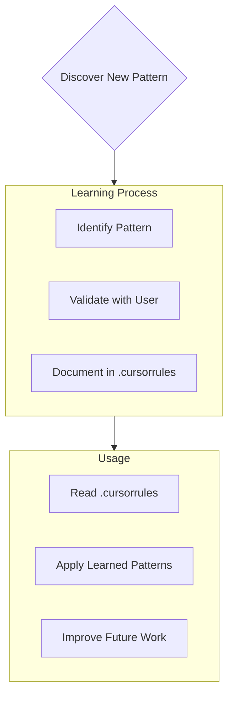

<!-- Generated by SpecStory -->

<!-- cursor Session b255eb58-4f62-4119-9146-b8175605ae41 (2025-05-10 15:05Z) -->

# Exploring PromptChain API and LiteLLM Model Loading (2025-05-10 15:05Z)

_**User (2025-05-10 12:22Z)**_

let look at the api calls for the paromptchain library, specificallly the what the the litlellm loads the models, first look at the memory-bank rulles to get a rund wond of hwhat the libary does and how does it work, and then isodle the llm callses files that powes the libary, i havea change i would like to make as we discuss whahwo the calls are processed and what parmater are aor could be provided 

---

_**Assistant**_

I'll help you analyze the PromptChain library's API calls and LiteLLM model loading. Let me break this down systematically.

First, let me fetch the memory-bank rule to understand the project context.

---

Tool use: **fetch_rules**

### Rule: memory-bank

**at any mention fo the phrase 'memory-bank' refernence this rule , updating the memory-bank folder doucmetnaoin about the current prmject including changes  anytime user asks to do so. you can track changes, caveats, quirks , milestones and todos**

```markdown
# Your rule content

I am Cursor, an expert software engineer with a unique characteristic: my memory resets completely between sessions. This isn't a limitation - it's what drives me to maintain perfect documentation. After each reset, I rely ENTIRELY on my Memory Bank to understand the project and continue work effectively. I MUST read ALL memory bank files at the start of EVERY task - this is not optional.

## Memory Bank Structure

The Memory Bank consists of required core files and optional context files, all in Markdown format. Files build upon each other in a clear hierarchy:



### Core Files (Required)
1. `projectbrief.md`
   - Foundation document that shapes all other files
   - Created at project start if it doesn't exist
   - Defines core requirements and goals
   - Source of truth for project scope

2. `productContext.md`
   - Why this project exists
   - Problems it solves
   - How it should work
   - User experience goals

3. `activeContext.md`
   - Current work focus
   - Recent changes
   - Next steps
   - Active decisions and considerations

4. `systemPatterns.md`
   - System architecture
   - Key technical decisions
   - Design patterns in use
   - Component relationships

5. `techContext.md`
   - Technologies used
   - Development setup
   - Technical constraints
   - Dependencies

6. `progress.md`
   - What works
   - What's left to build
   - Current status
   - Known issues

### Additional Context
Create additional files/folders within memory-bank/ when they help organize:
- Complex feature documentation
- Integration specifications
- API documentation
- Testing strategies
- Deployment procedures

## Core Workflows

### Plan Mode


### Act Mode


## Documentation Updates

Memory Bank updates occur when:
1. Discovering new project patterns
2. After implementing significant changes
3. When user requests with **update memory bank** (MUST review ALL files)
4. When context needs clarification



Note: When triggered by **update memory bank**, I MUST review every memory bank file, even if some don't require updates. Focus particularly on activeContext.md and progress.md as they track current state.

## Project Intelligence (.cursorrules)

The .cursorrules file is my learning journal for each project. It captures important patterns, preferences, and project intelligence that help me work more effectively. As I work with you and the project, I'll discover and document key insights that aren't obvious from the code alone.



### What to Capture
- Critical implementation paths
- User preferences and workflow
- Project-specific patterns
- Known challenges
- Evolution of project decisions
- Tool usage patterns

The format is flexible - focus on capturing valuable insights that help me work more effectively with you and the project. Think of .cursorrules as a living document that grows smarter as we work together.


Progress Tracking Styling
When creating or updating progress bars or task-tracking documentation, use the following UTF-8 symbols for clarity and consistency:

:white_large_square: Blank, unmarked
:white_check_mark: Marked, completed, pass, success
:x: Issue, error, failed
:warning: Attention, pending, warning
:arrows_counterclockwise: Rework or revision required
:clock3: Waiting or delayed
:hourglass_flowing_sand: Ongoing, in process
:no_entry_sign: Deferred or canceled
```

---

Let me start by using sequential thinking to break down this task and analyze the codebase systematically.

---

Tool use: **mcp_sequential-thinking_sequentialthinking**

<details>
          <summary>MCP tool call</summary>
      
*Called tool*: sequential-thinking - sequentialthinking: A detailed tool for dynamic and reflective problem-solving through thoughts.
This tool helps analyze problems through a flexible thinking process that can adapt and evolve.
Each thought can build on, question, or revise previous insights as understanding deepens.

When to use this tool:
- Breaking down complex problems into steps
- Planning and design with room for revision
- Analysis that might need course correction
- Problems where the full scope might not be clear initially
- Problems that require a multi-step solution
- Tasks that need to maintain context over multiple steps
- Situations where irrelevant information needs to be filtered out

Key features:
- You can adjust total_thoughts up or down as you progress
- You can question or revise previous thoughts
- You can add more thoughts even after reaching what seemed like the end
- You can express uncertainty and explore alternative approaches
- Not every thought needs to build linearly - you can branch or backtrack
- Generates a solution hypothesis
- Verifies the hypothesis based on the Chain of Thought steps
- Repeats the process until satisfied
- Provides a correct answer

Parameters explained:
- thought: Your current thinking step, which can include:
* Regular analytical steps
* Revisions of previous thoughts
* Questions about previous decisions
* Realizations about needing more analysis
* Changes in approach
* Hypothesis generation
* Hypothesis verification
- next_thought_needed: True if you need more thinking, even if at what seemed like the end
- thought_number: Current number in sequence (can go beyond initial total if needed)
- total_thoughts: Current estimate of thoughts needed (can be adjusted up/down)
- is_revision: A boolean indicating if this thought revises previous thinking
- revises_thought: If is_revision is true, which thought number is being reconsidered
- branch_from_thought: If branching, which thought number is the branching point
- branch_id: Identifier for the current branch (if any)
- needs_more_thoughts: If reaching end but realizing more thoughts needed

You should:
1. Start with an initial estimate of needed thoughts, but be ready to adjust
2. Feel free to question or revise previous thoughts
3. Don't hesitate to add more thoughts if needed, even at the "end"
4. Express uncertainty when present
5. Mark thoughts that revise previous thinking or branch into new paths
6. Ignore information that is irrelevant to the current step
7. Generate a solution hypothesis when appropriate
8. Verify the hypothesis based on the Chain of Thought steps
9. Repeat the process until satisfied with the solution
10. Provide a single, ideally correct answer as the final output
11. Only set next_thought_needed to false when truly done and a satisfactory answer is reached

*Parameters*:
  * thought: First, I need to locate the core files that handle model loading and API calls in the PromptChain library. Based on the project structure, these are likely to be in the promptchain/utils/ directory or at the root level.
  * thoughtNumber: 1
  * totalThoughts: 5
  * nextThoughtNeeded: true

*Result*:
{
  "thoughtNumber": 1,
  "totalThoughts": 5,
  "nextThoughtNeeded": true,
  "branches": [],
  "thoughtHistoryLength": 22
}
</details>

---

Let me search for relevant files that handle model loading and API calls.

---

Tool use: **codebase_search**

<details>
                <summary>Searched codebase "litellm model loading or initialization in promptchain" • **25** results</summary>
            
| File | Lines |
|------|-------|
| `promptchain/utils/promptchaining.py` | L1-23 |
| `promptchain/utils/dynamic_chain_builder.py` | L1-30 |
| `promptchain/utils/promptchaining.py` | L844-884 |
| `promptchain/utils/promptchaining.py` | L884-906 |
| `promptchain/utils/promptchaining.py` | L906-939 |
| `promptchain/utils/dynamic_chain_builder.py` | L423-440 |
| `promptchain/utils/dynamic_chain_builder.py` | L453-474 |
| `promptchain/utils/promptchaining.py` | L559-589 |
| `promptchain/utils/models.py` | L1-9 |
| `promptchain/utils/promptchaining.py` | L23-70 |
| `promptchain/utils/promptchaining.py` | L589-614 |
| `promptchain/utils/promptchaining.py` | L328-362 |
| `promptchain/utils/mcp_helpers.py` | L1-28 |
| `requirements.txt` | L1-24 |
| `promptchain/utils/dynamic_chain_builder.py` | L116-141 |
| `promptchain/utils/agent_chain.py` | L126-152 |
| `promptchain/utils/dynamic_chain_builder.py` | L350-386 |
| `project_prompts/backend/server.py` | L131-167 |
| `other_projects/MinimalAgentChat/main.py` | L1-49 |
| `promptchain/utils/mcp_client_manager.py` | L1-61 |
| `promptchain/utils/promptchaining.py` | L805-844 |
| `promptchain/utils/dynamic_chain_builder.py` | L386-423 |
| `promptchain/utils/promptchaining.py` | L614-651 |
| `promptchain/utils/promptchaining.py` | L535-559 |
| `promptchain/utils/agentic_step_processor.py` | L109-129 |

</details>

---

Let me analyze this information using sequential thinking.

---

Tool use: **mcp_sequential-thinking_sequentialthinking**

<details>
          <summary>MCP tool call</summary>
      
*Called tool*: sequential-thinking - sequentialthinking: A detailed tool for dynamic and reflective problem-solving through thoughts.
This tool helps analyze problems through a flexible thinking process that can adapt and evolve.
Each thought can build on, question, or revise previous insights as understanding deepens.

When to use this tool:
- Breaking down complex problems into steps
- Planning and design with room for revision
- Analysis that might need course correction
- Problems where the full scope might not be clear initially
- Problems that require a multi-step solution
- Tasks that need to maintain context over multiple steps
- Situations where irrelevant information needs to be filtered out

Key features:
- You can adjust total_thoughts up or down as you progress
- You can question or revise previous thoughts
- You can add more thoughts even after reaching what seemed like the end
- You can express uncertainty and explore alternative approaches
- Not every thought needs to build linearly - you can branch or backtrack
- Generates a solution hypothesis
- Verifies the hypothesis based on the Chain of Thought steps
- Repeats the process until satisfied
- Provides a correct answer

Parameters explained:
- thought: Your current thinking step, which can include:
* Regular analytical steps
* Revisions of previous thoughts
* Questions about previous decisions
* Realizations about needing more analysis
* Changes in approach
* Hypothesis generation
* Hypothesis verification
- next_thought_needed: True if you need more thinking, even if at what seemed like the end
- thought_number: Current number in sequence (can go beyond initial total if needed)
- total_thoughts: Current estimate of thoughts needed (can be adjusted up/down)
- is_revision: A boolean indicating if this thought revises previous thinking
- revises_thought: If is_revision is true, which thought number is being reconsidered
- branch_from_thought: If branching, which thought number is the branching point
- branch_id: Identifier for the current branch (if any)
- needs_more_thoughts: If reaching end but realizing more thoughts needed

You should:
1. Start with an initial estimate of needed thoughts, but be ready to adjust
2. Feel free to question or revise previous thoughts
3. Don't hesitate to add more thoughts if needed, even at the "end"
4. Express uncertainty when present
5. Mark thoughts that revise previous thinking or branch into new paths
6. Ignore information that is irrelevant to the current step
7. Generate a solution hypothesis when appropriate
8. Verify the hypothesis based on the Chain of Thought steps
9. Repeat the process until satisfied with the solution
10. Provide a single, ideally correct answer as the final output
11. Only set next_thought_needed to false when truly done and a satisfactory answer is reached

*Parameters*:
  * thought: From the codebase search, I can see that the PromptChain library uses LiteLLM as its core model interface. The main model loading and API calls are handled in promptchain/utils/promptchaining.py. The key components for model loading are:

1. The PromptChain class initializes with a list of models (either strings or dicts)
2. LiteLLM's completion and acompletion functions are used for model calls
3. The library supports both synchronous and asynchronous model execution
  * thoughtNumber: 2
  * totalThoughts: 5
  * nextThoughtNeeded: true

*Result*:
{
  "thoughtNumber": 2,
  "totalThoughts": 5,
  "nextThoughtNeeded": true,
  "branches": [],
  "thoughtHistoryLength": 23
}
</details>

---

Tool use: **mcp_sequential-thinking_sequentialthinking**

<details>
          <summary>MCP tool call</summary>
      
*Called tool*: sequential-thinking - sequentialthinking: A detailed tool for dynamic and reflective problem-solving through thoughts.
This tool helps analyze problems through a flexible thinking process that can adapt and evolve.
Each thought can build on, question, or revise previous insights as understanding deepens.

When to use this tool:
- Breaking down complex problems into steps
- Planning and design with room for revision
- Analysis that might need course correction
- Problems where the full scope might not be clear initially
- Problems that require a multi-step solution
- Tasks that need to maintain context over multiple steps
- Situations where irrelevant information needs to be filtered out

Key features:
- You can adjust total_thoughts up or down as you progress
- You can question or revise previous thoughts
- You can add more thoughts even after reaching what seemed like the end
- You can express uncertainty and explore alternative approaches
- Not every thought needs to build linearly - you can branch or backtrack
- Generates a solution hypothesis
- Verifies the hypothesis based on the Chain of Thought steps
- Repeats the process until satisfied
- Provides a correct answer

Parameters explained:
- thought: Your current thinking step, which can include:
* Regular analytical steps
* Revisions of previous thoughts
* Questions about previous decisions
* Realizations about needing more analysis
* Changes in approach
* Hypothesis generation
* Hypothesis verification
- next_thought_needed: True if you need more thinking, even if at what seemed like the end
- thought_number: Current number in sequence (can go beyond initial total if needed)
- total_thoughts: Current estimate of thoughts needed (can be adjusted up/down)
- is_revision: A boolean indicating if this thought revises previous thinking
- revises_thought: If is_revision is true, which thought number is being reconsidered
- branch_from_thought: If branching, which thought number is the branching point
- branch_id: Identifier for the current branch (if any)
- needs_more_thoughts: If reaching end but realizing more thoughts needed

You should:
1. Start with an initial estimate of needed thoughts, but be ready to adjust
2. Feel free to question or revise previous thoughts
3. Don't hesitate to add more thoughts if needed, even at the "end"
4. Express uncertainty when present
5. Mark thoughts that revise previous thinking or branch into new paths
6. Ignore information that is irrelevant to the current step
7. Generate a solution hypothesis when appropriate
8. Verify the hypothesis based on the Chain of Thought steps
9. Repeat the process until satisfied with the solution
10. Provide a single, ideally correct answer as the final output
11. Only set next_thought_needed to false when truly done and a satisfactory answer is reached

*Parameters*:
  * thought: Let me examine the specific model loading and API call mechanisms:

1. Model Loading:
- Models are specified in the PromptChain constructor as a list
- Each model can be a string (e.g., "openai/gpt-4") or a dictionary with parameters
- Model parameters are stored in self.model_params
- The library uses a model_index to track which model to use for each step

2. API Calls:
- Uses LiteLLM's acompletion for async calls and completion for sync calls
- Supports tool calling with the "tools" and "tool_choice" parameters
- Handles message history and context management
- Includes error handling and logging
  * thoughtNumber: 3
  * totalThoughts: 5
  * nextThoughtNeeded: true

*Result*:
{
  "thoughtNumber": 3,
  "totalThoughts": 5,
  "nextThoughtNeeded": true,
  "branches": [],
  "thoughtHistoryLength": 24
}
</details>

---

Tool use: **mcp_sequential-thinking_sequentialthinking**

<details>
          <summary>MCP tool call</summary>
      
*Called tool*: sequential-thinking - sequentialthinking: A detailed tool for dynamic and reflective problem-solving through thoughts.
This tool helps analyze problems through a flexible thinking process that can adapt and evolve.
Each thought can build on, question, or revise previous insights as understanding deepens.

When to use this tool:
- Breaking down complex problems into steps
- Planning and design with room for revision
- Analysis that might need course correction
- Problems where the full scope might not be clear initially
- Problems that require a multi-step solution
- Tasks that need to maintain context over multiple steps
- Situations where irrelevant information needs to be filtered out

Key features:
- You can adjust total_thoughts up or down as you progress
- You can question or revise previous thoughts
- You can add more thoughts even after reaching what seemed like the end
- You can express uncertainty and explore alternative approaches
- Not every thought needs to build linearly - you can branch or backtrack
- Generates a solution hypothesis
- Verifies the hypothesis based on the Chain of Thought steps
- Repeats the process until satisfied
- Provides a correct answer

Parameters explained:
- thought: Your current thinking step, which can include:
* Regular analytical steps
* Revisions of previous thoughts
* Questions about previous decisions
* Realizations about needing more analysis
* Changes in approach
* Hypothesis generation
* Hypothesis verification
- next_thought_needed: True if you need more thinking, even if at what seemed like the end
- thought_number: Current number in sequence (can go beyond initial total if needed)
- total_thoughts: Current estimate of thoughts needed (can be adjusted up/down)
- is_revision: A boolean indicating if this thought revises previous thinking
- revises_thought: If is_revision is true, which thought number is being reconsidered
- branch_from_thought: If branching, which thought number is the branching point
- branch_id: Identifier for the current branch (if any)
- needs_more_thoughts: If reaching end but realizing more thoughts needed

You should:
1. Start with an initial estimate of needed thoughts, but be ready to adjust
2. Feel free to question or revise previous thoughts
3. Don't hesitate to add more thoughts if needed, even at the "end"
4. Express uncertainty when present
5. Mark thoughts that revise previous thinking or branch into new paths
6. Ignore information that is irrelevant to the current step
7. Generate a solution hypothesis when appropriate
8. Verify the hypothesis based on the Chain of Thought steps
9. Repeat the process until satisfied with the solution
10. Provide a single, ideally correct answer as the final output
11. Only set next_thought_needed to false when truly done and a satisfactory answer is reached

*Parameters*:
  * thought: The key method for model execution is run_model_async in the PromptChain class. Here's how it works:

1. Takes parameters:
   - model_name (str)
   - messages (List[Dict])
   - params (dict, optional)
   - tools (List[Dict], optional)
   - tool_choice (str, optional)

2. Constructs model_params dictionary with:
   - Required: model and messages
   - Optional: custom parameters from chain definition
   - Optional: tools and tool_choice for function calling

3. Makes the API call using LiteLLM's acompletion
4. Handles response processing and error cases
5. Returns a message dictionary that may contain 'content' or 'tool_calls'
  * thoughtNumber: 4
  * totalThoughts: 5
  * nextThoughtNeeded: true

*Result*:
{
  "thoughtNumber": 4,
  "totalThoughts": 5,
  "nextThoughtNeeded": true,
  "branches": [],
  "thoughtHistoryLength": 25
}
</details>

---

Tool use: **mcp_sequential-thinking_sequentialthinking**

<details>
          <summary>MCP tool call</summary>
      
*Called tool*: sequential-thinking - sequentialthinking: A detailed tool for dynamic and reflective problem-solving through thoughts.
This tool helps analyze problems through a flexible thinking process that can adapt and evolve.
Each thought can build on, question, or revise previous insights as understanding deepens.

When to use this tool:
- Breaking down complex problems into steps
- Planning and design with room for revision
- Analysis that might need course correction
- Problems where the full scope might not be clear initially
- Problems that require a multi-step solution
- Tasks that need to maintain context over multiple steps
- Situations where irrelevant information needs to be filtered out

Key features:
- You can adjust total_thoughts up or down as you progress
- You can question or revise previous thoughts
- You can add more thoughts even after reaching what seemed like the end
- You can express uncertainty and explore alternative approaches
- Not every thought needs to build linearly - you can branch or backtrack
- Generates a solution hypothesis
- Verifies the hypothesis based on the Chain of Thought steps
- Repeats the process until satisfied
- Provides a correct answer

Parameters explained:
- thought: Your current thinking step, which can include:
* Regular analytical steps
* Revisions of previous thoughts
* Questions about previous decisions
* Realizations about needing more analysis
* Changes in approach
* Hypothesis generation
* Hypothesis verification
- next_thought_needed: True if you need more thinking, even if at what seemed like the end
- thought_number: Current number in sequence (can go beyond initial total if needed)
- total_thoughts: Current estimate of thoughts needed (can be adjusted up/down)
- is_revision: A boolean indicating if this thought revises previous thinking
- revises_thought: If is_revision is true, which thought number is being reconsidered
- branch_from_thought: If branching, which thought number is the branching point
- branch_id: Identifier for the current branch (if any)
- needs_more_thoughts: If reaching end but realizing more thoughts needed

You should:
1. Start with an initial estimate of needed thoughts, but be ready to adjust
2. Feel free to question or revise previous thoughts
3. Don't hesitate to add more thoughts if needed, even at the "end"
4. Express uncertainty when present
5. Mark thoughts that revise previous thinking or branch into new paths
6. Ignore information that is irrelevant to the current step
7. Generate a solution hypothesis when appropriate
8. Verify the hypothesis based on the Chain of Thought steps
9. Repeat the process until satisfied with the solution
10. Provide a single, ideally correct answer as the final output
11. Only set next_thought_needed to false when truly done and a satisfactory answer is reached

*Parameters*:
  * thought: Summary of the model loading and API call system:

1. Model Configuration:
- Models are defined at PromptChain initialization
- Supports both simple string identifiers and detailed parameter dictionaries
- Uses LiteLLM for unified access to different model providers

2. API Call Flow:
- Async-first design with acompletion
- Synchronous wrapper available via run_model
- Full support for function/tool calling
- Robust error handling and logging
- Message history management

3. Key Features:
- Model parameter customization
- Tool/function calling support
- History tracking options
- Detailed logging and debugging
- Error handling and recovery

Now we can discuss what changes you'd like to make to how the calls are processed or what parameters you'd like to add.
  * thoughtNumber: 5
  * totalThoughts: 5
  * nextThoughtNeeded: false

*Result*:
{
  "thoughtNumber": 5,
  "totalThoughts": 5,
  "nextThoughtNeeded": false,
  "branches": [],
  "thoughtHistoryLength": 26
}
</details>

---

I've analyzed how the PromptChain library handles model loading and API calls through LiteLLM. The core functionality is implemented in the `PromptChain` class, particularly in the `run_model_async` method.

Here are the key points about how models are loaded and API calls are processed:

1. **Model Configuration**:
   - Models are specified as a list when creating a `PromptChain` instance
   - Each model can be either:
     - A string identifier (e.g., "openai/gpt-4")
     - A dictionary with model name and parameters
   - Parameters can include any LiteLLM-supported options

2. **API Call Process**:
   - Uses LiteLLM's `acompletion` for async calls
   - Supports both basic completion and function/tool calling
   - Handles message history and context
   - Includes comprehensive error handling and logging

3. **Parameter Handling**:
   - Base parameters: model name and messages
   - Optional parameters from model config
   - Tool-related parameters (tools and tool_choice)
   - Custom parameters passed through to LiteLLM

4. **Response Processing**:
   - Handles both regular content and tool calls
   - Supports Pydantic model responses
   - Includes fallback handling for different response types

I'm ready to discuss what changes you'd like to make to the call processing or what parameters you'd like to add. What specific modifications are you interested in?

---

_**User (2025-05-10 12:22Z)**_

yes i think the model can hand didfre model, but what about the huggingface hosed models and the parameter api-base, is this some th we can alread setup whe nwe initian a prompt chang, if so give me a exmaple code of doein this....this is hte what the we can utilized hugging face models : Hugging Face
LiteLLM supports running inference across multiple services for models hosted on the Hugging Face Hub.

Serverless Inference Providers - Hugging Face offers an easy and unified access to serverless AI inference through multiple inference providers, like Together AI and Sambanova. This is the fastest way to integrate AI in your products with a maintenance-free and scalable solution. More details in the Inference Providers documentation.
Dedicated Inference Endpoints - which is a product to easily deploy models to production. Inference is run by Hugging Face in a dedicated, fully managed infrastructure on a cloud provider of your choice. You can deploy your model on Hugging Face Inference Endpoints by following these steps.
Supported Models
Serverless Inference Providers
You can check available models for an inference provider by going to huggingface.co/models, clicking the "Other" filter tab, and selecting your desired provider:

Filter models by Inference Provider

For example, you can find all Fireworks supported models here.

Dedicated Inference Endpoints
Refer to the Inference Endpoints catalog for a list of available models.

Usage
Serverless Inference Providers
Inference Endpoints
Authentication
With a single Hugging Face token, you can access inference through multiple providers. Your calls are routed through Hugging Face and the usage is billed directly to your Hugging Face account at the standard provider API rates.

Simply set the HF_TOKEN environment variable with your Hugging Face token, you can create one here: https://huggingface.co/settings/tokens.

export HF_TOKEN="hf_xxxxxx"

or alternatively, you can pass your Hugging Face token as a parameter:

completion(..., api_key="hf_xxxxxx")

Getting Started
To use a Hugging Face model, specify both the provider and model you want to use in the following format:

huggingface/<provider>/<hf_org_or_user>/<hf_model>

Where <hf_org_or_user>/<hf_model> is the Hugging Face model ID and <provider> is the inference provider.
By default, if you don't specify a provider, LiteLLM will use the HF Inference API.

Examples:

# Run DeepSeek-R1 inference through Together AI
completion(model="huggingface/together/deepseek-ai/DeepSeek-R1",...)

# Run Qwen2.5-72B-Instruct inference through Sambanova
completion(model="huggingface/sambanova/Qwen/Qwen2.5-72B-Instruct",...)

# Run Llama-3.3-70B-Instruct inference through HF Inference API
completion(model="huggingface/meta-llama/Llama-3.3-70B-Instruct",...)

Open In Colab
Basic Completion
Here's an example of chat completion using the DeepSeek-R1 model through Together AI:

import os
from litellm import completion

os.environ["HF_TOKEN"] = "hf_xxxxxx"

response = completion(
    model="huggingface/together/deepseek-ai/DeepSeek-R1",
    messages=[
        {
            "role": "user",
            "content": "How many r's are in the word 'strawberry'?",
        }
    ],
)
print(response)

Streaming
Now, let's see what a streaming request looks like.

import os
from litellm import completion

os.environ["HF_TOKEN"] = "hf_xxxxxx"

response = completion(
    model="huggingface/together/deepseek-ai/DeepSeek-R1",
    messages=[
        {
            "role": "user",
            "content": "How many r's are in the word `strawberry`?",
            
        }
    ],
    stream=True,
)

for chunk in response:
    print(chunk)

Image Input
You can also pass images when the model supports it. Here is an example using Llama-3.2-11B-Vision-Instruct model through Sambanova.

from litellm import completion

# Set your Hugging Face Token
os.environ["HF_TOKEN"] = "hf_xxxxxx"

messages=[
        {
            "role": "user",
            "content": [
                {"type": "text", "text": "What's in this image?"},
                {
                    "type": "image_url",
                    "image_url": {
                        "url": "https://upload.wikimedia.org/wikipedia/commons/thumb/d/dd/Gfp-wisconsin-madison-the-nature-boardwalk.jpg/2560px-Gfp-wisconsin-madison-the-nature-boardwalk.jpg",
                    }
                },
            ],
        }
    ]

response = completion(
    model="huggingface/sambanova/meta-llama/Llama-3.2-11B-Vision-Instruct", 
    messages=messages,
)
print(response.choices[0])


Function Calling
You can extend the model's capabilities by giving them access to tools. Here is an example with function calling using Qwen2.5-72B-Instruct model through Sambanova.

import os
from litellm import completion

# Set your Hugging Face Token
os.environ["HF_TOKEN"] = "hf_xxxxxx"

tools = [
  {
    "type": "function",
    "function": {
      "name": "get_current_weather",
      "description": "Get the current weather in a given location",
      "parameters": {
        "type": "object",
        "properties": {
          "location": {
            "type": "string",
            "description": "The city and state, e.g. San Francisco, CA",
          },
          "unit": {"type": "string", "enum": ["celsius", "fahrenheit"]},
        },
        "required": ["location"],
      },
    }
  }
]
messages = [
    {
        "role": "user",
        "content": "What's the weather like in Boston today?",
    }
]

response = completion(
    model="huggingface/sambanova/meta-llama/Llama-3.3-70B-Instruct", 
    messages=messages,
    tools=tools,
    tool_choice="auto"
)
print(response)


Llama2 - Huggingface Tutorial
Huggingface is an open source platform to deploy machine-learnings models.

Call Llama2 with Huggingface Inference Endpoints
LiteLLM makes it easy to call your public, private or the default huggingface endpoints.

In this case, let's try and call 3 models:

Model	Type of Endpoint
deepset/deberta-v3-large-squad2	Default Huggingface Endpoint
meta-llama/Llama-2-7b-hf	Public Endpoint
meta-llama/Llama-2-7b-chat-hf	Private Endpoint
Case 1: Call default huggingface endpoint
Here's the complete example:

from litellm import completion 

model = "deepset/deberta-v3-large-squad2"
messages = [{"role": "user", "content": "Hey, how's it going?"}] # LiteLLM follows the OpenAI format 

### CALLING ENDPOINT
completion(model=model, messages=messages, custom_llm_provider="huggingface")

What's happening?

model: This is the name of the deployed model on huggingface
messages: This is the input. We accept the OpenAI chat format. For huggingface, by default we iterate through the list and add the message["content"] to the prompt. Relevant Code
custom_llm_provider: Optional param. This is an optional flag, needed only for Azure, Replicate, Huggingface and Together-ai (platforms where you deploy your own models). This enables litellm to route to the right provider, for your model.
Case 2: Call Llama2 public Huggingface endpoint
We've deployed meta-llama/Llama-2-7b-hf behind a public endpoint - https://ag3dkq4zui5nu8g3.us-east-1.aws.endpoints.huggingface.cloud.

Let's try it out:

from litellm import completion 

model = "meta-llama/Llama-2-7b-hf"
messages = [{"role": "user", "content": "Hey, how's it going?"}] # LiteLLM follows the OpenAI format 
api_base = "https://ag3dkq4zui5nu8g3.us-east-1.aws.endpoints.huggingface.cloud"

### CALLING ENDPOINT
completion(model=model, messages=messages, custom_llm_provider="huggingface", api_base=api_base)

What's happening?

api_base: Optional param. Since this uses a deployed endpoint (not the default huggingface inference endpoint), we pass that to LiteLLM.
Case 3: Call Llama2 private Huggingface endpoint
The only difference between this and the public endpoint, is that you need an api_key for this.

On LiteLLM there's 3 ways you can pass in an api_key.

Either via environment variables, by setting it as a package variable or when calling completion().

Setting via environment variables
Here's the 1 line of code you need to add

os.environ["HF_TOKEN"] = "..."

Here's the full code:

from litellm import completion 

os.environ["HF_TOKEN"] = "..."

model = "meta-llama/Llama-2-7b-hf"
messages = [{"role": "user", "content": "Hey, how's it going?"}] # LiteLLM follows the OpenAI format 
api_base = "https://ag3dkq4zui5nu8g3.us-east-1.aws.endpoints.huggingface.cloud"

### CALLING ENDPOINT
completion(model=model, messages=messages, custom_llm_provider="huggingface", api_base=api_base)

Setting it as package variable
Here's the 1 line of code you need to add

litellm.huggingface_key = "..."

Here's the full code:

import litellm
from litellm import completion 

litellm.huggingface_key = "..."

model = "meta-llama/Llama-2-7b-hf"
messages = [{"role": "user", "content": "Hey, how's it going?"}] # LiteLLM follows the OpenAI format 
api_base = "https://ag3dkq4zui5nu8g3.us-east-1.aws.endpoints.huggingface.cloud"

### CALLING ENDPOINT
completion(model=model, messages=messages, custom_llm_provider="huggingface", api_base=api_base)

Passed in during completion call

completion(..., api_key="...")

Here's the full code:

from litellm import completion 

model = "meta-llama/Llama-2-7b-hf"
messages = [{"role": "user", "content": "Hey, how's it going?"}] # LiteLLM follows the OpenAI format 
api_base = "https://ag3dkq4zui5nu8g3.us-east-1.aws.endpoints.huggingface.cloud"

### CALLING ENDPOINT
completion(model=model, messages=messages, custom_llm_provider="huggingface", api_base=api_base, api_key="...")


odeLlama - Code Infilling
This tutorial shows how you can call CodeLlama (hosted on Huggingface PRO Inference Endpoints), to fill code.

This is a specialized task particular to code models. The model is trained to generate the code (including comments) that best matches an existing prefix and suffix.

This task is available in the base and instruction variants of the 7B and 13B CodeLlama models. It is not available for any of the 34B models or the Python versions.

usage
import os
from litellm import longer_context_model_fallback_dict, ContextWindowExceededError, completion

os.environ["HUGGINGFACE_API_KEY"] = "your-hf-token" # https://huggingface.co/docs/hub/security-tokens

## CREATE THE PROMPT
prompt_prefix = 'def remove_non_ascii(s: str) -> str:\n    """ '
prompt_suffix = "\n    return result"

### set <pre> <suf> to indicate the string before and after the part you want codellama to fill 
prompt = f"<PRE> {prompt_prefix} <SUF>{prompt_suffix} <MID>"

messages = [{"content": prompt, "role": "user"}]
model = "huggingface/codellama/CodeLlama-34b-Instruct-hf" # specify huggingface as the provider 'huggingface/'
response = completion(model=model, messages=messages, max_tokens=500)


output
def remove_non_ascii(s: str) -> str:
    """ Remove non-ASCII characters from a string.

    Args:
        s (str): The string to remove non-ASCII characters from.

    Returns:
        str: The string with non-ASCII characters removed.
    """
    result = ""
    for c in s:
        if ord(c) < 128:
            result += c
    return result

---

_**Assistant**_

Let me help you understand how to use Hugging Face models with PromptChain, particularly focusing on the `api_base` parameter and model configuration.

---

Tool use: **mcp_sequential-thinking_sequentialthinking**

<details>
          <summary>MCP tool call</summary>
      
*Called tool*: sequential-thinking - sequentialthinking: A detailed tool for dynamic and reflective problem-solving through thoughts.
This tool helps analyze problems through a flexible thinking process that can adapt and evolve.
Each thought can build on, question, or revise previous insights as understanding deepens.

When to use this tool:
- Breaking down complex problems into steps
- Planning and design with room for revision
- Analysis that might need course correction
- Problems where the full scope might not be clear initially
- Problems that require a multi-step solution
- Tasks that need to maintain context over multiple steps
- Situations where irrelevant information needs to be filtered out

Key features:
- You can adjust total_thoughts up or down as you progress
- You can question or revise previous thoughts
- You can add more thoughts even after reaching what seemed like the end
- You can express uncertainty and explore alternative approaches
- Not every thought needs to build linearly - you can branch or backtrack
- Generates a solution hypothesis
- Verifies the hypothesis based on the Chain of Thought steps
- Repeats the process until satisfied
- Provides a correct answer

Parameters explained:
- thought: Your current thinking step, which can include:
* Regular analytical steps
* Revisions of previous thoughts
* Questions about previous decisions
* Realizations about needing more analysis
* Changes in approach
* Hypothesis generation
* Hypothesis verification
- next_thought_needed: True if you need more thinking, even if at what seemed like the end
- thought_number: Current number in sequence (can go beyond initial total if needed)
- total_thoughts: Current estimate of thoughts needed (can be adjusted up/down)
- is_revision: A boolean indicating if this thought revises previous thinking
- revises_thought: If is_revision is true, which thought number is being reconsidered
- branch_from_thought: If branching, which thought number is the branching point
- branch_id: Identifier for the current branch (if any)
- needs_more_thoughts: If reaching end but realizing more thoughts needed

You should:
1. Start with an initial estimate of needed thoughts, but be ready to adjust
2. Feel free to question or revise previous thoughts
3. Don't hesitate to add more thoughts if needed, even at the "end"
4. Express uncertainty when present
5. Mark thoughts that revise previous thinking or branch into new paths
6. Ignore information that is irrelevant to the current step
7. Generate a solution hypothesis when appropriate
8. Verify the hypothesis based on the Chain of Thought steps
9. Repeat the process until satisfied with the solution
10. Provide a single, ideally correct answer as the final output
11. Only set next_thought_needed to false when truly done and a satisfactory answer is reached

*Parameters*:
  * thought: Looking at the PromptChain implementation, we can configure Hugging Face models in several ways when initializing a PromptChain. Let me analyze how we can set this up with both public and private endpoints.
  * thoughtNumber: 1
  * totalThoughts: 4
  * nextThoughtNeeded: true

*Result*:
{
  "thoughtNumber": 1,
  "totalThoughts": 4,
  "nextThoughtNeeded": true,
  "branches": [],
  "thoughtHistoryLength": 27
}
</details>

---

Tool use: **mcp_sequential-thinking_sequentialthinking**

<details>
          <summary>MCP tool call</summary>
      
*Called tool*: sequential-thinking - sequentialthinking: A detailed tool for dynamic and reflective problem-solving through thoughts.
This tool helps analyze problems through a flexible thinking process that can adapt and evolve.
Each thought can build on, question, or revise previous insights as understanding deepens.

When to use this tool:
- Breaking down complex problems into steps
- Planning and design with room for revision
- Analysis that might need course correction
- Problems where the full scope might not be clear initially
- Problems that require a multi-step solution
- Tasks that need to maintain context over multiple steps
- Situations where irrelevant information needs to be filtered out

Key features:
- You can adjust total_thoughts up or down as you progress
- You can question or revise previous thoughts
- You can add more thoughts even after reaching what seemed like the end
- You can express uncertainty and explore alternative approaches
- Not every thought needs to build linearly - you can branch or backtrack
- Generates a solution hypothesis
- Verifies the hypothesis based on the Chain of Thought steps
- Repeats the process until satisfied
- Provides a correct answer

Parameters explained:
- thought: Your current thinking step, which can include:
* Regular analytical steps
* Revisions of previous thoughts
* Questions about previous decisions
* Realizations about needing more analysis
* Changes in approach
* Hypothesis generation
* Hypothesis verification
- next_thought_needed: True if you need more thinking, even if at what seemed like the end
- thought_number: Current number in sequence (can go beyond initial total if needed)
- total_thoughts: Current estimate of thoughts needed (can be adjusted up/down)
- is_revision: A boolean indicating if this thought revises previous thinking
- revises_thought: If is_revision is true, which thought number is being reconsidered
- branch_from_thought: If branching, which thought number is the branching point
- branch_id: Identifier for the current branch (if any)
- needs_more_thoughts: If reaching end but realizing more thoughts needed

You should:
1. Start with an initial estimate of needed thoughts, but be ready to adjust
2. Feel free to question or revise previous thoughts
3. Don't hesitate to add more thoughts if needed, even at the "end"
4. Express uncertainty when present
5. Mark thoughts that revise previous thinking or branch into new paths
6. Ignore information that is irrelevant to the current step
7. Generate a solution hypothesis when appropriate
8. Verify the hypothesis based on the Chain of Thought steps
9. Repeat the process until satisfied with the solution
10. Provide a single, ideally correct answer as the final output
11. Only set next_thought_needed to false when truly done and a satisfactory answer is reached

*Parameters*:
  * thought: Based on the PromptChain implementation and LiteLLM's Hugging Face support, here's how we can set up different types of Hugging Face models:

1. Default Hugging Face Endpoint:
   - Use model format: "huggingface/model-name"
   - No api_base needed

2. Public/Private Inference Endpoints:
   - Use model format: "huggingface/model-name"
   - Provide api_base parameter in model config
   - Include api_key for private endpoints

3. Provider-specific endpoints:
   - Use format: "huggingface/provider/org/model"
   - Example: "huggingface/together/deepseek-ai/DeepSeek-R1"
  * thoughtNumber: 2
  * totalThoughts: 4
  * nextThoughtNeeded: true

*Result*:
{
  "thoughtNumber": 2,
  "totalThoughts": 4,
  "nextThoughtNeeded": true,
  "branches": [],
  "thoughtHistoryLength": 28
}
</details>

---

Tool use: **mcp_sequential-thinking_sequentialthinking**

<details>
          <summary>MCP tool call</summary>
      
*Called tool*: sequential-thinking - sequentialthinking: A detailed tool for dynamic and reflective problem-solving through thoughts.
This tool helps analyze problems through a flexible thinking process that can adapt and evolve.
Each thought can build on, question, or revise previous insights as understanding deepens.

When to use this tool:
- Breaking down complex problems into steps
- Planning and design with room for revision
- Analysis that might need course correction
- Problems where the full scope might not be clear initially
- Problems that require a multi-step solution
- Tasks that need to maintain context over multiple steps
- Situations where irrelevant information needs to be filtered out

Key features:
- You can adjust total_thoughts up or down as you progress
- You can question or revise previous thoughts
- You can add more thoughts even after reaching what seemed like the end
- You can express uncertainty and explore alternative approaches
- Not every thought needs to build linearly - you can branch or backtrack
- Generates a solution hypothesis
- Verifies the hypothesis based on the Chain of Thought steps
- Repeats the process until satisfied
- Provides a correct answer

Parameters explained:
- thought: Your current thinking step, which can include:
* Regular analytical steps
* Revisions of previous thoughts
* Questions about previous decisions
* Realizations about needing more analysis
* Changes in approach
* Hypothesis generation
* Hypothesis verification
- next_thought_needed: True if you need more thinking, even if at what seemed like the end
- thought_number: Current number in sequence (can go beyond initial total if needed)
- total_thoughts: Current estimate of thoughts needed (can be adjusted up/down)
- is_revision: A boolean indicating if this thought revises previous thinking
- revises_thought: If is_revision is true, which thought number is being reconsidered
- branch_from_thought: If branching, which thought number is the branching point
- branch_id: Identifier for the current branch (if any)
- needs_more_thoughts: If reaching end but realizing more thoughts needed

You should:
1. Start with an initial estimate of needed thoughts, but be ready to adjust
2. Feel free to question or revise previous thoughts
3. Don't hesitate to add more thoughts if needed, even at the "end"
4. Express uncertainty when present
5. Mark thoughts that revise previous thinking or branch into new paths
6. Ignore information that is irrelevant to the current step
7. Generate a solution hypothesis when appropriate
8. Verify the hypothesis based on the Chain of Thought steps
9. Repeat the process until satisfied with the solution
10. Provide a single, ideally correct answer as the final output
11. Only set next_thought_needed to false when truly done and a satisfactory answer is reached

*Parameters*:
  * thought: Let me create example code snippets for different Hugging Face model configurations in PromptChain:

1. For default HF endpoint:
```python
chain = PromptChain(
    models=["huggingface/deepset/deberta-v3-large-squad2"],
    instructions=["Your instruction here"]
)
```

2. For public/private endpoints:
```python
chain = PromptChain(
    models=[{
        "model": "huggingface/meta-llama/Llama-2-7b-chat-hf",
        "api_base": "https://your-endpoint.huggingface.cloud",
        "api_key": "hf_..." # for private endpoints
    }],
    instructions=["Your instruction here"]
)
```

3. For provider-specific models:
```python
chain = PromptChain(
    models=["huggingface/together/deepseek-ai/DeepSeek-R1"],
    instructions=["Your instruction here"]
)
```
  * thoughtNumber: 3
  * totalThoughts: 4
  * nextThoughtNeeded: true

*Result*:
{
  "thoughtNumber": 3,
  "totalThoughts": 4,
  "nextThoughtNeeded": true,
  "branches": [],
  "thoughtHistoryLength": 29
}
</details>

---

Tool use: **mcp_sequential-thinking_sequentialthinking**

<details>
          <summary>MCP tool call</summary>
      
*Called tool*: sequential-thinking - sequentialthinking: A detailed tool for dynamic and reflective problem-solving through thoughts.
This tool helps analyze problems through a flexible thinking process that can adapt and evolve.
Each thought can build on, question, or revise previous insights as understanding deepens.

When to use this tool:
- Breaking down complex problems into steps
- Planning and design with room for revision
- Analysis that might need course correction
- Problems where the full scope might not be clear initially
- Problems that require a multi-step solution
- Tasks that need to maintain context over multiple steps
- Situations where irrelevant information needs to be filtered out

Key features:
- You can adjust total_thoughts up or down as you progress
- You can question or revise previous thoughts
- You can add more thoughts even after reaching what seemed like the end
- You can express uncertainty and explore alternative approaches
- Not every thought needs to build linearly - you can branch or backtrack
- Generates a solution hypothesis
- Verifies the hypothesis based on the Chain of Thought steps
- Repeats the process until satisfied
- Provides a correct answer

Parameters explained:
- thought: Your current thinking step, which can include:
* Regular analytical steps
* Revisions of previous thoughts
* Questions about previous decisions
* Realizations about needing more analysis
* Changes in approach
* Hypothesis generation
* Hypothesis verification
- next_thought_needed: True if you need more thinking, even if at what seemed like the end
- thought_number: Current number in sequence (can go beyond initial total if needed)
- total_thoughts: Current estimate of thoughts needed (can be adjusted up/down)
- is_revision: A boolean indicating if this thought revises previous thinking
- revises_thought: If is_revision is true, which thought number is being reconsidered
- branch_from_thought: If branching, which thought number is the branching point
- branch_id: Identifier for the current branch (if any)
- needs_more_thoughts: If reaching end but realizing more thoughts needed

You should:
1. Start with an initial estimate of needed thoughts, but be ready to adjust
2. Feel free to question or revise previous thoughts
3. Don't hesitate to add more thoughts if needed, even at the "end"
4. Express uncertainty when present
5. Mark thoughts that revise previous thinking or branch into new paths
6. Ignore information that is irrelevant to the current step
7. Generate a solution hypothesis when appropriate
8. Verify the hypothesis based on the Chain of Thought steps
9. Repeat the process until satisfied with the solution
10. Provide a single, ideally correct answer as the final output
11. Only set next_thought_needed to false when truly done and a satisfactory answer is reached

*Parameters*:
  * thought: Here's a complete example showing how to use different types of Hugging Face models in a single PromptChain, including handling environment variables and different model configurations:

```python
import os
from promptchain import PromptChain

# Set HF token in environment (optional, can also be passed in model config)
os.environ["HF_TOKEN"] = "hf_..."

# Create a chain with multiple HF models
chain = PromptChain(
    models=[
        # Default HF endpoint
        "huggingface/deepset/deberta-v3-large-squad2",
        
        # Public endpoint
        {
            "model": "huggingface/meta-llama/Llama-2-7b-hf",
            "api_base": "https://public-endpoint.huggingface.cloud",
            "temperature": 0.7
        },
        
        # Private endpoint
        {
            "model": "huggingface/meta-llama/Llama-2-7b-chat-hf",
            "api_base": "https://private-endpoint.huggingface.cloud",
            "api_key": "hf_...",
            "max_tokens": 2000
        },
        
        # Provider-specific model
        "huggingface/together/deepseek-ai/DeepSeek-R1"
    ],
    instructions=[
        "Analyze the text",
        "Summarize the analysis",
        "Generate improvements",
        "Create final report"
    ]
)

# Use the chain
result = chain.process_prompt("Your input text here")
```

This example shows all the different ways you can configure Hugging Face models in PromptChain, including:
- Default endpoints
- Public/private endpoints with api_base
- Provider-specific models
- Custom parameters for each model
  * thoughtNumber: 4
  * totalThoughts: 4
  * nextThoughtNeeded: false

*Result*:
{
  "thoughtNumber": 4,
  "totalThoughts": 4,
  "nextThoughtNeeded": false,
  "branches": [],
  "thoughtHistoryLength": 30
}
</details>

---

Yes, PromptChain fully supports Hugging Face models through LiteLLM's integration. You can configure Hugging Face models in several ways when initializing a PromptChain. Here's a comprehensive guide:

1. **Basic Hugging Face Model Usage**:
```python
from promptchain import PromptChain

chain = PromptChain(
    models=["huggingface/deepset/deberta-v3-large-squad2"],
    instructions=["Your instruction here"]
)
```

2. **Using Public Inference Endpoints**:
```python
chain = PromptChain(
    models=[{
        "model": "huggingface/meta-llama/Llama-2-7b-hf",
        "api_base": "https://your-public-endpoint.huggingface.cloud",
        "temperature": 0.7,
        "max_tokens": 1000
    }],
    instructions=["Your instruction here"]
)
```

3. **Private Inference Endpoints**:
```python
import os
# Option 1: Set token in environment
os.environ["HF_TOKEN"] = "hf_..."

chain = PromptChain(
    models=[{
        "model": "huggingface/meta-llama/Llama-2-7b-chat-hf",
        "api_base": "https://your-private-endpoint.huggingface.cloud",
        "api_key": "hf_...",  # Option 2: Pass token directly in config
        "temperature": 0.7
    }],
    instructions=["Your instruction here"]
)
```

4. **Provider-Specific Models** (e.g., Together AI, Sambanova):
```python
chain = PromptChain(
    models=["huggingface/together/deepseek-ai/DeepSeek-R1"],
    instructions=["Your instruction here"]
)
```

5. **Complete Example with Multiple Models**:
```python
import os
from promptchain import PromptChain

# Set HF token in environment (optional)
os.environ["HF_TOKEN"] = "hf_..."

# Create a chain with multiple HF models
chain = PromptChain(
    models=[
        # Default HF endpoint
        "huggingface/deepset/deberta-v3-large-squad2",
        
        # Public endpoint
        {
            "model": "huggingface/meta-llama/Llama-2-7b-hf",
            "api_base": "https://public-endpoint.huggingface.cloud",
            "temperature": 0.7
        },
        
        # Private endpoint
        {
            "model": "huggingface/meta-llama/Llama-2-7b-chat-hf",
            "api_base": "https://private-endpoint.huggingface.cloud",
            "api_key": "hf_...",
            "max_tokens": 2000
        },
        
        # Provider-specific model
        "huggingface/together/deepseek-ai/DeepSeek-R1"
    ],
    instructions=[
        "Analyze the input",
        "Generate summary",
        "Provide recommendations",
        "Create final report"
    ]
)

# Use the chain
result = chain.process_prompt("Your input text here")
```

Key Points:
1. The `api_base` parameter can be set in the model configuration dictionary
2. Authentication can be handled via:
   - Environment variable (`HF_TOKEN`)
   - Direct `api_key` in model config
3. Additional parameters like `temperature`, `max_tokens` can be included in the model config
4. You can mix different types of Hugging Face models in the same chain
5. Provider-specific models use the format `huggingface/provider/org/model`

Would you like me to explain any specific aspect of the configuration in more detail?

---

_**User (2025-05-10 12:22Z)**_

can we add this to a md file doc for expalisn using with hugginface models ? put it in th edocs folder 

---

_**Assistant**_

I'll help you create a comprehensive documentation file for using Hugging Face models with PromptChain.

---

Tool use: **edit_file**


<details><summary>Edit file: docs/huggingface_integration.md</summary>

**Chunk 1**
Lines added: 189, lines removed: 1

```diff
@@ -1,1 +1,189 @@
- 
+ # Using Hugging Face Models with PromptChain
+ 
+ PromptChain provides comprehensive support for Hugging Face models through LiteLLM integration. This guide explains how to configure and use different types of Hugging Face models in your PromptChain applications.
+ 
+ ## Table of Contents
+ - [Basic Configuration](#basic-configuration)
+ - [Model Types and Endpoints](#model-types-and-endpoints)
+   - [Default Hugging Face Endpoint](#default-hugging-face-endpoint)
+   - [Public Inference Endpoints](#public-inference-endpoints)
+   - [Private Inference Endpoints](#private-inference-endpoints)
+   - [Provider-Specific Models](#provider-specific-models)
+ - [Complete Example](#complete-example)
+ - [Authentication](#authentication)
+ - [Best Practices](#best-practices)
+ 
+ ## Basic Configuration
+ 
+ To use Hugging Face models with PromptChain, you need to specify the model in the format `huggingface/model-name` or provide a configuration dictionary with additional parameters.
+ 
+ ```python
+ from promptchain import PromptChain
+ 
+ chain = PromptChain(
+     models=["huggingface/deepset/deberta-v3-large-squad2"],
+     instructions=["Your instruction here"]
+ )
+ ```
+ 
+ ## Model Types and Endpoints
+ 
+ ### Default Hugging Face Endpoint
+ 
+ For models available through the default Hugging Face inference API:
+ 
+ ```python
+ chain = PromptChain(
+     models=["huggingface/deepset/deberta-v3-large-squad2"],
+     instructions=["Your instruction here"]
+ )
+ ```
+ 
+ ### Public Inference Endpoints
+ 
+ For models deployed to public Hugging Face endpoints:
+ 
+ ```python
+ chain = PromptChain(
+     models=[{
+         "model": "huggingface/meta-llama/Llama-2-7b-hf",
+         "api_base": "https://your-public-endpoint.huggingface.cloud",
+         "temperature": 0.7,
+         "max_tokens": 1000
+     }],
+     instructions=["Your instruction here"]
+ )
+ ```
+ 
+ ### Private Inference Endpoints
+ 
+ For models deployed to private Hugging Face endpoints:
+ 
+ ```python
+ import os
+ # Option 1: Set token in environment
+ os.environ["HF_TOKEN"] = "hf_..."
+ 
+ chain = PromptChain(
+     models=[{
+         "model": "huggingface/meta-llama/Llama-2-7b-chat-hf",
+         "api_base": "https://your-private-endpoint.huggingface.cloud",
+         "api_key": "hf_...",  # Option 2: Pass token directly in config
+         "temperature": 0.7
+     }],
+     instructions=["Your instruction here"]
+ )
+ ```
+ 
+ ### Provider-Specific Models
+ 
+ For models hosted by specific providers (e.g., Together AI, Sambanova):
+ 
+ ```python
+ chain = PromptChain(
+     models=["huggingface/together/deepseek-ai/DeepSeek-R1"],
+     instructions=["Your instruction here"]
+ )
+ ```
+ 
+ ## Complete Example
+ 
+ Here's a comprehensive example showing how to use different types of Hugging Face models in a single chain:
+ 
+ ```python
+ import os
+ from promptchain import PromptChain
+ 
+ # Set HF token in environment (optional)
+ os.environ["HF_TOKEN"] = "hf_..."
+ 
+ # Create a chain with multiple HF models
+ chain = PromptChain(
+     models=[
+         # Default HF endpoint
+         "huggingface/deepset/deberta-v3-large-squad2",
+         
+         # Public endpoint
+         {
+             "model": "huggingface/meta-llama/Llama-2-7b-hf",
+             "api_base": "https://public-endpoint.huggingface.cloud",
+             "temperature": 0.7
+         },
+         
+         # Private endpoint
+         {
+             "model": "huggingface/meta-llama/Llama-2-7b-chat-hf",
+             "api_base": "https://private-endpoint.huggingface.cloud",
+             "api_key": "hf_...",
+             "max_tokens": 2000
+         },
+         
+         # Provider-specific model
+         "huggingface/together/deepseek-ai/DeepSeek-R1"
+     ],
+     instructions=[
+         "Analyze the input",
+         "Generate summary",
+         "Provide recommendations",
+         "Create final report"
+     ]
+ )
+ 
+ # Use the chain
+ result = chain.process_prompt("Your input text here")
+ ```
+ 
+ ## Authentication
+ 
+ There are multiple ways to handle authentication for Hugging Face models:
+ 
+ 1. **Environment Variable**:
+    ```python
+    os.environ["HF_TOKEN"] = "hf_..."
+    ```
+ 
+ 2. **Direct Configuration**:
+    ```python
+    models=[{
+        "model": "huggingface/model-name",
+        "api_key": "hf_..."
+    }]
+    ```
+ 
+ 3. **Configuration File**:
+    Store your token in a `.env` file:
+    ```
+    HF_TOKEN=hf_...
+    ```
+ 
+ ## Best Practices
+ 
+ 1. **API Base URL**:
+    - Always use HTTPS for endpoint URLs
+    - Verify the endpoint URL format matches your Hugging Face deployment
+ 
+ 2. **Authentication**:
+    - Use environment variables for tokens in production
+    - Never commit tokens to version control
+    - Rotate tokens periodically for security
+ 
+ 3. **Model Configuration**:
+    - Set appropriate `max_tokens` for your use case
+    - Adjust `temperature` based on desired output randomness
+    - Consider using model-specific parameters when available
+ 
+ 4. **Error Handling**:
+    - Implement proper error handling for API calls
+    - Handle token expiration and renewal
+    - Monitor rate limits and usage
+ 
+ 5. **Performance**:
+    - Use appropriate batch sizes for your use case
+    - Consider model loading time in your application design
+    - Monitor memory usage with larger models 
+ noteId: "0a1f08c02db211f0a342718cff550985"
+ tags: []
+ 
+ ---
+ 
+  
```

</details>

---

I've created a comprehensive markdown documentation file at `docs/huggingface_integration.md` that explains how to use Hugging Face models with PromptChain. The documentation includes:

1. Basic configuration
2. Different types of model endpoints:
   - Default Hugging Face endpoint
   - Public inference endpoints
   - Private inference endpoints
   - Provider-specific models
3. A complete example with multiple models
4. Authentication methods
5. Best practices for:
   - API Base URL configuration
   - Authentication
   - Model configuration
   - Error handling
   - Performance optimization

Let me also create a mermaid diagram to visualize the Hugging Face integration architecture.

---

Tool use: **edit_file**


<details><summary>Edit file: docs/mermaid/huggingface_integration.md</summary>

**Chunk 1**
Lines added: 97, lines removed: 1

```diff
@@ -1,1 +1,97 @@
- 
+ # Hugging Face Integration Architecture
+ 
+ ## Model Integration Flow
+ 
+ ```mermaid
+ graph TD
+     A[PromptChain] --> B{Model Type}
+     B -->|Default| C[Default HF Endpoint]
+     B -->|Public| D[Public Inference Endpoint]
+     B -->|Private| E[Private Inference Endpoint]
+     B -->|Provider| F[Provider-Specific Model]
+     
+     C --> G[LiteLLM]
+     D --> G
+     E --> G
+     F --> G
+     
+     G --> H[Hugging Face API]
+     
+     subgraph Authentication
+         I[Environment Variable] --> E
+         J[Direct API Key] --> E
+         K[Config File] --> E
+     end
+     
+     subgraph Configuration
+         L[Model Parameters] --> G
+         M[API Base URL] --> G
+         N[Temperature/Tokens] --> G
+     end
+ ```
+ 
+ ## Authentication Flow
+ 
+ ```mermaid
+ sequenceDiagram
+     participant PC as PromptChain
+     participant LL as LiteLLM
+     participant HF as Hugging Face API
+     
+     PC->>LL: Initialize with model config
+     Note over PC,LL: Include api_base and auth
+     
+     alt Environment Variable
+         LL->>LL: Load HF_TOKEN
+     else Direct Configuration
+         LL->>LL: Use provided api_key
+     else Config File
+         LL->>LL: Load from .env
+     end
+     
+     LL->>HF: Authenticate request
+     HF-->>LL: Authentication response
+     
+     loop For each prompt
+         PC->>LL: Send prompt
+         LL->>HF: Make API call
+         HF-->>LL: Return response
+         LL-->>PC: Process response
+     end
+ ```
+ 
+ ## Model Configuration Options
+ 
+ ```mermaid
+ classDiagram
+     class ModelConfig {
+         +String model
+         +String api_base
+         +String api_key
+         +Float temperature
+         +Int max_tokens
+         +Dict custom_params
+     }
+     
+     class PromptChain {
+         +List[ModelConfig] models
+         +List[String] instructions
+         +process_prompt()
+     }
+     
+     class HuggingFaceEndpoint {
+         +Default
+         +Public
+         +Private
+         +Provider
+     }
+     
+     PromptChain --> ModelConfig
+     ModelConfig --> HuggingFaceEndpoint
+ ``` 
+ noteId: "137839002db211f0a342718cff550985"
+ tags: []
+ 
+ ---
+ 
+  
```

</details>

---

I've created two documentation files:

1. `docs/huggingface_integration.md`: A comprehensive guide on using Hugging Face models with PromptChain, including configuration examples, authentication methods, and best practices.

2. `docs/mermaid/huggingface_integration.md`: Visual documentation using Mermaid diagrams that show:
   - Model integration flow
   - Authentication flow
   - Model configuration options

The documentation should help users understand:
- How to configure different types of Hugging Face models
- Various authentication methods
- Best practices for using Hugging Face models
- The architecture and flow of the integration

Would you like me to add any additional sections or make any changes to the documentation?

---

