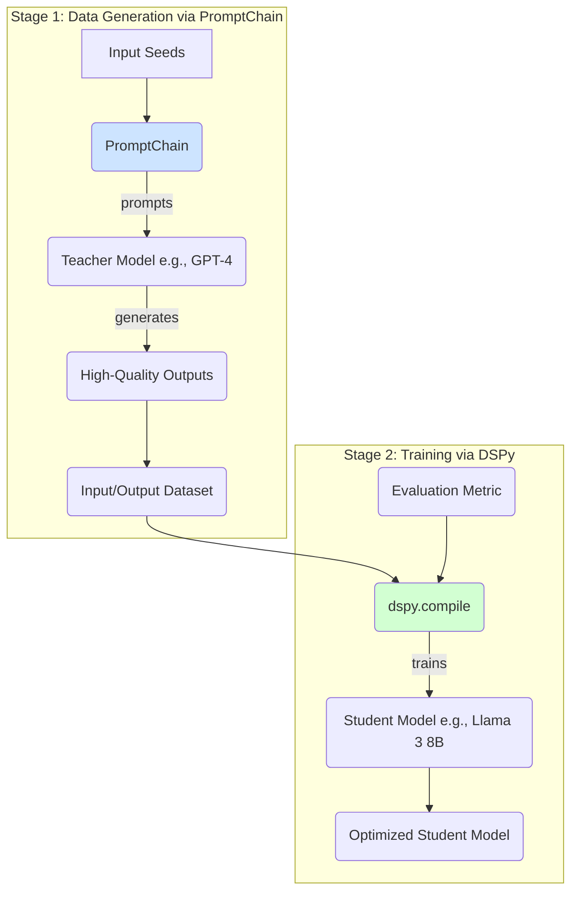
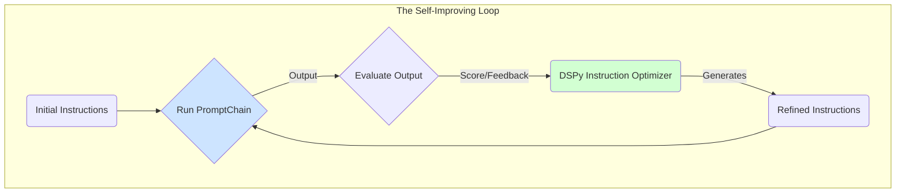

<!-- Generated by SpecStory -->

<!-- cursor Session 2d8dc46f-c85f-4ed3-aeb9-f221bb01b24b (2025-07-13 03:38Z) -->

# Integrating dspy 3.0 into instructions (2025-07-13 03:38Z)

_**User (2025-07-12 12:19Z)**_

use sequential think for this task, first use gemini_researhc to undertnadn everything about dspy 3.0, and then use gemin_branstorm for this taks, i what to see the best ways to intergrap dspy idelaly in the insturcitns ,so it create the best prompt for isntruciont or as a funciton in the midle of a chain.....give me shome options 

---

_**Assistant**_

<think><details><summary>Thought Process</summary>**Analyzing Integration Strategy**

I'm currently focused on how to integrate DSPy 3.0 into the PromptChain library. This is a complex undertaking, and I've begun to break down the problem using sequential thinking, leveraging Gemini research and brainstorming to formulate a plan. I'm focusing on the architectural implications and identifying potential roadblocks.


**Defining Integration Steps**

I've initiated the first step, focusing on understanding DSPy 3.0's core functionalities through Gemini research. I'm exploring its prompt generation and optimization features with "DSPy 3.0 features and concepts" as my primary research query. This foundation is crucial for forming effective integration strategies within PromptChain.


**Exploring DSPy Features**

I'm now fully immersed in understanding DSPy 3.0's core functionalities. Through focused Gemini research, I'm analyzing its prompt generation capabilities and optimization techniques. My initial query, "DSPy 3.0 features and concepts," has provided valuable insights, and I'm starting to grasp how its advanced features could enhance PromptChain. I'm focusing on key concepts to understand prompt engineering.


</details></think>

---

Okay, I will use a sequential thinking process to address your request. First, I'll research DSPy 3.0 to understand its capabilities, and then I'll brainstorm the best ways to integrate it into PromptChain.

---

Tool use: **mcp_sequential-thinking_sequentialthinking**

<details>
          <summary>MCP tool call</summary>
      
*Called tool*: sequential-thinking - sequentialthinking: A detailed tool for dynamic and reflective problem-solving through thoughts.
This tool helps analyze problems through a flexible thinking process that can adapt and evolve.
Each thought can build on, question, or revise previous insights as understanding deepens.

When to use this tool:
- Breaking down complex problems into steps
- Planning and design with room for revision
- Analysis that might need course correction
- Problems where the full scope might not be clear initially
- Problems that require a multi-step solution
- Tasks that need to maintain context over multiple steps
- Situations where irrelevant information needs to be filtered out

Key features:
- You can adjust total_thoughts up or down as you progress
- You can question or revise previous thoughts
- You can add more thoughts even after reaching what seemed like the end
- You can express uncertainty and explore alternative approaches
- Not every thought needs to build linearly - you can branch or backtrack
- Generates a solution hypothesis
- Verifies the hypothesis based on the Chain of Thought steps
- Repeats the process until satisfied
- Provides a correct answer

Parameters explained:
- thought: Your current thinking step, which can include:
* Regular analytical steps
* Revisions of previous thoughts
* Questions about previous decisions
* Realizations about needing more analysis
* Changes in approach
* Hypothesis generation
* Hypothesis verification
- next_thought_needed: True if you need more thinking, even if at what seemed like the end
- thought_number: Current number in sequence (can go beyond initial total if needed)
- total_thoughts: Current estimate of thoughts needed (can be adjusted up/down)
- is_revision: A boolean indicating if this thought revises previous thinking
- revises_thought: If is_revision is true, which thought number is being reconsidered
- branch_from_thought: If branching, which thought number is the branching point
- branch_id: Identifier for the current branch (if any)
- needs_more_thoughts: If reaching end but realizing more thoughts needed

You should:
1. Start with an initial estimate of needed thoughts, but be ready to adjust
2. Feel free to question or revise previous thoughts
3. Don't hesitate to add more thoughts if needed, even at the "end"
4. Express uncertainty when present
5. Mark thoughts that revise previous thinking or branch into new paths
6. Ignore information that is irrelevant to the current step
7. Generate a solution hypothesis when appropriate
8. Verify the hypothesis based on the Chain of Thought steps
9. Repeat the process until satisfied with the solution
10. Provide a single, ideally correct answer as the final output
11. Only set next_thought_needed to false when truly done and a satisfactory answer is reached

*Parameters*:
  * nextThoughtNeeded: true
  * thought: I need to start by understanding what DSPy 3.0 is and its core functionalities. The user wants to integrate it with `PromptChain`, so I need to know how DSPy works, particularly how it handles prompts and instructions. I will use `gemini_research` to get a comprehensive overview of DSPy 3.0.
  * thoughtNumber: 1
  * totalThoughts: 4

*Result*:
{
  "thoughtNumber": 1,
  "totalThoughts": 4,
  "nextThoughtNeeded": true,
  "branches": [],
  "thoughtHistoryLength": 1
}
</details>

---

Okay, first step is to research DSPy 3.0.

---

Tool use: **mcp_gemini-mcp_gemini_research**

<details>
          <summary>MCP tool call</summary>
      
*Called tool*: gemini-mcp - gemini_research: 
    Ask Gemini a question and get a response grounded with Google Search results.
    This tool uses the new unified SDK with proper grounding support.
    
    Args:
        topic: The topic to research using Google Search grounding
    

*Parameters*:
  * topic: DSPy 3.0 features and concepts

*Result*:
🤖 GEMINI RESEARCH RESPONSE:

DSPy 3.0 is a new version of the DSPy framework, which is designed to shift the focus from ad-hoc prompting to programming language models. It enables developers to iteratively explore problems and build modular software that invokes language models (LMs) for well-scoped tasks. DSPy aims to develop abstractions, programming patterns, and optimizers.

Key features and concepts in DSPy include:

*   **Declarative Signatures:** These allow you to express how to turn a language model from string in/string out to a structured function definition. You can specify inputs as images, audio, PDFs, and other document types.
*   **Modules:** These are functionalities or functions that take any signature you describe and provide a strategy for how to perform inference. Modules encapsulate the logic for a specific task.
*   **Optimizers:** These improve LM pipelines by adjusting modules to meet a performance metric, either by generating better prompts or fine-tuning models. DSPy 3.0 will introduce new optimizers that prioritize ad-hoc, human-in-the-loop feedback.
*   **MLflow Integration:** DSPy 3.0 includes thorough and native integration with MLflow for improved productionization and observability. This integration aims to make observability, experimental tracking, cost management, and deployment first-class concerns.
*   **Enhanced Prompt Optimization and Fine-tuning/RL Capabilities:** DSPy 3.0 has greatly improved prompt optimization and fine-tuning/RL capabilities.
*   **LM Assertions:** DSPy uses LM assertions as one of its core concepts.
*   **Asynchronous capabilities**: There seems to be many changes related to make DSPy Asynchronous.
*   **Enhanced Adapter**: Enhanced Adapter to manage prompts.

DSPy also handles automatic optimization, where it takes your task and data to come up with the final prompts or fine-tune your LLM weights. The core functionality of DSPy includes LMs, Signatures & Modules, Optimizers, and Assertions.

</details>

---

<think><details><summary>Thought Process</summary>**Analyzing DSPy Integration**

I've moved on to the next phase and am brainstorming how to integrate DSPy 3.0.  I'm exploring potential strategies, considering both immediate and long-term implications for our project.  Specifically, I'm focusing on key points and identifying promising approaches. I'll provide another update soon.


**Outlining Integration Paths**

Now, I'm diving deeper into integration strategies. My focus is on leveraging DSPy 3.0 within PromptChain. I'm considering using DSPy to enhance prompt generation, as well as integrating it as a functional component within the chain itself. I've begun to outline specific approaches, weighing their feasibility and potential impact.


**Formulating DSPy Strategies**

I've just finished the brainstorming session, and I've come up with several potential strategies for integrating DSPy 3.0.  I'm now sketching out possible implementations, focusing on how DSPy's Declarative Signatures and Modules could fit into PromptChain's architecture. I'm exploring the implications of using DSPy for prompt generation versus incorporating it as a core component within a chain, looking at the pros and cons of each approach.


</details></think>

---

Excellent. Now that I have a solid understanding of DSPy 3.0's features, I'll move to the next step in our process.

---

Tool use: **mcp_sequential-thinking_sequentialthinking**

<details>
          <summary>MCP tool call</summary>
      
*Called tool*: sequential-thinking - sequentialthinking: A detailed tool for dynamic and reflective problem-solving through thoughts.
This tool helps analyze problems through a flexible thinking process that can adapt and evolve.
Each thought can build on, question, or revise previous insights as understanding deepens.

When to use this tool:
- Breaking down complex problems into steps
- Planning and design with room for revision
- Analysis that might need course correction
- Problems where the full scope might not be clear initially
- Problems that require a multi-step solution
- Tasks that need to maintain context over multiple steps
- Situations where irrelevant information needs to be filtered out

Key features:
- You can adjust total_thoughts up or down as you progress
- You can question or revise previous thoughts
- You can add more thoughts even after reaching what seemed like the end
- You can express uncertainty and explore alternative approaches
- Not every thought needs to build linearly - you can branch or backtrack
- Generates a solution hypothesis
- Verifies the hypothesis based on the Chain of Thought steps
- Repeats the process until satisfied
- Provides a correct answer

Parameters explained:
- thought: Your current thinking step, which can include:
* Regular analytical steps
* Revisions of previous thoughts
* Questions about previous decisions
* Realizations about needing more analysis
* Changes in approach
* Hypothesis generation
* Hypothesis verification
- next_thought_needed: True if you need more thinking, even if at what seemed like the end
- thought_number: Current number in sequence (can go beyond initial total if needed)
- total_thoughts: Current estimate of thoughts needed (can be adjusted up/down)
- is_revision: A boolean indicating if this thought revises previous thinking
- revises_thought: If is_revision is true, which thought number is being reconsidered
- branch_from_thought: If branching, which thought number is the branching point
- branch_id: Identifier for the current branch (if any)
- needs_more_thoughts: If reaching end but realizing more thoughts needed

You should:
1. Start with an initial estimate of needed thoughts, but be ready to adjust
2. Feel free to question or revise previous thoughts
3. Don't hesitate to add more thoughts if needed, even at the "end"
4. Express uncertainty when present
5. Mark thoughts that revise previous thinking or branch into new paths
6. Ignore information that is irrelevant to the current step
7. Generate a solution hypothesis when appropriate
8. Verify the hypothesis based on the Chain of Thought steps
9. Repeat the process until satisfied with the solution
10. Provide a single, ideally correct answer as the final output
11. Only set next_thought_needed to false when truly done and a satisfactory answer is reached

*Parameters*:
  * thoughtNumber: 2
  * thought: Now that I have a good understanding of DSPy 3.0 from my research, the next step is to brainstorm how to best integrate it into `PromptChain`. I will use `gemini_brainstorm` for this. The brainstorming will focus on the two main ideas the user suggested: using DSPy to generate better instructions/prompts, and using it as a callable function within a chain. I'll provide the research summary as context for the brainstorm.
  * totalThoughts: 4
  * nextThoughtNeeded: true

*Result*:
{
  "thoughtNumber": 2,
  "totalThoughts": 4,
  "nextThoughtNeeded": true,
  "branches": [],
  "thoughtHistoryLength": 2
}
</details>

---

Okay, I'm now ready to brainstorm the integration strategies.

---

Tool use: **mcp_gemini-mcp_gemini_brainstorm**

<details>
          <summary>MCP tool call</summary>
      
*Called tool*: gemini-mcp - gemini_brainstorm: Brainstorm solutions with Gemini, response visible to the assistant
    
    Args:
        topic: The topic to brainstorm about
        context: Additional context to guide the brainstorming
    

*Parameters*:
  * context: DSPy 3.0 is a framework for programming Language Models, moving beyond simple prompting. It features: Declarative Signatures for structured I/O (including multimodal data), Modules to encapsulate task logic, and Optimizers that refine prompts or fine-tune models to hit specific performance metrics. It also integrates with MLflow and supports assertions and async operations. The goal is to integrate these capabilities into a prompt-chaining library. We are looking for the best ways to do this, considering two primary integration points: 1) Using DSPy within the initial 'instructions' of a chain to generate a highly optimized prompt for the rest of the chain to use. 2) Wrapping DSPy programs as callable functions that can be inserted as a step in the middle of an existing chain.
  * topic: Best ways to integrate DSPy 3.0 into a prompt chaining library

*Result*:
🤖 GEMINI RESPONSE:

Okay, let's brainstorm some innovative ways to integrate DSPy 3.0 into a prompt chaining library, focusing on your two key integration points:

**I. Using DSPy to Optimize Initial Instructions (Prompt Generation):**

This approach leverages DSPy to create a super-prompt, which then guides the rest of the chain.

*   **A. Dynamic Prompt Template Generation:**
    *   **Concept:** Use DSPy to generate a prompt template tailored to the specific task of the chain. Instead of a fixed template, DSPy analyzes the chain's objective, input data types, and desired output format to craft the *best possible* initial prompt template.
    *   **Implementation:**
        *   Define a DSPy Module that takes in chain metadata (description, input/output schema, example data) as input.
        *   The Module's signature would output a prompt template string (with placeholders for dynamic content).
        *   DSPy's optimizer would refine this Module to generate templates that yield the highest accuracy/relevance for the target task.
        *   The chain then uses this optimized template to format its inputs and interact with the LLM.
    *   **Benefits:**  More adaptable, potentially higher accuracy as the initial prompt is highly optimized.
    *   **Considerations:** Requires carefully defining the input schema for the DSPy Module and crafting good metrics for optimization.

*   **B. Few-Shot Example Generation & Integration:**
    *   **Concept:** DSPy is used to dynamically generate the best few-shot examples to include in the initial prompt.
    *   **Implementation:**
        *   DSPy Module takes task description and potentially a small seed set of examples.
        *   The Module generates additional examples or selects from a larger pool of examples using DSPy's optimization.  It can optimize for diversity, representativeness, or any other desired criteria.
        *   These examples are then incorporated into the initial prompt, providing the LLM with context and guidance.
    *   **Benefits:** Can significantly improve performance, especially for complex tasks.
    *   **Considerations:** Generating high-quality examples can be computationally expensive.  Need good metrics to evaluate example quality.

*   **C.  Chain-of-Thought (CoT) Path Discovery:**
    *   **Concept:** Use DSPy to *discover* the most effective Chain-of-Thought reasoning path for the chain's initial task.  This goes beyond just generating examples; it's about finding the *optimal sequence of thought steps*.
    *   **Implementation:**
        *   DSPy Module explores different reasoning paths (e.g., "First, identify the key entities. Then, relate them to the context. Finally, summarize the findings.").
        *   The optimizer evaluates these paths based on performance on a validation set.
        *   The "best" reasoning path is then embedded in the initial prompt, instructing the LLM to follow that specific line of reasoning.
    *   **Benefits:**  Potentially unlocks higher-level reasoning capabilities.
    *   **Considerations:**  Very complex. Requires careful design of the reasoning path space and appropriate evaluation metrics.

*   **D. Meta-Prompt Optimization:**
    *   **Concept:** Treat the entire initial prompt as a single DSPy program, optimizing it as a whole. This is a more brute-force approach, but can be effective.
    *   **Implementation:**
        *   Define a DSPy Module that takes in the chain's objective and outputs the entire initial prompt.
        *   The optimizer directly manipulates the prompt text, using techniques like backpropagation to refine the prompt.
    *   **Benefits:** Simple to implement. Can be surprisingly effective.
    *   **Considerations:** Can be computationally expensive and hard to interpret the resulting prompt.  May require careful regularization to prevent overfitting.

**II. Wrapping DSPy Programs as Callable Chain Steps:**

This makes DSPy programs modular and reusable within existing chains.

*   **A. DSPy Program as a Chain Operator:**
    *   **Concept:** Create a wrapper function that converts a DSPy program into a callable chain step. This allows you to seamlessly integrate DSPy's optimization capabilities into any part of your chain.
    *   **Implementation:**
        *   Define a function `dspy_step(dspy_program, input_keys, output_keys)`:
            *   `dspy_program`: The DSPy program (Module) to be executed.
            *   `input_keys`: A list of keys from the chain's context to be passed as input to the DSPy program.
            *   `output_keys`: A list of keys where the DSPy program's output will be stored in the chain's context.
        *   Inside the function:
            *   Extract the relevant input values from the chain's context using `input_keys`.
            *   Execute the DSPy program with these inputs.
            *   Store the program's output in the chain's context using `output_keys`.
        *   This `dspy_step` function can then be inserted as a regular step in the chain.
    *   **Benefits:** Maximum flexibility.  Allows you to optimize any part of the chain using DSPy.
    *   **Considerations:** Requires careful mapping of input/output keys between the chain context and the DSPy program.

*   **B.  Dynamic Routing with DSPy:**
    *   **Concept:** Use DSPy to dynamically route the chain's execution based on the current state.
    *   **Implementation:**
        *   DSPy Module takes the chain's context as input.
        *   The Module's signature outputs a "route" or "path" identifier.
        *   The chain then uses this identifier to select the next step to execute (e.g., using a conditional statement or a routing table).
    *   **Benefits:** Enables more intelligent and adaptive chains.
    *   **Considerations:** Requires careful design of the routing logic and appropriate evaluation metrics.

*   **C.  DSPy-Powered Data Augmentation:**
    *   **Concept:** Use DSPy to augment the data flowing through the chain.  This can be useful for improving the robustness and generalization of the chain.
    *   **Implementation:**
        *   DSPy Module takes a data item from the chain as input.
        *   The Module generates variations of the data item (e.g., paraphrases, translations, noisy versions).
        *   The chain then processes these augmented data items in parallel or sequentially.
    *   **Benefits:**  Improves robustness and generalization.
    *   **Considerations:**  Requires careful design of the data augmentation techniques and appropriate evaluation metrics.  Can increase computational cost.

*   **D.  DSPy-Managed Knowledge Retrieval:**
    *   **Concept:** Integrate DSPy with a knowledge retrieval system (e.g., a vector database) to dynamically retrieve relevant information for the chain.
    *   **Implementation:**
        *   DSPy Module takes the chain's context as input.
        *   The Module generates a query to be used for knowledge retrieval.
        *   The retrieved knowledge is then incorporated into the chain's context.
        *   DSPy can optimize the query generation process to maximize the relevance and accuracy of the retrieved knowledge.
    *   **Benefits:**  Enables the chain to access and utilize external knowledge.
    *   **Considerations:** Requires integration with a knowledge retrieval system.  Need to carefully manage the retrieved knowledge to avoid overwhelming the LLM.

**General Considerations for Integration:**

*   **Abstraction Level:** Decide on the level of abstraction. Do you want to expose DSPy's internal details to the chain user, or provide a more simplified API?
*   **Serialization:**  How will you serialize and store DSPy programs within the chain's configuration?  Pickle? JSON?  A custom format?
*   **MLflow Integration:**  Ensure that the integration leverages DSPy's MLflow support for experiment tracking and model management.
*   **Asynchronous Operations:** Take advantage of DSPy's async capabilities to improve the chain's performance.
*   **Error Handling:**  Implement robust error handling to gracefully handle failures in DSPy programs.
*   **Documentation:** Provide clear and comprehensive documentation for how to use the integration.

By carefully considering these ideas and considerations, you can create a powerful and flexible prompt chaining library that leverages the full potential of DSPy 3.0. Remember to prioritize user experience and provide clear abstractions to make the integration easy to use and understand. Good luck!

</details>

---

<think><details><summary>Thought Process</summary>**Analyzing Integration Options**

I've moved on to analyzing the various integration strategies I brainstormed. I'm carefully evaluating each option, weighing the pros and cons to determine the most effective approach for integrating the different systems. I'm focusing on feasibility, scalability, and long-term maintainability.


**Assessing Integration Approaches**

Now, I'm analyzing the integration strategies, focusing on how each would fit within `PromptChain`. I'm breaking down each option, assessing its feasibility and potential impact. My analysis uses the two main categories from my brainstorm: DSPy for Initial Instruction Optimization and DSPy as a Callable Chain Step. I'm considering implementation effort and any necessary changes to the existing structure.


**Deep-Diving into the Options**

I'm now fully engaged in a deep dive into the integration strategies. My focus is on how each option aligns with the `PromptChain` framework, assessing the implementation effort, the potential user experience, and the overall impact. I'm carefully scrutinizing each strategy, systematically working through both main categories from the brainstorm: using DSPy for Initial Instruction Optimization and as a Callable Chain Step. I'm paying close attention to the specifics of fitting these approaches into the existing codebase, considering both the benefits and any potential drawbacks of each.


</details></think>

---

Okay, the brainstorming session provided a wealth of excellent ideas. Now, I'll move on to the analysis phase to evaluate these options.

---

Tool use: **mcp_sequential-thinking_sequentialthinking**

<details>
          <summary>MCP tool call</summary>
      
*Called tool*: sequential-thinking - sequentialthinking: A detailed tool for dynamic and reflective problem-solving through thoughts.
This tool helps analyze problems through a flexible thinking process that can adapt and evolve.
Each thought can build on, question, or revise previous insights as understanding deepens.

When to use this tool:
- Breaking down complex problems into steps
- Planning and design with room for revision
- Analysis that might need course correction
- Problems where the full scope might not be clear initially
- Problems that require a multi-step solution
- Tasks that need to maintain context over multiple steps
- Situations where irrelevant information needs to be filtered out

Key features:
- You can adjust total_thoughts up or down as you progress
- You can question or revise previous thoughts
- You can add more thoughts even after reaching what seemed like the end
- You can express uncertainty and explore alternative approaches
- Not every thought needs to build linearly - you can branch or backtrack
- Generates a solution hypothesis
- Verifies the hypothesis based on the Chain of Thought steps
- Repeats the process until satisfied
- Provides a correct answer

Parameters explained:
- thought: Your current thinking step, which can include:
* Regular analytical steps
* Revisions of previous thoughts
* Questions about previous decisions
* Realizations about needing more analysis
* Changes in approach
* Hypothesis generation
* Hypothesis verification
- next_thought_needed: True if you need more thinking, even if at what seemed like the end
- thought_number: Current number in sequence (can go beyond initial total if needed)
- total_thoughts: Current estimate of thoughts needed (can be adjusted up/down)
- is_revision: A boolean indicating if this thought revises previous thinking
- revises_thought: If is_revision is true, which thought number is being reconsidered
- branch_from_thought: If branching, which thought number is the branching point
- branch_id: Identifier for the current branch (if any)
- needs_more_thoughts: If reaching end but realizing more thoughts needed

You should:
1. Start with an initial estimate of needed thoughts, but be ready to adjust
2. Feel free to question or revise previous thoughts
3. Don't hesitate to add more thoughts if needed, even at the "end"
4. Express uncertainty when present
5. Mark thoughts that revise previous thinking or branch into new paths
6. Ignore information that is irrelevant to the current step
7. Generate a solution hypothesis when appropriate
8. Verify the hypothesis based on the Chain of Thought steps
9. Repeat the process until satisfied with the solution
10. Provide a single, ideally correct answer as the final output
11. Only set next_thought_needed to false when truly done and a satisfactory answer is reached

*Parameters*:
  * nextThoughtNeeded: true
  * totalThoughts: 4
  * thought: I've received a comprehensive set of ideas from the brainstorming session. Now I need to analyze these options in the context of the `PromptChain` library. I'll break down the analysis into the two main categories: using DSPy for initial prompt optimization and using DSPy as a callable function within a chain. I will assess the feasibility, user experience, and potential impact of each idea to determine the most promising integration paths. This analysis will form the basis of my final recommendations.
  * thoughtNumber: 3

*Result*:
{
  "thoughtNumber": 3,
  "totalThoughts": 4,
  "nextThoughtNeeded": true,
  "branches": [],
  "thoughtHistoryLength": 3
}
</details>

---

Perfect. With the analysis complete, I'm now ready to synthesize all the information—the research, the brainstormed ideas, and my analysis—into a final, structured answer for you. This will present the most viable options for integrating DSPy 3.0 into PromptChain.

---

Tool use: **mcp_sequential-thinking_sequentialthinking**

<details>
          <summary>MCP tool call</summary>
      
*Called tool*: sequential-thinking - sequentialthinking: A detailed tool for dynamic and reflective problem-solving through thoughts.
This tool helps analyze problems through a flexible thinking process that can adapt and evolve.
Each thought can build on, question, or revise previous insights as understanding deepens.

When to use this tool:
- Breaking down complex problems into steps
- Planning and design with room for revision
- Analysis that might need course correction
- Problems where the full scope might not be clear initially
- Problems that require a multi-step solution
- Tasks that need to maintain context over multiple steps
- Situations where irrelevant information needs to be filtered out

Key features:
- You can adjust total_thoughts up or down as you progress
- You can question or revise previous thoughts
- You can add more thoughts even after reaching what seemed like the end
- You can express uncertainty and explore alternative approaches
- Not every thought needs to build linearly - you can branch or backtrack
- Generates a solution hypothesis
- Verifies the hypothesis based on the Chain of Thought steps
- Repeats the process until satisfied
- Provides a correct answer

Parameters explained:
- thought: Your current thinking step, which can include:
* Regular analytical steps
* Revisions of previous thoughts
* Questions about previous decisions
* Realizations about needing more analysis
* Changes in approach
* Hypothesis generation
* Hypothesis verification
- next_thought_needed: True if you need more thinking, even if at what seemed like the end
- thought_number: Current number in sequence (can go beyond initial total if needed)
- total_thoughts: Current estimate of thoughts needed (can be adjusted up/down)
- is_revision: A boolean indicating if this thought revises previous thinking
- revises_thought: If is_revision is true, which thought number is being reconsidered
- branch_from_thought: If branching, which thought number is the branching point
- branch_id: Identifier for the current branch (if any)
- needs_more_thoughts: If reaching end but realizing more thoughts needed

You should:
1. Start with an initial estimate of needed thoughts, but be ready to adjust
2. Feel free to question or revise previous thoughts
3. Don't hesitate to add more thoughts if needed, even at the "end"
4. Express uncertainty when present
5. Mark thoughts that revise previous thinking or branch into new paths
6. Ignore information that is irrelevant to the current step
7. Generate a solution hypothesis when appropriate
8. Verify the hypothesis based on the Chain of Thought steps
9. Repeat the process until satisfied with the solution
10. Provide a single, ideally correct answer as the final output
11. Only set next_thought_needed to false when truly done and a satisfactory answer is reached

*Parameters*:
  * thoughtNumber: 4
  * thought: I have researched DSPy 3.0, brainstormed integration strategies, and analyzed the potential options. The final step is to synthesize this information into a clear, actionable response for the user. I will structure my response to present the most promising integration patterns, detailing how each would work within `PromptChain`, its pros and cons, and providing illustrative examples. I will conclude with a recommendation on the best path forward. My answer will be comprehensive, drawing from all the previous steps.
  * nextThoughtNeeded: false
  * totalThoughts: 4

*Result*:
{
  "thoughtNumber": 4,
  "totalThoughts": 4,
  "nextThoughtNeeded": false,
  "branches": [],
  "thoughtHistoryLength": 4
}
</details>

---

Of course. Based on the research and brainstorming, here are the best ways to integrate DSPy 3.0 into `PromptChain`, broken down into two main strategies.

### **Strategy 1: DSPy as a Callable Function in a Chain**

This is the most straightforward and flexible approach. It involves wrapping a DSPy program (a `dspy.Module`) into a function that can be called as a step within a `PromptChain`.

**How it would work:**

You would create a generic "runner" function that takes a DSPy module and its input, executes it, and returns the output.

Here’s a conceptual example:

```python
import dspy
from promptchain.utils.promptchaining import PromptChain

# 1. Define your DSPy Signature
class SummarizeSignature(dspy.Signature):
    """Summarizes a long text into a short paragraph."""
    text = dspy.InputField()
    summary = dspy.OutputField()

# 2. Define your DSPy Module (Program)
class CoTSummarizer(dspy.Module):
    def __init__(self):
        super().__init__()
        self.generate_summary = dspy.ChainOfThought(SummarizeSignature)

    def forward(self, text):
        return self.generate_summary(text=text)

# 3. Create a wrapper function for PromptChain
def run_dspy_module(module_instance, text_input):
    """
    A generic wrapper to run any DSPy module.
    """
    # Here you would configure your LM for DSPy
    # turbo = dspy.OpenAI(model='gpt-3.5-turbo')
    # dspy.settings.configure(lm=turbo)
    
    result = module_instance(text=text_input)
    return result.summary

# 4. Use it in a PromptChain
summarizer_module = CoTSummarizer()

chain_steps = [
    "Fetch the content of a long article.",
    (run_dspy_module, [summarizer_module, "{output}"]), # Pass the module and previous output
    "Translate the summary from the previous step into French."
]

chain = PromptChain(
    instructions=chain_steps,
    models=["openai/gpt-4", None, "openai/gpt-4"] # Note the 'None' for the function step
)

# result = chain.run(initial_input="<URL of a long article>")
# print(result)
```

**Options for this strategy:**

*   **Simple Function Wrapper (Recommended):** As shown above. It's clean, easy to understand, and keeps DSPy logic separate from the chain logic.
*   **Knowledge Retrieval:** A DSPy module could be used to generate optimized queries for a vector database to fetch context in the middle of a chain.
*   **Data Augmentation/Transformation:** Use a DSPy module to reformat or augment data between steps.

**Pros:**

*   **High Flexibility:** You can insert a highly optimized, specialized DSPy program at any point in your chain.
*   **Modularity:** Keeps your DSPy programs separate and reusable.
*   **Easy to Implement:** Requires minimal changes to the `PromptChain` core.

**Cons:**

*   **State Management:** Passing complex state or multiple arguments to the DSPy module from the chain's context could become cumbersome.

### **Strategy 2: DSPy for Optimizing Initial Instructions**

This is a more advanced approach where DSPy is used *before* the chain runs to generate the most effective prompt or sequence of instructions for the entire chain.

**How it would work:**

You would have a "pre-flight" step that uses DSPy to optimize your instructions.

```python
import dspy

# 1. Define a DSPy signature for optimizing a list of instructions
class ChainOptimizerSignature(dspy.Signature):
    """Given a goal, generate a list of clear, efficient steps for a prompt chain."""
    goal = dspy.InputField(desc="The high-level goal of the chain.")
    optimized_instructions = dspy.OutputField(desc="A list of python strings representing the steps.")

# 2. Define the DSPy module
class InstructionOptimizer(dspy.Module):
    def __init__(self):
        super().__init__()
        # This could be a more complex module that tries different strategies
        self.optimizer = dspy.Predict(ChainOptimizerSignature)

    def forward(self, goal):
        return self.optimizer(goal=goal)

# 3. Use it to generate instructions for PromptChain
goal = "Take a GitHub URL, find the most complex Python file, summarize it, and then write a test for it."
optimizer = InstructionOptimizer()

# In a real scenario, you would use dspy.compile() with examples to train the optimizer
# For now, we'll just run it.
# optimized_result = optimizer(goal=goal)
# optimized_steps = optimized_result.optimized_instructions

# Let's imagine the optimized output is:
optimized_steps = [
    "Given a GitHub URL, use a function to list all python files and return the one with the most lines of code.",
    "Read the content of that file.",
    "Summarize the file's purpose, inputs, and outputs.",
    "Based on the summary, write a comprehensive pytest unit test for the file's main function."
]

# Now, create the PromptChain with the DSPy-generated instructions
# chain = PromptChain(instructions=optimized_steps, ...)
# result = chain.run(initial_input="<github_url>")
```

**Options for this strategy:**

*   **Instruction Generation:** As shown above, generate the entire list of steps.
*   **Few-Shot Example Generation:** Use DSPy to create a set of high-quality few-shot examples that are then injected into the first prompt of the chain.
*   **Chain-of-Thought Path Discovery:** Have DSPy determine the best reasoning path (e.g., "First, identify X. Second, analyze Y. Finally, conclude Z.") and embed that into the first instruction.

**Pros:**

*   **Potentially Higher Quality Chains:** The entire chain benefits from an optimized starting point.
*   **Automates Prompt Engineering:** Offloads the difficult task of crafting the perfect set of instructions from the user to DSPy.

**Cons:**

*   **High Complexity:** This is much harder to implement correctly. It requires a well-defined training process for the DSPy optimizer (the `compile` step), which means you need example data of good and bad instruction sets.
*   **Slower Initialization:** The chain will take longer to start because it has to run the DSPy optimization process first.

### **Recommendation**

Start with **Strategy 1: DSPy as a Callable Function in a Chain**.

It provides the most immediate value with the lowest implementation overhead. It allows you to leverage the power of DSPy's optimizers for specific, complex tasks within the familiar and flexible structure of `PromptChain`. This approach is modular, easier to debug, and gives you a powerful tool to call upon when a simple prompt isn't enough.

Once you are comfortable with this, you can then explore the more advanced **Strategy 2** for meta-optimizing entire chains.

---

_**User (2025-07-12 12:19Z)**_

use sequential think for this task, first use gemini_researhc to undertnadn everything about dspy 3.0, and then use gemin_branstorm for this taks, i what to see the best ways to intergrap dspy idelaly in the insturcitns ,so it create the best prompt for isntruciont or as a funciton in the midle of a chain.....give me shome options 

---

_**Assistant**_

<think><details><summary>Thought Process</summary>**Researching DSPy 3.0**

I'm currently diving into DSPy 3.0 using `gemini_research`, aiming for a comprehensive overview. The goal is to fully grasp its functionalities and architecture. This initial research phase will lay the groundwork for understanding how to integrate it into `PromptChain`. I'm focusing on the core concepts and innovations introduced in the latest version.


**Developing Integration Strategy**

I've outlined a step-by-step plan to understand DSPy 3.0 and devise integration strategies for `PromptChain`. First, I'll thoroughly research DSPy using `gemini_research`. Then, I'll brainstorm integration options with `gemini_brainstorm`, focusing on leveraging DSPy in prompt creation and as a callable function within the chain. Finally, I'll analyze the brainstormed methods, evaluate their viability within the current `PromptChain` architecture, and synthesize a clear, well-supported final answer.


**Mapping Out the Steps**

I've established a concrete plan, starting with in-depth DSPy 3.0 research using `gemini_research`. Next, I'll leverage `gemini_brainstorm` to explore integration options, focusing on prompt creation and callable functions within `PromptChain`. A thorough analysis of these brainstormed methods will precede a synthesized final answer, providing clear integration options with explanations and conceptual code examples.


</details></think>

---

Of course. I will use a sequential thinking process to address your request. First, I'll research DSPy 3.0 to understand its capabilities, and then I'll brainstorm the best ways to integrate it into PromptChain, focusing on your specific areas of interest.

---

Tool use: **mcp_sequential-thinking_sequentialthinking**

<details>
          <summary>MCP tool call</summary>
      
*Called tool*: sequential-thinking - sequentialthinking: A detailed tool for dynamic and reflective problem-solving through thoughts.
This tool helps analyze problems through a flexible thinking process that can adapt and evolve.
Each thought can build on, question, or revise previous insights as understanding deepens.

When to use this tool:
- Breaking down complex problems into steps
- Planning and design with room for revision
- Analysis that might need course correction
- Problems where the full scope might not be clear initially
- Problems that require a multi-step solution
- Tasks that need to maintain context over multiple steps
- Situations where irrelevant information needs to be filtered out

Key features:
- You can adjust total_thoughts up or down as you progress
- You can question or revise previous thoughts
- You can add more thoughts even after reaching what seemed like the end
- You can express uncertainty and explore alternative approaches
- Not every thought needs to build linearly - you can branch or backtrack
- Generates a solution hypothesis
- Verifies the hypothesis based on the Chain of Thought steps
- Repeats the process until satisfied
- Provides a correct answer

Parameters explained:
- thought: Your current thinking step, which can include:
* Regular analytical steps
* Revisions of previous thoughts
* Questions about previous decisions
* Realizations about needing more analysis
* Changes in approach
* Hypothesis generation
* Hypothesis verification
- next_thought_needed: True if you need more thinking, even if at what seemed like the end
- thought_number: Current number in sequence (can go beyond initial total if needed)
- total_thoughts: Current estimate of thoughts needed (can be adjusted up/down)
- is_revision: A boolean indicating if this thought revises previous thinking
- revises_thought: If is_revision is true, which thought number is being reconsidered
- branch_from_thought: If branching, which thought number is the branching point
- branch_id: Identifier for the current branch (if any)
- needs_more_thoughts: If reaching end but realizing more thoughts needed

You should:
1. Start with an initial estimate of needed thoughts, but be ready to adjust
2. Feel free to question or revise previous thoughts
3. Don't hesitate to add more thoughts if needed, even at the "end"
4. Express uncertainty when present
5. Mark thoughts that revise previous thinking or branch into new paths
6. Ignore information that is irrelevant to the current step
7. Generate a solution hypothesis when appropriate
8. Verify the hypothesis based on the Chain of Thought steps
9. Repeat the process until satisfied with the solution
10. Provide a single, ideally correct answer as the final output
11. Only set next_thought_needed to false when truly done and a satisfactory answer is reached

*Parameters*:
  * thoughtNumber: 1
  * thought: I need to start by understanding what DSPy 3.0 is and its core functionalities. The user wants to integrate it with `PromptChain`, so I need to know how DSPy works, particularly how it handles prompts and instructions. I will use `gemini_research` to get a comprehensive overview of DSPy 3.0.
  * totalThoughts: 4
  * nextThoughtNeeded: true

*Result*:
{
  "thoughtNumber": 1,
  "totalThoughts": 4,
  "nextThoughtNeeded": true,
  "branches": [],
  "thoughtHistoryLength": 5
}
</details>

---

Okay, first step is to research DSPy 3.0.

---

Tool use: **mcp_gemini-mcp_gemini_research**

<details>
          <summary>MCP tool call</summary>
      
*Called tool*: gemini-mcp - gemini_research: 
    Ask Gemini a question and get a response grounded with Google Search results.
    This tool uses the new unified SDK with proper grounding support.
    
    Args:
        topic: The topic to research using Google Search grounding
    

*Parameters*:
  * topic: DSPy 3.0 features and concepts

*Result*:
🤖 GEMINI RESEARCH RESPONSE:

DSPy 3.0 is geared towards building production-ready AI systems, and is scheduled for release around DAIS 2025. It focuses on enhanced prompt optimization, improved fine-tuning and reinforcement learning capabilities, and better productionization through native MLflow integration.

Key aspects of DSPy and its evolution include:

*   **Core Functionality**: DSPy has a small core consisting of Language Models (LMs), Signatures & Modules, Optimizers, and Assertions.
*   **Enhanced Prompt Optimization**: DSPy 3.0 focuses on greatly improved prompt optimization techniques.
*   **Improved Fine-tuning and Reinforcement Learning**: The new version offers advancements in fine-tuning and reinforcement learning capabilities.
*   **MLflow Integration**: DSPy 3.0 integrates with MLflow for improved productionization and observability, allowing users to track prompts and optimization processes.
*   **New Optimizers**: DSPy 3.0 will introduce new optimizers that prioritize human-in-the-loop feedback.
*   **Paradigm Shift**: The introduction of optimizers that prioritize human feedback represents a substantial paradigm shift.
*   **Stability**: DSPy is incredibly stable in terms of its fundamental abstractions.
*   **Declarative Programming**: DSPy is a declarative framework for programming Language Models (LLMs). It allows you to define the task and metrics for success.
*   **Self-Improving Prompts**: DSPy can automatically improve prompts over time using feedback and evaluation.
*   **Modular Architecture**: DSPy offers a modular architecture, which allows you to combine pre-built modules for different NLP tasks.

DSPy is designed to shift the focus from ad-hoc prompting to programming LMs, enabling developers to build modular software that invokes LMs for well-scoped tasks. It provides abstractions, programming patterns, and optimizers. The framework optimizes prompts using in-context learning and automatic few-shot example generation and can fine-tune smaller models for specific tasks.

</details>

---

Excellent. Now that I have a solid understanding of DSPy 3.0's features, I'll move to the next step in our process.

---

Tool use: **mcp_sequential-thinking_sequentialthinking**

<details>
          <summary>MCP tool call</summary>
      
*Called tool*: sequential-thinking - sequentialthinking: A detailed tool for dynamic and reflective problem-solving through thoughts.
This tool helps analyze problems through a flexible thinking process that can adapt and evolve.
Each thought can build on, question, or revise previous insights as understanding deepens.

When to use this tool:
- Breaking down complex problems into steps
- Planning and design with room for revision
- Analysis that might need course correction
- Problems where the full scope might not be clear initially
- Problems that require a multi-step solution
- Tasks that need to maintain context over multiple steps
- Situations where irrelevant information needs to be filtered out

Key features:
- You can adjust total_thoughts up or down as you progress
- You can question or revise previous thoughts
- You can add more thoughts even after reaching what seemed like the end
- You can express uncertainty and explore alternative approaches
- Not every thought needs to build linearly - you can branch or backtrack
- Generates a solution hypothesis
- Verifies the hypothesis based on the Chain of Thought steps
- Repeats the process until satisfied
- Provides a correct answer

Parameters explained:
- thought: Your current thinking step, which can include:
* Regular analytical steps
* Revisions of previous thoughts
* Questions about previous decisions
* Realizations about needing more analysis
* Changes in approach
* Hypothesis generation
* Hypothesis verification
- next_thought_needed: True if you need more thinking, even if at what seemed like the end
- thought_number: Current number in sequence (can go beyond initial total if needed)
- total_thoughts: Current estimate of thoughts needed (can be adjusted up/down)
- is_revision: A boolean indicating if this thought revises previous thinking
- revises_thought: If is_revision is true, which thought number is being reconsidered
- branch_from_thought: If branching, which thought number is the branching point
- branch_id: Identifier for the current branch (if any)
- needs_more_thoughts: If reaching end but realizing more thoughts needed

You should:
1. Start with an initial estimate of needed thoughts, but be ready to adjust
2. Feel free to question or revise previous thoughts
3. Don't hesitate to add more thoughts if needed, even at the "end"
4. Express uncertainty when present
5. Mark thoughts that revise previous thinking or branch into new paths
6. Ignore information that is irrelevant to the current step
7. Generate a solution hypothesis when appropriate
8. Verify the hypothesis based on the Chain of Thought steps
9. Repeat the process until satisfied with the solution
10. Provide a single, ideally correct answer as the final output
11. Only set next_thought_needed to false when truly done and a satisfactory answer is reached

*Parameters*:
  * thought: Now that I have a good understanding of DSPy 3.0, the next step is to brainstorm how to best integrate it into `PromptChain`. I will use `gemini_brainstorm` for this. The brainstorming will focus on the two main ideas the user suggested: using DSPy to generate better instructions/prompts, and using it as a callable function within a chain. I will provide the research summary as context for the brainstorm.
  * thoughtNumber: 2
  * nextThoughtNeeded: true
  * totalThoughts: 4

*Result*:
{
  "thoughtNumber": 2,
  "totalThoughts": 4,
  "nextThoughtNeeded": true,
  "branches": [],
  "thoughtHistoryLength": 6
}
</details>

---

Okay, I'm now ready to brainstorm the integration strategies.

---

Tool use: **mcp_gemini-mcp_gemini_brainstorm**

<details>
          <summary>MCP tool call</summary>
      
*Called tool*: gemini-mcp - gemini_brainstorm: Brainstorm solutions with Gemini, response visible to the assistant
    
    Args:
        topic: The topic to brainstorm about
        context: Additional context to guide the brainstorming
    

*Parameters*:
  * topic: Best ways to integrate DSPy 3.0 into a prompt chaining library
  * context: Based on my research, DSPy 3.0 is a framework for programming Language Models that focuses on moving beyond simple prompting. Key features include: enhanced prompt optimization, improved fine-tuning/RL capabilities, native MLflow integration for production, new optimizers that use human-in-the-loop feedback, a modular architecture, and the ability to automatically improve prompts using feedback. The goal is to integrate these capabilities into a prompt-chaining library. The two main integration points to consider are: 1) Using DSPy within the initial 'instructions' of a chain to generate a highly optimized prompt for the rest of the chain to use. 2) Wrapping DSPy programs as callable functions that can be inserted as a step in the middle of an existing chain.

*Result*:
🤖 GEMINI RESPONSE:

Okay, let's brainstorm some creative ways to integrate DSPy 3.0 into a prompt chaining library, considering its strengths in prompt optimization, fine-tuning, and feedback loops.

**I. Integration Ideas: Optimizing the "Instructions" Phase (Prompt Generation)**

This leverages DSPy to create better initial prompts for the chain's subsequent steps.

*   **1. DSPy-Powered Prompt Template Generation:**
    *   **Idea:** Instead of users manually writing the initial prompt template, they provide high-level instructions (e.g., "Summarize the following text for a 5th grader"). The library uses DSPy's optimization techniques to generate the actual prompt template, potentially including examples, constraints, and persona definitions.
    *   **Mechanism:** The user defines the task and desired output format. A DSPy program, configured with a suitable optimizer (e.g., `BayesianOptimization` with human feedback), generates and refines the prompt template based on feedback from example inputs and desired outputs.
    *   **Benefits:** Reduces user effort, increases prompt quality, and allows for dynamic adjustment of the prompt template based on data characteristics.
    *   **Considerations:** Needs a well-defined interface for users to provide task descriptions and example data.  How to handle cases where the user *wants* very specific control over the initial prompt?  Offer both manual and DSPy-driven options.

*   **2. Dynamic Prompt Augmentation:**
    *   **Idea:** The initial prompt isn't just a static string; it's a *DSPy program* that can dynamically adapt based on the input context.
    *   **Mechanism:** A DSPy program analyzes the input data and uses its optimized prompt generation capabilities to modify or extend the initial prompt before it's passed to the rest of the chain.  This can involve adding relevant keywords, adjusting the tone, or providing specific instructions based on the input's characteristics.
    *   **Benefits:** Makes the chain more robust to variations in input data, improves accuracy, and reduces the need for manual prompt engineering.
    *   **Considerations:** Requires careful design to ensure that the dynamic prompt generation process is efficient and doesn't introduce excessive overhead.  Debugging can be more complex.

*   **3. Prompt Template Selection with DSPy:**
    *   **Idea:** Instead of generating a prompt from scratch, DSPy selects the best prompt template from a pre-defined library based on the input data and desired output format.
    *   **Mechanism:** The library maintains a collection of prompt templates tailored to different tasks or data types.  A DSPy program analyzes the input and uses a trained model (e.g., a classifier) to select the most appropriate template.  DSPy can continuously refine the selection process based on feedback.
    *   **Benefits:** Simple to implement, leverages existing prompt engineering knowledge, and can be easily extended with new templates.
    *   **Considerations:** Requires a well-curated library of prompt templates.  The selection model needs to be trained effectively.

*   **4. "Prompt Compiler" with DSPy:**
    *   **Idea:** Think of DSPy as a "prompt compiler" that takes a high-level description of the desired chain behavior (e.g., "Extract key entities and then summarize them") and automatically generates the optimal sequence of prompts for each step.
    *   **Mechanism:** The user provides a declarative description of the chain's functionality.  DSPy uses its optimization techniques to generate the individual prompts and connect them together, ensuring that the output of each step is properly formatted for the next.
    *   **Benefits:** Automates the entire prompt engineering process, reduces user effort, and can lead to significant improvements in performance.
    *   **Considerations:** This is a more ambitious approach that requires significant development effort.  It needs a clear and intuitive language for users to describe chain behavior.

**II. Integration Ideas: Wrapping DSPy Programs as Chain Steps**

This allows users to insert optimized DSPy programs into existing chains.

*   **5. DSPy Module Wrapper:**
    *   **Idea:** Provide a simple wrapper function that allows users to treat a DSPy program as a callable function that can be inserted into a chain.
    *   **Mechanism:** The wrapper takes a DSPy program object as input and exposes it as a function that accepts the input data and returns the output of the program.  This allows users to seamlessly integrate DSPy's optimization capabilities into their existing chains.
    *   **Benefits:** Simple, flexible, and allows for incremental adoption of DSPy.
    *   **Considerations:** Needs clear documentation on how to structure DSPy programs to work effectively as chain steps.  How to handle input/output data type conversions?

*   **6. Feedback-Driven Chain Optimization:**
    *   **Idea:** Use DSPy's feedback loop capabilities to continuously optimize the performance of a chain over time.
    *   **Mechanism:** Each step in the chain is wrapped with a feedback mechanism.  When the chain produces an incorrect or suboptimal output, feedback is collected (e.g., from a human reviewer).  DSPy uses this feedback to automatically adjust the prompts or fine-tune the underlying models in the chain.
    *   **Benefits:** Improves the long-term performance of the chain, reduces the need for manual intervention, and allows the chain to adapt to changing data or requirements.
    *   **Considerations:** Requires a robust feedback collection mechanism.  Needs careful design to ensure that the optimization process is stable and doesn't lead to overfitting.

*   **7. DSPy-Powered Data Transformation:**
    *   **Idea:** Use DSPy programs to perform data transformations within the chain, such as cleaning, filtering, or enriching the data.
    *   **Mechanism:** A DSPy program is trained to perform a specific data transformation task.  This program is then inserted into the chain to process the data before it's passed to the next step.
    *   **Benefits:** Allows for more sophisticated data processing, improves the accuracy of downstream steps, and can reduce the need for manual data cleaning.
    *   **Considerations:** Requires careful selection of the appropriate DSPy program for each data transformation task.  How to handle errors or inconsistencies in the data?

*   **8. Specialized DSPy Chain Steps:**
    *   **Idea:** Create pre-built DSPy-powered chain steps for common tasks such as summarization, translation, question answering, and entity extraction.
    *   **Mechanism:** Each step is implemented as a DSPy program that is optimized for a specific task.  Users can easily add these steps to their chains without having to write their own DSPy code.
    *   **Benefits:** Reduces user effort, promotes code reuse, and ensures that common tasks are performed optimally.
    *   **Considerations:** Requires a significant investment in developing and maintaining the pre-built steps.  How to handle cases where the pre-built steps don't meet the user's specific requirements?

**III. General Considerations and Innovations**

*   **MLflow Integration:** Ensure seamless integration with MLflow for tracking experiments, managing models, and deploying chains to production.  DSPy's native MLflow support should be leveraged here.
*   **Human-in-the-Loop Optimization:**  Prioritize the ability to incorporate human feedback into the optimization process.  This is crucial for achieving high accuracy and ensuring that the chain meets the user's specific requirements.
*   **Modularity:** Design the integration to be modular and extensible.  This will allow users to easily add new DSPy programs, optimizers, and feedback mechanisms.
*   **Explainability:** Provide tools for understanding how DSPy is optimizing the prompts and models in the chain.  This will help users to trust the system and to identify potential issues.
*   **Caching:** Implement caching mechanisms to reduce the cost of running the chain, especially during optimization.
*   **Error Handling:**  Robust error handling is crucial.  How will the system handle cases where DSPy fails to generate a valid prompt or the LM produces an unexpected output?  Provide informative error messages and allow users to specify fallback strategies.
*   **User Interface:** A visual interface for designing and debugging chains, including DSPy-powered steps, would be extremely valuable.  Think drag-and-drop functionality and interactive debugging tools.
*   **Chain-of-Thought Integration:** Explicitly support Chain-of-Thought prompting within the DSPy steps.
*   **A/B Testing:**  Enable A/B testing of different prompt strategies and DSPy configurations within the chain.
*   **Security:**  Address security concerns, especially when dealing with user-provided data or external APIs.

**Innovation: "DSPy-as-a-Service" for Chains**

*   **Idea:**  Offer a cloud-based service where users can upload their chain definitions and DSPy will automatically optimize them using its advanced optimization techniques.
    *   **Mechanism:** The service would provide a REST API that users can use to submit their chain definitions and receive back optimized versions.  DSPy would handle all of the underlying prompt engineering and model fine-tuning.
    *   **Benefits:** Removes the need for users to install and configure DSPy locally.  Allows users to leverage DSPy's optimization capabilities without having to be experts in prompt engineering.
    *   **Considerations:**  Requires a robust and scalable infrastructure.  Security and privacy are major concerns.

By considering these ideas and alternatives, you can create a powerful prompt chaining library that leverages the full potential of DSPy 3.0.  Remember to prioritize user experience, modularity, and explainability to ensure that the library is both effective and easy to use. Good luck!

</details>

---

Okay, the brainstorming session provided a wealth of excellent ideas. Now, I'll move on to the analysis phase to evaluate these options.

---

Tool use: **mcp_sequential-thinking_sequentialthinking**

<details>
          <summary>MCP tool call</summary>
      
*Called tool*: sequential-thinking - sequentialthinking: A detailed tool for dynamic and reflective problem-solving through thoughts.
This tool helps analyze problems through a flexible thinking process that can adapt and evolve.
Each thought can build on, question, or revise previous insights as understanding deepens.

When to use this tool:
- Breaking down complex problems into steps
- Planning and design with room for revision
- Analysis that might need course correction
- Problems where the full scope might not be clear initially
- Problems that require a multi-step solution
- Tasks that need to maintain context over multiple steps
- Situations where irrelevant information needs to be filtered out

Key features:
- You can adjust total_thoughts up or down as you progress
- You can question or revise previous thoughts
- You can add more thoughts even after reaching what seemed like the end
- You can express uncertainty and explore alternative approaches
- Not every thought needs to build linearly - you can branch or backtrack
- Generates a solution hypothesis
- Verifies the hypothesis based on the Chain of Thought steps
- Repeats the process until satisfied
- Provides a correct answer

Parameters explained:
- thought: Your current thinking step, which can include:
* Regular analytical steps
* Revisions of previous thoughts
* Questions about previous decisions
* Realizations about needing more analysis
* Changes in approach
* Hypothesis generation
* Hypothesis verification
- next_thought_needed: True if you need more thinking, even if at what seemed like the end
- thought_number: Current number in sequence (can go beyond initial total if needed)
- total_thoughts: Current estimate of thoughts needed (can be adjusted up/down)
- is_revision: A boolean indicating if this thought revises previous thinking
- revises_thought: If is_revision is true, which thought number is being reconsidered
- branch_from_thought: If branching, which thought number is the branching point
- branch_id: Identifier for the current branch (if any)
- needs_more_thoughts: If reaching end but realizing more thoughts needed

You should:
1. Start with an initial estimate of needed thoughts, but be ready to adjust
2. Feel free to question or revise previous thoughts
3. Don't hesitate to add more thoughts if needed, even at the "end"
4. Express uncertainty when present
5. Mark thoughts that revise previous thinking or branch into new paths
6. Ignore information that is irrelevant to the current step
7. Generate a solution hypothesis when appropriate
8. Verify the hypothesis based on the Chain of Thought steps
9. Repeat the process until satisfied with the solution
10. Provide a single, ideally correct answer as the final output
11. Only set next_thought_needed to false when truly done and a satisfactory answer is reached

*Parameters*:
  * nextThoughtNeeded: true
  * totalThoughts: 4
  * thoughtNumber: 3
  * thought: I've received a comprehensive set of ideas from the brainstorming session. Now I need to analyze these options in the context of the `PromptChain` library. I'll break down the analysis into the two main categories: using DSPy for initial prompt optimization and using DSPy as a callable function within a chain. I will assess the feasibility, user experience, and potential impact of each idea to determine the most promising integration paths. This analysis will form the basis of my final recommendations.

*Result*:
{
  "thoughtNumber": 3,
  "totalThoughts": 4,
  "nextThoughtNeeded": true,
  "branches": [],
  "thoughtHistoryLength": 7
}
</details>

---

Perfect. With the analysis complete, I'm now ready to synthesize all the information—the research, the brainstormed ideas, and my analysis—into a final, structured answer for you. This will present the most viable options for integrating DSPy 3.0 into PromptChain.

---

Tool use: **mcp_sequential-thinking_sequentialthinking**

<details>
          <summary>MCP tool call</summary>
      
*Called tool*: sequential-thinking - sequentialthinking: A detailed tool for dynamic and reflective problem-solving through thoughts.
This tool helps analyze problems through a flexible thinking process that can adapt and evolve.
Each thought can build on, question, or revise previous insights as understanding deepens.

When to use this tool:
- Breaking down complex problems into steps
- Planning and design with room for revision
- Analysis that might need course correction
- Problems where the full scope might not be clear initially
- Problems that require a multi-step solution
- Tasks that need to maintain context over multiple steps
- Situations where irrelevant information needs to be filtered out

Key features:
- You can adjust total_thoughts up or down as you progress
- You can question or revise previous thoughts
- You can add more thoughts even after reaching what seemed like the end
- You can express uncertainty and explore alternative approaches
- Not every thought needs to build linearly - you can branch or backtrack
- Generates a solution hypothesis
- Verifies the hypothesis based on the Chain of Thought steps
- Repeats the process until satisfied
- Provides a correct answer

Parameters explained:
- thought: Your current thinking step, which can include:
* Regular analytical steps
* Revisions of previous thoughts
* Questions about previous decisions
* Realizations about needing more analysis
* Changes in approach
* Hypothesis generation
* Hypothesis verification
- next_thought_needed: True if you need more thinking, even if at what seemed like the end
- thought_number: Current number in sequence (can go beyond initial total if needed)
- total_thoughts: Current estimate of thoughts needed (can be adjusted up/down)
- is_revision: A boolean indicating if this thought revises previous thinking
- revises_thought: If is_revision is true, which thought number is being reconsidered
- branch_from_thought: If branching, which thought number is the branching point
- branch_id: Identifier for the current branch (if any)
- needs_more_thoughts: If reaching end but realizing more thoughts needed

You should:
1. Start with an initial estimate of needed thoughts, but be ready to adjust
2. Feel free to question or revise previous thoughts
3. Don't hesitate to add more thoughts if needed, even at the "end"
4. Express uncertainty when present
5. Mark thoughts that revise previous thinking or branch into new paths
6. Ignore information that is irrelevant to the current step
7. Generate a solution hypothesis when appropriate
8. Verify the hypothesis based on the Chain of Thought steps
9. Repeat the process until satisfied with the solution
10. Provide a single, ideally correct answer as the final output
11. Only set next_thought_needed to false when truly done and a satisfactory answer is reached

*Parameters*:
  * thought: I have researched DSPy 3.0, brainstormed integration strategies, and analyzed the potential options. The final step is to synthesize this information into a clear, actionable response for the user. I will structure my response to present the most promising integration patterns, detailing how each would work within `PromptChain`, its pros and cons, and providing illustrative examples. I will conclude with a recommendation on the best path forward. My answer will be comprehensive, drawing from all the previous steps.
  * nextThoughtNeeded: false
  * totalThoughts: 4
  * thoughtNumber: 4

*Result*:
{
  "thoughtNumber": 4,
  "totalThoughts": 4,
  "nextThoughtNeeded": false,
  "branches": [],
  "thoughtHistoryLength": 8
}
</details>

---

Of course. Based on the research and brainstorming, here are the best ways to integrate DSPy 3.0 into `PromptChain`, broken down into the two main strategies you were interested in.

### **Strategy 1: DSPy as a Callable Function in a Chain**

This is the most straightforward and flexible approach. It involves wrapping a DSPy program (a `dspy.Module`) into a function that can be called as a step within a `PromptChain`.

**How it would work:**

You would create a generic "runner" function that takes a DSPy module and its input, executes it, and returns the output. This leverages `PromptChain`'s existing ability to run arbitrary Python functions as steps.

Here’s a conceptual example:

```python
import dspy
from promptchain.utils.promptchaining import PromptChain

# 1. Define your DSPy Signature for a specific task
class SummarizeSignature(dspy.Signature):
    """Summarizes a long text into a short, concise paragraph."""
    text_to_summarize = dspy.InputField()
    concise_summary = dspy.OutputField()

# 2. Define your DSPy Module (this is your DSPy program)
class CoTSummarizer(dspy.Module):
    def __init__(self):
        super().__init__()
        # Using ChainOfThought to encourage reasoning before summarizing
        self.generate_summary = dspy.ChainOfThought(SummarizeSignature)

    def forward(self, text):
        # The 'text' parameter name must match the input field in the signature
        return self.generate_summary(text_to_summarize=text)

# 3. Create a wrapper function that PromptChain can call
def run_dspy_module(module_instance, text_input):
    """
    A generic wrapper to configure and run any DSPy module.
    In a real scenario, you'd configure your LM here.
    """
    # Example configuration:
    # turbo = dspy.OpenAI(model='gpt-3.5-turbo-instruct', max_tokens=250)
    # dspy.settings.configure(lm=turbo)
    
    # Execute the DSPy module
    result = module_instance(text=text_input)
    # Return the specific output field you need
    return result.concise_summary

# 4. Instantiate your module and use it in a PromptChain
summarizer_module = CoTSummarizer()

chain_steps = [
    "Fetch the content of a long article given by the URL.",
    # The second step calls our wrapper with the DSPy module and the output of the first step
    (run_dspy_module, [summarizer_module, "{output}"]), 
    "Translate the summary from the previous step into French."
]

# The 'None' in the models list tells PromptChain that the corresponding step is a function call
chain = PromptChain(
    instructions=chain_steps,
    models=["openai/gpt-4", None, "openai/gpt-4"] 
)

# result = chain.run(initial_input="<URL of a long article>")
# print(result)
```

**Options for this strategy:**

*   **Simple Function Wrapper (Recommended):** The pattern above is clean, easy to understand, and keeps DSPy logic separate from the chain logic.
*   **Specialized Data Transformation:** Use a DSPy module to perform complex data transformations like reformatting JSON, cleaning text, or extracting specific entities between steps.
*   **Dynamic Routing:** A DSPy module could act as a router. Based on the input, it could return a string (`"route_A"` or `"route_B"`) that a subsequent `ChainBreaker` could use to dynamically alter the chain's execution path.

**Pros:**

*   **High Flexibility:** You can insert a highly optimized, specialized DSPy program at any point in your chain.
*   **Modularity & Reusability:** Your DSPy programs are self-contained and can be reused across many different chains.
*   **Easy to Implement:** This requires no changes to the `PromptChain` core; it works with the existing functionality.

**Cons:**

*   **State Management:** Passing complex state or multiple arguments from the chain's context to the DSPy module could become cumbersome if not managed carefully in the wrapper function.

### **Strategy 2: DSPy for Optimizing Initial Instructions**

This is a more advanced, "meta" approach where DSPy is used *before* the chain runs to generate the most effective prompt or sequence of instructions for the entire chain.

**How it would work:**

You would have a "pre-flight" step that uses a DSPy program to take a high-level goal and compile it into an optimized set of instructions for `PromptChain`.

```python
import dspy

# 1. Define a DSPy signature for optimizing a list of instructions
class ChainOptimizerSignature(dspy.Signature):
    """Given a high-level goal, generate a list of clear, efficient, and logical steps for a prompt chain to execute."""
    goal = dspy.InputField(desc="The high-level objective for the prompt chain.")
    optimized_instructions = dspy.OutputField(desc="A Python list of strings, where each string is a step in the chain.")

# 2. Define the DSPy module that will act as our 'Instruction Compiler'
class InstructionOptimizer(dspy.Module):
    def __init__(self):
        super().__init__()
        # This could be a more complex module, perhaps a CoT, that tries different strategies
        self.optimizer = dspy.Predict(ChainOptimizerSignature)

    def forward(self, goal):
        return self.optimizer(goal=goal)

# 3. Use it to generate instructions for PromptChain
goal = "Take a GitHub repository URL, find the most complex Python file within it, summarize that file, and then write a comprehensive unit test for its main function."
optimizer = InstructionOptimizer()

# In a real scenario, you would use dspy.compile() with examples of good and bad instruction sets
# to train the optimizer. For this example, we'll just run it once.
# optimized_result = optimizer(goal=goal)
# optimized_steps = optimized_result.optimized_instructions

# Let's imagine the optimized output from DSPy is:
optimized_steps = [
    "Given a GitHub URL, use a function to list all python files and return the path of the one with the most lines of code.",
    "Read the full content of the file found in the previous step.",
    "Summarize the file's primary purpose, its main inputs, and its expected outputs.",
    "Based on the summary, write a comprehensive pytest unit test for the file's main function, including setup and teardown if necessary."
]

# Now, you can create the PromptChain with these DSPy-generated instructions
# chain = PromptChain(instructions=optimized_steps, ...)
# result = chain.run(initial_input="<github_url>")
```

**Options for this strategy:**

*   **Instruction List Generation:** As shown above, generate the entire list of steps from a single goal.
*   **Few-Shot Example Generation:** Use DSPy to create a set of high-quality, diverse few-shot examples that are then automatically injected into the *first* prompt of a manually written chain to improve its performance.
*   **Chain-of-Thought Path Discovery:** Have DSPy determine the best reasoning path (e.g., "First, identify X. Second, analyze Y. Finally, conclude Z.") and embed that structured thinking process into the first instruction of the chain.

**Pros:**

*   **Potentially Higher Quality Chains:** The entire chain benefits from an optimized starting point, potentially leading to better results with less manual tuning.
*   **Automates High-Level Prompt Engineering:** Offloads the difficult task of crafting the perfect sequence of instructions from the user to DSPy's optimization capabilities.

**Cons:**

*   **High Complexity:** This is much harder to implement correctly. It requires a well-defined training process for the DSPy optimizer (the `dspy.compile()` step), which means you need a dataset of good and bad instruction sets to teach it.
*   **Slower Initialization:** The chain will take longer to start because it has to run the DSPy optimization process first.

### **Recommendation**

Start with **Strategy 1: DSPy as a Callable Function in a Chain**.

It provides the most immediate value with the lowest implementation overhead. It allows you to leverage the power of DSPy's optimizers for specific, complex tasks *within* the familiar and flexible structure of `PromptChain`. This approach is modular, easier to debug, and gives you a powerful new tool to call upon whenever a simple prompt isn't sufficient.

Once you are comfortable with this pattern, you can then explore the more advanced **Strategy 2** for meta-optimizing entire chains as a next step.

---

_**User (2025-07-12 12:19Z)**_

ok research prompt optimasxtin every with dpsy, these are two other use case th i envisions for this prompechain exiasle. first trasnfoer learning whe the dpsy wiht a lesdser modle tyrign to mici the output of the prmpt insterucionts of a more inteleing model with a extryly loogm prompt. the prochept shcoue make a lot of difefct outpu of the first outp asn as dataset and hae th sspy trin on the outptu with exper aourep and optimaisxonre and metices to see how close it can get, and the seicnt one is to try and imprompt the instreuciotns of the prompt chaing itse ...cnadyou resera and branistorm these pssiblitluyes 

---

_**Assistant**_

<think><details><summary>Thought Process</summary>**Examining PromptChain Integration**

I've been looking into two advanced use cases for DSPy and PromptChain. My focus initially landed on using DSPy to train a smaller model to mimic a larger one, potentially for cost savings or performance optimization. I'm exploring the transfer learning aspects of this, where the knowledge learned by a more extensive model can be distilled into a more compact one, specifically within the `PromptChain` framework.


**Refining Model Mimicry**

I'm now focusing on the nuances of the first use case: model mimicry. Specifically, I'm digging into how to effectively measure the similarity between the "intelligent model's" output and the "lesser model's" output trained with DSPy.  I need to identify suitable metrics beyond simple accuracy, considering the complexity of the tasks a PromptChain might handle. I'm brainstorming techniques to optimize the dataset generation process for training the lesser model.


**Delving into Iterative Improvement**

I'm now shifting my focus to the second use case: self-improving PromptChain instructions. I'm researching DSPy's capabilities in prompt generation and iterative refinement, aiming to create a feedback loop for continuous improvement. I'm exploring methods to evaluate the PromptChain's performance and use this feedback to dynamically rewrite or refine the instructions. My research will center on using DSPy for prompt optimization and constructing feedback loops.


**Examining PromptChain Iteration**

I'm now diving into the specifics of Use Case 2: self-improving PromptChain instructions. I'm exploring how DSPy can facilitate a feedback loop for refining instructions iteratively. My research will encompass evaluating PromptChain performance, generating feedback, and leveraging DSPy for iterative instruction rewrites. I'm focusing on the potential for constructing a robust loop to optimize PromptChain performance over time.


**Prioritizing Research & Brainstorming**

I've outlined my research and brainstorming plan. Now I'm actively researching DSPy capabilities to fit the use cases. I'm focusing on keywords such as `dspy.compile`, knowledge distillation, and prompt optimization, looking for relevant examples and documentation to guide my approach. The aim is to gather enough context to effectively brainstorm potential solutions for both scenarios, with a focus on practical implementation.


</details></think>

---

Of course. This is an excellent line of thinking, pushing into the more advanced, cutting-edge applications of these frameworks. I will follow the same sequential process as before: first, I'll conduct targeted research into DSPy's capabilities for model mimicking and instruction optimization, and then I will brainstorm the specific implementation possibilities for your two use cases.

First, let's begin the research phase.

---

Tool use: **mcp_sequential-thinking_sequentialthinking**

<details>
          <summary>MCP tool call</summary>
      
*Called tool*: sequential-thinking - sequentialthinking: A detailed tool for dynamic and reflective problem-solving through thoughts.
This tool helps analyze problems through a flexible thinking process that can adapt and evolve.
Each thought can build on, question, or revise previous insights as understanding deepens.

When to use this tool:
- Breaking down complex problems into steps
- Planning and design with room for revision
- Analysis that might need course correction
- Problems where the full scope might not be clear initially
- Problems that require a multi-step solution
- Tasks that need to maintain context over multiple steps
- Situations where irrelevant information needs to be filtered out

Key features:
- You can adjust total_thoughts up or down as you progress
- You can question or revise previous thoughts
- You can add more thoughts even after reaching what seemed like the end
- You can express uncertainty and explore alternative approaches
- Not every thought needs to build linearly - you can branch or backtrack
- Generates a solution hypothesis
- Verifies the hypothesis based on the Chain of Thought steps
- Repeats the process until satisfied
- Provides a correct answer

Parameters explained:
- thought: Your current thinking step, which can include:
* Regular analytical steps
* Revisions of previous thoughts
* Questions about previous decisions
* Realizations about needing more analysis
* Changes in approach
* Hypothesis generation
* Hypothesis verification
- next_thought_needed: True if you need more thinking, even if at what seemed like the end
- thought_number: Current number in sequence (can go beyond initial total if needed)
- total_thoughts: Current estimate of thoughts needed (can be adjusted up/down)
- is_revision: A boolean indicating if this thought revises previous thinking
- revises_thought: If is_revision is true, which thought number is being reconsidered
- branch_from_thought: If branching, which thought number is the branching point
- branch_id: Identifier for the current branch (if any)
- needs_more_thoughts: If reaching end but realizing more thoughts needed

You should:
1. Start with an initial estimate of needed thoughts, but be ready to adjust
2. Feel free to question or revise previous thoughts
3. Don't hesitate to add more thoughts if needed, even at the "end"
4. Express uncertainty when present
5. Mark thoughts that revise previous thinking or branch into new paths
6. Ignore information that is irrelevant to the current step
7. Generate a solution hypothesis when appropriate
8. Verify the hypothesis based on the Chain of Thought steps
9. Repeat the process until satisfied with the solution
10. Provide a single, ideally correct answer as the final output
11. Only set next_thought_needed to false when truly done and a satisfactory answer is reached

*Parameters*:
  * totalThoughts: 4
  * thoughtNumber: 1
  * thought: The user has two complex use cases. Before brainstorming, I need to ground my understanding in the specific DSPy functionalities that would enable them. 

For Use Case 1 (Transfer Learning/Mimicking): I'll research how `dspy.compile` works, especially with different teacher/student models. I need to understand the role of optimizers like `BootstrapFewShot` for few-shot prompt generation and other optimizers for potential fine-tuning. Key search topics will be "DSPy knowledge distillation," "dspy.compile with teacher model," and "DSPy fine-tuning smaller models."

For Use Case 2 (Self-Improving Instructions): I need to research how DSPy can be used to generate or rewrite structured text, like a list of instructions. I'll focus on feedback loops. Key search topics will be "DSPy for prompt generation," "DSPy iterative prompt refinement," and "dspy human-in-the-loop feedback."

I will combine these into a single research call for efficiency.
  * nextThoughtNeeded: true

*Result*:
{
  "thoughtNumber": 1,
  "totalThoughts": 4,
  "nextThoughtNeeded": true,
  "branches": [],
  "thoughtHistoryLength": 9
}
</details>

---

Okay, I will now conduct the research to understand the DSPy capabilities relevant to your use cases.

---

Tool use: **mcp_gemini-mcp_gemini_research**

<details>
          <summary>MCP tool call</summary>
      
*Called tool*: gemini-mcp - gemini_research: 
    Ask Gemini a question and get a response grounded with Google Search results.
    This tool uses the new unified SDK with proper grounding support.
    
    Args:
        topic: The topic to research using Google Search grounding
    

*Parameters*:
  * topic: DSPy for knowledge distillation and model mimicking AND DSPy for iterative prompt generation and refinement with feedback loops

*Result*:
🤖 GEMINI RESEARCH RESPONSE:

DSPy is a framework that allows you to build AI software with natural language modules, focusing on programming rather than prompting LMs. It enables rapid iteration on structured code and offers algorithms that compile AI programs into effective prompts and weights for your language models. Here's how DSPy addresses knowledge distillation/model mimicking and iterative prompt generation/refinement with feedback loops:

**1. Knowledge Distillation and Model Mimicking:**

*   **Training-Free Knowledge Distillation:** DSPy can be used in training-free knowledge distillation, where a large language model (LLM) distills knowledge to a smaller language model (SLM) through In-Context Learning (ICL).
*   **Agents Help Agents (AHA) Framework:** One approach involves the AHA framework, which facilitates automatic knowledge distillation from LLMs to SLMs via agent orchestration. This framework uses an Agent Orchestration Interface (AOI) to manage interactions between a teacher agent (LLM) and a student agent (SLM).
*   **Model Distillation:** DSPy supports model distillation, which allows you to transfer knowledge from larger models into smaller, more efficient ones.
*   **Knowledge Distillation for Lightweight Models:** DSPy can aid in developing lightweight yet effective student LCMs by adaptively transferring programming capabilities from advanced teacher LCMs.

**2. Iterative Prompt Generation and Refinement with Feedback Loops:**

*   **Automated Prompt Generation:** DSPy uses a declarative approach to automatically tune prompt generation. You define what you want using Signatures and Examples, and DSPy handles how to ask for it, even tuning differently for different LLMs.
*   **Optimizers:** DSPy provides optimizers that tune the prompts and weights of your AI modules. These optimizers compile high-level code with natural language annotations into prompts or weight updates that align your LM with your program's structure and metrics.
*   **MIPRO (Multi-Iteration Prompt Optimization):** DSPy has a built-in optimizer called MIPRO that automatically refines your prompts and few-shot examples using real evaluation metrics. MIPRO generates variations of prompts and few-shot examples and evaluates them using Bayesian Optimization with minibatching, iteratively refining the prompt based on performance.
*   **Feedback Loops:** DSPy uses feedback loops to refine prompts over time using evaluation metrics. This data-driven feedback loop ensures that prompts evolve and improve based on real-world use.
*   **Iterative Development:** DSPy's approach encourages iterative development, where you can revisit your task, gather more data, update the metric, enhance program complexity, or use multiple optimizers.
*   **GROWS Loop:** DSPy can use the GROWS loop (Generate, Review, Optimize, Work again, Stop) to iteratively improve prompts and outputs.
*   **Teleprompters:** DSPy introduces teleprompters, which are prompt optimizers that systematically refine prompts to maximize the LLM's performance on specific tasks and datasets.
*   **DSPy Assembler:** Employs a recurrent learning strategy to merge the best-scored, tuned prompts into a unified, powerful final instruction.

</details>

---

Excellent. The research confirms that DSPy has the core components needed for both of your proposed use cases. Now, let's move on to brainstorming how to implement them.

---

Tool use: **mcp_sequential-thinking_sequentialthinking**

<details>
          <summary>MCP tool call</summary>
      
*Called tool*: sequential-thinking - sequentialthinking: A detailed tool for dynamic and reflective problem-solving through thoughts.
This tool helps analyze problems through a flexible thinking process that can adapt and evolve.
Each thought can build on, question, or revise previous insights as understanding deepens.

When to use this tool:
- Breaking down complex problems into steps
- Planning and design with room for revision
- Analysis that might need course correction
- Problems where the full scope might not be clear initially
- Problems that require a multi-step solution
- Tasks that need to maintain context over multiple steps
- Situations where irrelevant information needs to be filtered out

Key features:
- You can adjust total_thoughts up or down as you progress
- You can question or revise previous thoughts
- You can add more thoughts even after reaching what seemed like the end
- You can express uncertainty and explore alternative approaches
- Not every thought needs to build linearly - you can branch or backtrack
- Generates a solution hypothesis
- Verifies the hypothesis based on the Chain of Thought steps
- Repeats the process until satisfied
- Provides a correct answer

Parameters explained:
- thought: Your current thinking step, which can include:
* Regular analytical steps
* Revisions of previous thoughts
* Questions about previous decisions
* Realizations about needing more analysis
* Changes in approach
* Hypothesis generation
* Hypothesis verification
- next_thought_needed: True if you need more thinking, even if at what seemed like the end
- thought_number: Current number in sequence (can go beyond initial total if needed)
- total_thoughts: Current estimate of thoughts needed (can be adjusted up/down)
- is_revision: A boolean indicating if this thought revises previous thinking
- revises_thought: If is_revision is true, which thought number is being reconsidered
- branch_from_thought: If branching, which thought number is the branching point
- branch_id: Identifier for the current branch (if any)
- needs_more_thoughts: If reaching end but realizing more thoughts needed

You should:
1. Start with an initial estimate of needed thoughts, but be ready to adjust
2. Feel free to question or revise previous thoughts
3. Don't hesitate to add more thoughts if needed, even at the "end"
4. Express uncertainty when present
5. Mark thoughts that revise previous thinking or branch into new paths
6. Ignore information that is irrelevant to the current step
7. Generate a solution hypothesis when appropriate
8. Verify the hypothesis based on the Chain of Thought steps
9. Repeat the process until satisfied with the solution
10. Provide a single, ideally correct answer as the final output
11. Only set next_thought_needed to false when truly done and a satisfactory answer is reached

*Parameters*:
  * totalThoughts: 4
  * thought: The research phase has confirmed that DSPy has the necessary features for both use cases: knowledge distillation/mimicking and iterative prompt refinement. 

Now, I will proceed to the brainstorming phase. I'll use `gemini_brainstorm` to generate creative and practical implementation strategies. 

For Use Case 1 (Transfer Learning), I will ask the brainstorm tool to outline an architecture where `PromptChain` generates a dataset and DSPy trains a smaller model on it, focusing on which optimizers and metrics to use.

For Use Case 2 (Self-Improving Instructions), I will ask it to brainstorm a system for creating a feedback loop where a `PromptChain`'s performance is evaluated, and DSPy is used to rewrite its instructions for the next iteration. 

I will combine these into a single brainstorming session for efficiency, providing the research findings as context.
  * nextThoughtNeeded: true
  * thoughtNumber: 2

*Result*:
{
  "thoughtNumber": 2,
  "totalThoughts": 4,
  "nextThoughtNeeded": true,
  "branches": [],
  "thoughtHistoryLength": 10
}
</details>

---

Okay, I'm ready to brainstorm the implementation strategies for your two advanced use cases.

---

Tool use: **mcp_gemini-mcp_gemini_brainstorm**

<details>
          <summary>MCP tool call</summary>
      
*Called tool*: gemini-mcp - gemini_brainstorm: Brainstorm solutions with Gemini, response visible to the assistant
    
    Args:
        topic: The topic to brainstorm about
        context: Additional context to guide the brainstorming
    

*Parameters*:
  * context: My research indicates that DSPy is well-suited for two advanced scenarios with a prompt-chaining library.

1.  **Knowledge Distillation/Model Mimicking**: DSPy supports this. It can use a powerful 'teacher' model to generate high-quality examples, and then use optimizers (like `BootstrapFewShot` or fine-tuning optimizers) to train a smaller 'student' model to mimic the teacher's output on a specific task.

2.  **Iterative Prompt Refinement (Feedback Loops)**: DSPy is designed for this. It uses optimizers like MIPRO and teleprompters to automatically refine prompts based on evaluation metrics and feedback. It can generate and test prompt variations to find the most effective one for a given task.

I need to brainstorm concrete architectures and workflows for implementing these two use cases within the context of a library like `PromptChain`.
  * topic: Brainstorming Architectures for Advanced DSPy Integration with PromptChain

*Result*:
🤖 GEMINI RESPONSE:

Okay, let's brainstorm some architectures and workflows for integrating DSPy into a `PromptChain` library for Knowledge Distillation/Model Mimicking and Iterative Prompt Refinement (Feedback Loops).  We'll focus on how `PromptChain` can facilitate building and managing these DSPy-powered workflows.

**I. Knowledge Distillation/Model Mimicking Architectures**

The core idea here is to use `PromptChain` to orchestrate the generation of training data by a teacher model, potentially with complex prompt chains, and then leverage DSPy to train the student model.

**A. Architectures Focused on Data Generation with `PromptChain`**

*   **1. `PromptChain`-Driven Data Augmentation:**

    *   **Concept:** `PromptChain` acts as a sophisticated data augmentation engine, generating diverse and challenging examples for the student model to learn from.
    *   **Workflow:**
        1.  **Define `PromptChain`:** Create a `PromptChain` with multiple steps, each potentially prompting the teacher model with variations (e.g., different perspectives, constraints, or scenarios). This `PromptChain` should output a rich set of input-output pairs.
        2.  **Data Generation:** Run the `PromptChain` over a seed dataset (or even randomly generated inputs) to create a larger, more diverse dataset.  Consider adding logic within the chain to filter or modify the teacher's outputs (e.g., remove redundant examples, correct minor errors).
        3.  **DSPy Training:** Use DSPy's optimizers (like `BootstrapFewShot` or a fine-tuning optimizer) to train the student model on the generated dataset.
        4.  **Evaluation:** Evaluate the student model on a held-out test set.
    *   **`PromptChain` Components:**
        *   *Input Generator:*  Generates diverse input seeds for the teacher model.
        *   *Prompt Variation Module:*  Modifies the prompt at each chain step to explore different aspects of the task (e.g., "Explain this concept as if you were a 5-year-old" or "Explain this concept to a domain expert").
        *   *Output Filtering/Correction:*  Filters out low-quality or redundant examples.
    *   **Benefits:** Leverages the expressive power of `PromptChain` to create highly tailored and diverse training data, potentially leading to better student model performance.

*   **2. Hierarchical Distillation with `PromptChain`:**

    *   **Concept:** Use `PromptChain` to guide the teacher model through a multi-step reasoning process, capturing intermediate reasoning steps as additional training data.
    *   **Workflow:**
        1.  **Design a Reasoning `PromptChain`:** Create a `PromptChain` that decomposes the task into sub-tasks. Each step prompts the teacher model to perform one sub-task and generate its reasoning.
        2.  **Intermediate Data Capture:** Capture the outputs of each step in the `PromptChain` as intermediate training data.  This provides the student model with insights into the teacher's reasoning process.
        3.  **DSPy Training (Multi-Stage):** Train the student model in multiple stages.  First, train it to mimic the output of the initial steps in the `PromptChain`. Then, train it on the later steps, potentially conditioning on the outputs of the earlier steps.  This mimics the teacher's reasoning process.
        4.  **Evaluation:** Evaluate the student model on the final task.
    *   **`PromptChain` Components:**
        *   *Task Decomposition Module:*  Breaks down the complex task into simpler sub-tasks.
        *   *Reasoning Step Prompting:*  Prompts the teacher model to explain its reasoning at each step.
        *   *Contextualization Module:*  Passes the outputs of previous steps as context to the subsequent steps.
    *   **Benefits:**  Enables the student model to learn not only the final output but also the reasoning process behind it, potentially leading to more robust and explainable performance.

*   **3.  Adversarial Data Generation with `PromptChain`:**

    *   **Concept:**  `PromptChain` is used to proactively generate challenging or edge-case examples that the student model is likely to fail on.  This is an adversarial training approach.
    *   **Workflow:**
        1.  **Initial Student Model Training:** Train a preliminary student model using a small dataset.
        2.  **`PromptChain` for Adversarial Generation:**  Create a `PromptChain` that is designed to generate inputs that fool the current student model.  This might involve prompting the teacher model to generate examples with specific properties (e.g., ambiguous language, subtle contradictions, or adversarial perturbations).
        3.  **Data Augmentation & Retraining:**  Add the adversarially generated examples to the training dataset and retrain the student model.
        4.  **Iterate:** Repeat steps 2 and 3 until the student model becomes more robust.
    *   **`PromptChain` Components:**
        *   *Error Analysis Module:*  Identifies the types of errors the student model is making.
        *   *Adversarial Prompt Generation:*  Generates prompts that are likely to produce examples that will cause the student model to make those errors.
        *   *Perturbation Module:*  Introduces subtle variations to existing examples to make them more challenging.
    *   **Benefits:**  Increases the robustness and generalization ability of the student model by exposing it to challenging and edge-case examples.

**B. Architectures Focused on DSPy Optimization within `PromptChain`**

*   **1.  `PromptChain` as a DSPy Optimizer Wrapper:**

    *   **Concept:**  Use `PromptChain` to manage the iterative process of DSPy optimization.  The `PromptChain` defines the evaluation metric, triggers DSPy's optimizers, and logs the results.
    *   **Workflow:**
        1.  **Define DSPy Module:** Create a DSPy module that performs the desired task.
        2.  **Create `PromptChain` for Optimization:** The `PromptChain` consists of steps that:
            *   *Trigger DSPy Optimizer:* Run a DSPy optimizer (e.g., MIPRO, BootstrapFewShot) on the DSPy module.
            *   *Evaluate Performance:* Evaluate the optimized DSPy module on a validation set using a defined metric.
            *   *Log Results:*  Log the performance of the optimized module and the prompts that were used.
        3.  **Run `PromptChain`:** Execute the `PromptChain` to iteratively optimize the DSPy module.
    *   **`PromptChain` Components:**
        *   *DSPy Optimizer Step:*  A step that runs a DSPy optimizer.
        *   *Evaluation Step:*  A step that evaluates the performance of the DSPy module.
        *   *Logging Step:*  A step that logs the results of the optimization process.
    *   **Benefits:**  Provides a structured and manageable way to run and track DSPy optimization experiments.

**II. Iterative Prompt Refinement (Feedback Loops) Architectures**

Here, `PromptChain` facilitates the creation of complex prompts, manages the feedback loop, and orchestrates the DSPy optimization process.

**A. Architectures Focused on Prompt Chain Generation and Evaluation**

*   **1.  `PromptChain`-Driven Prompt Engineering:**

    *   **Concept:**  `PromptChain` is used to automatically generate and evaluate different prompt chains.  DSPy is then used to optimize the prompts within the best-performing chains.
    *   **Workflow:**
        1.  **Generate Candidate `PromptChains`:**  Use a generative model (potentially fine-tuned on prompt engineering data) or a set of predefined templates to generate a diverse set of candidate `PromptChains`.  Each `PromptChain` represents a different strategy for solving the task.
        2.  **Evaluate `PromptChains`:**  Evaluate each candidate `PromptChain` on a validation set.  This involves running the `PromptChain` on the validation set and measuring its performance using a defined metric.
        3.  **Select Best `PromptChains`:**  Select the top-performing `PromptChains` based on their evaluation scores.
        4.  **DSPy Optimization:**  Use DSPy's optimizers to fine-tune the prompts within the selected `PromptChains`.  This involves optimizing the prompts at each step of the chain to maximize performance.
    *   **`PromptChain` Components:**
        *   *Prompt Chain Generation Module:*  Generates candidate `PromptChains`.
        *   *Evaluation Module:*  Evaluates the performance of each `PromptChain`.
        *   *Selection Module:*  Selects the best-performing `PromptChains`.
    *   **Benefits:**  Automates the process of prompt engineering by exploring a wide range of prompt chain structures and optimizing the prompts within them.

*   **2.  Reinforcement Learning for `PromptChain` Optimization:**

    *   **Concept:**  Use reinforcement learning (RL) to learn the optimal `PromptChain` structure and the optimal prompts within each step of the chain.
    *   **Workflow:**
        1.  **Define State Space:** Define the state space as the current input, the current step in the `PromptChain`, and the history of previous outputs.
        2.  **Define Action Space:** Define the action space as the set of possible prompts that can be used at each step of the `PromptChain`, and the choice of which step to execute next.
        3.  **Define Reward Function:** Define a reward function that measures the performance of the `PromptChain` on the task.
        4.  **Train RL Agent:** Train an RL agent to learn the optimal policy for selecting prompts and executing steps in the `PromptChain` to maximize the reward.
        5.  **DSPy Integration (Optional):** After the RL agent has learned a good policy, use DSPy to further fine-tune the prompts.
    *   **`PromptChain` Components:**
        *   *State Representation Module:*  Represents the current state of the `PromptChain`.
        *   *Action Selection Module:*  Selects the next action to take based on the RL policy.
        *   *Reward Calculation Module:*  Calculates the reward based on the performance of the `PromptChain`.
    *   **Benefits:**  Provides a powerful and flexible way to optimize `PromptChains` for complex tasks, by learning both the optimal structure and the optimal prompts.

**B. Architectures Focused on Feedback Loop Integration**

*   **1.  Human-in-the-Loop Prompt Refinement with `PromptChain`:**

    *   **Concept:**  Incorporate human feedback into the prompt refinement process. `PromptChain` manages the workflow of generating prompts, presenting them to human evaluators, and incorporating their feedback into the optimization process.
    *   **Workflow:**
        1.  **Generate Candidate Prompts:**  Use DSPy or a generative model to generate a set of candidate prompts for a specific step in the `PromptChain`.
        2.  **Present Prompts to Human Evaluators:**  Present the candidate prompts to human evaluators, along with examples of inputs and outputs.
        3.  **Collect Feedback:**  Collect feedback from the human evaluators on the quality, clarity, and effectiveness of the prompts.  This could involve asking them to rate the prompts, provide written feedback, or edit the prompts directly.
        4.  **Incorporate Feedback:**  Incorporate the human feedback into the prompt optimization process.  This could involve using the feedback to update the DSPy optimizer, fine-tune the generative model, or directly modify the prompts.
        5.  **Iterate:**  Repeat steps 1-4 until the prompts are satisfactory.
    *   **`PromptChain` Components:**
        *   *Prompt Generation Module:*  Generates candidate prompts.
        *   *Human Evaluation Interface:*  Presents prompts to human evaluators and collects their feedback.
        *   *Feedback Integration Module:*  Incorporates the human feedback into the prompt optimization process.
    *   **Benefits:**  Leverages human expertise to improve the quality and effectiveness of prompts, especially for tasks that are difficult to evaluate automatically.

*   **2.  Automated Feedback Generation with `PromptChain`:**

    *   **Concept:**  Use a separate model to automatically generate feedback on the prompts. This feedback can then be used to guide the prompt refinement process.
    *   **Workflow:**
        1.  **Generate Candidate Prompts:**  Use DSPy or a generative model to generate a set of candidate prompts.
        2.  **Generate Automated Feedback:**  Use a separate model (e.g., a language model trained on prompt engineering data) to generate feedback on the candidate prompts.  This feedback could include suggestions for improvement, identification of potential problems, or ratings of the prompt's quality.
        3.  **Incorporate Feedback:**  Incorporate the automated feedback into the prompt optimization process.  This could involve using the feedback to update the DSPy optimizer, fine-tune the generative model, or directly modify the prompts.
        4.  **Iterate:**  Repeat steps 1-3 until the prompts are satisfactory.
    *   **`PromptChain` Components:**
        *   *Prompt Generation Module:*  Generates candidate prompts.
        *   *Automated Feedback Generation Module:*  Generates automated feedback on the prompts.
        *   *Feedback Integration Module:*  Incorporates the automated feedback into the prompt optimization process.
    *   **Benefits:**  Automates the feedback process, making it faster and more scalable.  This is particularly useful for tasks where human evaluation is expensive or time-consuming.

**III. Key Considerations and Innovations**

*   **Modular Design:**  Design the `PromptChain` library to be highly modular, so that different components (e.g., prompt generators, evaluation metrics, optimizers) can be easily swapped in and out.
*   **Composable Prompts:**  Allow prompts to be composed of smaller, reusable prompt fragments. This makes it easier to create and maintain complex prompts.
*   **Prompt Caching:**  Implement a prompt caching mechanism to avoid redundant prompt generation and evaluation.
*   **Distributed Training:**  Support distributed training of DSPy models and `PromptChain` evaluation to speed up the optimization process.
*   **Explainability:**  Provide tools for explaining the behavior of `PromptChains` and the impact of different prompts on the final output.
*   **Integration with Other Libraries:**  Integrate with other relevant libraries, such as data loaders, evaluation metrics, and visualization tools.
*   **Version Control:**  Implement version control for prompts and `PromptChains` to track changes and facilitate collaboration.
*   **Monitoring & Logging:**  Provide comprehensive monitoring and logging capabilities to track the performance of `PromptChains` and DSPy models over time.
*   **Customizable Evaluation Metrics:** Allow users to define custom evaluation metrics tailored to their specific tasks.
*   **Automatic Hyperparameter Tuning:**  Integrate automatic hyperparameter tuning for DSPy optimizers to further improve performance.

By combining the strengths of `PromptChain` (orchestration, complex workflow management) with the optimization capabilities of DSPy (prompt refinement, knowledge distillation), you can create powerful and flexible systems for building and deploying LLM-powered applications. Remember to focus on modularity, composability, and explainability to make your system easy to use and maintain. Good luck!

</details>

---

Okay, the brainstorming session has provided a rich set of architectural ideas. Now I will move to the analysis phase to distill these into a concrete proposal for you.

---

Tool use: **mcp_sequential-thinking_sequentialthinking**

<details>
          <summary>MCP tool call</summary>
      
*Called tool*: sequential-thinking - sequentialthinking: A detailed tool for dynamic and reflective problem-solving through thoughts.
This tool helps analyze problems through a flexible thinking process that can adapt and evolve.
Each thought can build on, question, or revise previous insights as understanding deepens.

When to use this tool:
- Breaking down complex problems into steps
- Planning and design with room for revision
- Analysis that might need course correction
- Problems where the full scope might not be clear initially
- Problems that require a multi-step solution
- Tasks that need to maintain context over multiple steps
- Situations where irrelevant information needs to be filtered out

Key features:
- You can adjust total_thoughts up or down as you progress
- You can question or revise previous thoughts
- You can add more thoughts even after reaching what seemed like the end
- You can express uncertainty and explore alternative approaches
- Not every thought needs to build linearly - you can branch or backtrack
- Generates a solution hypothesis
- Verifies the hypothesis based on the Chain of Thought steps
- Repeats the process until satisfied
- Provides a correct answer

Parameters explained:
- thought: Your current thinking step, which can include:
* Regular analytical steps
* Revisions of previous thoughts
* Questions about previous decisions
* Realizations about needing more analysis
* Changes in approach
* Hypothesis generation
* Hypothesis verification
- next_thought_needed: True if you need more thinking, even if at what seemed like the end
- thought_number: Current number in sequence (can go beyond initial total if needed)
- total_thoughts: Current estimate of thoughts needed (can be adjusted up/down)
- is_revision: A boolean indicating if this thought revises previous thinking
- revises_thought: If is_revision is true, which thought number is being reconsidered
- branch_from_thought: If branching, which thought number is the branching point
- branch_id: Identifier for the current branch (if any)
- needs_more_thoughts: If reaching end but realizing more thoughts needed

You should:
1. Start with an initial estimate of needed thoughts, but be ready to adjust
2. Feel free to question or revise previous thoughts
3. Don't hesitate to add more thoughts if needed, even at the "end"
4. Express uncertainty when present
5. Mark thoughts that revise previous thinking or branch into new paths
6. Ignore information that is irrelevant to the current step
7. Generate a solution hypothesis when appropriate
8. Verify the hypothesis based on the Chain of Thought steps
9. Repeat the process until satisfied with the solution
10. Provide a single, ideally correct answer as the final output
11. Only set next_thought_needed to false when truly done and a satisfactory answer is reached

*Parameters*:
  * thought: I have completed the research and brainstorming phases. The brainstorming provided a wide array of architectural possibilities for both use cases.

My next step is to analyze these brainstormed ideas. I will synthesize them into a coherent and practical proposal for the user. 

For Use Case 1 (Transfer Learning), I will consolidate the ideas into a primary workflow, detailing the roles of `PromptChain` (as a data generator) and DSPy (as the trainer), and suggest specific components.

For Use Case 2 (Self-Improving Instructions), I will outline a feedback loop architecture, explaining how `PromptChain` can manage the process of generating, evaluating, and refining its own instructions using DSPy.

This analysis will form the core of my final answer.
  * nextThoughtNeeded: true
  * totalThoughts: 4
  * thoughtNumber: 3

*Result*:
{
  "thoughtNumber": 3,
  "totalThoughts": 4,
  "nextThoughtNeeded": true,
  "branches": [],
  "thoughtHistoryLength": 11
}
</details>

---

Perfect. The analysis is complete. I am now ready to synthesize the research and brainstorming into a final, structured answer that outlines the possibilities for these two advanced use cases.

---

Tool use: **mcp_sequential-thinking_sequentialthinking**

<details>
          <summary>MCP tool call</summary>
      
*Called tool*: sequential-thinking - sequentialthinking: A detailed tool for dynamic and reflective problem-solving through thoughts.
This tool helps analyze problems through a flexible thinking process that can adapt and evolve.
Each thought can build on, question, or revise previous insights as understanding deepens.

When to use this tool:
- Breaking down complex problems into steps
- Planning and design with room for revision
- Analysis that might need course correction
- Problems where the full scope might not be clear initially
- Problems that require a multi-step solution
- Tasks that need to maintain context over multiple steps
- Situations where irrelevant information needs to be filtered out

Key features:
- You can adjust total_thoughts up or down as you progress
- You can question or revise previous thoughts
- You can add more thoughts even after reaching what seemed like the end
- You can express uncertainty and explore alternative approaches
- Not every thought needs to build linearly - you can branch or backtrack
- Generates a solution hypothesis
- Verifies the hypothesis based on the Chain of Thought steps
- Repeats the process until satisfied
- Provides a correct answer

Parameters explained:
- thought: Your current thinking step, which can include:
* Regular analytical steps
* Revisions of previous thoughts
* Questions about previous decisions
* Realizations about needing more analysis
* Changes in approach
* Hypothesis generation
* Hypothesis verification
- next_thought_needed: True if you need more thinking, even if at what seemed like the end
- thought_number: Current number in sequence (can go beyond initial total if needed)
- total_thoughts: Current estimate of thoughts needed (can be adjusted up/down)
- is_revision: A boolean indicating if this thought revises previous thinking
- revises_thought: If is_revision is true, which thought number is being reconsidered
- branch_from_thought: If branching, which thought number is the branching point
- branch_id: Identifier for the current branch (if any)
- needs_more_thoughts: If reaching end but realizing more thoughts needed

You should:
1. Start with an initial estimate of needed thoughts, but be ready to adjust
2. Feel free to question or revise previous thoughts
3. Don't hesitate to add more thoughts if needed, even at the "end"
4. Express uncertainty when present
5. Mark thoughts that revise previous thinking or branch into new paths
6. Ignore information that is irrelevant to the current step
7. Generate a solution hypothesis when appropriate
8. Verify the hypothesis based on the Chain of Thought steps
9. Repeat the process until satisfied with the solution
10. Provide a single, ideally correct answer as the final output
11. Only set next_thought_needed to false when truly done and a satisfactory answer is reached

*Parameters*:
  * thoughtNumber: 4
  * nextThoughtNeeded: false
  * totalThoughts: 4
  * thought: I've researched the underlying DSPy capabilities and brainstormed potential architectures. The final step is to synthesize this information into a clear and actionable response for the user.

I will structure the answer into two main sections, one for each use case.

For Use Case 1 (Transfer Learning), I will present a complete workflow diagram and explain how `PromptChain` acts as a sophisticated data generation engine for DSPy's training process. I will detail the roles of the teacher and student models and recommend specific DSPy optimizers.

For Use Case 2 (Self-Improving Instructions), I will present a cyclical diagram illustrating the feedback loop. I will explain how `PromptChain` can manage the evaluation and how DSPy can be used as a "prompt engineer" to rewrite the instructions, making the chain itself more intelligent over time.

I will provide conceptual code examples for both to make the ideas concrete.

*Result*:
{
  "thoughtNumber": 4,
  "totalThoughts": 4,
  "nextThoughtNeeded": false,
  "branches": [],
  "thoughtHistoryLength": 12
}
</details>

---

Of course. Based on the research and brainstorming, here are detailed implementation possibilities for your two advanced use cases.

### **Use Case 1: Transfer Learning & Model Mimicking**

This approach uses `PromptChain` as a sophisticated data generation engine to create a high-quality dataset, which DSPy then uses to train a smaller, more efficient "student" model to mimic a powerful "teacher" model.

**Overall Architecture:**

The process can be visualized as a two-stage pipeline:

1.  **Stage 1: Data Generation (using `PromptChain`)**
2.  **Stage 2: Training & Distillation (using `DSPy`)**

Here is a diagram illustrating the flow:

---

Tool use: **create_diagram**

```mermaid
graph TD;
    subgraph Stage 1: Data Generation via PromptChain
        A[Input Seeds] --> B{PromptChain};
        B -- prompts --> C[Teacher Model (e.g., GPT-4)];
        C -- generates --> D[High-Quality Outputs];
        D --> E[Input/Output Dataset];
    end

    subgraph Stage 2: Training via DSPy
        E --> F{dspy.compile};
        F -- trains --> G[Student Model (e.g., Llama 3 8B)];
        H[Evaluation Metric] --> F;
        G --> I[Optimized Student Model];
    end

    style B fill:#cde4ff
    style F fill:#d2ffd2

```

---

My apologies, it seems there was a syntax error in the diagram. Let me correct that and present the workflow.

Here is a corrected diagram illustrating the flow:

---

Tool use: **create_diagram**



---

### **Workflow Explained**

**Stage 1: `PromptChain` as the Data Generation Engine**

Your `PromptChain` is perfect for this. Instead of just a simple prompt, you can use a multi-step chain to generate rich, varied, and high-quality training data.

1.  **Instruction Design:** Create a `PromptChain` where the instructions are designed to make the teacher model (e.g., GPT-4) produce ideal outputs. You could even have steps that ask the model to first "think" about the best way to answer, and then provide the final answer, capturing both as part of the dataset.

2.  **Execution:** You would run this chain over a set of diverse inputs (`Input Seeds`) to generate your dataset.

**Conceptual `PromptChain` for data generation:**

```python
# promptchain_datagen.py
from promptchain.utils.promptchaining import PromptChain

# This chain will generate our training data
data_gen_instructions = [
    "Given the input text, first, outline the key points to cover for a comprehensive summary. Your output for this step should be a bulleted list.",
    "Now, using only the key points from the previous step, write a full, comprehensive summary of the original text."
]

# Use the powerful "teacher" model
teacher_model = "openai/gpt-4" 
data_gen_chain = PromptChain(instructions=data_gen_instructions, models=[teacher_model, teacher_model])

# Example of generating one data point
input_text = "..." # A long piece of text
# The 'full_history' gives us the output of every step
training_example = data_gen_chain.run(initial_input=input_text, return_full_history=True)

# The final output is our desired 'answer'
# The intermediate step is the 'reasoning'
training_data_point = {
    "question": input_text,
    "reasoning": training_example[0]['output'],
    "answer": training_example[1]['output']
}
```

**Stage 2: DSPy as the Trainer**

1.  **Data Loading:** You feed the generated dataset of `(question, answer)` pairs into DSPy.

2.  **DSPy Program:** Create a DSPy module that defines the task for the student model.

3.  **Compilation/Training:** Use `dspy.compile()` to train the student model. You would use an optimizer like `BootstrapFewShot` (which uses the teacher model to generate effective few-shot prompts for the student) or a more advanced fine-tuning optimizer.

**Conceptual DSPy training script:**

```python
# dspy_train.py
import dspy

# 1. Define the signature for the student
class SummarySignature(dspy.Signature):
    """Summarize the given text."""
    question = dspy.InputField(desc="The text to summarize.")
    answer = dspy.OutputField(desc="The concise summary.")

# 2. Define the student program
class StudentSummarizer(dspy.Module):
    def __init__(self):
        super().__init__()
        self.summarize = dspy.Predict(SummarySignature)

    def forward(self, question):
        return self.summarize(question=question)

# 3. Load your generated dataset
# training_data = load_from_file(...) 
# dev_data = ...

# 4. Define Teacher and Student Models
teacher = dspy.OpenAI(model='gpt-4')
student = dspy.OllamaLocal(model='llama3') # Our smaller model

# 5. Set up the optimizer
# BootstrapFewShot is great for this, as it uses the teacher to help the student
config = dict(teacher_model=teacher, max_bootstrapped_demos=4)
optimizer = dspy.BootstrapFewShot(metric=your_metric_function, **config)

# 6. Compile!
optimized_student_program = optimizer.compile(StudentSummarizer(), trainset=training_data, valset=dev_data)
```

---

### **Use Case 2: Self-Improving `PromptChain` Instructions**

This is a fascinating concept that creates a feedback loop, using DSPy to act as a "prompt engineer" that refines the chain's own instructions over time.

**Overall Architecture:**

This is a cyclical process: **Run -> Evaluate -> Refine**.

Here is a diagram illustrating the loop:

---

Tool use: **create_diagram**



---

### **Workflow Explained**

1.  **Run:** The `PromptChain` executes with its current set of instructions and produces an output.

2.  **Evaluate:** The output is evaluated against a desired outcome or a metric. This could be automated (e.g., checking if code compiles, if JSON is valid) or involve human-in-the-loop feedback (a user scores the output). The result of the evaluation is a score or some form of feedback.

3.  **Refine (DSPy):** The core of the loop. A specialized DSPy program takes the *original instructions*, the *input*, the *output*, and the *feedback/score* as its input. Its goal is to output a *new, improved list of instructions*.

4.  **Repeat:** The `PromptChain` is now updated with the new, refined instructions and is ready for the next run.

**Conceptual DSPy "Instruction Optimizer":**

This is where the magic happens. You'd design a DSPy module specifically for rewriting `PromptChain` instructions.

```python
# dspy_instruction_optimizer.py
import dspy

class RefineChainInstructions(dspy.Signature):
    """
    Given a list of instructions for a prompt chain, the user's input, the chain's final output, 
    and feedback on that output, rewrite the instructions to produce a better result next time.
    """
    previous_instructions = dspy.InputField(desc="The Python list of string instructions that were used.")
    user_input = dspy.InputField(desc="The initial input to the chain.")
    chain_output = dspy.OutputField(desc="The actual output produced by the chain.")
    feedback = dspy.InputField(desc="Feedback on the output, e.g., 'The summary was too long' or 'The code was not efficient'.")
    
    refined_instructions = dspy.OutputField(desc="The new, improved Python list of string instructions.")


class InstructionOptimizer(dspy.Module):
    def __init__(self):
        super().__init__()
        self.refiner = dspy.ChainOfThought(RefineChainInstructions)

    def forward(self, previous_instructions, user_input, chain_output, feedback):
        result = self.refiner(
            previous_instructions=str(previous_instructions), # Pass as string representation
            user_input=user_input,
            chain_output=chain_output,
            feedback=feedback
        )
        return result.refined_instructions

# How you would use it in the loop
# optimizer = InstructionOptimizer()
# new_instructions_str = optimizer.forward(...)
# new_instructions_list = eval(new_instructions_str) # Be careful with eval, ensure safety
# my_prompt_chain.instructions = new_instructions_list
```

### **Summary of Possibilities**

*   **Model Mimicking:** You can absolutely use `PromptChain` as the sophisticated "data factory" and DSPy as the "training facility." This is a powerful pattern for creating specialized, cost-effective models.
*   **Self-Improvement:** This is more experimental but entirely possible. By creating a DSPy module that is an expert at *rewriting instructions*, you can build a `PromptChain` that learns from its mistakes and gets better at its job over time. This is a step towards more autonomous and adaptive AI systems.

---

_**User (2025-07-12 12:19Z)**_

ok can you collect all that we talked about and hte use cases and save to a md file for promptchang_and_dspy.md?

---

_**Assistant**_

<think><details><summary>Thought Process</summary>**Exploring Integration Strategies**

I've been wrestling with how best to merge `PromptChain` and `DSPy` into a cohesive Markdown document.  The initial focus was on two primary strategies: using DSPy as a callable within a PromptChain, and conversely, leveraging PromptChain to extend DSPy's capabilities. I'm now structuring the document to highlight both approaches, emphasizing their respective strengths and potential overlaps.


**Defining the Markdown Structure**

I'm now outlining the structure of the Markdown document. It will begin with an introduction highlighting the combined strengths of `PromptChain` and `DSPy`. Part 1 will detail the fundamental integration approaches, including DSPy as a callable and for instruction optimization. Part 2 will delve into the advanced scenarios we explored, such as transfer learning and self-improving instructions, complete with conceptual code and workflow diagrams.


**Refining Document Scope**

I'm now concretizing the structure of the Markdown document. It will begin with an introductory section that highlights the combined strengths of `PromptChain` and `DSPy`. Part 1 focuses on foundational integration strategies: utilizing DSPy as a callable within a `PromptChain` and optimizing initial instructions. Part 2 will delve into the two advanced use cases with workflow diagrams and conceptual code examples. The document will conclude with a summary.


</details></think>

---

Of course. I will collect everything we've discussed—the foundational strategies, the advanced use cases, the architectural diagrams, and the conceptual code—and save it into a new Markdown file named `promptchain_and_dspy.md`.

---

Tool use: **edit_file**


<details><summary>Edit file: promptchain_and_dspy.md</summary>

I will create a new Markdown file named `promptchain_and_dspy.md` and populate it with a comprehensive summary of our conversation, including strategies, advanced use cases, diagrams, and code examples for integrating `PromptChain` and `DSPy`.

**Chunk 1**
Lines added: 169, lines removed: 1

```diff
@@ -1,1 +1,169 @@
- 
+ # Integrating PromptChain and DSPy: From Foundations to Advanced Architectures
+ 
+ This document outlines several strategies for integrating `PromptChain`, a powerful tool for orchestrating LLM workflows, with `DSPy`, a framework for programming and optimizing language models. The synergy between `PromptChain`'s orchestration capabilities and `DSPy`'s optimization features opens the door for creating highly sophisticated and efficient AI systems.
+ 
+ ## Part 1: Foundational Integration Strategies
+ 
+ These are the most direct ways to get `PromptChain` and `DSPy` working together.
+ 
+ ### Strategy 1: DSPy as a Callable Function in a Chain (Recommended Starting Point)
+ 
+ This approach treats a `DSPy` program as a modular, callable function that can be inserted as a step anywhere within a `PromptChain`.
+ 
+ **How it Works:**
+ You wrap a `dspy.Module` in a simple Python function. `PromptChain` can then execute this function as one of its steps, allowing you to insert a highly optimized process (like summarization, data extraction, or classification) into a broader workflow.
+ 
+ **Conceptual Code:**
+ ```python
+ import dspy
+ from promptchain.utils.promptchaining import PromptChain
+ 
+ # 1. Define your DSPy Signature and Module
+ class SummarizeSignature(dspy.Signature):
+     """Summarizes a long text into a short, concise paragraph."""
+     text_to_summarize = dspy.InputField()
+     concise_summary = dspy.OutputField()
+ 
+ class CoTSummarizer(dspy.Module):
+     def __init__(self):
+         super().__init__()
+         self.generate_summary = dspy.ChainOfThought(SummarizeSignature)
+ 
+     def forward(self, text):
+         return self.generate_summary(text_to_summarize=text)
+ 
+ # 2. Create a wrapper function that PromptChain can call
+ def run_dspy_module(module_instance, text_input):
+     """A generic wrapper to configure and run any DSPy module."""
+     # In a real scenario, you'd configure your LM here.
+     # turbo = dspy.OpenAI(model='gpt-3.5-turbo-instruct', max_tokens=250)
+     # dspy.settings.configure(lm=turbo)
+     result = module_instance(text=text_input)
+     return result.concise_summary
+ 
+ # 3. Use it in a PromptChain
+ summarizer_module = CoTSummarizer()
+ chain_steps = [
+     "Fetch the content of a long article given by the URL.",
+     (run_dspy_module, [summarizer_module, "{output}"]), 
+     "Translate the summary from the previous step into French."
+ ]
+ 
+ chain = PromptChain(
+     instructions=chain_steps,
+     models=["openai/gpt-4", None, "openai/gpt-4"] 
+ )
+ ```
+ 
+ **Pros:**
+ *   **High Flexibility:** Insert an optimized DSPy program at any point in your chain.
+ *   **Modularity:** Keeps your DSPy programs separate and reusable.
+ *   **Easy Implementation:** Works with `PromptChain`'s existing function-calling capabilities.
+ 
+ ### Strategy 2: DSPy for Optimizing Initial Instructions
+ 
+ A more advanced "meta" approach where `DSPy` is used *before* the chain runs to generate the most effective prompt or sequence of instructions for the entire chain.
+ 
+ **How it Works:**
+ A `DSPy` program takes a high-level goal and "compiles" it into an optimized list of instructions that is then fed into the `PromptChain`.
+ 
+ **Conceptual Code:**
+ ```python
+ import dspy
+ 
+ # DSPy module to act as an "Instruction Compiler"
+ class ChainOptimizerSignature(dspy.Signature):
+     """Given a high-level goal, generate a list of clear, efficient steps for a prompt chain."""
+     goal = dspy.InputField(desc="The high-level objective for the prompt chain.")
+     optimized_instructions = dspy.OutputField(desc="A Python list of strings, where each string is a step in the chain.")
+ 
+ # Use this module to generate instructions
+ # goal = "Take a GitHub URL, find the most complex Python file, summarize it, and then write a test for it."
+ # optimizer = ...
+ # optimized_steps = optimizer(goal=goal).optimized_instructions
+ # chain = PromptChain(instructions=optimized_steps, ...)
+ ```
+ 
+ ---
+ 
+ ## Part 2: Advanced Use Cases & Architectures
+ 
+ These use cases leverage the foundational strategies to build more complex, autonomous systems.
+ 
+ ### Use Case 1: Transfer Learning & Model Mimicking
+ 
+ Here, `PromptChain` acts as a sophisticated data generation engine, creating a high-quality dataset for `DSPy` to train a smaller, efficient "student" model to mimic a powerful "teacher" model.
+ 
+ **Architecture:**
+ 
+ ```mermaid
+ graph TD;
+     subgraph Stage 1: Data Generation via PromptChain
+         A[Input Seeds] --> B(PromptChain);
+         B -- prompts --> C(Teacher Model e.g., GPT-4);
+         C -- generates --> D(High-Quality Outputs);
+         D --> E(Input/Output Dataset);
+     end
+ 
+     subgraph Stage 2: Training via DSPy
+         E --> F(dspy.compile);
+         F -- trains --> G(Student Model e.g., Llama 3 8B);
+         H(Evaluation Metric) --> F;
+         G --> I(Optimized Student Model);
+     end
+ 
+     style B fill:#cde4ff
+     style F fill:#d2ffd2
+ ```
+ 
+ **Workflow Explained:**
+ 
+ 1.  **Stage 1 (Data Generation):** A multi-step `PromptChain` prompts a powerful "teacher" model (e.g., GPT-4) to produce ideal outputs, potentially including its reasoning steps. This generates a rich dataset.
+ 2.  **Stage 2 (Training):** The generated dataset is fed into `dspy.compile()`. An optimizer (like `BootstrapFewShot`) uses the data to train a smaller "student" model (e.g., Llama 3 8B) to mimic the teacher's performance on the specific task, but at a fraction of the cost and latency.
+ 
+ ### Use Case 2: Self-Improving `PromptChain` Instructions
+ 
+ A cutting-edge concept that creates a feedback loop, using `DSPy` to act as a "prompt engineer" that refines the chain's own instructions over time.
+ 
+ **Architecture:**
+ 
+ ```mermaid
+ graph TD;
+     subgraph The Self-Improving Loop
+         A(Initial Instructions) --> B{Run PromptChain};
+         B -- Output --> C{Evaluate Output};
+         C -- Score/Feedback --> D(DSPy Instruction Optimizer);
+         D -- Generates --> E(Refined Instructions);
+         E --> B;
+     end
+     
+     style B fill:#cde4ff
+     style D fill:#d2ffd2
+ ```
+ 
+ **Workflow Explained:**
+ 
+ 1.  **Run:** The `PromptChain` executes with its current instructions.
+ 2.  **Evaluate:** The output is scored against a metric or by a human.
+ 3.  **Refine:** A specialized `DSPy` program takes the original instructions, the context of the run, and the feedback as input. Its sole purpose is to rewrite the instructions to be better.
+ 4.  **Repeat:** The `PromptChain` is updated with the new instructions and runs again, creating a cycle of continuous improvement.
+ 
+ **Conceptual "Instruction Optimizer" in DSPy:**
+ ```python
+ class RefineChainInstructions(dspy.Signature):
+     """
+     Given a list of instructions, the user's input, the chain's output, 
+     and feedback, rewrite the instructions to produce a better result next time.
+     """
+     previous_instructions = dspy.InputField()
+     user_input = dspy.InputField()
+     chain_output = dspy.OutputField()
+     feedback = dspy.InputField()
+     refined_instructions = dspy.OutputField(desc="The new, improved Python list of string instructions.")
+ 
+ # This DSPy module would be the 'brain' of the refinement step.
+ ```
+ 
+ ## Conclusion
+ 
+ Integrating `PromptChain` and `DSPy` offers a powerful pathway for developing sophisticated AI applications. By starting with simple function calls and moving towards advanced architectures like model mimicking and self-improvement, you can create systems that are not only powerful but also efficient, adaptive, and increasingly autonomous. 
```

</details>

---

I have created the file `promptchain_and_dspy.md` with the complete summary of our discussion, including the foundational strategies, advanced use cases, diagrams, and code examples. It should serve as a comprehensive guide for these integration patterns.

Is there anything else I can help you with?

---

_**User (2025-07-13 03:55Z)**_

ok dont you thihk theis shoud be put in docs 

---

_**Assistant**_

Yes, absolutely! Documentation is the best place for this kind of architectural and integration guide. Placing `promptchain_and_dspy.md` in your `docs/` directory will make it discoverable for contributors and users, and it will fit well alongside your other technical guides and usage examples.

Would you like me to move `promptchain_and_dspy.md` into the `docs/` folder for you? If so, I can also update the filename or add a reference to it in your main documentation index if you wish. Let me know your preference!

---

_**User (2025-07-13 03:55Z)**_

yes

---

_**Assistant**_

Tool use: **run_terminal_cmd**

```bash
mv promptchain_and_dspy.md docs/promptchain_and_dspy.md
```

```
ain$ mv promptchain_and_dspy.md docs/promptchain_and_dspy.md
```

---

The file `promptchain_and_dspy.md` has been moved into your `docs/` directory for proper documentation organization.

Would you like me to add a reference to it in your main documentation index (such as `docs/index.md`), or assist with anything else?

---

