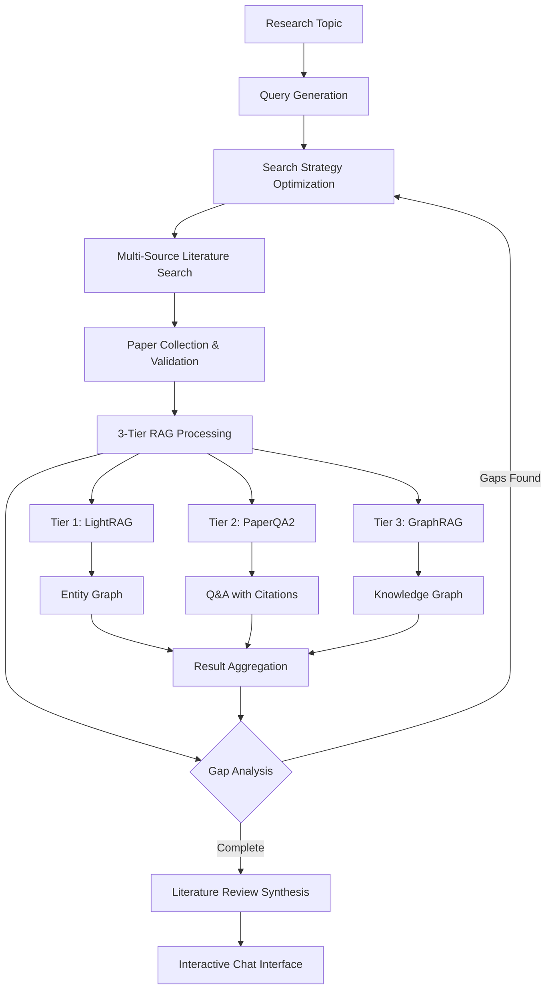
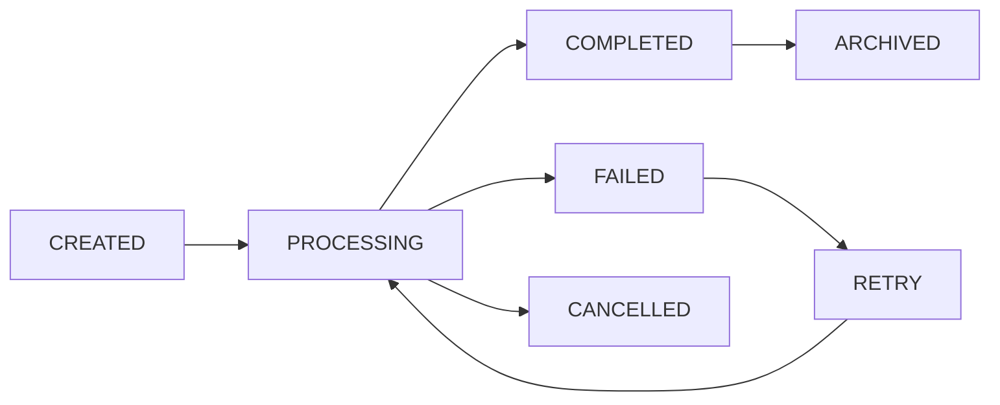

# Architecture Overview

This document provides a comprehensive overview of the Research Agent System's architecture, design patterns, and implementation details.

## Table of Contents

- [System Overview](#system-overview)
- [Core Architecture](#core-architecture)
- [Multi-Agent Orchestration](#multi-agent-orchestration)
- [3-Tier RAG Pipeline](#3-tier-rag-pipeline)
- [Data Flow](#data-flow)
- [Integration Layer](#integration-layer)
- [Session Management](#session-management)
- [Configuration System](#configuration-system)
- [Security & Performance](#security--performance)
- [Extensibility](#extensibility)

## System Overview

The Research Agent System is a sophisticated AI-powered research platform that combines multiple advanced technologies to automate comprehensive literature research. The system is built around a multi-agent architecture orchestrated by PromptChain, with a three-tier RAG (Retrieval-Augmented Generation) processing pipeline.

### Key Architectural Principles

1. **Modularity**: Each component is independently deployable and configurable
2. **Scalability**: Horizontal scaling through async processing and caching
3. **Flexibility**: Support for cloud APIs, local models, and hybrid deployments
4. **Extensibility**: Plugin architecture for new agents and RAG tiers
5. **Reliability**: Comprehensive error handling and graceful degradation
6. **Performance**: Multi-tier caching and optimized processing pipelines

### Technology Stack

| Layer | Technologies |
|-------|-------------|
| **Orchestration** | PromptChain, AsyncIO, Python 3.11+ |
| **AI/ML Models** | OpenAI GPT-4, Anthropic Claude, Local Ollama Models |
| **RAG Systems** | LightRAG, PaperQA2, GraphRAG |
| **Data Sources** | Sci-Hub MCP, ArXiv API, PubMed/NCBI |
| **Web Framework** | FastAPI, Chainlit, Rich (CLI) |
| **Database** | SQLite (sessions), Vector DBs (embeddings) |
| **Caching** | Redis (optional), Memory, Disk |
| **Integration** | Model Context Protocol (MCP) |

## Core Architecture

The system follows a layered architecture with clear separation of concerns:

```
┌─────────────────────────────────────────────────────────────────┐
│                        User Interface Layer                     │
├─────────────────────────────────────────────────────────────────┤
│  CLI (Typer/Rich)  │  Web UI (FastAPI)  │  Chat (Chainlit)    │
└─────────────────────┴─────────────────────┴─────────────────────┘
┌─────────────────────────────────────────────────────────────────┐
│                      Orchestration Layer                        │
├─────────────────────────────────────────────────────────────────┤
│           AdvancedResearchOrchestrator (PromptChain)            │
└─────────────────────────────────────────────────────────────────┘
┌─────────────────────────────────────────────────────────────────┐
│                        Agent Layer                              │
├─────────────┬─────────────┬─────────────┬─────────────┬─────────┤
│Query        │Search       │Literature   │ReAct        │Synthesis│
│Generator    │Strategist   │Searcher     │Analyzer     │Agent    │
└─────────────┴─────────────┴─────────────┴─────────────┴─────────┘
┌─────────────────────────────────────────────────────────────────┐
│                      Processing Layer                           │
├─────────────────┬─────────────────┬─────────────────────────────┤
│Tier 1: LightRAG │Tier 2: PaperQA2 │Tier 3: GraphRAG           │
│(Entity Extract) │(Research Q&A)   │(Knowledge Reasoning)      │
└─────────────────┴─────────────────┴─────────────────────────────┘
┌─────────────────────────────────────────────────────────────────┐
│                      Integration Layer                          │
├─────────────┬─────────────┬─────────────┬─────────────┬─────────┤
│Sci-Hub MCP  │ArXiv API    │PubMed API   │OpenAlex API │Local FS │
└─────────────┴─────────────┴─────────────┴─────────────┴─────────┘
┌─────────────────────────────────────────────────────────────────┐
│                        Data Layer                               │
├─────────────┬─────────────┬─────────────┬─────────────┬─────────┤
│Session DB   │Vector Store │Cache        │File Storage │Logs     │
│(SQLite)     │(Various)    │(Multi-tier) │(PDFs/Data)  │(JSONL)  │
└─────────────┴─────────────┴─────────────┴─────────────┴─────────┘
```

## Multi-Agent Orchestration

The system uses PromptChain's AgentChain for sophisticated multi-agent coordination. Each agent is specialized for specific research tasks and can operate independently or as part of a pipeline.

### Agent Architecture

```python
class BaseAgent:
    """Base class for all research agents"""
    def __init__(self, config: Dict[str, Any])
    def process(self, input_data: Any) -> Any
    async def process_async(self, input_data: Any) -> Any
    def get_tools(self) -> List[Dict[str, Any]]
    def register_tools(self, tools: List) -> None
```

### Agent Types and Responsibilities

#### 1. QueryGenerationAgent
- **Purpose**: Transforms research topics into targeted questions
- **Input**: Research topic (string)
- **Output**: Structured queries with priorities and categories
- **Processing**: Uses AgenticStepProcessor for multi-step reasoning
- **Tools**: Topic analysis, question generation, priority scoring

```python
# Example query generation output
{
    "primary_queries": [
        {
            "query": "What are the main approaches to machine learning interpretability?",
            "priority": 0.9,
            "category": "overview",
            "keywords": ["interpretability", "explainable AI"]
        }
    ],
    "secondary_queries": [...],
    "metadata": {...}
}
```

#### 2. SearchStrategistAgent
- **Purpose**: Optimizes search strategies across databases
- **Input**: Generated queries and previous findings
- **Output**: Optimized search terms and database priorities
- **Processing**: Analyzes query characteristics and database strengths
- **Tools**: Search optimization, keyword generation, database selection

#### 3. LiteratureSearchAgent
- **Purpose**: Coordinates multi-source paper retrieval
- **Input**: Search strategy and optimized queries
- **Output**: Retrieved papers with metadata
- **Processing**: Parallel search across multiple databases
- **Tools**: MCP integrations (Sci-Hub, ArXiv, PubMed), metadata validation

#### 4. ReActAnalysisAgent
- **Purpose**: Performs iterative gap analysis and refinement
- **Input**: Multi-tier RAG processing results
- **Output**: Gap analysis and new query recommendations
- **Processing**: ReAct-style reasoning with observation-action cycles
- **Tools**: Gap detection, coverage analysis, completeness assessment

#### 5. SynthesisAgent
- **Purpose**: Generates comprehensive literature reviews
- **Input**: All research findings and original topic
- **Output**: Structured literature review with statistics
- **Processing**: Multi-step synthesis with cross-reference analysis
- **Tools**: Literature synthesis, statistical analysis, citation analysis

### Agent Coordination Patterns

#### Pipeline Mode (Default)
```
Topic → Query Generation → Search Strategy → Literature Search → 
Multi-Tier RAG → Gap Analysis → [Iteration] → Synthesis → Review
```

#### Router Mode
```
User Input → Router Decision → Selected Agent → Processing → Response
```

#### Broadcast Mode (Future)
```
Query → [All Agents Parallel] → Result Aggregation → Synthesis
```

## 3-Tier RAG Pipeline

The system employs a sophisticated three-tier RAG architecture, where each tier specializes in different aspects of document understanding and reasoning.

### Tier 1: LightRAG - Entity Extraction

**Purpose**: Extract entities and relationships to build knowledge graphs

**Components**:
- Entity Extractor: Identifies key entities (people, organizations, concepts)
- Relationship Mapper: Maps relationships between entities
- Knowledge Graph Builder: Constructs searchable graph structures

**Processing Flow**:
```
Papers → Text Chunking → Entity Extraction → Relationship Mapping → 
Graph Construction → Entity Indexing → Retrieval Ready
```

**Configuration Options**:
- **Cloud Mode**: Uses GPT-4/Claude for high-accuracy extraction
- **Ollama Mode**: Uses local models (Mistral, Llama) for privacy
- **Hybrid Mode**: Not applicable (single-tier processing)

**Output**: Knowledge graph with entities and relationships

### Tier 2: PaperQA2 - Research Question Answering

**Purpose**: Answer specific research questions with detailed citations

**Components**:
- Document Indexer: Creates searchable paper index
- Evidence Retriever: Finds relevant paper sections
- Answer Generator: Synthesizes answers with citations
- Citation Manager: Maintains detailed source references

**Processing Flow**:
```
Papers → Document Parsing → Chunk Indexing → Question Processing → 
Evidence Retrieval → Answer Synthesis → Citation Generation
```

**Key Features**:
- Evidence-based answering with source citations
- Configurable evidence retrieval (top-k, similarity thresholds)
- Multi-document synthesis
- Automatic citation formatting

**Output**: Detailed answers with evidence and citations

### Tier 3: GraphRAG - Knowledge Graph Reasoning

**Purpose**: Perform advanced reasoning over interconnected concepts

**Components**:
- Graph Constructor: Builds comprehensive knowledge graphs
- Community Detection: Identifies related concept clusters
- Reasoning Engine: Performs multi-hop reasoning
- Query Processor: Handles complex graph queries

**Processing Flow**:
```
Papers → Graph Construction → Community Detection → Index Building → 
Query Processing → Multi-hop Reasoning → Response Synthesis
```

**Advanced Features**:
- Community-based reasoning
- Multi-hop relationship traversal
- Hierarchical concept organization
- Global and local reasoning modes

**Output**: Structured insights from graph-based reasoning

### Tier Coordination

The three tiers operate in coordination to provide comprehensive analysis:

```python
class MultiQueryCoordinator:
    """Coordinates processing across all three tiers"""
    
    async def coordinate_processing(self, papers: List[Paper], queries: List[Query]):
        # Parallel processing across tiers
        tier1_results = await self.process_lightrag(papers)
        tier2_results = await self.process_paperqa2(papers, queries)
        tier3_results = await self.process_graphrag(papers)
        
        # Aggregate and synthesize results
        return self.synthesize_multi_tier_results(
            tier1_results, tier2_results, tier3_results
        )
```

## Data Flow

The system's data flow follows a clear progression from input to output, with multiple feedback loops for iterative refinement.

### Primary Data Flow



### Data Types and Structures

#### Core Data Models

```python
@dataclass
class Paper:
    title: str
    authors: List[str]
    year: int
    venue: str
    doi: Optional[str]
    abstract: Optional[str]
    pdf_url: Optional[str]
    source: str
    metadata: Dict[str, Any]

@dataclass
class Query:
    query: str
    priority: float
    category: str
    keywords: List[str]
    status: str = "pending"
    results: Optional[Dict[str, Any]] = None

@dataclass
class ResearchSession:
    session_id: str
    topic: str
    status: SessionStatus
    created_at: datetime
    papers: List[Paper]
    queries: List[Query]
    literature_review: Optional[Dict[str, Any]]
    statistics: Dict[str, Any]
```

#### Processing Results

```python
@dataclass
class TierResult:
    tier_id: str
    processing_time: float
    papers_processed: int
    results: Dict[str, Any]
    metadata: Dict[str, Any]

@dataclass
class LiteratureReview:
    executive_summary: Dict[str, Any]
    sections: Dict[str, Dict[str, Any]]
    citations: Dict[str, Any]
    statistics: Dict[str, Any]
    metadata: Dict[str, Any]
```

### Data Storage Strategy

#### Session Persistence
- **Primary Storage**: SQLite database for session metadata
- **File Storage**: JSON files for complete session data
- **Cache Storage**: Multi-tier caching for performance

#### Paper Management
- **Metadata Storage**: SQLite with full-text search
- **PDF Storage**: Local filesystem with organized directory structure
- **Index Storage**: Vector databases for embedding-based search

#### Cache Architecture
```
┌─────────────────────────────────────────────────────────────────┐
│                        Memory Cache (L1)                        │
├─────────────────────────────────────────────────────────────────┤
│  • Session data        • Query results      • Paper metadata   │
│  • TTL: 1 hour         • Size: 500MB        • LRU eviction     │
└─────────────────────────────────────────────────────────────────┘
┌─────────────────────────────────────────────────────────────────┐
│                         Disk Cache (L2)                         │
├─────────────────────────────────────────────────────────────────┤
│  • Processed papers    • RAG results        • Embeddings       │
│  • TTL: 24 hours       • Size: 2GB          • Background cleanup│
└─────────────────────────────────────────────────────────────────┘
┌─────────────────────────────────────────────────────────────────┐
│                        Redis Cache (L3)                         │
├─────────────────────────────────────────────────────────────────┤
│  • Shared sessions     • Cross-instance     • Optional         │
│  • TTL: Configurable   • Size: Unlimited    • Production use   │
└─────────────────────────────────────────────────────────────────┘
```

## Integration Layer

The integration layer manages connections to external services and APIs through a unified interface.

### Model Context Protocol (MCP) Integration

MCP provides a standardized way to integrate external tools and services:

```python
class MCPIntegration:
    """Manages MCP server connections and tool access"""
    
    def __init__(self, mcp_config: Dict[str, Any]):
        self.servers = {}
        self.tools = {}
        self.initialize_servers(mcp_config)
    
    async def initialize_servers(self, config):
        """Initialize all configured MCP servers"""
        for server_id, server_config in config.items():
            server = await self.create_mcp_server(server_config)
            self.servers[server_id] = server
            self.tools.update(await server.get_tools())
    
    async def call_tool(self, tool_name: str, parameters: Dict):
        """Call an MCP tool with automatic server routing"""
        return await self.tools[tool_name].call(parameters)
```

### External Service Integrations

#### Sci-Hub Integration
- **Method**: MCP Server (stdio)
- **Features**: Direct paper retrieval, PDF download, metadata extraction
- **Rate Limiting**: Configurable requests per minute
- **Caching**: Local PDF storage with deduplication

#### ArXiv Integration
- **Method**: Direct API calls
- **Features**: Category-based search, metadata retrieval, PDF access
- **Rate Limiting**: 30 requests per minute (API limit)
- **Categories**: Configurable subject categories

#### PubMed Integration
- **Method**: NCBI E-utilities API
- **Features**: Biomedical literature search, MeSH term support
- **Authentication**: Email-based identification required
- **Rate Limiting**: 10 requests per second with API key

### API Abstraction Layer

```python
class LiteratureSearchAPI:
    """Unified interface for all literature search services"""
    
    def __init__(self, config: Dict[str, Any]):
        self.sci_hub = SciHubClient(config.get('sci_hub', {}))
        self.arxiv = ArXivClient(config.get('arxiv', {}))
        self.pubmed = PubMedClient(config.get('pubmed', {}))
    
    async def search_papers(self, query: str, sources: List[str] = None) -> List[Paper]:
        """Search across all configured sources"""
        tasks = []
        
        if 'sci_hub' in sources:
            tasks.append(self.sci_hub.search(query))
        if 'arxiv' in sources:
            tasks.append(self.arxiv.search(query))
        if 'pubmed' in sources:
            tasks.append(self.pubmed.search(query))
        
        results = await asyncio.gather(*tasks, return_exceptions=True)
        return self.merge_results(results)
```

## Session Management

The session management system handles the complete lifecycle of research sessions, from creation to persistence and retrieval.

### Session States

```python
class SessionStatus(Enum):
    CREATED = "created"          # Session initialized
    PROCESSING = "processing"    # Research in progress
    COMPLETED = "completed"      # Research finished successfully
    FAILED = "failed"           # Research failed with errors
    CANCELLED = "cancelled"     # User cancelled research
```

### Session Lifecycle



### Persistence Strategy

#### Session Data Structure
```python
class ResearchSession:
    # Core identification
    session_id: str = field(default_factory=lambda: str(uuid.uuid4()))
    topic: str
    created_at: datetime = field(default_factory=datetime.utcnow)
    updated_at: datetime = field(default_factory=datetime.utcnow)
    
    # State management
    status: SessionStatus = SessionStatus.CREATED
    current_iteration: int = 0
    max_iterations: int = 5
    
    # Research data
    queries: List[Query] = field(default_factory=list)
    completed_queries: List[Query] = field(default_factory=list)
    papers: List[Paper] = field(default_factory=list)
    
    # Processing results
    tier_results: Dict[str, TierResult] = field(default_factory=dict)
    literature_review: Optional[Dict[str, Any]] = None
    
    # Metadata and statistics
    statistics: Dict[str, Any] = field(default_factory=dict)
    configuration: Dict[str, Any] = field(default_factory=dict)
```

#### Storage Implementation
```python
class SessionManager:
    """Manages session persistence and retrieval"""
    
    def __init__(self, config: Dict[str, Any]):
        self.db_path = config.get('database', {}).get('path', './research_cache.db')
        self.file_storage = config.get('file_storage', './data/sessions')
        self.cache = CacheManager(config.get('caching', {}))
    
    async def save_session(self, session: ResearchSession) -> str:
        """Save session to database and file system"""
        # Update timestamps
        session.updated_at = datetime.utcnow()
        
        # Save to database (metadata only)
        await self.save_to_database(session)
        
        # Save to file system (complete data)
        file_path = await self.save_to_file(session)
        
        # Update cache
        await self.cache.set(f"session:{session.session_id}", session)
        
        return file_path
    
    async def load_session(self, session_id: str) -> ResearchSession:
        """Load session from cache, database, or file system"""
        # Try cache first
        session = await self.cache.get(f"session:{session_id}")
        if session:
            return session
        
        # Load from file system
        session = await self.load_from_file(session_id)
        if session:
            # Update cache
            await self.cache.set(f"session:{session.session_id}", session)
            return session
        
        raise SessionNotFoundError(f"Session {session_id} not found")
```

## Configuration System

The configuration system provides flexible, hierarchical configuration management with environment variable support.

### Configuration Architecture

```python
class ResearchConfig:
    """Main configuration class with validation and type checking"""
    
    def __init__(self):
        self.system = SystemConfig()
        self.literature_search = LiteratureSearchConfig()
        self.three_tier_rag = ThreeTierRAGConfig()
        self.promptchain = PromptChainConfig()
        self.research_session = ResearchSessionConfig()
        # ... other config sections
    
    @classmethod
    def from_yaml(cls, file_path: str) -> 'ResearchConfig':
        """Load configuration from YAML file"""
        with open(file_path, 'r') as f:
            config_data = yaml.safe_load(f)
        return cls.from_dict(config_data)
    
    @classmethod
    def from_dict(cls, config_dict: Dict[str, Any]) -> 'ResearchConfig':
        """Create configuration from dictionary with validation"""
        config = cls()
        config.update_from_dict(config_dict)
        config.validate()
        return config
    
    def validate(self):
        """Validate configuration consistency and requirements"""
        # Check required API keys based on selected modes
        if self.three_tier_rag.tier1_lightrag.mode == 'cloud':
            self._validate_cloud_api_keys()
        
        # Validate processing limits
        self._validate_processing_limits()
        
        # Check file system permissions
        self._validate_file_permissions()
```

### Configuration Validation

```python
class ConfigValidator:
    """Validates configuration consistency and requirements"""
    
    def validate_api_requirements(self, config: ResearchConfig):
        """Validate API key requirements based on configuration"""
        required_keys = set()
        
        # Check each tier's requirements
        for tier in [config.three_tier_rag.tier1_lightrag, 
                     config.three_tier_rag.tier2_paperqa2,
                     config.three_tier_rag.tier3_graphrag]:
            if tier.mode == 'cloud':
                required_keys.update(self.get_cloud_api_keys(tier))
        
        # Check agent requirements
        for agent_config in config.promptchain.agents.values():
            model = agent_config.get('model', '')
            if model.startswith('openai/'):
                required_keys.add('OPENAI_API_KEY')
            elif model.startswith('anthropic/'):
                required_keys.add('ANTHROPIC_API_KEY')
        
        # Validate presence
        missing_keys = []
        for key in required_keys:
            if not os.getenv(key):
                missing_keys.append(key)
        
        if missing_keys:
            raise ConfigurationError(f"Missing required API keys: {missing_keys}")
```

## Security & Performance

### Security Measures

#### API Key Management
- Environment variable isolation
- No hardcoded credentials
- Optional encryption for cached data
- Secure header handling for web interfaces

#### Input Validation
- Query sanitization to prevent injection attacks
- File path validation for security
- Size limits for uploads and inputs
- Content type verification

#### Data Privacy
- Optional data anonymization
- Local processing options (Ollama mode)
- Configurable data retention policies
- Secure file handling

### Performance Optimizations

#### Async Processing
```python
class AsyncResearchProcessor:
    """Asynchronous processing for improved performance"""
    
    async def process_papers_parallel(self, papers: List[Paper]) -> Dict[str, Any]:
        """Process multiple papers in parallel across tiers"""
        semaphore = asyncio.Semaphore(self.config.performance.max_concurrent_requests)
        
        async def process_single_paper(paper: Paper):
            async with semaphore:
                return await self.process_paper_all_tiers(paper)
        
        tasks = [process_single_paper(paper) for paper in papers]
        results = await asyncio.gather(*tasks, return_exceptions=True)
        
        return self.aggregate_results(results)
```

#### Caching Strategy
- Multi-tier caching (memory, disk, Redis)
- Intelligent cache invalidation
- Compressed storage for large results
- Background cache warming

#### Resource Management
- Memory usage monitoring
- Garbage collection optimization
- Connection pooling for APIs
- Batch processing for large datasets

## Extensibility

The system is designed for easy extension and customization.

### Adding New Agents

```python
from research_agent.agents.base import BaseAgent
from promptchain import PromptChain

class CustomAnalysisAgent(BaseAgent):
    """Example custom agent for domain-specific analysis"""
    
    def __init__(self, config: Dict[str, Any]):
        super().__init__(config)
        self.chain = PromptChain(
            models=[config.get('model', 'openai/gpt-4o')],
            instructions=[
                "Analyze papers for specific domain: {domain}",
                "Focus on methodological innovations and gaps"
            ]
        )
        self._register_custom_tools()
    
    def _register_custom_tools(self):
        """Register domain-specific tools"""
        self.chain.register_tool_function(self.domain_analysis)
        self.chain.register_tool_function(self.innovation_detection)
    
    async def process(self, papers: List[Paper], domain: str) -> Dict[str, Any]:
        """Process papers for domain-specific analysis"""
        paper_texts = [p.abstract for p in papers if p.abstract]
        
        result = await self.chain.process_prompt_async(
            "\n\n".join(paper_texts),
            variables={"domain": domain}
        )
        
        return {
            "analysis": result,
            "domain": domain,
            "papers_analyzed": len(papers),
            "processing_time": time.time() - start_time
        }
```

### Adding New RAG Tiers

```python
class CustomRAGTier:
    """Example implementation of a custom RAG tier"""
    
    def __init__(self, config: Dict[str, Any]):
        self.config = config
        self.initialize_components()
    
    def initialize_components(self):
        """Initialize tier-specific components"""
        self.document_processor = CustomDocumentProcessor()
        self.indexer = CustomIndexer()
        self.retriever = CustomRetriever()
        self.generator = CustomGenerator()
    
    async def process_papers(self, papers: List[Paper], queries: List[Query]) -> Dict[str, Any]:
        """Process papers through custom RAG tier"""
        # Document processing
        processed_docs = await self.document_processor.process(papers)
        
        # Indexing
        await self.indexer.index_documents(processed_docs)
        
        # Query processing
        results = []
        for query in queries:
            retrieved_docs = await self.retriever.retrieve(query)
            response = await self.generator.generate(query, retrieved_docs)
            results.append(response)
        
        return {
            "tier_id": "custom_tier",
            "results": results,
            "metadata": self.get_processing_metadata()
        }
```

### Configuration Extensions

```python
@dataclass
class CustomTierConfig:
    """Configuration for custom RAG tier"""
    enabled: bool = True
    mode: str = "cloud"
    model_name: str = "openai/gpt-4o"
    processing_batch_size: int = 10
    custom_parameters: Dict[str, Any] = field(default_factory=dict)

# Extend main configuration
class ExtendedResearchConfig(ResearchConfig):
    def __init__(self):
        super().__init__()
        self.custom_tier = CustomTierConfig()
```

### Plugin Architecture

```python
class PluginManager:
    """Manages system plugins and extensions"""
    
    def __init__(self):
        self.plugins = {}
        self.hooks = defaultdict(list)
    
    def register_plugin(self, plugin_name: str, plugin_class: type):
        """Register a new plugin"""
        plugin = plugin_class()
        self.plugins[plugin_name] = plugin
        
        # Register plugin hooks
        for hook_name in plugin.get_hooks():
            self.hooks[hook_name].append(plugin)
    
    async def execute_hook(self, hook_name: str, *args, **kwargs):
        """Execute all plugins registered for a hook"""
        results = []
        for plugin in self.hooks[hook_name]:
            try:
                result = await plugin.execute_hook(hook_name, *args, **kwargs)
                results.append(result)
            except Exception as e:
                logger.error(f"Plugin {plugin} failed on hook {hook_name}: {e}")
        
        return results
```

This architecture documentation provides a comprehensive overview of the Research Agent System's design and implementation. The modular, extensible architecture enables easy customization and scaling while maintaining reliability and performance.