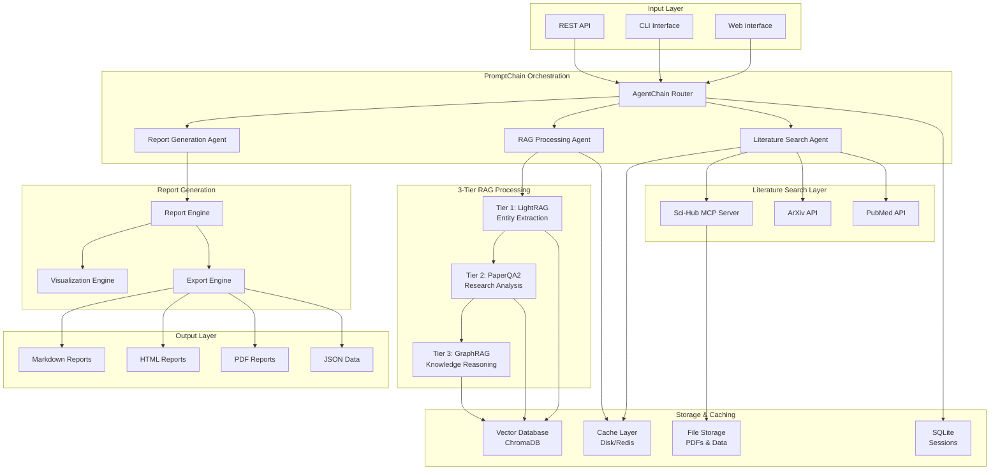

# Research Agent System Architecture

## Overview

The Research Agent System is a comprehensive platform that combines literature search, 3-tier RAG processing, and research report generation using PromptChain orchestration. The system focuses on three primary literature sources: **Sci-Hub MCP**, **ArXiv**, and **PubMed**.

## High-Level Architecture



## Core Components

### 1. PromptChain Orchestration Layer

**AgentChain Router**: The central orchestrator that manages the research workflow using PromptChain's multi-agent system.

```python
# Agent Configuration
agents = {
    "literature_search_agent": {
        "description": "Searches papers from Sci-Hub MCP, ArXiv, and PubMed",
        "model": "openai/gpt-4",
        "tools": ["scihub_mcp", "arxiv_search", "pubmed_search"]
    },
    "rag_processing_agent": {
        "description": "Processes papers through 3-tier RAG pipeline",
        "model": "openai/gpt-4", 
        "tools": ["lightrag", "paperqa2", "graphrag"]
    },
    "report_generation_agent": {
        "description": "Generates comprehensive research reports",
        "model": "openai/gpt-4",
        "tools": ["visualization", "statistics", "export"]
    }
}
```

### 2. Literature Search Integration

#### Sci-Hub MCP Server
- **Purpose**: Primary paper retrieval and PDF download
- **Tools Available**:
  - `search_scihub_by_doi`: Direct DOI-based retrieval
  - `search_scihub_by_title`: Title-based search
  - `search_scihub_by_keyword`: Keyword/topic search
  - `download_scihub_pdf`: PDF download and storage
  - `get_paper_metadata`: Metadata extraction

#### ArXiv Integration
- **Purpose**: Preprint and latest research discovery
- **Features**:
  - Category-based search (cs.AI, cs.LG, cs.CL, etc.)
  - Advanced query syntax
  - Metadata extraction
  - Abstract processing

#### PubMed Integration
- **Purpose**: Biomedical and life sciences literature
- **Features**:
  - NCBI Entrez API integration
  - Medical subject headings (MeSH)
  - Citation network analysis
  - Abstract and metadata extraction

### 3. Three-Tier RAG System

#### Tier 1: LightRAG (Entity & Relationship Extraction)
```yaml
tier1_lightrag:
  purpose: "Extract entities and build knowledge graph"
  models:
    ollama: "mistral-nemo:latest"
    embedding: "bge-m3:latest"
  features:
    - Entity extraction from research papers
    - Relationship mapping between concepts
    - Knowledge graph construction
    - Dual-level retrieval system
```

#### Tier 2: PaperQA2 (Research Analysis & QA)
```yaml
tier2_paperqa:
  purpose: "Deep research analysis and question answering"
  models:
    ollama: "llama3.2"
    embedding: "mxbai-embed-large"
  features:
    - Literature-grounded question answering
    - Contradiction detection
    - Citation network traversal
    - Research gap identification
```

#### Tier 3: GraphRAG (Knowledge Graph Reasoning)
```yaml
tier3_graphrag:
  purpose: "Multi-hop reasoning and complex analysis"
  models:
    extraction: "llama3.2"
    query: "mistral"
  features:
    - Knowledge graph reasoning
    - Multi-hop question answering
    - Community detection
    - Global and local search patterns
```

## Data Flow Architecture

### Research Pipeline Flow

1. **Query Input** → User submits research question via web/CLI/API
2. **Agent Routing** → AgentChain selects appropriate agent based on query type
3. **Literature Search** → Search across Sci-Hub MCP, ArXiv, and PubMed
4. **Paper Retrieval** → Download PDFs and extract metadata
5. **3-Tier Processing**:
   - **Tier 1**: Extract entities and relationships
   - **Tier 2**: Perform research analysis and QA
   - **Tier 3**: Execute knowledge graph reasoning
6. **Result Synthesis** → Combine insights from all tiers
7. **Report Generation** → Create comprehensive report with visualizations
8. **Output Delivery** → Export in multiple formats (MD, HTML, PDF, JSON)

### PromptChain Integration Pattern

```python
class ResearchWorkflow:
    def __init__(self):
        # Literature Search Chain
        self.search_chain = PromptChain(
            models=["openai/gpt-4"],
            instructions=[
                "Extract search terms from query: {input}",
                self.literature_search_step,
                "Rank and filter papers by relevance: {input}"
            ],
            tools=[
                "scihub_search_by_keyword",
                "arxiv_search", 
                "pubmed_search"
            ]
        )
        
        # RAG Processing Chain
        self.rag_chain = PromptChain(
            models=["openai/gpt-4"],
            instructions=[
                "Prepare papers for processing: {input}",
                self.tier1_processing,  # LightRAG
                self.tier2_processing,  # PaperQA2
                self.tier3_processing,  # GraphRAG
                "Synthesize results: {input}"
            ]
        )
        
        # Report Generation Chain
        self.report_chain = PromptChain(
            models=["openai/gpt-4"],
            instructions=[
                "Analyze processed results: {input}",
                "Generate statistics and insights: {input}",
                "Create visualizations: {input}",
                "Format final report: {input}"
            ]
        )
```

## Configuration Management

### YAML-Based Configuration
The system uses a comprehensive YAML configuration file (`config/research_config.yaml`) that controls:

- **Literature search parameters** (sources, rate limits, result counts)
- **3-tier RAG settings** (models, processing parameters, deployment modes)
- **PromptChain agent configuration** (routing, instructions, tools)
- **Storage and caching settings** (databases, file paths, TTL)
- **Report generation options** (formats, sections, visualizations)
- **Web interface settings** (ports, authentication, UI options)

### Deployment Modes
- **Cloud Mode**: Uses OpenAI/Anthropic APIs for maximum performance
- **Ollama Mode**: Local model deployment for privacy and cost savings
- **Hybrid Mode**: Mix of cloud and local models for balanced approach

## Storage Architecture

### Vector Database (ChromaDB)
- **Purpose**: Store paper embeddings and enable semantic search
- **Collections**: Separate collections for different paper types
- **Persistence**: Local file-based storage with optional cloud sync

### Caching Layer
- **Disk Cache**: For paper metadata and search results
- **Redis Cache**: For high-performance distributed caching (optional)
- **Memory Cache**: For frequently accessed data during processing

### File Storage
- **PDF Storage**: Downloaded papers organized by source and date
- **Data Storage**: Processed results, knowledge graphs, statistics
- **Output Storage**: Generated reports and visualizations

### Session Management (SQLite)
- **Sessions Table**: Research session metadata and configuration
- **Messages Table**: Conversation history and intermediate results
- **Analytics Table**: Usage statistics and performance metrics

## MCP Integration Architecture

### Context7 MCP Server
- **Purpose**: Access library documentation for RAG frameworks
- **Usage**: Get up-to-date docs for LightRAG, PaperQA2, GraphRAG
- **Integration**: Automatic documentation retrieval during setup

### Gemini MCP Server
- **Purpose**: Pair programming and code review assistance
- **Usage**: Code generation, debugging, optimization suggestions
- **Integration**: Real-time development support during implementation

### Git MCP Server  
- **Purpose**: Version control and milestone tracking
- **Usage**: Automatic commits, semantic versioning, progress tracking
- **Integration**: Git-based development workflow management

## Security & Privacy Architecture

### Data Privacy
- **Local Processing**: All sensitive research data processed locally
- **No Cloud Upload**: Papers and analysis results never leave local environment
- **Encrypted Storage**: Optional encryption for cached data and PDFs

### API Security
- **Rate Limiting**: Respect academic API limits and terms of service
- **Authentication**: Secure API key management for external services
- **Access Control**: Role-based access for multi-user deployments

## Performance & Scalability

### Optimization Strategies
- **Async Processing**: Non-blocking operations throughout the pipeline
- **Batch Processing**: Efficient handling of multiple papers
- **Intelligent Caching**: Minimize redundant API calls and processing
- **Memory Management**: Efficient resource usage for large datasets

### Scalability Patterns
- **Horizontal Scaling**: Multiple worker processes for parallel processing
- **Load Balancing**: Distribution of research tasks across resources  
- **Microservice Architecture**: Modular components for independent scaling

## Monitoring & Observability

### Logging Architecture
- **Structured Logging**: JSON-formatted logs for analysis
- **Multi-level Logging**: Different verbosity levels for development vs production
- **Performance Metrics**: Execution time, memory usage, token consumption

### Health Monitoring
- **Service Health**: Monitor all external APIs and MCP servers
- **Resource Usage**: Track CPU, memory, and storage consumption
- **Error Tracking**: Comprehensive error logging and alerting

## Development & Testing Architecture

### Testing Strategy
- **Unit Tests**: Individual component testing
- **Integration Tests**: End-to-end workflow testing  
- **Performance Tests**: Load testing and benchmarking
- **Mock Testing**: Testing without external API dependencies

### Development Workflow
- **Test-Driven Development**: Write tests before implementation
- **Code Review**: Automated code review using MCP agents
- **Continuous Integration**: Automated testing and quality checks
- **Documentation**: Auto-generated API docs and user guides

This architecture provides a robust, scalable, and maintainable foundation for advanced research agent capabilities while leveraging the full power of PromptChain orchestration.