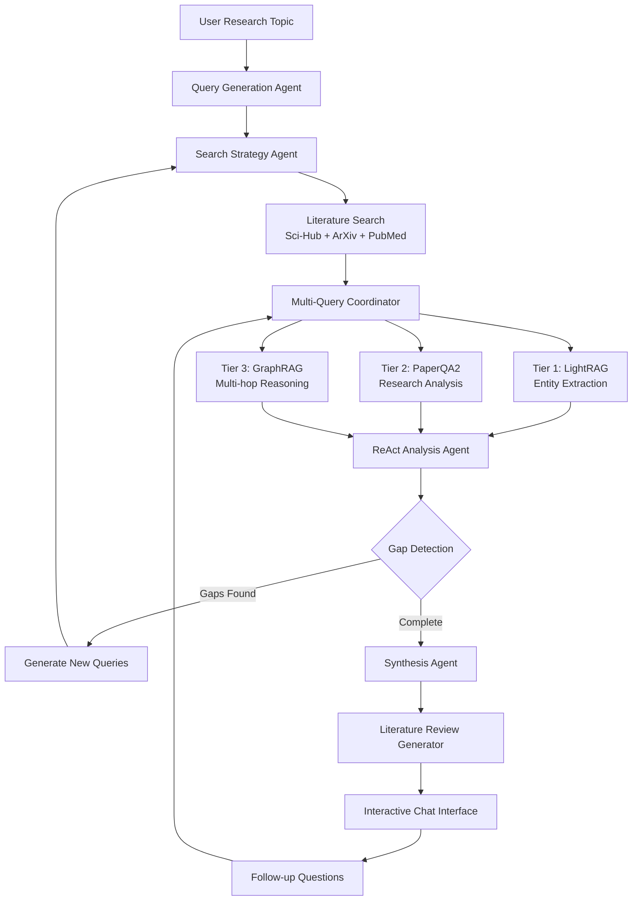

# Research Agent System - Advanced Architecture

## Overview

This is an **advanced iterative research agent system** that uses PromptChain to orchestrate a sophisticated multi-query, multi-tier RAG workflow. The system breaks research topics into multiple targeted questions, processes papers iteratively using ReAct-style reasoning, and synthesizes comprehensive literature reviews with ongoing chat capabilities.

## Core Philosophy

**NOT** a simple "user question → single answer" system. Instead:

1. **Research Topic Decomposition**: Break complex topics into multiple specific research questions
2. **Iterative Multi-Query Processing**: Each tier processes papers with multiple targeted queries
3. **ReAct-Style Gap Detection**: Analyze results → identify gaps → generate new queries → iterate
4. **Comprehensive Synthesis**: Compile findings into literature review documents
5. **Interactive Chat Interface**: Enable follow-up questions and document updates

## System Architecture



## Advanced PromptChain Orchestration

### 1. Query Generation Agent
**Purpose**: Transform research topics into multiple specific, targeted questions

```python
class QueryGenerationAgent(PromptChain):
    def __init__(self):
        super().__init__(
            models=["openai/gpt-4o"],
            instructions=[
                "Analyze research topic: {topic}",
                AgenticStepProcessor(
                    objective="Generate 8-12 specific research questions covering different aspects",
                    max_internal_steps=5
                ),
                "Format as structured query list with priority scores"
            ]
        )
```

**Example Output**:
```json
{
  "primary_queries": [
    {"query": "What ML techniques are currently used in drug discovery?", "priority": 1.0},
    {"query": "What are the main limitations of existing approaches?", "priority": 0.9},
    {"query": "Which datasets are commonly used for training?", "priority": 0.8}
  ],
  "secondary_queries": [
    {"query": "What regulatory challenges exist for ML-based drug discovery?", "priority": 0.7},
    {"query": "How do pharmaceutical companies implement these systems?", "priority": 0.6}
  ]
}
```

### 2. Search Strategy Agent
**Purpose**: Determine optimal search strategies and paper selection based on current findings

```python
class SearchStrategyAgent(PromptChain):
    def __init__(self):
        super().__init__(
            models=["openai/gpt-4o-mini"],
            instructions=[
                "Current queries: {queries}",
                "Previous findings: {findings}",
                AgenticStepProcessor(
                    objective="Determine optimal search strategy and keywords",
                    max_internal_steps=3
                ),
                "Generate search terms for Sci-Hub, ArXiv, and PubMed"
            ]
        )
```

### 3. Multi-Query Coordinator
**Purpose**: Send different queries to each tier and coordinate parallel processing

```python
class MultiQueryCoordinator:
    async def process_papers_with_queries(self, papers: List[Paper], queries: List[Query]):
        results = {}
        
        for query in queries:
            # Each tier processes ALL papers with THIS specific query
            tier1_result = await self.lightrag.process_with_query(papers, query)
            tier2_result = await self.paperqa2.process_with_query(papers, query) 
            tier3_result = await self.graphrag.process_with_query(papers, query)
            
            results[query.id] = {
                "entities": tier1_result,
                "analysis": tier2_result,
                "reasoning": tier3_result
            }
            
        return results
```

### 4. ReAct Analysis Agent
**Purpose**: Analyze results from all tiers, detect gaps, and generate follow-up queries

```python
class ReActAnalysisAgent(PromptChain):
    def __init__(self):
        super().__init__(
            models=["anthropic/claude-3-5-sonnet-20240620"],
            instructions=[
                "Analyze multi-tier results: {results}",
                AgenticStepProcessor(
                    objective="Identify research gaps and determine if more queries needed",
                    max_internal_steps=7
                ),
                "Generate new queries or mark as complete"
            ],
            tools=[
                "gap_detection",
                "query_generation", 
                "completeness_assessment"
            ]
        )
```

**ReAct Loop Example**:
```
Thought: I've analyzed 15 papers on ML in drug discovery. I found good coverage of techniques and datasets, but limited information on regulatory challenges.

Action: gap_detection("regulatory challenges", current_findings)

Observation: Only 2 papers mention FDA approval processes. This is a significant gap.

Thought: I need to search for papers specifically about regulatory aspects of ML in pharmaceutical development.

Action: query_generation("regulatory challenges ML pharmaceutical FDA approval")

Result: Generated new query: "What are the regulatory requirements and challenges for ML-based drug discovery systems seeking FDA approval?"
```

### 5. Synthesis Agent
**Purpose**: Compile all findings into comprehensive literature review

```python
class SynthesisAgent(PromptChain):
    def __init__(self):
        super().__init__(
            models=["openai/gpt-4o"],
            instructions=[
                "All research findings: {findings}",
                "Original research topic: {topic}",
                AgenticStepProcessor(
                    objective="Synthesize comprehensive literature review with sections, statistics, and analysis",
                    max_internal_steps=10
                ),
                "Generate structured literature review document"
            ],
            store_steps=True
        )
```

## 3-Tier RAG Processing (Multi-Query)

### Enhanced Processing Flow

Each tier now processes papers with **multiple specific queries**:

```python
class EnhancedTier1LightRAG:
    async def process_with_query(self, papers: List[Paper], query: Query):
        # Add papers to LightRAG
        for paper in papers:
            await self.lightrag.aadd(paper.pdf_path)
        
        # Query with specific research question
        result = await self.lightrag.aquery(
            query.text,
            param=QueryParam(mode="hybrid")
        )
        
        # Extract entities and relationships relevant to this query
        return {
            "entities": result.entities,
            "relationships": result.relationships,
            "query_specific_insights": result.insights
        }

class EnhancedTier2PaperQA2:
    async def process_with_query(self, papers: List[Paper], query: Query):
        # Add papers to PaperQA2
        docs = Docs()
        for paper in papers:
            await docs.aadd(paper.pdf_path)
        
        # Query with specific research question
        session = await docs.aquery(query.text)
        
        return {
            "answer": session.answer,
            "citations": session.contexts,
            "sources": session.references,
            "query_analysis": session.formatted_answer
        }

class EnhancedTier3GraphRAG:
    async def process_with_query(self, structured_data: Dict, query: Query):
        # Use outputs from Tier 1 & 2 as structured input
        processed_data = self.prepare_graphrag_input(structured_data)
        
        # Multi-hop reasoning for specific query
        result = await self.graphrag.query(query.text)
        
        return {
            "multi_hop_answer": result.answer,
            "reasoning_path": result.reasoning_chain,
            "knowledge_graph_insights": result.graph_analysis
        }
```

## Advanced AgentChain Configuration

### Sequential Agentic Chains

```yaml
promptchain:
  agent_chain:
    execution_mode: "pipeline"  # Sequential execution for research workflow
    agents:
      - name: "query_generator"
        type: "agentic"
        max_internal_steps: 5
        
      - name: "search_strategist" 
        type: "agentic"
        max_internal_steps: 3
        
      - name: "literature_searcher"
        type: "function_calling"
        tools: ["sci_hub_search", "arxiv_search", "pubmed_search"]
        
      - name: "multi_query_coordinator"
        type: "orchestrator"
        
      - name: "react_analyzer"
        type: "agentic" 
        max_internal_steps: 7
        
      - name: "synthesis_agent"
        type: "agentic"
        max_internal_steps: 10
        
      - name: "chat_interface"
        type: "interactive"
```

### Router Configuration for Chat Mode

```yaml
router:
  model: "openai/gpt-4o-mini"
  decision_templates:
    research_mode_dispatch: |
      User input: {user_input}
      Current research status: {research_status}
      Available actions:
      1. Start new research topic
      2. Ask follow-up question about existing research
      3. Request specific analysis
      4. Generate additional queries
      5. Export/update literature review
      
      Choose action and agent: {"action": "action_name", "agent": "agent_name"}
```

## Iterative Research Workflow

### Complete Research Session

```python
class AdvancedResearchOrchestrator:
    async def conduct_research_session(self, research_topic: str):
        session = ResearchSession(topic=research_topic)
        
        # Phase 1: Query Generation
        queries = await self.query_generator.generate_queries(research_topic)
        session.add_queries(queries)
        
        # Phase 2: Initial Literature Search
        papers = await self.search_strategist.find_papers(queries)
        session.add_papers(papers)
        
        # Phase 3: Multi-Query Processing Loop
        iteration = 1
        while not session.is_complete() and iteration <= 5:
            print(f"Research Iteration {iteration}")
            
            # Process papers with current queries across all tiers
            results = await self.multi_query_coordinator.process_papers_with_queries(
                session.papers, session.active_queries
            )
            session.add_results(results)
            
            # ReAct Analysis - detect gaps and generate new queries
            analysis = await self.react_analyzer.analyze_results(results)
            
            if analysis.gaps_found:
                new_queries = analysis.new_queries
                session.add_queries(new_queries)
                
                # Search for more papers if needed
                additional_papers = await self.search_strategist.find_papers(new_queries)
                session.add_papers(additional_papers)
                
            iteration += 1
        
        # Phase 4: Synthesis
        literature_review = await self.synthesis_agent.synthesize_findings(session)
        session.literature_review = literature_review
        
        # Phase 5: Interactive Chat
        chat_interface = InteractiveChatInterface(session)
        return chat_interface
```

### Interactive Chat Capabilities

```python
class InteractiveChatInterface:
    async def handle_user_input(self, user_input: str):
        intent = await self.classify_intent(user_input)
        
        if intent == "follow_up_question":
            # Process through existing papers with new question
            answer = await self.process_follow_up(user_input)
            
        elif intent == "request_addendum":
            # Add section to existing literature review
            addendum = await self.generate_addendum(user_input)
            self.session.literature_review.add_section(addendum)
            
        elif intent == "new_search":
            # Expand search with new papers
            new_papers = await self.expand_search(user_input)
            results = await self.process_new_papers(new_papers, user_input)
            
        elif intent == "export_request":
            # Export in requested format
            document = await self.export_literature_review(user_input)
            
        return response
```

## Literature Review Output Structure

### Comprehensive Document Generation

```python
class LiteratureReviewDocument:
    sections = [
        "executive_summary",
        "research_methodology", 
        "key_findings_by_query",
        "cross_cutting_themes",
        "research_gaps_identified", 
        "statistical_analysis",
        "citation_network_analysis",
        "temporal_trends",
        "recommendations_for_future_research",
        "comprehensive_bibliography",
        "appendix_detailed_query_results"
    ]
    
    visualizations = [
        "citation_network_graph",
        "temporal_publication_trends", 
        "keyword_frequency_clouds",
        "author_collaboration_networks",
        "research_gap_heatmap"
    ]
```

## Key Differentiators

### 1. Multi-Query Intelligence
- **Not single question**: Breaks topics into 8-12 specific queries
- **Targeted processing**: Each tier answers specific questions
- **Comprehensive coverage**: Ensures all aspects are explored

### 2. ReAct-Style Iteration  
- **Gap detection**: Identifies missing information
- **Dynamic query generation**: Creates new questions based on findings
- **Adaptive search**: Finds additional papers as needed

### 3. Advanced Synthesis
- **Cross-query analysis**: Finds themes across different questions
- **Statistical insights**: Citation analysis, temporal trends
- **Interactive updates**: Chat interface for ongoing refinement

### 4. PromptChain Orchestration
- **Sequential agentic chains**: Complex multi-step reasoning
- **Tool integration**: MCP servers for external capabilities
- **State management**: Persistent research sessions

This architecture transforms the system from a simple Q&A tool into a **comprehensive research assistant** capable of conducting thorough literature reviews with iterative refinement and interactive chat capabilities.