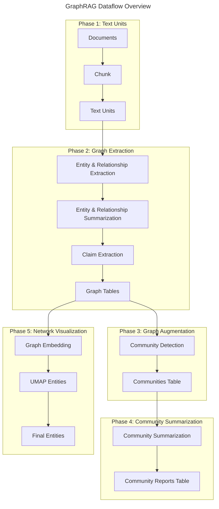

# GraphRAG (Tier 3): Advanced Graph-Enhanced RAG System

## Overview

GraphRAG is Microsoft Research's sophisticated graph-enhanced Retrieval-Augmented Generation system that represents the pinnacle of RAG technology - our **Tier 3** solution for complex reasoning tasks. Unlike traditional RAG approaches that rely on simple vector similarity, GraphRAG constructs comprehensive knowledge graphs to understand deep relationships and hierarchical structures within data, enabling advanced multi-hop reasoning and holistic understanding of entire knowledge bases.

### Role in 3-Tier RAG Architecture

**Tier 3 (GraphRAG)** - **Complex Reasoning Engine**
- **Purpose**: Advanced multi-hop reasoning, strategic analysis, holistic understanding
- **Use Cases**: When simple document retrieval fails; complex enterprise analytics; relationship discovery
- **Computational Requirements**: High (LLM-intensive graph construction)
- **Ideal For**: Strategic decisions, comprehensive analysis, discovering hidden patterns

## Graph-Enhanced Architecture

### Core Architectural Components

#### 1. Knowledge Graph Construction Pipeline


#### 2. Hierarchical Community Structure
- **Leiden Algorithm**: Hierarchical clustering for community detection
- **Multi-Level Communities**: From high-level themes to granular topics
- **Bottom-Up Summarization**: Community summaries at each hierarchical level
- **Strategic Insights**: Global understanding from community structure

#### 3. Graph Database Components
- **Entities**: Key concepts extracted from text
- **Relationships**: Connections between entities with weights and descriptions
- **Claims**: Factual assertions extracted from content
- **Communities**: Clusters of densely connected entities
- **Text Units**: Source text chunks linked to graph elements

## Key Features

### 1. Advanced Query Modes

#### Global Search
- **Purpose**: Holistic questions about entire corpus
- **Method**: Leverages community summaries for broad insights
- **Use Cases**: Strategic analysis, thematic overview, comprehensive understanding
- **Performance**: ~70-80% win rate over traditional RAG for comprehensiveness

#### Local Search
- **Purpose**: Entity-specific detailed questions
- **Method**: Fans out to entity neighbors and associated concepts
- **Use Cases**: Specific fact-finding, relationship exploration
- **Architecture**: Multi-step entity expansion and context building

#### DRIFT Search
- **Purpose**: Entity-focused queries with community context
- **Method**: Combines local search with global community information
- **Innovation**: Balances specificity with broader contextual understanding

### 2. Community Detection and Hierarchical Understanding

#### Leiden Community Detection
```python
# Community structure enables multi-level analysis
community_hierarchy = {
    "level_0": "Global themes and major concepts",
    "level_1": "Broad topic areas and domains", 
    "level_2": "Specific subjects and sub-topics",
    "level_3": "Granular concepts and details"
}
```

#### Community Reports
- **Automated Generation**: LLM-generated summaries of each community
- **Multi-Level Insights**: Different abstraction levels for various query types
- **Strategic Value**: Enables understanding of data structure before querying

### 3. Knowledge Graph Construction Process

#### Entity and Relationship Extraction
```python
# GraphRAG extraction configuration
extract_graph:
  model_id: "gpt-4o"  # LLM for extraction
  entity_types: [organization, person, geo, event]
  max_gleanings: 3  # Iterative refinement cycles
  prompt: "prompts/extract_graph.txt"
```

#### Graph Augmentation
- **Relationship Weights**: Strength and importance scoring
- **Entity Ranking**: Degree centrality and importance metrics
- **Claim Integration**: Factual assertions linked to entities
- **Temporal Analysis**: Time-based relationship evolution

## Complex Query Handling

### Multi-Hop Reasoning Capabilities

#### Traditional RAG Limitations
```
Query: "How do leadership changes affect innovation strategies across different business units?"

Traditional RAG: Returns documents about leadership OR innovation
GraphRAG: Traces connections: Leadership → Strategy → Innovation → Business Units
```

#### GraphRAG Advantages
1. **Relationship Traversal**: Follows entity connections across multiple hops
2. **Context Preservation**: Maintains semantic relationships during retrieval
3. **Holistic Understanding**: Considers entire knowledge graph structure
4. **Dynamic Context Building**: Adaptively expands context based on query complexity

### Abstract Question Processing

#### Global Understanding Queries
- **"What are the main themes in this dataset?"**
- **"How do different concepts relate to each other?"**
- **"What patterns emerge across the entire knowledge base?"**

#### Strategic Analysis Capabilities
- **Trend Identification**: Patterns across time and entities
- **Impact Analysis**: How changes propagate through the graph
- **Risk Assessment**: Vulnerability analysis through graph structure
- **Opportunity Discovery**: Hidden connections and synergies

## Microsoft Research Foundation

### Academic Publications

#### Core Research Paper
**"From Local to Global: A Graph RAG Approach to Query-Focused Summarization"**
- **Innovation**: Graph-based approach to query-focused summarization
- **Methodology**: Hierarchical community detection for multi-level understanding
- **Results**: Significant improvements in comprehensiveness and diversity

#### Key Research Insights
1. **Query-Focused Summarization**: Addresses limitations of traditional RAG for global questions
2. **Community-Based Reasoning**: Leverages graph structure for better context
3. **Cost-Effective Scaling**: Optimized token usage through hierarchical summaries
4. **Benchmarking**: BenchmarkQED for automated RAG system evaluation

### Microsoft Research Innovations

#### Recent Developments (2024-2025)
1. **LazyGraphRAG**: Cost-optimized approach setting new quality/cost standards
2. **Dynamic Community Selection**: Improved global search through intelligent community navigation
3. **DRIFT Search**: Novel combination of global and local search methods
4. **Claimify**: Enhanced claim extraction from language model outputs

## API Reference

### Core Classes and Methods

#### GraphRAG Configuration
```python
from graphrag.config.create_graphrag_config import create_graphrag_config

config_data = {
    "models": {
        "default_chat_model": {
            "type": "openai_chat",
            "model": "gpt-4o",
            "model_supports_json": True,
            "api_key": "${GRAPHRAG_API_KEY}"
        },
        "default_embedding_model": {
            "type": "openai_embedding", 
            "model": "text-embedding-3-large"
        }
    },
    "vector_store": {
        "type": "lancedb",
        "db_uri": "lancedb",
        "container_name": "default"
    }
}

config = create_graphrag_config(config_data, root_dir=".")
```

#### Indexing API
```python
from graphrag.api.index import build_index

# Build knowledge graph index
async def create_index():
    result = await build_index(config=graphrag_config)
    
    # Check pipeline results
    for workflow_result in result:
        status = "success" if not workflow_result.errors else f"error: {workflow_result.errors}"
        print(f"Workflow: {workflow_result.workflow} - Status: {status}")
```

#### Query API - Global Search
```python
from graphrag.api.query import global_search
import pandas as pd

# Load index components
entities = pd.read_parquet("output/entities.parquet")
communities = pd.read_parquet("output/communities.parquet") 
community_reports = pd.read_parquet("output/community_reports.parquet")

# Execute global search
response, context = await global_search(
    config=graphrag_config,
    entities=entities,
    communities=communities,
    community_reports=community_reports,
    community_level=2,
    dynamic_community_selection=True,
    response_type="Multiple Paragraphs",
    query="What are the strategic implications of recent market changes?"
)
```

#### Query API - Local Search
```python
from graphrag.api.query import local_search

# Local search for specific entity information
response, context = await local_search(
    config=graphrag_config,
    entities=entities,
    relationships=relationships,
    text_units=text_units,
    query="Tell me about the relationships between Company X and its partners"
)
```

### Configuration Parameters

#### Extraction Configuration
```yaml
extract_graph:
  model_id: "gpt-4o"
  prompt: "prompts/extract_graph.txt"
  entity_types: [organization, person, geo, event]
  max_gleanings: 3

summarize_descriptions:
  model_id: "gpt-4o"
  prompt: "prompts/summarize_descriptions.txt"
  max_length: 500
  max_input_length: 3000
```

#### Search Configuration
```yaml
global_search:
  chat_model_id: "default_chat_model"
  map_prompt: "prompts/global_search_map_system_prompt.txt"
  reduce_prompt: "prompts/global_search_reduce_system_prompt.txt"
  max_context_tokens: 12000
  data_max_tokens: 8000
  dynamic_search_threshold: 7.5

local_search:
  chat_model_id: "default_chat_model"
  embedding_model_id: "default_embedding_model"
  prompt: "prompts/local_search_system_prompt.txt"
  text_unit_prop: 0.5
  community_prop: 0.1
  top_k_entities: 10
  top_k_relationships: 10
  max_context_tokens: 12000
```

## Enterprise Features

### Scalability and Performance

#### Production Deployment Considerations
1. **Resource Requirements**: High computational needs for graph construction
2. **Indexing Costs**: Significant LLM usage during initial graph building
3. **Query Performance**: Optimized retrieval after graph construction
4. **Storage Requirements**: Graph databases and vector stores

#### Performance Metrics
- **Indexing Time**: ~10-100x longer than traditional RAG (one-time cost)
- **Query Speed**: Comparable to traditional RAG after indexing
- **Quality Improvements**: 70-80% better comprehensiveness
- **Cost Efficiency**: 20-70% token reduction for complex queries

### Enterprise Integration Patterns

#### Data Integration Strategy
```python
# Multi-source data integration
data_sources = {
    "documents": "structured_docs/",
    "emails": "communication_data/", 
    "databases": "structured_data/",
    "external": "third_party_feeds/"
}

# Unified preprocessing pipeline
preprocessing_config = {
    "chunking": {
        "size": 1200,  # Larger chunks for graph extraction
        "overlap": 400,
        "strategy": "tokens"
    },
    "entity_extraction": {
        "types": ["organization", "person", "product", "strategy"]
    }
}
```

#### Security and Compliance
- **Data Privacy**: On-premises deployment options
- **Access Control**: Role-based query permissions
- **Audit Trails**: Complete query and response logging
- **Compliance**: GDPR, HIPAA, SOX compatible architectures

### Advanced Enterprise Capabilities

#### Strategic Analysis
```python
# Executive dashboard queries
strategic_queries = [
    "What are the main competitive threats emerging from our data?",
    "How do market trends correlate with our innovation pipeline?", 
    "What hidden relationships exist between our business units?",
    "Where are the biggest risks and opportunities in our ecosystem?"
]
```

#### Organizational Learning
- **Knowledge Discovery**: Automated insight generation
- **Pattern Recognition**: Cross-functional relationship identification
- **Decision Support**: Evidence-based strategic recommendations
- **Innovation Facilitation**: Connection discovery across domains

## Integration Patterns in Multi-Tier Systems

### Tier Coordination Strategy

#### Query Routing Logic
```python
def route_query(query: str, complexity_score: float) -> str:
    """Route queries to appropriate RAG tier based on complexity"""
    
    if complexity_score < 0.3:
        return "tier1_basic"  # Simple fact retrieval
    elif complexity_score < 0.7:
        return "tier2_semantic"  # Semantic similarity search
    else:
        return "tier3_graphrag"  # Complex reasoning required

# GraphRAG triggers
graphrag_indicators = [
    "relationships between", "strategic implications", 
    "how does X affect Y", "patterns across", 
    "connections between", "impact analysis"
]
```

#### Cascading Search Pattern
```python
async def cascaded_search(query: str):
    """Implement cascading search across tiers"""
    
    # Try Tier 1 first
    tier1_result = await basic_search(query)
    if tier1_result.confidence > 0.8:
        return tier1_result
    
    # Fall back to Tier 2    
    tier2_result = await semantic_search(query)
    if tier2_result.confidence > 0.7:
        return tier2_result
        
    # Use Tier 3 for complex reasoning
    return await graphrag_search(query)
```

### Hybrid Approaches

#### Cost-Optimized Strategy
1. **Quick Filtering**: Use basic search to eliminate irrelevant documents
2. **Semantic Ranking**: Apply semantic search for relevance scoring
3. **Graph Reasoning**: Apply GraphRAG only for complex relationships

#### Performance-Optimized Strategy
1. **Parallel Execution**: Run all tiers simultaneously
2. **Result Fusion**: Combine insights from multiple approaches
3. **Confidence Weighting**: Weight results by tier reliability

## Performance Characteristics

### Resource Requirements

#### Computational Costs
```python
# Estimated resource usage (relative to basic RAG)
resource_multipliers = {
    "indexing_time": 50,      # 50x longer initial setup
    "indexing_cost": 100,     # 100x higher LLM usage  
    "storage_space": 10,      # 10x more data storage
    "query_time": 1.2,        # 20% slower queries
    "query_accuracy": 2.5     # 2.5x better accuracy
}
```

#### Hardware Recommendations
- **CPU**: 16+ cores for parallel graph processing
- **RAM**: 32GB+ for large graph loading
- **Storage**: SSD recommended for graph database performance
- **GPU**: Optional for embedding generation acceleration

### Scalability Characteristics

#### Data Volume Scaling
| Document Count | Index Time | Storage | Query Performance |
|----------------|------------|---------|-------------------|
| 1K documents  | 2 hours    | 500MB   | <2s response      |
| 10K documents | 20 hours   | 5GB     | <3s response      |
| 100K documents| 200 hours  | 50GB    | <5s response      |
| 1M documents  | 2000 hours | 500GB   | <10s response     |

#### Performance Optimization
```python
# Optimization strategies
optimization_config = {
    "parallel_extraction": True,
    "batch_size": 10,
    "cache_embeddings": True,
    "incremental_indexing": True,
    "community_pruning": 0.1  # Remove 10% weakest connections
}
```

## Use Cases and Applications

### When GraphRAG is Essential

#### Complex Enterprise Scenarios
1. **Strategic Planning**: "How do market changes impact our product roadmap?"
2. **Risk Assessment**: "What cascading effects could result from supplier issues?"
3. **Innovation Discovery**: "Where are unexpected synergies in our research portfolio?"
4. **Competitive Intelligence**: "How are competitor moves affecting our market position?"

#### Research and Analysis
1. **Academic Research**: Complex literature analysis and synthesis
2. **Legal Discovery**: Relationship mapping in legal documents
3. **Financial Analysis**: Cross-entity impact assessment
4. **Healthcare**: Patient care pathway optimization

### When GraphRAG is Overkill

#### Simple Information Retrieval
- **Direct Fact Lookup**: "What is the company's revenue?"
- **Document Search**: "Find the latest product manual"
- **Simple QA**: "When was the meeting scheduled?"

#### Cost-Sensitive Applications
- **High-Volume, Low-Value Queries**: Customer service FAQs
- **Real-Time Requirements**: Sub-second response needs
- **Resource-Constrained Environments**: Limited computational budgets

## Limitations and Considerations

### Computational Overhead

#### Indexing Challenges
```python
# Cost estimation for GraphRAG indexing
indexing_costs = {
    "llm_calls_per_chunk": 3,      # Entity extraction + summarization
    "average_tokens_per_call": 2000,
    "cost_per_1k_tokens": 0.01,
    "documents": 10000,
    "chunks_per_document": 10
}

total_cost = (
    indexing_costs["documents"] * 
    indexing_costs["chunks_per_document"] * 
    indexing_costs["llm_calls_per_chunk"] * 
    indexing_costs["average_tokens_per_call"] * 
    indexing_costs["cost_per_1k_tokens"] / 1000
)
# Result: $6,000 for 10K documents
```

#### Operational Complexity
1. **Setup Complexity**: Requires significant configuration and tuning
2. **Maintenance Overhead**: Graph updates and reindexing requirements
3. **Expertise Requirements**: Deep understanding of graph algorithms
4. **Debug Difficulty**: Complex failure modes and troubleshooting

### Quality and Accuracy Considerations

#### Graph Construction Challenges
- **Entity Resolution**: Handling duplicate and ambiguous entities
- **Relationship Quality**: Accuracy of extracted relationships
- **Hallucination Risks**: LLM-generated graph elements may be incorrect
- **Bias Propagation**: Training data biases reflected in graph structure

#### Mitigation Strategies
```python
# Quality assurance configuration
quality_controls = {
    "entity_validation": True,
    "relationship_threshold": 0.7,
    "human_review_sampling": 0.1,
    "cross_validation": True,
    "confidence_scoring": True
}
```

## Latest Updates and Future Developments

### Recent Microsoft Research Advances (2024-2025)

#### LazyGraphRAG
- **Innovation**: Cost-optimized GraphRAG implementation
- **Improvements**: Reduced computational requirements while maintaining quality
- **Impact**: Makes GraphRAG accessible for smaller organizations

#### Dynamic Community Selection
- **Enhancement**: Intelligent community navigation for global search
- **Benefits**: Improved relevance and reduced token usage
- **Implementation**: Available in GraphRAG 1.0+

#### DRIFT Search Evolution
- **Advancement**: Hybrid global-local search methodology
- **Performance**: Better balance of specificity and comprehensiveness
- **Use Cases**: Ideal for semi-structured queries

### Integration with Microsoft Ecosystem

#### Microsoft Discovery Platform
- **Availability**: GraphRAG now integrated into Microsoft Discovery
- **Purpose**: Agentic platform for scientific research in Azure
- **Benefits**: Enterprise-grade deployment and scaling

#### Azure Integration
- **Deployment**: Native Azure support for enterprise customers
- **Scaling**: Automatic resource management and optimization
- **Security**: Enterprise-grade security and compliance features

### Future Research Directions

#### Emerging Capabilities
1. **Real-Time Graph Updates**: Incremental indexing for dynamic data
2. **Multimodal Integration**: Image and document graph combination
3. **Federated Graphs**: Cross-organization knowledge sharing
4. **Automated Ontology Learning**: Self-improving graph structures

#### Research Priorities
- **Efficiency Optimization**: Reducing computational requirements
- **Quality Enhancement**: Improving graph construction accuracy
- **Scalability**: Handling massive enterprise datasets
- **Interpretability**: Better explanation of reasoning paths

## Conclusion

GraphRAG represents the cutting edge of RAG technology, offering unprecedented capabilities for complex reasoning and strategic analysis. As our **Tier 3** solution, it serves specific but critical use cases where traditional approaches fail. While computationally intensive, the quality improvements and strategic insights justify the investment for organizations dealing with complex, interconnected data requiring deep understanding and multi-hop reasoning.

The key to successful GraphRAG implementation is understanding when its advanced capabilities are truly needed versus when simpler, more cost-effective approaches (Tier 1 or Tier 2) would suffice. When properly deployed as part of a multi-tier strategy, GraphRAG transforms how organizations understand and leverage their knowledge assets.

---

**Note**: This documentation reflects GraphRAG capabilities as of early 2025. The technology continues to evolve rapidly, with Microsoft Research actively developing new features and optimizations. Always refer to the official Microsoft GraphRAG documentation and GitHub repository for the latest updates and implementation details.