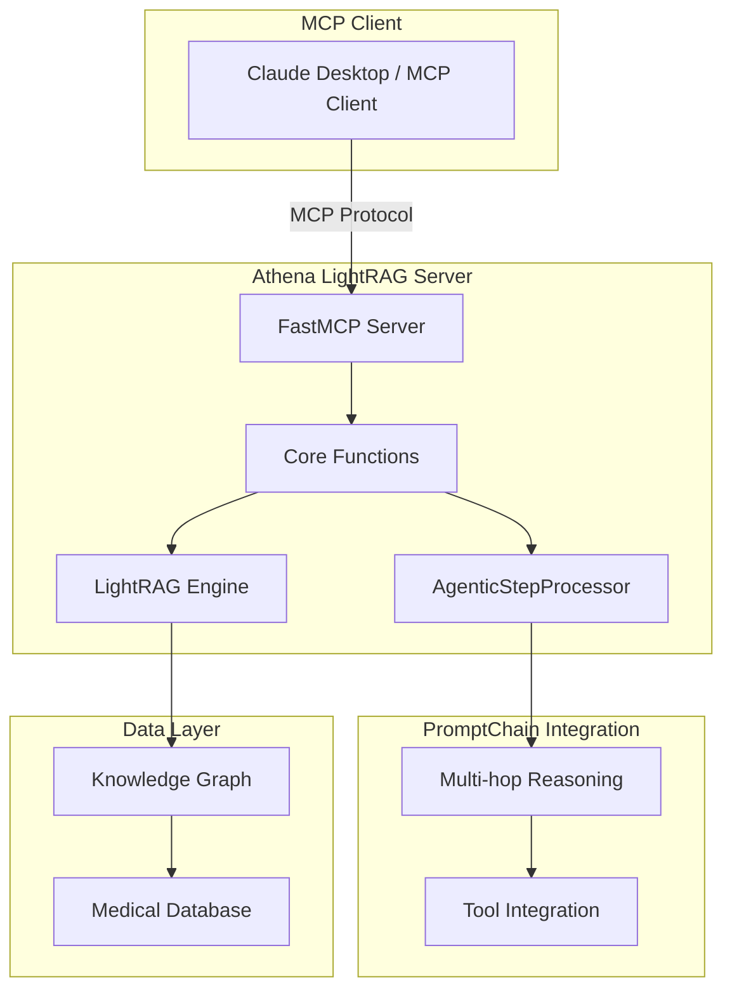
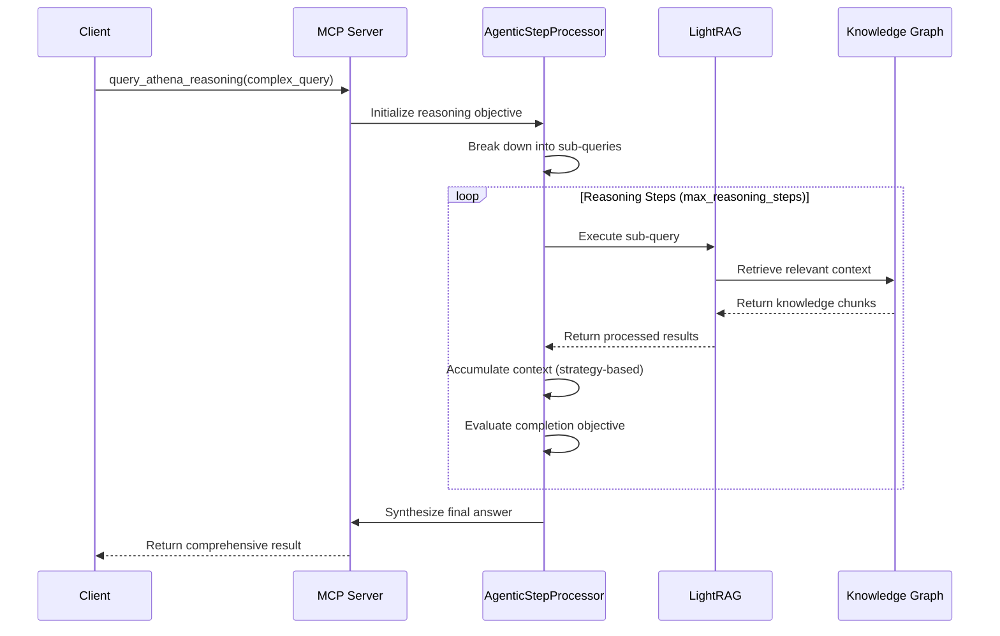

# Athena LightRAG MCP Server - API Reference

## Overview

The Athena LightRAG MCP Server provides multi-hop reasoning capabilities for health database queries using PromptChain's AgenticStepProcessor and LightRAG knowledge graph. This FastMCP 2025 compliant server exposes 4 MCP tools for intelligent querying of medical database structures.

**Version:** 0.1.0  
**Protocol:** Model Context Protocol (MCP)  
**Transport:** stdio (MCP standard), HTTP (testing)  
**Repository:** Part of PromptChain ecosystem

## Architecture



## MCP Tools

### 1. query_athena

**Description:** Execute basic queries against the Athena medical database using LightRAG.

**Parameters:**
- `query` (string, required): The question about the medical database
- `mode` (enum, optional): Query strategy - "local", "global", "hybrid", "naive" (default: "hybrid")
- `context_only` (boolean, optional): Return only retrieved context without LLM generation (default: false)
- `top_k` (integer, optional): Number of top results to retrieve (default: 60)

**Returns:** String containing the answer based on the Athena medical database

**Example:**
```json
{
  "tool": "query_athena",
  "parameters": {
    "query": "What tables are related to patient appointments?",
    "mode": "hybrid",
    "top_k": 20
  }
}
```

**Response:**
```json
{
  "result": "The patient appointments system involves several interconnected tables: patient_appointments (main scheduling), patients (demographic data), providers (healthcare staff), appointment_types (procedure categories), and scheduling_slots (availability). These tables form the core appointment management workflow with foreign key relationships linking patient demographics to scheduled appointments and assigned providers."
}
```

### 2. query_athena_reasoning

**Description:** Execute complex multi-hop reasoning queries requiring analysis across multiple database entities.

**Parameters:**
- `query` (string, required): Complex question requiring multi-step reasoning
- `context_strategy` (enum, optional): "incremental", "comprehensive", "focused" (default: "incremental")
- `mode` (enum, optional): LightRAG query mode for each step (default: "hybrid")  
- `max_reasoning_steps` (integer, optional): Maximum reasoning iterations 1-10 (default: 5)

**Returns:** String containing comprehensive answer synthesized from multi-hop reasoning

**Example:**
```json
{
  "tool": "query_athena_reasoning", 
  "parameters": {
    "query": "How do anesthesia workflows connect to patient scheduling and billing systems?",
    "context_strategy": "comprehensive",
    "max_reasoning_steps": 4
  }
}
```

**Response:**
```json
{
  "result": "Through multi-hop reasoning analysis:\n\n1. **Scheduling Integration**: Anesthesia workflows begin with surgical scheduling where anesthesia_assignments link to patient_appointments, ensuring proper anesthesiologist allocation.\n\n2. **Clinical Workflow**: The anesthesia_records table captures procedure details, medication administration, and timing data that feeds into both clinical documentation and billing.\n\n3. **Billing Connection**: Anesthesia services generate billable events through anesthesia_billing_codes linked to procedure_codes, which integrate with the general billing_transactions system.\n\n4. **Data Flow**: Patient scheduling → anesthesia assignment → procedure execution → clinical documentation → billing code generation → insurance processing. This creates a seamless workflow from initial appointment booking through final payment processing."
}
```

### 3. get_database_status

**Description:** Get information about the Athena LightRAG database status and statistics.

**Parameters:** None

**Returns:** String with formatted database information including path, initialization status, and statistics

**Example:**
```json
{
  "tool": "get_database_status",
  "parameters": {}
}
```

**Response:**
```json
{
  "result": "Database Path: ./athena_lightrag_db\nDatabase Exists: True\nInitialized: True\nTotal Size: 125.3 MB\nTotal Files: 847\nDatabase Files: entities.json, relationships.json, communities.json, graph_chunk_entity_relation.json"
}
```

### 4. get_query_mode_help

**Description:** Get detailed information about LightRAG query modes and context strategies.

**Parameters:** None

**Returns:** String containing comprehensive guide to query modes

**Example:**
```json
{
  "tool": "get_query_mode_help",
  "parameters": {}
}
```

**Response:**
```json
{
  "result": "🔍 LightRAG Query Modes Guide:\n\n📍 LOCAL MODE:\n- Best for: Specific entity relationships, detailed technical questions\n- Use when: Asking about particular tables, fields, or specific components\n- Example: \"What are the columns in the patient_appointments table?\"\n\n🌍 GLOBAL MODE:\n- Best for: High-level overviews, system-wide analysis, summaries\n- Use when: Asking about overall architecture, general patterns, broad topics\n- Example: \"What are the main categories of tables in the database?\"\n\n⚡ HYBRID MODE (Default):\n- Best for: Most questions, combines local detail with global context\n- Use when: Unsure which mode to use, or need both specific and general info\n- Example: \"How does patient scheduling integrate with billing systems?\"\n\n🎯 NAIVE MODE:\n- Best for: Simple keyword searches, when other modes are too complex\n- Use when: Looking for basic text matches without graph reasoning\n- Example: Simple searches that don't require relationship understanding"
}
```

## Query Modes Detailed

### Local Mode
- **Purpose:** Focus on specific entities and their immediate relationships
- **Best for:** Technical details, specific table schemas, field definitions
- **Performance:** Fast, targeted retrieval
- **Use cases:** "What columns are in table X?", "How are tables A and B related?"

### Global Mode  
- **Purpose:** Provide high-level overviews and system-wide patterns
- **Best for:** Architecture questions, broad categorizations, summaries
- **Performance:** Moderate, comprehensive analysis
- **Use cases:** "What are the main data categories?", "Overall system architecture"

### Hybrid Mode (Recommended)
- **Purpose:** Combine local specificity with global context
- **Best for:** Most questions requiring balanced detail and context
- **Performance:** Balanced speed and comprehensiveness
- **Use cases:** "How do workflows connect?", "What's the relationship between systems?"

### Naive Mode
- **Purpose:** Simple keyword-based retrieval without graph reasoning
- **Best for:** Basic searches when other modes are too complex
- **Performance:** Fastest, least sophisticated
- **Use cases:** Simple text matching, basic keyword searches

## Context Accumulation Strategies

### Incremental Strategy
- **Behavior:** Builds context step-by-step through reasoning chain
- **Best for:** Sequential analysis, following logical progressions
- **Memory usage:** Moderate, accumulates progressively
- **Example workflow:** Query A → Use results in Query B → Combine for Query C

### Comprehensive Strategy
- **Behavior:** Gathers broad context from multiple perspectives
- **Best for:** Complex system analysis, understanding interconnections  
- **Memory usage:** Higher, maintains extensive context
- **Example workflow:** Parallel queries across domains → Synthesis

### Focused Strategy
- **Behavior:** Targets specific areas with deep analysis
- **Best for:** Specialized technical questions, detailed investigations
- **Memory usage:** Moderate, concentrated on specific areas
- **Example workflow:** Deep dive into specific subsystem → Expand as needed

## Multi-hop Reasoning Workflow



## Error Handling

### Common Error Responses

**Missing Database:**
```json
{
  "error": "LightRAG database not found at ./athena_lightrag_db. Run ingestion first."
}
```

**Invalid Parameters:**
```json
{
  "error": "Query failed: Invalid mode 'invalid_mode', defaulting to 'hybrid'"
}
```

**API Key Issues:**
```json
{
  "error": "OpenAI API key not found. Set OPENAI_API_KEY environment variable."
}
```

**Timeout/Performance:**
```json
{
  "error": "Multi-hop reasoning failed: Timeout after 120 seconds"
}
```

### Error Recovery Strategies

1. **Parameter Validation:** Invalid modes default to "hybrid"
2. **Graceful Degradation:** Complex queries fall back to simpler approaches
3. **Timeout Protection:** Reasoning steps have configurable limits
4. **Resource Management:** Token limits prevent memory overflow

## Performance Characteristics

### Query Performance

| Operation | Typical Time | Max Recommended |
|-----------|--------------|-----------------|
| Basic Query (local) | 2-5 seconds | 30 seconds |
| Basic Query (global) | 3-8 seconds | 30 seconds |
| Basic Query (hybrid) | 4-10 seconds | 30 seconds |
| Multi-hop Reasoning | 15-60 seconds | 120 seconds |
| Database Status | <1 second | 5 seconds |

### Resource Usage

| Component | Memory Usage | Scalability |
|-----------|--------------|-------------|
| LightRAG Instance | 50-200 MB | Moderate |
| Knowledge Graph | 100-500 MB | High |
| Reasoning Context | 10-100 MB | Variable |
| Total System | 200-800 MB | Good |

### Optimization Recommendations

1. **Query Optimization:**
   - Use `local` mode for specific technical questions
   - Use `global` mode for overview questions
   - Limit `top_k` to 60 or fewer for faster responses

2. **Multi-hop Reasoning:**
   - Keep `max_reasoning_steps` ≤ 5 for most queries
   - Use `incremental` strategy for sequential analysis
   - Use `focused` strategy for specific deep dives

3. **Resource Management:**
   - Monitor memory usage with large knowledge graphs
   - Implement query caching for repeated patterns
   - Use connection pooling for high-frequency usage

## Integration Examples

### Claude Desktop Configuration

```json
{
  "mcpServers": {
    "athena-lightrag": {
      "command": "python",
      "args": ["/path/to/athena-lightrag/main.py"],
      "env": {
        "OPENAI_API_KEY": "your-api-key",
        "LIGHTRAG_WORKING_DIR": "./athena_lightrag_db"
      }
    }
  }
}
```

### Python Client Example

```python
import asyncio
from mcp_client import Client

async def query_athena_example():
    client = Client("stdio", ["python", "main.py"])
    
    # Basic query
    result = await client.call_tool("query_athena", {
        "query": "What tables handle patient data?",
        "mode": "hybrid"
    })
    print(result)
    
    # Multi-hop reasoning
    reasoning_result = await client.call_tool("query_athena_reasoning", {
        "query": "How do billing workflows integrate with clinical data?",
        "context_strategy": "comprehensive",
        "max_reasoning_steps": 3
    })
    print(reasoning_result)

# Run the example
asyncio.run(query_athena_example())
```

### HTTP Testing Mode

```bash
# Start server in HTTP mode
python main.py --http --port 8080

# Test with curl
curl -X POST http://localhost:8080/tools/query_athena \
  -H "Content-Type: application/json" \
  -d '{"query": "What are the main table categories?", "mode": "global"}'
```

## Best Practices

### Query Design

1. **Start Simple:** Use basic queries before multi-hop reasoning
2. **Be Specific:** Clear questions get better results
3. **Choose Appropriate Mode:** Match mode to question type
4. **Optimize Parameters:** Adjust `top_k` and `max_reasoning_steps` based on needs

### Performance Optimization

1. **Cache Common Queries:** Store frequently-used results
2. **Monitor Resource Usage:** Track memory and response times
3. **Batch Related Queries:** Group related questions efficiently
4. **Use Appropriate Modes:** Don't over-engineer simple questions

### Error Handling

1. **Validate Inputs:** Check parameters before sending
2. **Handle Timeouts:** Set appropriate client timeouts
3. **Graceful Degradation:** Fall back to simpler approaches
4. **Monitor Logs:** Watch for patterns in failures

### Security Considerations

1. **API Key Protection:** Secure OpenAI API keys
2. **Input Validation:** Sanitize query inputs
3. **Resource Limits:** Set appropriate timeouts and limits
4. **Access Control:** Implement proper authentication if needed

## Troubleshooting

### Common Issues

**Database Not Found:**
- Ensure LightRAG database exists at specified path
- Run data ingestion process first
- Check `LIGHTRAG_WORKING_DIR` environment variable

**API Key Errors:**
- Verify `OPENAI_API_KEY` is set correctly
- Check API key permissions and quota
- Ensure network connectivity to OpenAI

**Performance Issues:**
- Reduce `top_k` parameter for faster queries
- Lower `max_reasoning_steps` for quicker reasoning
- Monitor system memory usage
- Consider query complexity optimization

**MCP Connection Issues:**
- Verify stdio transport configuration
- Check Python path and dependencies
- Validate FastMCP installation
- Review client MCP configuration

### Debugging Steps

1. **Environment Validation:**
   ```bash
   python main.py --validate-only
   ```

2. **HTTP Testing:**
   ```bash
   python main.py --http --port 8080
   # Test with curl or Postman
   ```

3. **Integration Testing:**
   ```bash
   python integration_test.py
   ```

4. **Log Analysis:**
   - Enable DEBUG logging: `--log-level DEBUG`
   - Monitor stderr output for MCP communication
   - Check for memory usage patterns

## Version History

| Version | Date | Changes |
|---------|------|---------|
| 0.1.0 | 2025 | Initial release with 4 MCP tools and multi-hop reasoning |

## Support

For issues, questions, or contributions:
- Repository: Part of PromptChain ecosystem
- Documentation: See project README
- Integration Examples: Check test files and examples directory