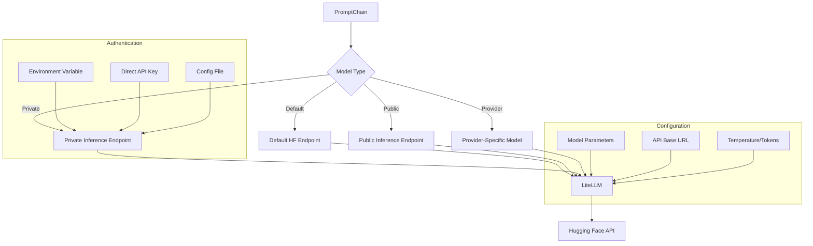
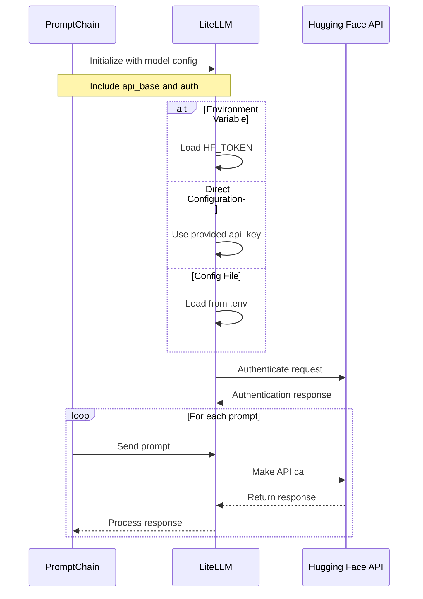
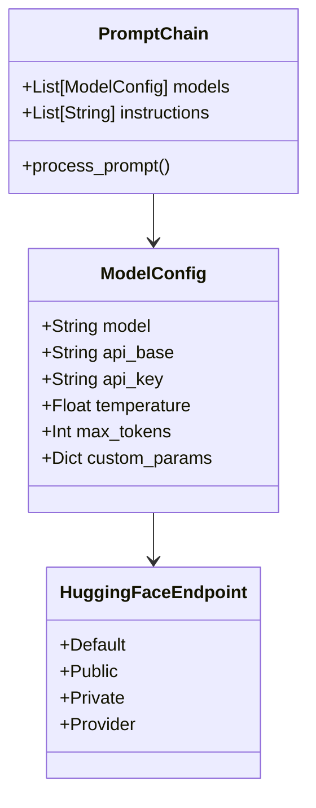

# Hugging Face Integration Architecture

## Model Integration Flow

```mermaid
graph TD
    A[PromptChain] --> B{Model Type}
    B -->|Default| C[Default HF Endpoint]
    B -->|Public| D[Public Inference Endpoint]
    B -->|Private| E[Private Inference Endpoint]
    B -->|Provider| F[Provider-Specific Model]
    
    C --> G[LiteLLM]
    D --> G
    E --> G
    F --> G
    
    G --> H[Hugging Face API]
    
    subgraph Authentication
        I[Environment Variable] --> E
        J[Direct API Key] --> E
        K[Config File] --> E
    end
    
    subgraph Configuration
        L[Model Parameters] --> G
        M[API Base URL] --> G
        N[Temperature/Tokens] --> G
    end
```

## Authentication Flow

```mermaid
sequenceDiagram
    participant PC as PromptChain
    participant LL as LiteLLM
    participant HF as Hugging Face API
    
    PC->>LL: Initialize with model config
    Note over PC,LL: Include api_base and auth
    
    alt Environment Variable
        LL->>LL: Load HF_TOKEN
    else Direct Configuration
        LL->>LL: Use provided api_key
    else Config File
        LL->>LL: Load from .env
    end
    
    LL->>HF: Authenticate request
    HF-->>LL: Authentication response
    
    loop For each prompt
        PC->>LL: Send prompt
        LL->>HF: Make API call
        HF-->>LL: Return response
        LL-->>PC: Process response
    end
```

## Model Configuration Options

```mermaid
classDiagram
    class ModelConfig {
        +String model
        +String api_base
        +String api_key
        +Float temperature
        +Int max_tokens
        +Dict custom_params
    }
    
    class PromptChain {
        +List[ModelConfig] models
        +List[String] instructions
        +process_prompt()
    }
    
    class HuggingFaceEndpoint {
        +Default
        +Public
        +Private
        +Provider
    }
    
    PromptChain --> ModelConfig
    ModelConfig --> HuggingFaceEndpoint
``` 
noteId: "137839002db211f0a342718cff550985"
tags: []

---

 