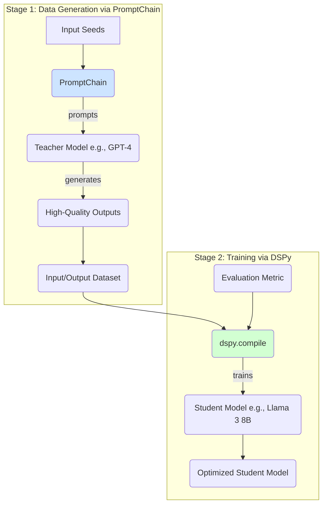
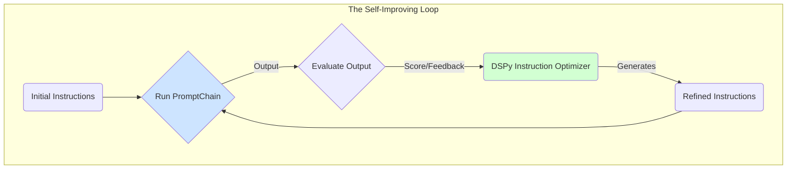

# Integrating PromptChain and DSPy: From Foundations to Advanced Architectures

This document outlines several strategies for integrating `PromptChain`, a powerful tool for orchestrating LLM workflows, with `DSPy`, a framework for programming and optimizing language models. The synergy between `PromptChain`'s orchestration capabilities and `DSPy`'s optimization features opens the door for creating highly sophisticated and efficient AI systems.

## Part 1: Foundational Integration Strategies

These are the most direct ways to get `PromptChain` and `DSPy` working together.

### Strategy 1: DSPy as a Callable Function in a Chain (Recommended Starting Point)

This approach treats a `DSPy` program as a modular, callable function that can be inserted as a step anywhere within a `PromptChain`.

**How it Works:**
You wrap a `dspy.Module` in a simple Python function. `PromptChain` can then execute this function as one of its steps, allowing you to insert a highly optimized process (like summarization, data extraction, or classification) into a broader workflow.

**Conceptual Code:**
```python
import dspy
from promptchain.utils.promptchaining import PromptChain

# 1. Define your DSPy Signature and Module
class SummarizeSignature(dspy.Signature):
    """Summarizes a long text into a short, concise paragraph."""
    text_to_summarize = dspy.InputField()
    concise_summary = dspy.OutputField()

class CoTSummarizer(dspy.Module):
    def __init__(self):
        super().__init__()
        self.generate_summary = dspy.ChainOfThought(SummarizeSignature)

    def forward(self, text):
        return self.generate_summary(text_to_summarize=text)

# 2. Create a wrapper function that PromptChain can call
def run_dspy_module(module_instance, text_input):
    """A generic wrapper to configure and run any DSPy module."""
    # In a real scenario, you'd configure your LM here.
    # turbo = dspy.OpenAI(model='gpt-3.5-turbo-instruct', max_tokens=250)
    # dspy.settings.configure(lm=turbo)
    result = module_instance(text=text_input)
    return result.concise_summary

# 3. Use it in a PromptChain
summarizer_module = CoTSummarizer()
chain_steps = [
    "Fetch the content of a long article given by the URL.",
    (run_dspy_module, [summarizer_module, "{output}"]), 
    "Translate the summary from the previous step into French."
]

chain = PromptChain(
    instructions=chain_steps,
    models=["openai/gpt-4", None, "openai/gpt-4"] 
)
```

**Pros:**
*   **High Flexibility:** Insert an optimized DSPy program at any point in your chain.
*   **Modularity:** Keeps your DSPy programs separate and reusable.
*   **Easy Implementation:** Works with `PromptChain`'s existing function-calling capabilities.

### Strategy 2: DSPy for Optimizing Initial Instructions

A more advanced "meta" approach where `DSPy` is used *before* the chain runs to generate the most effective prompt or sequence of instructions for the entire chain.

**How it Works:**
A `DSPy` program takes a high-level goal and "compiles" it into an optimized list of instructions that is then fed into the `PromptChain`.

**Conceptual Code:**
```python
import dspy

# DSPy module to act as an "Instruction Compiler"
class ChainOptimizerSignature(dspy.Signature):
    """Given a high-level goal, generate a list of clear, efficient steps for a prompt chain."""
    goal = dspy.InputField(desc="The high-level objective for the prompt chain.")
    optimized_instructions = dspy.OutputField(desc="A Python list of strings, where each string is a step in the chain.")

# Use this module to generate instructions
# goal = "Take a GitHub URL, find the most complex Python file, summarize it, and then write a test for it."
# optimizer = ...
# optimized_steps = optimizer(goal=goal).optimized_instructions
# chain = PromptChain(instructions=optimized_steps, ...)
```

---

## Part 2: Advanced Use Cases & Architectures

These use cases leverage the foundational strategies to build more complex, autonomous systems.

### Use Case 1: Transfer Learning & Model Mimicking

Here, `PromptChain` acts as a sophisticated data generation engine, creating a high-quality dataset for `DSPy` to train a smaller, efficient "student" model to mimic a powerful "teacher" model.

**Architecture:**



**Workflow Explained:**

1.  **Stage 1 (Data Generation):** A multi-step `PromptChain` prompts a powerful "teacher" model (e.g., GPT-4) to produce ideal outputs, potentially including its reasoning steps. This generates a rich dataset.
2.  **Stage 2 (Training):** The generated dataset is fed into `dspy.compile()`. An optimizer (like `BootstrapFewShot`) uses the data to train a smaller "student" model (e.g., Llama 3 8B) to mimic the teacher's performance on the specific task, but at a fraction of the cost and latency.

### Use Case 2: Self-Improving `PromptChain` Instructions

A cutting-edge concept that creates a feedback loop, using `DSPy` to act as a "prompt engineer" that refines the chain's own instructions over time.

**Architecture:**



**Workflow Explained:**

1.  **Run:** The `PromptChain` executes with its current instructions.
2.  **Evaluate:** The output is scored against a metric or by a human.
3.  **Refine:** A specialized `DSPy` program takes the original instructions, the context of the run, and the feedback as input. Its sole purpose is to rewrite the instructions to be better.
4.  **Repeat:** The `PromptChain` is updated with the new instructions and runs again, creating a cycle of continuous improvement.

**Conceptual "Instruction Optimizer" in DSPy:**
```python
class RefineChainInstructions(dspy.Signature):
    """
    Given a list of instructions, the user's input, the chain's output, 
    and feedback, rewrite the instructions to produce a better result next time.
    """
    previous_instructions = dspy.InputField()
    user_input = dspy.InputField()
    chain_output = dspy.OutputField()
    feedback = dspy.InputField()
    refined_instructions = dspy.OutputField(desc="The new, improved Python list of string instructions.")

# This DSPy module would be the 'brain' of the refinement step.
```

## Conclusion

Integrating `PromptChain` and `DSPy` offers a powerful pathway for developing sophisticated AI applications. By starting with simple function calls and moving towards advanced architectures like model mimicking and self-improvement, you can create systems that are not only powerful but also efficient, adaptive, and increasingly autonomous. 